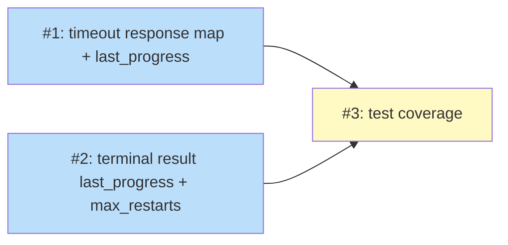

# PLAN: await_task timeout and terminal result context

## Status

Draft

## Scope summary

Add `last_progress` to `niwa_await_task` timeout responses and `last_progress`/
`max_restarts` to terminal results, so coordinators can assess task health without
a separate `niwa_query_task` call.

## Decomposition strategy

**Horizontal decomposition.** The two implementation changes target independent
functions (`handleAwaitTask` timeout branch and `formatTerminalResult`). A third
issue adds test coverage for both. Issues 1 and 2 can be implemented in either
order or in parallel; Issue 3 must come last.

## Issue outlines

### Issue 1: fix(mcp): convert timeout response to map-based builder and add last_progress

**Goal**: Refactor the `handleAwaitTask` timeout branch from `fmt.Sprintf` to
`map[string]any` and add `last_progress` when `TaskState.LastProgress` is non-nil.

**Acceptance Criteria**:
- [ ] Timeout response includes `last_progress` as a JSON object
  (`{"summary":"...","at":"..."}`) when `TaskState.LastProgress` is non-nil
- [ ] Timeout response omits `last_progress` entirely (not null) when
  `TaskState.LastProgress` is nil
- [ ] Existing fields (`status`, `task_id`, `current_state`, `timeout_seconds`)
  are unchanged
- [ ] `go test ./internal/mcp/...` passes

**Dependencies**: None

**Files**: `internal/mcp/handlers_task.go`

---

### Issue 2: fix(mcp): add last_progress and max_restarts to terminal results

**Goal**: Surface `last_progress` and conditional `max_restarts` in
`formatTerminalResult` for all three terminal states.

**Acceptance Criteria**:
- [ ] Terminal results include `last_progress` when `TaskState.LastProgress` is
  non-nil (completed, abandoned, and cancelled states)
- [ ] Terminal results omit `last_progress` when `TaskState.LastProgress` is nil
- [ ] Terminal results include `max_restarts` when `TaskState.RestartCount > 0`
- [ ] Terminal results omit `max_restarts` when `TaskState.RestartCount == 0`
- [ ] Existing fields unchanged
- [ ] `go test ./internal/mcp/...` passes

**Dependencies**: None

**Files**: `internal/mcp/handlers_task.go`

---

### Issue 3: test(mcp): add coverage for progress context in await and terminal responses

**Goal**: Verify `last_progress` and `max_restarts` appear and are omitted correctly
in both timeout and terminal response shapes.

**Acceptance Criteria**:
- [ ] Test: timeout response includes `last_progress` when set in state.json
- [ ] Test: timeout response omits `last_progress` when `LastProgress` is nil
- [ ] Test: terminal result includes `last_progress` when set
- [ ] Test: terminal result omits `last_progress` when nil
- [ ] Test: terminal result includes `max_restarts` when `RestartCount > 0`
- [ ] Test: terminal result omits `max_restarts` when `RestartCount == 0`
- [ ] `go test ./internal/mcp/...` passes

**Dependencies**: Blocked by <<ISSUE:1>>, <<ISSUE:2>>

**Files**: `internal/mcp/handlers_task_test.go`

---

## Dependency graph

**Legend**: Green = done, Blue = ready, Yellow = blocked

## Implementation sequence

**Critical path**: Issue 1 (or 2) → Issue 3 — two issues deep.

**Recommended order**:
1. Implement Issue 1 and Issue 2 (in any order, or in the same commit — same file,
   adjacent functions)
2. Implement Issue 3 (tests for both)

Both implementation changes are in `internal/mcp/handlers_task.go` — combining them
in a single commit is reasonable since they're small and adjacent. The tests commit
follows.
