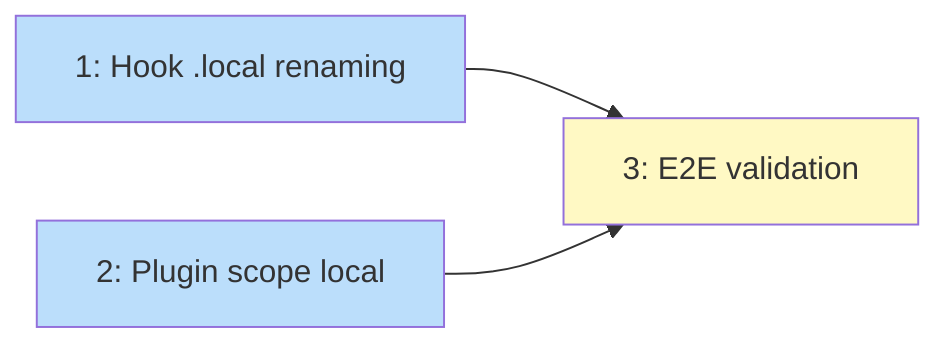

# PLAN: Claude Dir Local Naming

## Status

Draft

## Scope Summary

Ensure all files niwa places in `.claude/` use `.local` naming so repos don't
need to gitignore the entire `.claude/` directory.

## Decomposition Strategy

**Horizontal.** Three sequential fixes: hook script renaming, plugin scope change,
and end-to-end validation.

## Issue Outlines

### 1. Rename hook scripts with .local

**Goal:** Apply `localRename` to hook scripts installed by `HooksMaterializer` so
they use `.local` naming (e.g., `gate-online.local.sh`). Update the hook paths in
`settings.local.json` to reference the renamed files.

**Acceptance criteria:**
- `HooksMaterializer` applies `localRename` to the installed script filename
- `gate-online.sh` -> `gate-online.local.sh`, `workflow-continue.sh` -> `workflow-continue.local.sh`
- `settings.local.json` hook commands reference the renamed paths
  (e.g., `.claude/hooks/pre_tool_use/gate-online.local.sh`)
- Existing tests updated to expect `.local` filenames
- New test: verify installed hook filenames contain `.local`

**Dependencies:** None

**Complexity:** testable

### 2. Change plugin install scope to local

**Goal:** Change `InstallPlugins` to use `--scope local` instead of `--scope project`.
This writes `enabledPlugins` to `settings.local.json` instead of creating a separate
`settings.json`.

**Acceptance criteria:**
- `InstallPlugins` passes `--scope local` to `claude plugin install`
- No `settings.json` is created by niwa operations
- `enabledPlugins` merges into the existing `settings.local.json`
  (verified: `claude plugin install --scope local` merges, doesn't overwrite)
- Pipeline ordering is correct: settings materializer (Step 6.5) writes
  `settings.local.json` first, then plugin install (Step 6.9) merges into it

**Dependencies:** None (independent from issue 1)

**Complexity:** simple

### 3. End-to-end validation

**Goal:** Verify that after `niwa apply`, no non-.local files exist in any repo's
`.claude/` directory (except files that were already there before niwa ran).

**Acceptance criteria:**
- Run `niwa create` on a clean workspace
- For each repo, list all files in `.claude/`
- Every file niwa created either uses `.local` naming or is in a `.local`-named
  parent directory
- No `settings.json` exists (only `settings.local.json`)
- Hook scripts use `.local` naming
- Extensions already use `.local` naming (verified)

**Dependencies:** <<ISSUE:1>>, <<ISSUE:2>>

**Complexity:** simple (manual validation)

## Dependency Graph

**Legend**: Blue = ready, Yellow = blocked

## Implementation Sequence

Issues 1 and 2 are independent and can be done in parallel. Issue 3 validates both.
