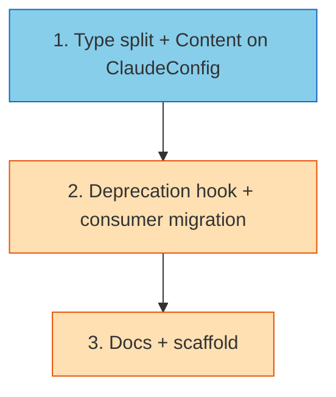

# PLAN: Claude-Key Consolidation

## Status

Draft

## Scope Summary

Rename the `[content]` top-level TOML table in `workspace.toml` to
`[claude.content]` so the Claude-specific semantics are explicit in the
schema. Keep `[content]` as a deprecated alias with a warning on use
and an error on conflict. Split `ClaudeConfig` into a full form
(workspace level) and a narrower `ClaudeOverride` (override positions)
so `[repos.<name>.claude.content]` becomes a TOML decode-time warning
for free.

## Decomposition Strategy

**Horizontal.** The design's own Implementation Approach is layered:
(1) schema + type split, (2) deprecation hook + consumer migration,
(3) documentation + scaffold. The type split (Issue 1) is a prerequisite
for the deprecation hook (Issue 2) because the hook merges the legacy
field into `cfg.Claude.Content`, which the split creates. Issue 3 is
documentation-only and depends on the schema being final.

Each issue delivers a working, tested increment. Issue 1 is a pure
refactor (types move, compiler warnings at override positions).
Issue 2 introduces the deprecation behavior and migrates consumers.
Issue 3 updates user-facing docs and the scaffold template.

## Issue Outlines

### Issue 1: refactor(config): add ClaudeOverride type and move Content under ClaudeConfig

**Complexity**: testable

**Goal**

Introduce the `ClaudeOverride` type, add a `Content ContentConfig` field
to `ClaudeConfig`, and retype override positions without changing
observable behavior. This issue is pure structural — consumer code
still reads through the deprecated `WorkspaceConfig.Content` field
(unchanged in this phase). Issue 2 does the consumer migration.

**Acceptance Criteria**

- `internal/config/config.go`:
  - New `ClaudeOverride` struct with fields `Enabled *bool`,
    `Plugins *[]string`, `Hooks HooksConfig`,
    `Settings SettingsConfig`, `Env ClaudeEnvConfig`. TOML tags match
    the corresponding fields in `ClaudeConfig`.
  - `ClaudeConfig` gains a `Content ContentConfig` field with TOML tag
    `content,omitempty`.
  - `RepoOverride.Claude` retyped from `*ClaudeConfig` to
    `*ClaudeOverride`.
  - `InstanceConfig.Claude` retyped from `*ClaudeConfig` to
    `*ClaudeOverride`.
  - `GlobalOverride.Claude` retyped from `*ClaudeConfig` to
    `*ClaudeOverride` (if it exists at that type today — check
    `config.go` global overlay section).
  - `WorkspaceConfig.Content` field unchanged at this phase (still the
    source of truth for consumers).
- `internal/workspace/override.go`: any type-name references
  (`*config.ClaudeConfig` at override positions) updated to
  `*config.ClaudeOverride`. Field reads (`.Enabled`, `.Plugins`,
  `.Hooks`, `.Settings`, `.Env`) unchanged.
- `internal/workspace/override_test.go` and any other tests that
  construct override configs updated to use the new type.
- Unit test added: TOML that contains `[repos.<name>.claude.content]`
  surfaces as an "unknown config field" warning in
  `ParseResult.Warnings` (proof the type split enforces the
  constraint without additional validation code).
- `go test ./...` passes.
- `go vet ./...` passes.

**Dependencies**: None.

### Issue 2: feat(config): migrate [content] to [claude.content] with deprecation warning

**Complexity**: testable

**Goal**

Add the post-parse deprecation hook that detects `[content]` usage,
merges it into `cfg.Claude.Content`, and emits a warning. Update
consumers (`internal/workspace/content.go`) to read from the canonical
`cfg.Claude.Content.*`. Validation error messages reference
`claude.content.*` paths.

**Acceptance Criteria**

- `internal/config/config.go`:
  - New helper `isContentConfigZero(c ContentConfig) bool` returning
    true when `Workspace.Source == ""`, `Groups` is empty or nil, and
    `Repos` is empty or nil.
  - `Parse()` post-`toml.Decode` hook:
    - If the legacy `cfg.Content` is non-zero AND `cfg.Claude.Content`
      is non-zero: return a hard error naming both paths and
      recommending `[claude.content]` as canonical.
    - If only the legacy `cfg.Content` is non-zero: copy it into
      `cfg.Claude.Content`, reset `cfg.Content` to the zero value,
      append a warning: `"[content] is deprecated; use [claude.content] instead"`.
    - If both are zero or only the new form is set: no action.
  - `validate()` error strings updated from `content.*` to
    `claude.content.*`.
- `internal/workspace/content.go`:
  - `InstallWorkspaceContent`, `InstallGroupContent`,
    `InstallRepoContent` read from `cfg.Claude.Content.Workspace`,
    `cfg.Claude.Content.Groups[...]`, `cfg.Claude.Content.Repos[...]`.
  - No other semantic change.
- Unit tests in `internal/config/config_test.go` covering:
  - Only `[claude.content]` set — no warnings, consumers read it.
  - Only `[content]` set — one deprecation warning, `cfg.Claude.Content`
    populated after parse, consumer code sees the content.
  - Both set — `Parse` returns an error with a clear message.
  - Neither set — no error, no warning (existing baseline).
- Unit tests in `internal/workspace/content_test.go` updated to
  construct fixtures under `cfg.Claude.Content.*` for the happy path;
  at least one test retained at `cfg.Content.*` to exercise the
  deprecation path.
- `go test ./...` passes.
- `go vet ./...` passes.

**Dependencies**: Issue 1.

### Issue 3: docs(config): update scaffold and schema docs for [claude.content]

**Complexity**: simple

**Goal**

Update user-facing documentation and the scaffold template to show
`[claude.content]` as the canonical form while explaining that
`[content]` is a deprecated alias.

**Acceptance Criteria**

- `internal/workspace/scaffold.go`: the example `workspace.toml`
  rendered by `niwa init` uses `[claude.content]` (not `[content]`).
  If the scaffold doesn't currently include content entries, no
  action needed — confirm by reading the template.
- `docs/designs/current/DESIGN-workspace-config.md`: schema section
  documents `[claude.content]` as the canonical form and `[content]`
  as a deprecated alias. One short paragraph explains the deprecation
  window (until v1.0) and the migration policy (warning on old-form
  use, error on both forms together).
- `README.md`: any schema example using `[content]` updated to
  `[claude.content]`. Add one line noting the deprecation.
- No code changes in this issue. Pure documentation.

**Dependencies**: Issue 2.

## Dependency Graph

**Legend**: Blue = ready, Yellow = blocked.

## Implementation Sequence

**Critical path**: 1 → 2 → 3. Three-step linear chain.

**Recommended order**: sequential in single-pr mode. Each issue is
small enough that parallelization would cost more in review overhead
than it saves in wall-clock time.

**Review checkpoints**:
1. After Issue 1 lands on branch: compiler is happy across the whole
   codebase, no observable behavior change. Existing tests still
   pass. New test proves `[repos.<name>.claude.content]` is rejected.
2. After Issue 2 lands on branch: all three deprecation paths tested
   (old-only → warn, new-only → clean, both → error). Consumer code
   reads from new canonical location.
3. After Issue 3 lands on branch: scaffold, README, and design doc
   updated. `niwa init` in a temp dir shows the new schema shape.

**Rollback plan**: each issue is independently revertible. Issue 1's
revert cleanly restores the single-type shape. Issue 2's revert
restores direct reads from `cfg.Content.*`. Issue 3's revert is
documentation-only.
