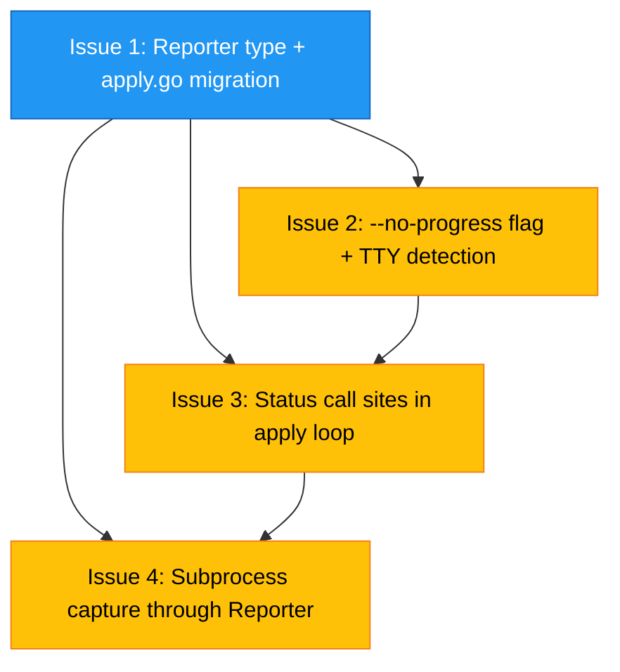

## Status

Draft

## Scope Summary

Replace niwa's linear stderr log dump with a cargo-style two-layer output model:
completed-repo events scroll as normal lines while a single carriage-return-rewritten
status line shows the current operation. Non-TTY output is unchanged; a `--no-progress`
flag provides explicit suppression for CI and scripts.

## Decomposition Strategy

**Horizontal decomposition.** The design's four implementation phases map 1:1 to four
issues, each building one complete layer before the next begins. The serial dependency
chain (Reporter → TTY wiring → status call sites → subprocess capture) follows
natural data-flow: each layer requires the layer before it to be importable and
tested. No walking skeleton is needed — the design has stable interfaces and each
layer is independently testable.

## Issue Outlines

### Issue 1: feat(workspace): add Reporter type and migrate apply.go output sites

**Goal**

Introduce the `Reporter` struct with `Status`/`Log`/`Warn`/`Writer` methods and
migrate all 17 `fmt.Fprintf(os.Stderr, ...)` call sites in `apply.go` to use it.

**Acceptance Criteria**

- [ ] `internal/workspace/reporter.go` exists and defines `Reporter` with `w io.Writer`, `isTTY bool`, `needsClear bool` fields
- [ ] `NewReporter(w io.Writer) *Reporter` constructs with `isTTY` detected via `golang.org/x/term`
- [ ] `NewReporterWithTTY(w io.Writer, isTTY bool) *Reporter` constructs with the given TTY flag
- [ ] `Status(msg string)` emits `\r\033[K` + msg on TTY and is a no-op on non-TTY; sets `needsClear = true`
- [ ] `Log(format string, a ...any)` clears the status line on TTY (`\r\033[K`) when `needsClear`, then appends; on non-TTY, appends directly
- [ ] `Warn(format string, a ...any)` behaves like `Log` but prefixes each line with `"warning: "`
- [ ] `Writer() io.Writer` returns an `io.Writer` backed by `Log`
- [ ] `internal/workspace/reporter_test.go` covers both TTY (`isTTY=true`) and non-TTY (`isTTY=false`) paths for all four methods
- [ ] `Applier` struct gains a `Reporter *Reporter` field; `NewApplier` initializes it with `NewReporter(os.Stderr)`
- [ ] All 17 `fmt.Fprintf(os.Stderr, ...)` sites in `apply.go` replaced with `a.Reporter.Log(...)` or `a.Reporter.Warn(...)`
- [ ] `reporter.Writer()` wired to the injectable `io.Writer` parameters in `emitRotatedFiles`, `checkRequiredKeys`, `guardrail.CheckGitHubPublicRemoteSecrets`, `EnvMaterializer.Stderr`, and `FilesMaterializer.Stderr`
- [ ] `go test ./internal/workspace/...` passes
- [ ] `overlaysync.go` is not modified

**Dependencies**

None

---

### Issue 2: feat(cli): add --no-progress flag and TTY detection

**Goal**

Register `--no-progress` as a persistent flag, add `golang.org/x/term`, and wire
TTY detection into `Reporter` construction in `runApply` and `runCreate`.

**Acceptance Criteria**

- [ ] `golang.org/x/term` added as a direct dependency in `go.mod` / `go.sum`
- [ ] `internal/cli/root.go` declares `noProgress bool` and `noColor bool` as package-level vars
- [ ] `--no-progress` registered on `rootCmd.PersistentFlags()` so all subcommands inherit it
- [ ] `PersistentPreRunE` sets `noColor = os.Getenv("NO_COLOR") != ""` after the existing `captureNiwaResponseFile()` call
- [ ] `runApply` constructs `workspace.NewReporterWithTTY(os.Stderr, !noProgress && term.IsTerminal(int(os.Stderr.Fd())))` and assigns it to `applier.Reporter`
- [ ] `runCreate` applies the same Reporter construction and assignment
- [ ] When `--no-progress` is passed, the Reporter operates in non-TTY mode regardless of actual terminal state
- [ ] When stderr is not a TTY (e.g., piped output), the Reporter operates in non-TTY mode with append-only output identical to today
- [ ] `NO_COLOR` env var does not affect the progress gate (status line behavior unchanged)
- [ ] `go vet ./...` passes

**Dependencies**

Blocked by Issue 1

---

### Issue 3: feat(workspace): add status line call sites in apply loop

**Goal**

Add `reporter.Status(...)` calls in `apply.go`'s per-repo loop so users see the
current operation ("cloning tools/myapp...") while each repo is being processed.

**Acceptance Criteria**

- [ ] Before each `CloneWithBranch` call in the `runPipeline` repo loop, `a.Reporter.Status("cloning <name>...")` is called
- [ ] Before each fetch/pull (the `SyncRepo` call path when `!a.NoPull` and the repo already exists), `a.Reporter.Status("syncing <name>...")` is called
- [ ] Before the `SyncConfigDir` call (Step 2a), `a.Reporter.Status("syncing config...")` is called
- [ ] Each `reporter.Status` call is followed by the existing `reporter.Log` or `reporter.Warn` call that clears the status line — no orphaned status lines remain after any branch
- [ ] On non-TTY (the default in tests), behavior is identical to Issue 1: only `Log`/`Warn` output, no ANSI sequences, no status text
- [ ] `go test ./internal/workspace/...` passes

**Dependencies**

Blocked by Issue 1, Issue 2

---

### Issue 4: feat(workspace): capture git subprocess output through Reporter

**Goal**

Add `internal/workspace/gitutil.go` with `runGitWithReporter` and `runCmdWithReporter`
helpers, update all subprocess call sites to route output through `Reporter`, and
move `SyncConfigDir` into `Applier.Apply`.

**Acceptance Criteria**

- [ ] `internal/workspace/gitutil.go` exists and defines `runGitWithReporter`, `runCmdWithReporter`, and `isGitErrorLine`
- [ ] `runGitWithReporter` creates an `io.Pipe`, assigns both `cmd.Stdout` and `cmd.Stderr` to the write end, launches a goroutine that reads with `bufio.Scanner`, routes git error lines through `r.Warn` and all others through `r.Log`, and waits for the goroutine to finish before returning
- [ ] `defer pw.Close()` is placed immediately after `io.Pipe()` — before any other code — so the write end closes even on panic or early return
- [ ] `pr.Close()` is called inside the goroutine after the scanner loop exits — before `close(done)` — to prevent the git process from blocking on write if the scanner exits early
- [ ] When `cmd.Run()` returns a non-nil error and at least one git-error line was captured, `runGitWithReporter` returns an error embedding those lines (not the generic "exit status N" string)
- [ ] `isGitErrorLine` returns true for lines whose trimmed text begins with `"fatal:"`, `"error:"`, or `"warning:"`
- [ ] `runCmdWithReporter` applies the same goroutine-pipe pattern but routes all lines through `r.Log` with no classifier (used for setup scripts)
- [ ] Both helpers strip ANSI/OSC escape sequences unconditionally using `regexp.MustCompile` at package init with CSI pattern `\x1b\[[0-9;]*[A-Za-z]` and OSC pattern `\x1b\][^\x07]*\x07`
- [ ] `CloneWith` in `clone.go` accepts `*Reporter` and replaces both `cmd.Stdout = os.Stderr; cmd.Stderr = os.Stderr` assignments with `runGitWithReporter`
- [ ] `FetchRepo` and `PullRepo` in `sync.go` accept `*Reporter` and replace their assignments with `runGitWithReporter`
- [ ] `SyncConfigDir` in `configsync.go` accepts `*Reporter` and replaces its assignment with `runGitWithReporter`
- [ ] `RunSetupScripts` in `setup.go` accepts `*Reporter` and replaces its assignment with `runCmdWithReporter`
- [ ] `overlaysync.go` is not modified
- [ ] `Applier.Apply` calls `SyncConfigDir(configDir, a.Reporter, a.AllowDirty)` — moved here from `cli/apply.go`
- [ ] `cli/apply.go` no longer calls `workspace.SyncConfigDir` directly; `applyAllowDirty` is no longer passed as an argument from that file
- [ ] All reporter-accepting call sites within `apply.go` pass `a.Reporter`
- [ ] `SyncRepo` in `sync.go` threads `*Reporter` through to `FetchRepo` and `PullRepo`
- [ ] `go test ./internal/workspace/...` passes; `go vet ./...` passes
- [ ] Existing functional test critical-path scenarios pass unchanged

**Dependencies**

Blocked by Issue 1, Issue 3

---

## Dependency Graph

**Legend**: Blue = ready to start, Yellow = blocked on dependency

## Implementation Sequence

**Critical path**: Issue 1 → Issue 2 → Issue 3 → Issue 4

All four issues form a single serial chain; no parallelization is possible.

1. **Issue 1** — Start here. No prerequisites. Introduces the `Reporter` type and
   migrates all `fmt.Fprintf` call sites. Tests establish the TTY/non-TTY behavior
   baseline that subsequent issues rely on.

2. **Issue 2** — Wire `--no-progress` and TTY detection into the CLI. This unblocks
   Issue 3 by ensuring the `Reporter` on `Applier` is constructed in the correct mode
   before status calls are added.

3. **Issue 3** — Add status call sites in the apply loop. This must land before Issue 4
   so the Status → subprocess-output → Log lifecycle is in place when subprocess output
   is routed through the Reporter.

4. **Issue 4** — Final integration: add `gitutil.go`, update all six subprocess call
   sites, and move `SyncConfigDir` into `Applier.Apply`. This is the heaviest issue;
   do it last so the full Reporter plumbing is available and tested.

All changes ship in a single PR on the `explore/clone-output-ux` branch.
