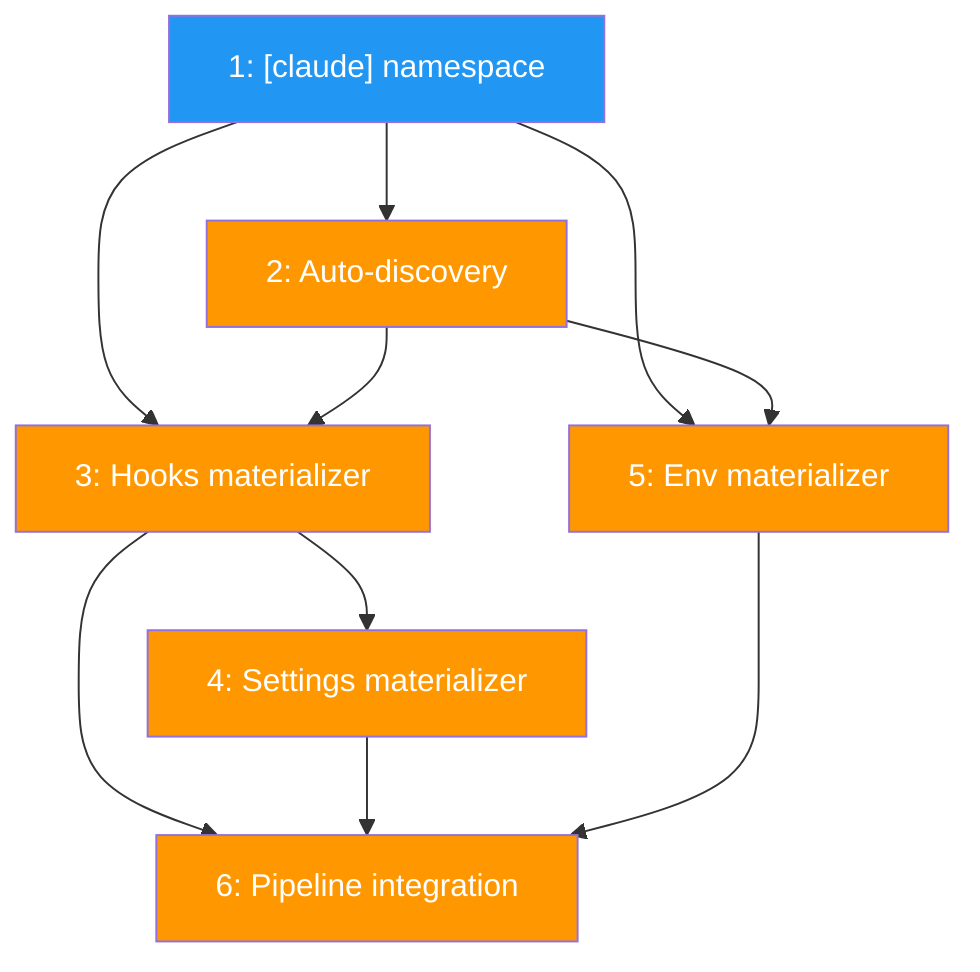

# PLAN: Config distribution

## Status

Draft

## Scope Summary

Add materializer pattern to the apply pipeline for distributing Claude Code hooks, settings, and env files to repos. Namespace hooks/settings under `[claude.*]` with convention-based auto-discovery. Typed config structs with ClaudeConfig wrapper.

## Decomposition Strategy

**Horizontal.** Clear layer-by-layer build: schema changes first (foundation), then auto-discovery functions, then each materializer, then pipeline integration. Each layer has stable interfaces.

## Issue Outlines

### Issue 1: refactor(config): nest hooks and settings under [claude] namespace

**Goal:** Add ClaudeConfig wrapper struct, move Hooks/Settings under Claude on WorkspaceConfig and RepoOverride, update MergeOverrides, update scaffold template, fix all tests.

**Acceptance Criteria:**
- [ ] `ClaudeConfig` struct with `Hooks HooksConfig` and `Settings SettingsConfig`
- [ ] `WorkspaceConfig.Claude ClaudeConfig` replaces flat Hooks/Settings fields
- [ ] `RepoOverride.Claude *ClaudeConfig` replaces flat Hooks/Settings fields
- [ ] `Env` stays at top level on both structs
- [ ] TOML parses `[claude.hooks]` and `[claude.settings]` correctly
- [ ] TOML parses `[repos.<name>.claude.hooks]` and `[repos.<name>.claude.settings]`
- [ ] `MergeOverrides` updated: hooks extend, settings replace per-key under Claude nesting
- [ ] `EffectiveConfig` updated with Claude nesting
- [ ] Scaffold template uses `[claude.hooks]` and `[claude.settings]`
- [ ] All existing tests updated and passing
- [ ] `go test ./...` passes

**Dependencies:** None

---

### Issue 2: feat(workspace): add auto-discovery for hooks and env files

**Goal:** Implement DiscoverHooks and DiscoverEnvFiles that scan .niwa/ directory structure by convention.

**Acceptance Criteria:**
- [ ] `DiscoverHooks(configDir)` returns HooksConfig from scanning hooks/ directory
- [ ] File `hooks/{event}.sh` maps to that event name
- [ ] Files in `hooks/{event}/` directory map to that event
- [ ] Non-.sh files in hooks/ are ignored
- [ ] `DiscoverEnvFiles(configDir)` returns workspace file path and per-repo file map
- [ ] `env/workspace.env` auto-discovered as workspace-level
- [ ] `env/repos/{repoName}.env` auto-discovered as per-repo
- [ ] Both validate paths stay within configDir
- [ ] Missing hooks/ or env/ directories return empty results (no error)
- [ ] Tests for each discovery pattern and edge cases
- [ ] `go test ./...` passes

**Dependencies:** Issue 1

---

### Issue 3: feat(workspace): implement hooks materializer

**Goal:** Define MaterializeContext, Materializer interface, and HooksMaterializer. Merges discovered + explicit + per-repo hooks, copies to .claude/hooks/{event}/, chmod +x, records installed paths.

**Acceptance Criteria:**
- [ ] `MaterializeContext` struct with Config, Effective, RepoName, RepoDir, ConfigDir, InstalledHooks
- [ ] `Materializer` interface with Name() and Materialize(ctx *MaterializeContext) ([]string, error)
- [ ] `HooksMaterializer` merges auto-discovered hooks with explicit config (explicit wins per-event)
- [ ] Per-repo hook overrides extend (append) workspace hooks
- [ ] Scripts copied to `{repoDir}/.claude/hooks/{event}/{scriptName}`
- [ ] Copied scripts are chmod 0755
- [ ] Source paths validated within configDir
- [ ] `ctx.InstalledHooks` populated with event -> installed paths
- [ ] Returns list of written file paths
- [ ] Tests for merge precedence, copy, chmod, containment validation
- [ ] `go test ./...` passes

**Dependencies:** Issue 1, Issue 2

---

### Issue 4: feat(workspace): implement settings materializer

**Goal:** SettingsMaterializer reads merged claude.settings, builds Claude Code settings.local.json with permissions + hook references from InstalledHooks, writes to .claude/settings.local.json.

**Acceptance Criteria:**
- [ ] Reads `Effective.Claude.Settings` for config values
- [ ] Maps `permissions` key: "bypass" -> "bypassPermissions", "ask" -> "askPermissions"
- [ ] Reads `ctx.InstalledHooks` to build hooks object in JSON
- [ ] Hook references use relative paths: `.claude/hooks/{event}/{script}`
- [ ] Each hook entry: `{"type": "command", "command": "<path>"}`
- [ ] Writes `{repoDir}/.claude/settings.local.json` via json.MarshalIndent (2-space)
- [ ] Returns written file path
- [ ] No-op (returns empty, no file written) when settings and hooks are both empty
- [ ] Tests for permissions mapping, hook refs, empty config
- [ ] `go test ./...` passes

**Dependencies:** Issue 3

---

### Issue 5: feat(workspace): implement env materializer

**Goal:** EnvMaterializer merges discovered + explicit env files and vars, writes .local.env.

**Acceptance Criteria:**
- [ ] Merges auto-discovered workspace.env with explicit `[env].files`
- [ ] Merges auto-discovered per-repo env with `[repos.<name>.env].files`
- [ ] Parses KEY=VALUE from each source file (skips comments with #, blank lines)
- [ ] Inline `vars` overlay file-sourced values (vars win for same key)
- [ ] Per-repo vars override workspace vars (already via MergeOverrides)
- [ ] Writes `{repoDir}/.local.env` with `# Generated by niwa` header
- [ ] Returns written file path
- [ ] No-op when no env files or vars configured
- [ ] Source paths validated within configDir
- [ ] Tests for file parsing, var overlay, per-repo override, empty config
- [ ] `go test ./...` passes

**Dependencies:** Issue 1, Issue 2

---

### Issue 6: feat(workspace): integrate materializers into apply pipeline

**Goal:** Add Materializers slice to Applier, initialize in NewApplier, add Step 6.5 materializer loop in runPipeline, run auto-discovery once before the loop, respect claude=false.

**Acceptance Criteria:**
- [ ] `Applier.Materializers []Materializer` field
- [ ] `NewApplier` initializes with [HooksMaterializer, SettingsMaterializer, EnvMaterializer]
- [ ] Auto-discovery (DiscoverHooks, DiscoverEnvFiles) runs once before per-repo loop
- [ ] Step 6.5: for each repo, build MaterializeContext, call each materializer, collect files
- [ ] Repos with `claude = false` skip hooks and settings materializers
- [ ] Repos with `claude = false` still get env materializer
- [ ] Written files flow into existing managed file hashing (ManagedFile entries)
- [ ] Integration test: apply with hooks + settings + env produces correct file layout
- [ ] `go test ./...` passes

**Dependencies:** Issue 3, Issue 4, Issue 5

## Dependency Graph

**Legend:** Blue = ready to start, Orange = blocked by dependencies

## Implementation Sequence

**Critical path:** Issue 1 -> Issue 2 -> Issue 3 -> Issue 4 -> Issue 6 (5 deep)

**Recommended order:**

1. **Issue 1** -- schema changes, everything depends on this
2. **Issue 2** -- auto-discovery, needed by materializers
3. **Issues 3 and 5 in parallel** -- hooks and env materializers are independent
4. **Issue 4** after 3 -- settings needs installed hook paths
5. **Issue 6** last -- wires everything into the pipeline
