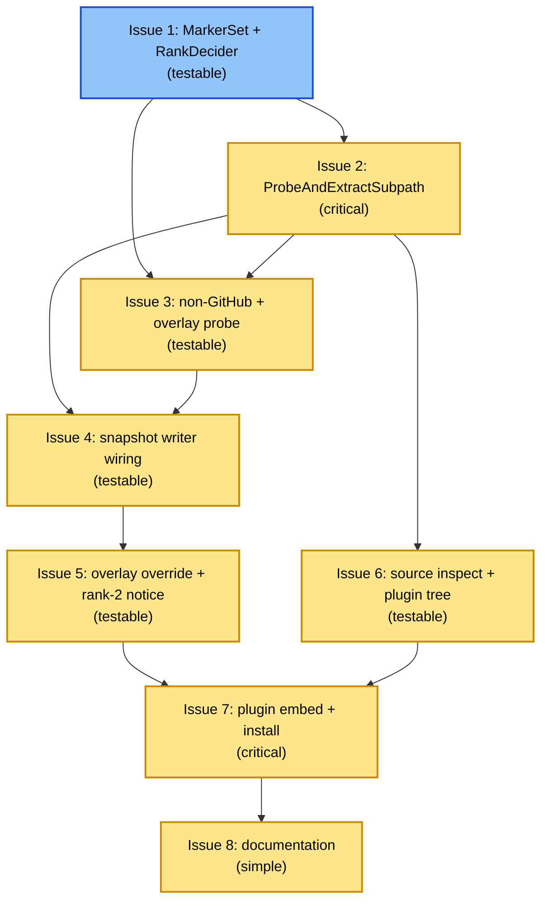

# PLAN: Config Source Discovery

## Status

Draft

## Scope Summary

Close the R5 discovery gap in `PRD-workspace-config-sources` by adding
a streaming probe pass to the existing GitHub tarball + non-GitHub
shallow-clone fetch paths; override the upstream R35 overlay-slug
derivation to anchor on the source repo name; wire a rank-2
deprecation notice through `DisclosedNotices`; and ship a niwa-owned
Claude Code plugin (embedded in the niwa binary via `embed.FS`,
auto-installed when a workspace is detected to need migration) that
exposes a `/niwa:migrate-config` skill.

## Decomposition Strategy

**Horizontal decomposition.** The design's Implementation Approach
lays out 8 sequential phases each with clean deliverable boundaries.
Horizontal decomposition maps each phase to one issue. Issue 1
(types + decider) has no live callers and lands first; subsequent
issues build outward from that base.

Walking skeleton would mean creating a thin end-to-end slice first
(probe → extract → notice → install → CLI command). That doesn't
fit: the work is mostly refactor + addition to an existing
production code path that already runs end-to-end. The integration
risk lives in specific seams (probe pass preserving security
defenses, opt-out plumbing across CLI flag + global config), and
those seams are layered, not vertical.

Execution mode `single-pr` was forced via CLI flag and is the
correct default for this work anyway — all changes ship in one
niwa binary release, no merge gates between phases, no cross-repo
boundaries.

## Issue Outlines

### Issue 1: feat(config): add MarkerSet, DeprecationNotice, RankDecider

**Complexity**: testable

#### Goal

Land the shared `MarkerSet` and `DeprecationNotice` types and the centralized `RankDecider` function in `internal/config/discover.go`, with the rank-2 BEGIN/END guard marker comments and a complete unit-test matrix.

#### Acceptance Criteria

- [ ] `MarkerSet` struct exists in `internal/config/discover.go` with exported fields `Rank1Dir`, `Rank1File`, `Rank2Path` (all `string`).
- [ ] `MarkerSet.HasRank1()` returns true only when the probe observed `<Rank1Dir>/<Rank1File>` at the source root; empty `.niwa/` directories must NOT make it return true.
- [ ] `MarkerSet.HasRank2()` returns true only when the probe observed `Rank2Path` at the source root.
- [ ] `DeprecationNotice` struct exists in `internal/config/discover.go` with at least `Rank int` and `Markers MarkerSet` fields.
- [ ] `TeamConfigMarkerSet()` factory returns `MarkerSet{Rank1Dir: ".niwa", Rank1File: "workspace.toml", Rank2Path: "workspace.toml"}`.
- [ ] `OverlayMarkerSet()` factory returns `MarkerSet{Rank1Dir: ".niwa", Rank1File: "workspace-overlay.toml", Rank2Path: "workspace-overlay.toml"}`.
- [ ] `RankDecider(found, markers MarkerSet) (subpath string, notice *DeprecationNotice, err error)` exists and is pure (no I/O, no globals).
- [ ] `RankDecider` returns rank-1 (`subpath = markers.Rank1Dir`, no notice) when only rank-1 is found.
- [ ] `RankDecider` returns rank-2 (`subpath = ""`, non-nil notice) when only rank-2 is found AND `rankTwoAccepted` is true.
- [ ] `RankDecider` prefers rank-1 over rank-2 when both are found (rank-1 wins, no notice) per PRD R13.
- [ ] `RankDecider` returns the PRD R3 ambiguity error for the documented ambiguous cases.
- [ ] `RankDecider` returns the PRD R4 no-marker error when neither rank-1 nor rank-2 is found.
- [ ] `RankDecider` returns the no-marker error when only rank-2 is found AND `rankTwoAccepted` is false (forward-compat path).
- [ ] The rank-2 branch inside `RankDecider` is delimited by `// BEGIN rank-2 deprecated branch …` and `// END rank-2 deprecated branch` comments, both naming "PRD-config-source-discovery R15".
- [ ] The branch is gated by `const rankTwoAccepted = true` declared inside `RankDecider`.
- [ ] Unit tests in `internal/config/discover_test.go` cover the matrix: rank-1 only, rank-2 only (true and false guard), both ranks present, ambiguous case, no markers, empty-`.niwa/`.
- [ ] The `rankTwoAccepted=false` cases exercise the guard via a test-only injection point so the deletion path is exercised before the follow-up release.
- [ ] `go test ./internal/config/...`, `go vet ./...`, `gofmt -l` all clean.

#### Dependencies

None — foundation; no live callers yet.

---

### Issue 2: feat(github): add ProbeAndExtractSubpath with header-only probe pass

**Complexity**: critical

#### Goal

Add `ProbeAndExtractSubpath` alongside the existing `ExtractSubpath` in `internal/github/tar.go`, implementing decompress-once-to-buffer with a two-pass over the decompressed tar (pass-1 probes marker presence using `MarkerSet`, pass-2 calls `ExtractSubpath` against the resolved subpath), while preserving all seven existing tarball security defenses and adding a regression test that guards probe-pass/extract-pass type-allowlist parity.

#### Acceptance Criteria

- [ ] `ProbeAndExtractSubpath(r io.Reader, markers config.MarkerSet, decider func(found, markers config.MarkerSet) (string, *config.DeprecationNotice, error), dest string) (resolvedSubpath string, rank int, notice *config.DeprecationNotice, err error)` is added in `internal/github/tar.go` and exported alongside the existing `ExtractSubpath`.
- [ ] `ExtractSubpath`'s signature and behaviour are unchanged; pass-2 calls into it verbatim against a fresh `tar.NewReader(bytes.NewReader(buf))`.
- [ ] Pass-1 (probe) iterates the buffered tar headers via a `probeMarkersFromHeaders` helper and records whether each marker in `MarkerSet` exists at the source-root level (after wrapper-anchoring). Pass-1 writes no bytes to disk.
- [ ] Pass-1 applies the same wrapper-anchoring, filename-validation, and type-allowlist checks as pass-2.
- [ ] After pass-1, the function calls `decider(found, markers)` and on error returns before pass-2 starts; on success, pass-2 calls `ExtractSubpath` against the resolved subpath.
- [ ] **Level A cap**: the existing `io.LimitReader(r, MaxDecompressedBytes+1)` at `internal/github/tar.go:63` continues to wrap the compressed reader before `gzip.NewReader`.
- [ ] **Level B cap (NEW)**: a new `io.LimitReader(gz, MaxDecompressedBytes+1)` wraps the decompressed stream during buffer fill; if it fires before pass-1 starts, the function returns the cap-exceeded diagnostic and writes nothing.
- [ ] **Level C cap**: the existing cumulative check at `internal/github/tar.go:150-168` runs unchanged during pass-2.
- [ ] The internal buffer is a `bytes.Buffer` pre-allocated with a small initial capacity (~1 MB), named (not magic), with a comment citing the design's common-case rationale.
- [ ] Errors from pass-1 and from the buffer-fill cap leave `dest` empty.
- [ ] `TestProbeAndExtract_DecompressionBombDefense` duplicates the existing extract-pass cap test for the new entry point; the test specifically exercises the Level B cap (input whose compressed size is well under `MaxDecompressedBytes` but whose decompressed size exceeds it).
- [ ] `TestProbeAndExtract_SymlinkMarkerIsNotRank1`: constructs a tarball whose `.niwa/workspace.toml` entry has tar header type `TypeSymlink` and asserts the probe does NOT report rank-1 found.
- [ ] Additional `tar_test.go` cases cover: rank-1 buffer-and-extract end-to-end, rank-2 buffer-and-extract end-to-end, ambiguity error before pass-2 starts, no-marker error before pass-2 starts, truncated-tarball-mid-fill.
- [ ] All new tests reuse the existing `tarballFakeServer` fixture conventions.
- [ ] `ExtractSubpath`'s existing test suite continues to pass unchanged.
- [ ] `go vet ./...` and `go test ./internal/github/...` pass.

#### Dependencies

Blocked by Issue 1 (requires `MarkerSet`, `RankDecider`, `DeprecationNotice` from `internal/config/discover.go`).

---

### Issue 3: feat(workspace): add probe pass to non-GitHub fallback and overlay sub-fetch

**Complexity**: testable

#### Goal

Add a `probeAndResolveCloneRoot` helper to `internal/workspace/fallback.go` and wire it into `FetchSubpathViaGitClone` before `cloneAndCopy`; extend `EnsureOverlaySnapshot` in `internal/workspace/overlaysync.go` to run the same probe pipeline parameterised by `OverlayMarkerSet()`, so non-GitHub and overlay fetches resolve rank-1 vs rank-2 layouts identically to the GitHub tarball path.

#### Acceptance Criteria

- [ ] New unexported `probeAndResolveCloneRoot(cloneDir string, markers config.MarkerSet, decider func(...)) (subpath string, rank int, notice *config.DeprecationNotice, err error)` lives in `internal/workspace/fallback.go`.
- [ ] Implementation uses `os.Stat`/`os.Lstat` on `filepath.Join(cloneDir, markers.Rank1Dir, markers.Rank1File)` and `filepath.Join(cloneDir, markers.Rank2Path)` at the shallow-clone top level. No `filepath.WalkDir` or full-tree walk.
- [ ] The helper populates a `config.MarkerSet`-shaped "found" record from the two stat results, then calls the injected `decider` and returns the resolved `(subpath, rank, notice, err)`.
- [ ] Function signature mirrors the GitHub-side probe contract from Decision 1.
- [ ] `FetchSubpathViaGitClone` accepts the same `(markers, decider)` inputs; the existing exported signature continues to work for callers that pass an explicit subpath.
- [ ] When `src.Subpath` is empty (discovery mode), `probeAndResolveCloneRoot` runs after `git clone --depth 1` succeeds and before `cloneAndCopy`; the resolved subpath flows into `cloneAndCopy`.
- [ ] When `src.Subpath` is non-empty (explicit-subpath mode per PRD R4), the probe is skipped and the explicit subpath flows through verbatim.
- [ ] Subpath-awareness matches the GitHub path: rank-1 wins → `markers.Rank1Dir`; rank-2 only → `""` plus non-nil notice; both present → rank-1 wins; neither → no-marker error; ambiguity rules from Issue 1 propagate.
- [ ] Failure cases return before `cloneAndCopy` runs; existing `defer os.RemoveAll(tmp)` removes the temp clone.
- [ ] `EnsureOverlaySnapshot` in `internal/workspace/overlaysync.go` runs the same probe pipeline parameterised by `OverlayMarkerSet()`.
- [ ] Probe runs only in the fresh-materialization branch; the marker-refresh and legacy-working-tree branches call `EnsureConfigSnapshot` unchanged.
- [ ] Silent-skip-on-failure contract from upstream R35 / PRD R11 wraps probe + extract: missing overlay returns `(wasFreshClone=true, err=nil)` without stderr noise.
- [ ] Resolved overlay rank surfaces back to the caller for Decision 3 notice emission.
- [ ] `fallback_test.go` and `overlaysync_test.go` cover AC-V1..AC-V6 via `localGitServer`.
- [ ] All existing tests continue to pass.

#### Dependencies

Blocked by Issue 1 (needs `MarkerSet`, `DeprecationNotice`, `RankDecider`, factories).
Blocked by Issue 2 (probe-shape symmetry; non-blocking for compile, but should land first so the signatures mirror the established shape).

---

### Issue 4: feat(workspace): wire probe pipeline into snapshot writer and provenance

**Complexity**: testable

#### Goal

Wire the new probe-and-extract pipeline into `materializeAndSwap`, bubble the resolved subpath and `rank int` up through `MaterializeFromSource` and `EnsureConfigSnapshotWithStatus`, and record the resolved subpath in the provenance marker so end-to-end PRD ACs AC-D1..D8 pass.

#### Acceptance Criteria

- [ ] `materializeAndSwap` no longer calls `github.ExtractSubpath` directly; the GitHub branch calls `github.ProbeAndExtractSubpath(body, markers, config.RankDecider, staging)`.
- [ ] `materializeAndSwap` accepts a `markers config.MarkerSet` parameter; the default callers pass `TeamConfigMarkerSet()`.
- [ ] The non-GitHub branch invokes `probeAndResolveCloneRoot(tmp, markers, RankDecider)` before `cloneAndCopy`.
- [ ] `MaterializeFromSource` signature becomes `(ctx, src, sourceURL, configDir, markers, fetcher, reporter) (rank int, err error)`; all call sites updated.
- [ ] `EnsureConfigSnapshotWithStatus` signature becomes `(ctx, configDir, fetcher, reporter) (converted bool, rank int, err error)`; `EnsureConfigSnapshot` keeps its `error`-only signature.
- [ ] `refreshSnapshot` and `lazyConvertWorkingTree` thread the rank back up.
- [ ] `Provenance.Subpath` written to `.niwa-source.json` is the value returned by the probe (resolved subpath), not the input `src.Subpath`.
- [ ] When the caller passed an explicit subpath via the slug, the probe is skipped and the explicit subpath is recorded verbatim.
- [ ] After a successful init via discovery, `ReadProvenance` returns `.niwa` for rank-1 sources and `""` for rank-2 sources.
- [ ] End-to-end PRD ACs via `tarballFakeServer` and `localGitServer`: AC-D1 (rank-1 only), AC-D2 (rank-2 only), AC-D5 (ambiguity + R5 byte-identity), AC-D6 (no marker + R5 byte-identity), AC-D7 (network 500 + R5 byte-identity), AC-D8 (empty `.niwa/` + root `workspace.toml`).
- [ ] When `materializeAndSwap` is called with `OverlayMarkerSet()`, the probe uses overlay marker filenames.
- [ ] On every probe-error path, `safeRemoveAll(staging)` runs and `SwapSnapshotAtomic` is never called.
- [ ] Provenance marker is only written into `staging` after probe success.
- [ ] Existing `EnsureConfigSnapshot` callers continue to compile and pass.
- [ ] `preserveInstanceState` still runs before `SwapSnapshotAtomic` on the success path.
- [ ] All existing snapshot-writer tests pass; `go test ./...` is green.

#### Dependencies

Blocked by Issue 2 (`ProbeAndExtractSubpath`).
Blocked by Issue 3 (`probeAndResolveCloneRoot`).

---

### Issue 5: feat(source, workspace): drop overlay subpath case-split and emit rank-2 deprecation notice

**Complexity**: testable

#### Goal

Drop the `Subpath != ""` case-split (and the now-dead `lastPathSegment` helper) from `Source.OverlayDerivedSource()` so the overlay slug is always `<owner>/<repo>-overlay`, and land `internal/workspace/disclosure.go` with `NoticeIDRank2TeamConfig`, `NoticeIDRank2Overlay`, and `EmitRank2Notice`, wired into `init` and `apply` so they emit the one-time rank-2 deprecation notice after snapshot promotion succeeds.

#### Acceptance Criteria

- [ ] `Source.OverlayDerivedSource()` in `internal/source/source.go` returns `Source{Host: s.Host, Owner: s.Owner, Repo: s.Repo + "-overlay", Ref: s.Ref}` for ALL inputs (whole-repo, single-segment subpath, multi-segment subpath).
- [ ] The `if s.Subpath != ""` branch is deleted.
- [ ] The `lastPathSegment` helper is deleted (no callers remain).
- [ ] `OverlayDerivedSource()` doc comment rewritten to cite PRD R10.
- [ ] `internal/source` remains a leaf package (no new imports).
- [ ] Existing `TestSource_OverlayDerivedSource` cases at `internal/source/source_test.go:217-256` flipped to assert the new R10 behaviour (whole-repo unchanged; subpath cases now expect `<repo>-overlay`).
- [ ] `TestSource_StringRoundTrip` and other existing tests pass unmodified.
- [ ] New file `internal/workspace/disclosure.go` exists with `const NoticeIDRank2TeamConfig = "rank2-deprecation:team-config"` and `const NoticeIDRank2Overlay = "rank2-deprecation:overlay"`.
- [ ] `EmitRank2Notice(state *InstanceState, id, identifier string, reporter *Reporter)` exported.
- [ ] Returns early without logging or mutating state when `noticeDisclosed(state, id)` is true (idempotence).
- [ ] On first call, appends `id` to `state.DisclosedNotices` AND calls reporter to write to stderr.
- [ ] Emitted message starts with `note:` and contains the literal substrings `deprecated`, the `identifier` value, and `/niwa:migrate-config`.
- [ ] `internal/cli/init.go` captures the rank from `MaterializeFromSource` and calls `EmitRank2Notice(state, NoticeIDRank2TeamConfig, slug, reporter)` iff `rank == 2`. The emit happens AFTER promotion succeeds.
- [ ] Apply path captures team-config rank from `EnsureConfigSnapshotWithStatus` and overlay rank from `EnsureOverlaySnapshot`; emits via `NoticeIDRank2TeamConfig` / `NoticeIDRank2Overlay` respectively iff `rank == 2`, after each artifact's promotion succeeds.
- [ ] `state.DisclosedNotices` persisted via the existing `SaveState` / `mergeDisclosedNotices` flow.
- [ ] PRD AC-N1..N6 pass end-to-end; AC-V1..V6 still pass (overlay slug change does not break overlay discovery).
- [ ] `go test`, `go vet`, `gofmt -l` clean.

#### Dependencies

Blocked by Issue 4 (rank value must flow up from materializer to init/apply call sites).

---

### Issue 6: feat(cli): add niwa source inspect command and embedded plugin source tree

**Complexity**: testable

#### Goal

Add a read-only `niwa source inspect <slug> [--json]` subcommand backed by a factored `ProbeMarkers` function in `internal/github/tar.go`, and ship the embedded `plugins/niwa/` source tree (manifest + `skills/migrate-config/SKILL.md`) that the migration skill drives via this CLI.

#### Acceptance Criteria

- [ ] `internal/cli/source_inspect.go` (NEW) registers a `source` parent command and a `source inspect` subcommand; `--help` works for both.
- [ ] Accepts a single positional slug argument parsed via `internal/source.Parse`; supports the full slug grammar `[host/]owner/repo[:subpath][@ref]`.
- [ ] Without `--json`, emits human-readable text including resolved host/owner/repo, explicit subpath, markers found, resolved rank/subpath (on success) or error code/message (on ambiguity/no-marker).
- [ ] With `--json`, emits a single JSON object matching the Decision 4 schema: top-level `schema_version: 1`, `slug`, `host`, `owner`, `repo`, `explicit_subpath`, `markers_found_at_root` (array).
- [ ] Successful probe: `resolved` object with `rank`, `subpath`, `deprecated`, `migration_hint`.
- [ ] Ambiguity (PRD R3): top-level `error` object with `code: "ambiguous"`; no `resolved` field; exits non-zero.
- [ ] No-marker (PRD R4): top-level `error` object with `code: "no_marker"`; no `resolved`; exits non-zero.
- [ ] Successful probes exit 0; probe failures exit non-zero.
- [ ] Strictly read-only: no `dest` writes, no snapshot mutation, no registry touch, no disclosure emission.
- [ ] `internal/cli/source_inspect_test.go` covers: slug parse failure, rank-1 (text + JSON), rank-2 (text + JSON with `deprecated: true` and non-empty `migration_hint`), ambiguity (JSON `error.code == "ambiguous"`, non-zero exit), no-marker (JSON `error.code == "no_marker"`, non-zero exit), `schema_version == 1`.
- [ ] `internal/github/tar.go` exposes `ProbeMarkers(tr *tar.Reader) (found config.MarkerSet, err error)` as an exported standalone function.
- [ ] `ProbeAndExtractSubpath` (from Issue 2) refactored to call `ProbeMarkers` for its pass-1; production behaviour and the existing test matrix continue to pass unchanged.
- [ ] `ProbeMarkers` applies the same wrapper-anchoring, filename-validation, and type-allowlist checks as the extract pass.
- [ ] `ProbeMarkers` writes nothing to disk.
- [ ] `tar_test.go` gains direct unit tests for `ProbeMarkers` covering rank-1, rank-2, both (ambiguity), neither, symlink-typed marker rejected.
- [ ] `niwa source inspect` calls `ProbeMarkers` (not `ProbeAndExtractSubpath`).
- [ ] `plugins/niwa/manifest.json` exists with `"name": "niwa"` and a semver-shaped `"version"` field.
- [ ] Manifest includes a skills index entry referencing `skills/migrate-config`.
- [ ] `plugins/niwa/skills/migrate-config/SKILL.md` exists and documents `/niwa:migrate-config <workspace-name>`.
- [ ] Skill body invokes `niwa source inspect <slug> --json` via the Bash tool to probe current source and candidate destination slugs.
- [ ] Skill body reads `~/.config/niwa/config.toml` via the Read tool to discover the current `source_url`.
- [ ] Skill presents path (a) in-place restructure (no registry edit) and path (b) slug swap (registry edit).
- [ ] On path (b), skill edits `~/.config/niwa/config.toml` via the Edit tool to rewrite the `source_url`, then prints the follow-up `niwa apply --force <workspace>` command.
- [ ] Skill MUST NOT run `git push`, `niwa apply`, or any materializing command; MUST NOT modify the workspace snapshot; MUST NOT emit disclosure/deprecation notices.
- [ ] `plugins/niwa/` tree is checked in as plain files (no build-time generation).
- [ ] `go vet ./...` and `go test ./internal/cli/... ./internal/github/...` pass.

#### Dependencies

Blocked by Issue 2 (refactors the pass-1 probe logic into a standalone `ProbeMarkers`; the underlying probe code and symlink-marker regression test must already be shipped).

---

### Issue 7: feat(plugin): embed niwa plugin and auto-install on rank-2 detection

**Complexity**: critical

#### Goal

Land the `internal/plugin/` package (`embed.go` with `//go:embed plugins/niwa` and `installer.go` with `Install(state, reporter, opts)` performing `os.Stat` + manifest-version idempotency and atomic stage-and-rename into `~/.claude/plugins/marketplaces/niwa/`), extend `internal/workspace/disclosure.go` with `NoticeIDPluginInstalled` / `NoticeIDPluginSkipped` and `EmitPluginNotice`, add `AutoInstallPlugins *bool` to `GlobalConfig`, wire the `--no-install-plugins` flag through `niwa init` and `niwa apply`, and call the installer after `EmitRank2Notice(...)` fires for either team or overlay artifact, with warn-and-continue on install failure.

#### Acceptance Criteria

- [ ] New `internal/plugin/embed.go` declares `//go:embed plugins/niwa` against an unexported `pluginFS embed.FS` and exposes `type InstalledPlugin struct { Name, Version, Path string }` and `func Embedded() (InstalledPlugin, error)`.
- [ ] `Embedded()` reads `plugins/niwa/manifest.json`; asserts `name == "niwa"` (build-time invariant); returns the embedded version and the canonical install path computed via `filepath.Join(homeDir, ".claude", "plugins", "marketplaces", "niwa")`.
- [ ] AC-I1: `TestEmbedded_ManifestNameIsNiwa` asserts the embedded manifest's `name` field equals `"niwa"`.
- [ ] New `internal/plugin/installer.go` declares `type Action int` (`Installed`, `UpToDate`, `Skipped`, `Failed`); `type InstallOpts struct { SkipInstall bool }`; `func Install(state *workspace.InstanceState, reporter *workspace.Reporter, opts InstallOpts) (Action, error)`.
- [ ] On user-environment failures (read-only `$HOME`, permission denied) `Install` returns `(Failed, nil)` so warn-and-continue is unambiguous. Non-nil `error` only on programmer error (malformed embedded manifest).
- [ ] `Install` flow when `SkipInstall == false`: call `Embedded()`; `os.Stat` install path; if on-disk equals embedded version → `(UpToDate, nil)` + emit `NoticeIDPluginInstalled`; otherwise atomic stage-and-rename: write to `<install-path>.next/` via `fs.WalkDir(pluginFS, "plugins/niwa", ...)` + `os.WriteFile` / `os.MkdirAll`; on extraction error `RemoveAll` next dir + `(Failed, nil)`; rename `install → .prev`, `.next → install`, `RemoveAll .prev`; on rename failure roll back.
- [ ] `Install` flow when `SkipInstall == true`: emit `NoticeIDPluginSkipped` with manual install command + return `(Skipped, nil)`. No filesystem reads under `~/.claude/`.
- [ ] AC-I2: fresh install from init asserts `(Installed, nil)`, install-path manifest exists with `name == "niwa"` and matching version, `state.DisclosedNotices` records `NoticeIDPluginInstalled` once, no `.next/` or `.prev/` remain.
- [ ] AC-I3: second invocation is `(UpToDate, nil)`, mtimes unchanged, no second `NoticeIDPluginInstalled` entry.
- [ ] AC-I4: self-heal after manual delete — re-running `Install` returns `(Installed, nil)` and recreates the install path.
- [ ] AC-I5a / AC-I5b: persistent opt-out via `auto_install_plugins = false` AND per-invocation opt-out via `--no-install-plugins` both return `(Skipped, nil)`; install-path absent; `NoticeIDPluginSkipped` recorded with manual install command substring.
- [ ] AC-I6: read-only `~/.claude/` → `(Failed, nil)`; no install path; `<install-path>.next/` does not survive; `NoticeIDPluginSkipped` recorded with failure cause + manual install command. Integration test confirms apply still exits 0 and `DisclosedNotices` carries both the rank-2 notice AND `plugin-install-skipped:niwa`.
- [ ] AC-I7: rank-1 path → no plugin notice (install never called).
- [ ] AC-I8: `internal/cli/init.go` adds `--no-install-plugins` bool flag; after `EmitRank2Notice` for team config in the rank-2 branch, calls `plugin.Install(state, reporter, plugin.InstallOpts{SkipInstall: noInstallPluginsFlag || globalCfg.SkipPluginInstall()})`. Apply path adds the same flag and calls the installer after each artifact's emit. Integration test asserts the first rank-2 `niwa apply` produces the install path + notice; the second invocation produces neither.
- [ ] `internal/workspace/disclosure.go` extended: `const NoticeIDPluginInstalled = "plugin-installed:niwa"`, `const NoticeIDPluginSkipped = "plugin-install-skipped:niwa"`, `func EmitPluginNotice(state *InstanceState, id string, manualCmd string, reporter *Reporter) error` (mirrors `EmitRank2Notice`, idempotent, emits reporter line containing `manualCmd` verbatim).
- [ ] `internal/config/config.go`: `GlobalConfig.AutoInstallPlugins *bool` parsed from TOML key `auto_install_plugins`; `(*GlobalConfig).SkipPluginInstall()` returns `true` iff the field is explicitly `false`.
- [ ] Install path computed as `filepath.Join(homeDir, ".claude", "plugins", "marketplaces", "niwa")`; no user-supplied component; `TestInstallPath_ComputedFromHomeOnly` verifies.
- [ ] Extraction walks `embed.FS` via `fs.WalkDir`; no archive parser. `TestPlugin_NoArchiveDeps` asserts `go list -deps ./internal/plugin/...` excludes `archive/tar`, `archive/zip`, `compress/gzip`.
- [ ] Atomic stage-and-rename uses `<install-path>.next/`; swap is `Rename(install, .prev) → Rename(.next, install) → RemoveAll(.prev)`. `TestInstall_RenameFailureRollsBack` exercises mid-swap failure.
- [ ] All new files gofmt clean; `go vet ./...` passes.

#### Dependencies

Blocked by Issue 5 (the `internal/workspace/disclosure.go` file must exist with `EmitRank2Notice` and the `InstanceState.DisclosedNotices` persistence shape this issue mirrors).
Blocked by Issue 6 (the `plugins/niwa/` source tree — manifest + skill markdown — must exist for the `//go:embed plugins/niwa` directive to compile).

---

### Issue 8: docs: add single-repo, brain-repo, and plugin-install guides for config sources

**Complexity**: simple

#### Goal

Update `docs/guides/workspace-config-sources.md` so it documents the complete shipped behaviour from PRD R30 — adding the six required heading anchors with the literal substrings required by AC-G1..G5 plus the rank-3 removal section described by R30.

#### Acceptance Criteria

- [ ] `docs/guides/workspace-config-sources.md` contains a heading whose anchor is exactly `#single-repo-workspace`. Section walks through Story 1, contains the literal substring `niwa init --from owner/repo` (no explicit subpath), a fenced code block with an on-disk layout including `.niwa/` plus at least one workspace component subdirectory, and the literal substring `dangazineu/foo-overlay`.
- [ ] Heading anchor `#brain-repo` exists. Section walks through Story 2; contains the literal substrings `discoverAllRepos`, `Classify`, `#138` (cross-reference to the upstream PR), and `acme/vision-overlay` (deliberately NOT `acme/.niwa-overlay`).
- [ ] Heading anchor `#overlay-slug-rule` exists. Section explains R10's unconditional repo-name-based derivation; contains the literal substring `repo-name`; contains at least three of the four worked overlay-slug examples from R10 as fenced or inline code blocks.
- [ ] Heading anchor `#rank-2-deprecation` exists. Section explains the one-time notice (R14), the two migration paths handled by the skill (R23), and the deferred hard-removal timeline; contains the literal substrings `deprecated`, `/niwa:migrate-config`, and `rank 2` (or `rank-2`).
- [ ] Heading anchor `#rank-3-removal` exists. Section explains the removed root `niwa.toml` path; contains the literal substrings `niwa.toml`, `rank 3` (or `rank-3`), and `.niwa/workspace.toml`.
- [ ] Heading anchor `#niwa-plugin-install` exists. Section explains the auto-install behaviour (R17), the silent install with disclosure (R18), the opt-out paths (R19), and the failure handling (R20); contains the literal substrings `auto_install_plugins`, `--no-install-plugins`, and `~/.claude/plugins/marketplaces/niwa/`; quotes the manual install command niwa prints when the user opts out (must match the CLI's emitted string from Issue 7).
- [ ] All six anchors are linkable (no duplicate slugs).
- [ ] No other guide section is regressed (cross-links to the new anchors resolve).
- [ ] CI passes.

#### Dependencies

Blocked by Issue 7 — the plugin auto-install must ship before the guide describes it, so `#niwa-plugin-install` quotes the actual manual install command emitted by the CLI rather than a placeholder.

## Dependency Graph

**Legend**: Blue = ready (no dependencies); Yellow = blocked (waiting on upstream issues).

## Implementation Sequence

**Critical path**: Issue 1 → Issue 2 → Issue 3 → Issue 4 → Issue 5 → Issue 7 → Issue 8 (7 of 8 issues).

**Parallelization opportunity**: Issue 6 (`niwa source inspect` + plugin source tree) can land any time between Issue 2 completion and Issue 7 start. It does not block or get blocked by Issues 3, 4, or 5, and the file sets are disjoint from Issue 3's. In single-pr mode this opportunity matters less than it would in multi-pr (one developer / one branch), but the loose coupling makes Issue 6 easy to interleave with Issues 3-5 commits.

**Recommended order for `/work-on`**:

1. **Issue 1** — foundation (`MarkerSet`, `RankDecider`, unit-test matrix). No live callers.
2. **Issue 2** — `ProbeAndExtractSubpath`. Critical: preserves the seven tarball security defenses plus adds the new Level B cap.
3. **Issue 3** — non-GitHub probe + overlay sub-fetch. Mirrors Issue 2's shape.
4. **Issue 4** — snapshot writer wiring. The first issue that surfaces the discovery behaviour end-to-end via `niwa init` / `niwa apply`. AC-D1..D8 pass after this lands.
5. **Issue 5** — overlay override + rank-2 deprecation notice. AC-N1..N6 and AC-V1..V6 pass after this lands.
6. **Issue 6** — `niwa source inspect` + plugin source tree. Can interleave with 3-5 if convenient; required before Issue 7 because of the `//go:embed plugins/niwa` directive.
7. **Issue 7** — plugin auto-install. Critical: introduces a new filesystem-write surface under `~/.claude/plugins/`. AC-I1..I8 pass after this lands.
8. **Issue 8** — documentation. Pure docs; lands last so the `#niwa-plugin-install` section quotes the real CLI-emitted manual install command rather than a placeholder.

After all 8 issues ship, the PRD's R29 reconciliation closes (upstream `PRD-workspace-config-sources.md` returns to `Done` once R5+R6+R7+R8+R33 are implemented and R35 is overridden per this PRD's R10).
