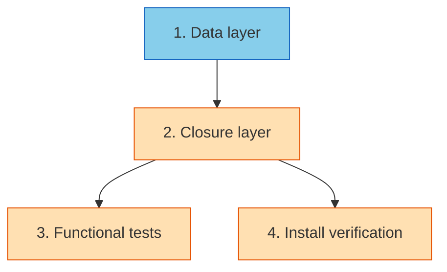

# PLAN: Contextual Completion

## Status

Draft

## Scope Summary

Adds dynamic tab-completion to niwa for 10 identifier positions across 10
commands — workspace names from the global registry, instance names from
the current workspace, repo names from the current instance — delivered on
by default via the existing shell-integration install paths.

## Decomposition Strategy

**Horizontal.** The design's own Implementation Approach is layered: data
layer → closures → tests → install-path verification, with strict
bottom-up dependencies. Walking skeleton would add ceremony without
surfacing integration risk because the data layer is a pure prerequisite
for the closure layer, and both terminal leaves (functional tests,
install verification) only consume the closure layer's observable
behavior.

## Issue Outlines

### Issue 1: feat(workspace,config): add enumeration helpers with sanitization

**Complexity**: testable

**Goal**

Add two sorted-and-sanitized enumeration helpers in the data-owning
packages, apply the same sanitization to the existing `EnumerateInstances`,
and migrate the four existing call sites to use them — all without
changing observable command behavior.

**Acceptance Criteria**

- `internal/workspace/state.go` exports
  `EnumerateRepos(instanceRoot string) ([]string, error)`:
  - Scans two levels: each immediate child of `instanceRoot` as a group,
    each subdirectory inside a group as a repo.
  - Skips top-level `.niwa` and `.claude`; skips dot-prefixed entries at
    both levels.
  - Skips entries whose names contain any character matched by
    `unicode.IsControl` or `unicode.In(r, unicode.Cf, unicode.Zl, unicode.Zp)`.
  - Returns sorted repo names (`sort.Strings`, stable, byte-lexicographic).
    Duplicate names across groups appear once.
  - Returns `([]string{}, nil)` when the instance root is empty;
    `(nil, err)` when `os.ReadDir(instanceRoot)` itself fails.
- `internal/workspace/state.go`'s existing `EnumerateInstances` applies the
  same sanitization filter.
- `internal/config/registry.go` exports
  `ListRegisteredWorkspaces() ([]string, error)`:
  - Loads via existing `LoadGlobalConfig`, returns sorted keys.
  - Returns `(nil, err)` on config load error; `([]string{}, nil)` when
    the registry is present but empty.
- `internal/cli/repo_resolve.go:findRepoDir` migrates to
  `workspace.EnumerateRepos` internally while preserving its existing
  contract (first-match short-circuit, `"ambiguous"` error on cross-group
  collision). Verified by existing tests still passing.
- The four existing "iterate `GlobalConfig.Registry` keys and sort"
  copies in `internal/cli/go.go` and `internal/cli/create.go` use
  `config.ListRegisteredWorkspaces()`; no behavior change.
- Unit tests in `internal/workspace/state_test.go` cover
  `EnumerateRepos` happy path, empty directory, missing root, and the
  sanitization filter rejecting a planted entry named `"bad\tname"`.
- Unit tests in `internal/config/registry_test.go` cover
  `ListRegisteredWorkspaces` happy path, missing config, and empty
  registry.
- Unit tests for `EnumerateInstances` sanitization added.
- `go test ./...` passes.
- `go vet ./...` passes.

**Dependencies**: None.

### Issue 2: feat(cli): attach dynamic completion closures across commands

**Complexity**: testable

**Goal**

Attach cobra `ValidArgsFunction` / `RegisterFlagCompletionFunc` closures to
the 10 in-scope identifier positions so dynamic tab-completion works for
workspace names, instance names, and repo names.

**Acceptance Criteria**

- New file `internal/cli/completion.go` contains four package-private
  closures with cobra's `ValidArgsFunction` signature:
  - `completeWorkspaceNames` — returns
    `config.ListRegisteredWorkspaces()` filtered by `toComplete`, with
    `ShellCompDirectiveNoFileComp`.
  - `completeInstanceNames` — resolves the workspace root from `cwd` via
    `config.Discover`, lists instances via `workspace.EnumerateInstances`
    + `workspace.LoadState(dir).InstanceName`, filters by `toComplete`,
    returns `NoFileComp`.
  - `completeRepoNames` — if `-w` is set on `cmd`, look up the workspace
    in the registry, pick the sorted-first instance, enumerate repos via
    `workspace.EnumerateRepos`; otherwise scope to
    `workspace.DiscoverInstance(cwd)` + `EnumerateRepos`. Filter by
    `toComplete`, return `NoFileComp`.
  - `completeGoTarget` — union of current-instance repos (decorated as
    `"<name>\trepo in <instanceNumber>"`) + registered workspaces
    (decorated as `"<name>\tworkspace"`). Collisions produce two
    entries, one per kind. Filter by `toComplete`, return `NoFileComp`.
- Error handling per Implicit Decision C: closures return
  `([]string{}, ShellCompDirectiveNoFileComp)` on any error rather than
  `ShellCompDirectiveError`.
- Wiring registered in `init()` of:
  - `apply.go` — `ValidArgsFunction = completeWorkspaceNames`;
    `RegisterFlagCompletionFunc("instance", completeInstanceNames)`.
  - `create.go` — `ValidArgsFunction = completeWorkspaceNames`.
  - `destroy.go` — `ValidArgsFunction = completeInstanceNames`.
  - `go.go` — `ValidArgsFunction = completeGoTarget`;
    `RegisterFlagCompletionFunc("workspace", completeWorkspaceNames)`;
    `RegisterFlagCompletionFunc("repo", completeRepoNames)`.
  - `reset.go` — `ValidArgsFunction = completeInstanceNames`.
  - `status.go` — `ValidArgsFunction = completeInstanceNames`.
  - `init.go` — `ValidArgsFunction = completeWorkspaceNames`.
- Unit tests in new `internal/cli/completion_test.go` cover:
  - `completeWorkspaceNames` with prefix filtering, empty registry, missing config.
  - `completeInstanceNames` with prefix filtering and cwd outside any workspace.
  - `completeRepoNames` with `-w` unset (cwd-based) and `-w` set (registry lookup + sorted-first instance).
  - `completeGoTarget` union decoration format, collision handling, prefix filtering.
  - All closures return `ShellCompDirectiveNoFileComp`.
- `go test ./...` passes.
- `go vet ./...` passes.
- Manual smoke: `./niwa __complete go ""` from inside a workspace instance produces both repo and workspace candidates with the expected `\t`-decorated format.

**Dependencies**: Issue 1.

### Issue 3: test(functional): cover completion via niwa __complete

**Complexity**: testable

**Goal**

Extend the existing godog-based functional test harness to cover
completion end-to-end via `niwa __complete`, so wiring bugs are caught in
CI rather than at user report time.

**Acceptance Criteria**

- New file `test/functional/features/completion.feature` with scenarios
  covering at minimum:
  - `niwa __complete apply a` returns registered workspaces starting with `a`.
  - `niwa __complete go ""` from inside a workspace instance returns both
    repos (decorated as `repo in <N>`) and registered workspaces (decorated
    as `workspace`).
  - `niwa __complete go tsu<tab>` returns only candidates prefixed `tsu`.
  - `niwa __complete go -w ""` returns registered workspaces (undecorated).
  - `niwa __complete go -r ""` from inside a workspace instance returns
    that instance's repos (undecorated).
  - `niwa __complete go -w <ws> -r ""` returns repos in the sorted-first
    instance of `<ws>`.
  - `niwa __complete destroy ""` returns instance names of the current
    workspace.
  - A scenario where `EnumerateRepos` encounters a directory with a
    sanitizable name (e.g., containing U+202E) and confirms the entry
    does not appear in completion output.
- New step implementations in `test/functional/steps_test.go`:
  - `aRegisteredWorkspaceExists(ctx, name)` — creates the workspace
    directory (via existing `aWorkspaceExists`) and writes an entry
    into `$HOME/.config/niwa/config.toml` (the sandboxed
    `XDG_CONFIG_HOME` already routes there).
  - `theCompletionOutputContains(ctx, text)` and
    `theCompletionOutputDoesNotContain(ctx, text)` — assertions against
    the parsed suggestion list.
  - Helper `completionSuggestions(stdout string) []string` that strips
    lines starting with `:` (cobra directive), lines starting with
    `Completion ended with directive:`, and everything from the first
    `\t` onward (descriptions) on each suggestion line.
- Step registrations added to `test/functional/suite_test.go`.
- `make test-functional` runs cleanly; new scenarios pass.
- The test harness's existing scenarios still pass (no regressions in
  `shell-navigation.feature`).

**Dependencies**: Issue 2.

### Issue 4: test(install): verify OOTB completion on install.sh and tsuku recipe

**Complexity**: testable

**Goal**

Prove and automate that a fresh niwa install through either `install.sh`
or the in-repo tsuku recipe yields a shell with working dynamic
tab-completion without any further user action. Apply any fixes the
verification surfaces.

**Acceptance Criteria**

- Add an automated verification for the `install.sh` path at
  `test/install/verify_install_sh.sh` (or an equivalent Go-based runner
  under `test/install/`):
  - Runs `install.sh` in an isolated `$HOME` (temp dir) with
    `--no-modify-path` or equivalent scoping if the installer supports
    it; otherwise uses a throwaway home.
  - Spawns a fresh login bash shell that sources the generated rc
    snippet (`~/.bashrc` entry added by `install.sh`).
  - Asserts that `niwa __complete go ""` produces output dispatched via
    the installed binary (i.e., the binary on the new shell's PATH is
    invoked).
  - Asserts that a sandboxed registry entry (written into the isolated
    `$XDG_CONFIG_HOME`) appears in the completion output.
  - Repeats the check under zsh if zsh is available on the CI image.
- Add an automated verification for the tsuku recipe path at
  `test/install/verify_tsuku_recipe.sh`:
  - Uses an isolated `$TSUKU_HOME` and either invokes
    `tsuku install tsukumogami/niwa` if scriptable, or runs the
    `install_shell_init` action directly against the installed niwa
    binary.
  - Asserts that
    `$TSUKU_HOME/share/shell.d/niwa.bash` and `.zsh` exist and
    contain the cobra completion function.
  - Spawns a shell that sources tsuku's env file, then asserts that
    `niwa __complete go ""` dispatches correctly.
- Both scripts are wired into a `make test-install` target. CI
  (`.github/workflows/test.yml`) runs the new target on PR.
- Resolution of the deferred `fix/43-revert-install-shell-init`
  question: either confirm the revert branch is obsolete (and delete it)
  or document the active workaround in
  `.tsuku-recipes/niwa.toml` and the design doc.
- Any fixes surfaced by the verification (e.g., stale
  `.tsuku-recipes/niwa.toml`, a `~/.niwa/env` tweak in `install.sh`, or
  an rc-file guard) are applied as part of this issue.
- Documentation in `README.md` or `docs/install.md` updated to reflect
  "shell completion ships on install" (one short note, not a new
  chapter).
- `make test-install` passes locally and in CI.

**Dependencies**: Issue 2.

## Dependency Graph

**Legend**: Blue = ready, Yellow = blocked.

## Implementation Sequence

**Critical path**: 1 → 2 → (3 or 4). Three-step chain.

**Recommended order**: 1 → 2 → 3 → 4. Issue 3 ships cheap CI coverage
before Issue 4's install-path work, which may surface fixes that slow
the PR down.

**Parallelization**: Issues 3 and 4 can be worked simultaneously after
Issue 2 lands. In single-pr mode with one contributor, linear
sequencing is preferred for review clarity.

**Review checkpoints** (per single-pr convention):
1. After Issue 1 lands on branch: verify refactor is behavior-preserving
   (existing tests green).
2. After Issue 2 lands on branch: manually smoke-test
   `./niwa __complete go ""` from inside an instance.
3. After Issue 3 lands on branch: `make test-functional` green.
4. After Issue 4 lands on branch: `make test-install` green; install on
   a fresh VM (or container) to confirm OOTB completion.
