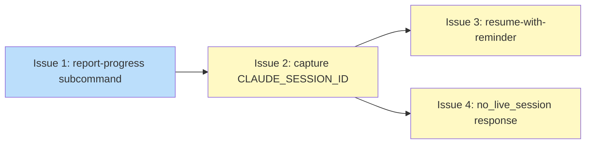

# Plan: Coordinator Loop Stall Recovery

## Status

Draft

## Scope Summary

Implement three coordinated changes to niwa's mesh daemon that fix coordinator delegation failures caused by stall watchdog kills: a stop hook that resets the watchdog at every Claude Code turn boundary; session ID capture at MCP server startup enabling resume-with-reminder after stall kills instead of fresh spawns; and a typed `no_live_session` response from `handleAsk` replacing the ephemeral-spawn fallback.

## Decomposition Strategy

**Horizontal decomposition.** The design defines four implementation phases with clean component boundaries and explicit sequential dependencies. Phase 1 (stop hook) and Phase 4 (`handleAsk` fix) are independent features. Phases 2 and 3 form a pipeline: session ID capture (Phase 2) provides the data that the resume path (Phase 3) reads. Horizontal decomposition maps 1:1 to the design's own phases, making each issue self-contained within its layer.

## Issue Outlines

### Issue 1: feat(mesh): add report-progress subcommand and stop hook script

**Goal**: Implement the `niwa mesh report-progress` CLI subcommand and generate the workspace-level stop hook script that calls it at every Claude Code turn boundary.

**Acceptance Criteria**:

- [ ] `niwa mesh report-progress` subcommand in `internal/cli/mesh.go` reads `NIWA_TASK_ID` and `NIWA_SESSION_ROLE` from the process environment; accepts no `--task-id` flag.
- [ ] Subcommand verifies ownership against `state.json` (task_id and worker.role must match); calls `mcp.UpdateState` to advance `last_progress.at` on success.
- [ ] Exit code policy: 0 on success, 0 on `ErrAlreadyTerminal`, 0 when `NIWA_TASK_ID` unset; non-zero on infrastructure errors.
- [ ] `workspace apply` generates `report-progress.sh` in `.niwa/hooks/stop/` using the absolute niwa binary path resolved at apply time; the script invokes `<absolute-path> mesh report-progress` with no additional arguments.
- [ ] The `[hooks] stop` entry is registered in `workspace.toml`.
- [ ] Unit test: ownership check (pass/fail), `UpdateState` called, terminal no-op exits 0, unset `NIWA_TASK_ID` exits 0, infrastructure error exits non-zero.
- [ ] Script-generation unit test asserts: binary path matches resolved absolute path, `mesh report-progress` tokens present, `--task-id` token absent.

**Dependencies**: None

---

### Issue 2: feat(mcp): capture CLAUDE_SESSION_ID at MCP server startup

**Goal**: Add `ClaudeSessionID`, `ResumeCount`, and `MaxResumes` schema fields and register the worker's session ID in `state.json` at MCP server startup before any tool call is handled.

**Acceptance Criteria**:

- [ ] `TaskWorker` gains `ClaudeSessionID string` (`json:"claude_session_id,omitempty"`) and `ResumeCount int` (`json:"resume_count,omitempty"`); `TaskState` gains `MaxResumes int` (`json:"max_resumes,omitempty"`); `TransitionLogEntry` gains `Resume bool` (`json:"resume,omitempty"`).
- [ ] `ClaudeSessionID` carries a struct-level comment: must not appear in diagnostic exports or sanitized log output.
- [ ] When `createTaskEnvelope` creates a new task, `MaxResumes` is written to `state.json` as `2`; test confirms via `ReadState` from disk.
- [ ] At MCP server startup (before any tool call), server reads `$CLAUDE_SESSION_ID`, validates against `sessionIDRegex` (`^[a-zA-Z0-9_-]{8,128}$`), and if valid and `s.taskID != ""`, calls `UpdateState` to write `Worker.ClaudeSessionID`; test confirms via `ReadState` from disk.
- [ ] When `s.taskID == ""` (coordinator session), startup registration write is skipped; test confirms no `state.json` write occurs.
- [ ] Absent or invalid `$CLAUDE_SESSION_ID`: field stays empty, server starts without error, no error-severity log line.
- [ ] Resume with new session: startup registration overwrites existing `ClaudeSessionID`; test confirms via `ReadState` from disk using a pre-populated fixture and different env var value.
- [ ] Audit log exclusion: calling any MCP tool handler with `Worker.ClaudeSessionID` populated produces a log entry lacking the string `"claude_session_id"`.
- [ ] Backward compatibility: `state.json` files lacking all four new fields round-trip through `ReadState` → `UpdateState` without data loss; test reads fixture and asserts zero values.

**Dependencies**: Blocked by <<ISSUE:1>>

---

### Issue 3: feat(mesh): implement resume-with-reminder on stall kill

**Goal**: Add the resume-vs-fresh-spawn branch in `retrySpawn` that resumes a killed worker with an injected reminder when the session is recoverable and the retry budget allows, and falls back to fresh spawn or exhaustion handling otherwise.

**Acceptance Criteria**:

Five guards run in strict order when the watchdog fires:

- [ ] **Guard 1 (RestartCount exhaustion)**: `RestartCount >= MaxRestarts` transitions the task to terminal/abandoned without entering the resume path and without changing any counter; `ReadState` confirms both `RestartCount` and `ResumeCount` unchanged.
- [ ] **Guard 2 (MaxResumes cap)**: `ResumeCount >= effective MaxResumes` (where `MaxResumes <= 0` treated as 2) triggers fresh spawn; `RestartCount++`, `ResumeCount=0`, `ClaudeSessionID` cleared.
- [ ] **Guard 3 (ClaudeSessionID presence)**: empty `ClaudeSessionID` triggers fresh spawn with same counter changes as Guard 2.
- [ ] **Guard 4 (session file integrity)**: `.jsonl` file missing, empty, or last 4 KB contains no complete JSON line triggers fresh spawn.
- [ ] **Guard 5 (sessionIDRegex)**: `ClaudeSessionID` failing `^[a-zA-Z0-9_-]{8,128}$` triggers fresh spawn before use in `--resume`.
- [ ] Guards evaluated in strict order; no guard runs before the preceding one resolves.

Resume path (all guards pass):

- [ ] `spawnWorker(resumeMode=true)` builds command: `claude --resume <session_id> -p "<reminder>" --permission-mode=<mode> --mcp-config=<path> --strict-mcp-config --allowed-tools <tools>`.
- [ ] Reminder matches the compile-time constant exactly: "You were stopped by the stall watchdog. The workspace stop hook resets the watchdog automatically at every turn boundary — you do not need to call niwa_report_progress manually. Do not call niwa_check_messages again — your task envelope is already in your conversation history. Continue your work from where you left off."
- [ ] `ResumeCount++`, `RestartCount` unchanged, `ClaudeSessionID` preserved; `TransitionLogEntry` has `resume: true`.

ClaudeSessionID capture trap:

- [ ] `cur.Worker.ClaudeSessionID` captured to local variable before `next.Worker = mcp.TaskWorker{}`.
- [ ] On resume branch, captured ID copied into `next.Worker.ClaudeSessionID`; on fresh-spawn branch, field left empty.

Tests (all counter/field checks via `ReadState` from disk):

- [ ] **Test A** (Guard 5 ordering): `ResumeCount < MaxResumes`, file passes integrity, `ClaudeSessionID` fails regex → fresh-spawn; `ReadState` asserts `RestartCount==prior+1`, `ResumeCount==0`, `ClaudeSessionID==""`.
- [ ] **Test B** (Guard 2 ordering): `ResumeCount == effective MaxResumes`, file passes integrity → fresh-spawn; `ReadState` asserts `RestartCount==prior+1`, `ResumeCount==0`, `ClaudeSessionID==""`.
- [ ] **Test C**: `ResumeCount=1`, `MaxResumes=2`; resume taken; `ReadState` asserts `ResumeCount==2`, `RestartCount==prior`.
- [ ] **Test D**: `ClaudeSessionID='test-session-id-abc'`; resume taken; `ReadState` asserts `ClaudeSessionID=='test-session-id-abc'`.
- [ ] **Test E**: fresh-spawn taken; `ReadState` asserts `RestartCount==prior+1`, `ResumeCount==0`, `ClaudeSessionID==""`.
- [ ] **Test F**: `RestartCount==MaxRestarts`, valid `ClaudeSessionID`, `ResumeCount=1`; `ReadState` asserts `RestartCount==MaxRestarts` (unchanged) and `ResumeCount==1` (unchanged).
- [ ] Guard 3 failure: `ClaudeSessionID` empty → fresh spawn; `ReadState` asserts `RestartCount++`, `ResumeCount==0`.
- [ ] Guard 4 failure: file fails integrity → fresh spawn; `ReadState` asserts `RestartCount++`, `ResumeCount==0`, `ClaudeSessionID==""`.
- [ ] `MaxResumes=0` in `state.json` treated as 2 in `retrySpawn`.
- [ ] Resume-path spawn does not increment `RestartCount`; `ReadState` confirms.

**Dependencies**: Blocked by <<ISSUE:2>>

---

### Issue 4: fix(mcp): return no_live_session status from handleAsk

**Goal**: Remove the ephemeral-spawn fallback from `handleAsk` and return a typed `no_live_session` response immediately when no live session exists for the target role, before creating any ask task store entry.

**Acceptance Criteria**:

- [ ] When `handleAsk` finds no live session for the target role, it returns immediately: `{status: "no_live_session", role: "<role>", message: "No live session found for role '<role>'. The role may have completed its task or not yet started."}`.
- [ ] `no_live_session` response returned before any ask task store entry is created; the implementation must not create a task directory optimistically and clean it up.
- [ ] Test: call `niwa_ask` targeting a role with no registered session; assert `status=="no_live_session"` and the tasks directory contains zero subdirectory entries (verifying the task directory was never written, not merely absent at assertion time).
- [ ] Ask tasks created on the live-session path use `MaxRestarts: 0`; test inspects created task's `state.json` and asserts `max_restarts==0`.
- [ ] An ask task that exceeds its timeout without an answer transitions to `abandoned`, not `queued`.
- [ ] After an ask task times out, the daemon does not attempt to restart it (`restart_count` remains 0, no new spawn event in `transitions.log` for that ask task).

**Dependencies**: Blocked by <<ISSUE:2>>

---

## Dependency Graph

**Legend**: Green = done, Blue = ready, Yellow = blocked, Purple = needs-design, Orange = tracks-design/tracks-plan

## Implementation Sequence

**Critical path**: Issue 1 → Issue 2 → Issue 3 (length 3). Issue 1 → Issue 2 → Issue 4 is also length 3; Issue 3 is the heavier implementation.

**Recommended order**:

1. **Issue 1** — no dependencies; start immediately. Delivers stop hook infrastructure independently shippable as first-line stall prevention.
2. **Issue 2** — unblocked after Issue 1. Schema additions and session registration; a prerequisite for both Issue 3 and Issue 4.
3. **Issues 3 and 4** — can be worked in parallel after Issue 2. Issue 3 is the heavier implementation (critical complexity, five-guard sequence); Issue 4 is testable complexity and a smaller change.

**Deployment constraint**: Issue 4 must not be deployed before Issue 2 is in production. The ephemeral-spawn fallback it removes exists because coordinator session registration was previously unreliable; removing it before Issue 2 is live creates a regression window.
