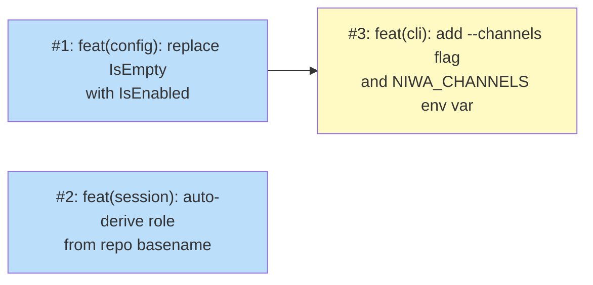

# PLAN: Cross-Session Communication — Channels Ergonomics

## Status

Draft

## Scope Summary

Implements Phase 6 of the cross-session communication design: role auto-derivation
(bare `[channels.mesh]` without a roles map now provisions the full session mesh),
hybrid channels activation (`--channels`/`--no-channels` flags on `niwa create` and
`niwa apply`), and a user-level default via the `NIWA_CHANNELS` environment variable.
Phases 1-5 (the original mesh implementation) are already shipped.

## Decomposition Strategy

**Horizontal decomposition.** The three components have clear interfaces and can be
implemented in layer order without integration risk: the existing session mesh
infrastructure is already in production, so each issue extends an isolated path
rather than building a new end-to-end flow. The config gate change (Issue 1) is a
prerequisite for the activation flags (Issue 3), but role resolution (Issue 2) is
fully independent. Issues 1 and 2 can be worked in parallel.

## Issue Outlines

---

### Issue 1: feat(config): replace IsEmpty with IsEnabled on MeshConfig

**Goal**

Change the channel provisioning gate from a content check (Roles map non-empty)
to a presence check (`[channels.mesh]` TOML section present), so a bare
`[channels.mesh]` with no sub-keys provisions the full mesh infrastructure.

**Acceptance Criteria**

- `ChannelsMeshConfig` is referenced as a pointer (`*ChannelsMeshConfig`) in
  `ChannelsConfig`; the field is `nil` when the `[channels.mesh]` TOML section
  is absent, and non-nil (even if zero-value) when the section is present
- `IsEnabled()` method added to `ChannelsConfig`; returns `c.Mesh != nil`
- `IsEmpty()` removed; all four callers updated:
  - `InstallChannelInfrastructure` in `internal/workspace/channels.go` (line 45)
  - `injectChannelHooks` in `internal/workspace/channels.go` (line 202)
  - Daemon spawn check in `internal/workspace/apply.go` (lines 256, 387)
- `buildChannelsSection` updated: removes the role-enumeration block (which read
  from `cfg.Channels.Mesh.Roles`); instead writes a single sentence explaining
  that roles are auto-derived from repo names; all four MCP tools still listed
- `niwa create` on a workspace with bare `[channels.mesh]` (no roles sub-keys)
  creates `.niwa/sessions/sessions.json`, `.claude/.mcp.json`, and `.niwa/daemon.pid`
- `niwa create` on a workspace with no `[channels]` section skips channel
  provisioning (no `.niwa/sessions/` created)
- Existing workspace configs with explicit `[channels.mesh.roles]` entries still
  provision correctly (pointer is non-nil; roles map accessible via `cfg.Channels.Mesh.Roles`)
- Functional test (new `@critical` scenario in `mesh.feature`): `niwa create`
  on a workspace with bare `[channels.mesh]` (no roles) creates the expected artifacts

**Dependencies**

None

---

### Issue 2: feat(session): auto-derive role from repo basename

**Goal**

Give sessions a meaningful role by default — `coordinator` for the instance root
session, repo basename for per-repo sessions — without requiring any role
configuration in workspace.toml.

**Acceptance Criteria**

- `deriveRole()` in `internal/cli/session_register.go` gains a fourth tier:
  when `NIWA_SESSION_ROLE` is unset and `--repo` is empty, derive role from
  `filepath.Base` of `pwd` relative to `NIWA_INSTANCE_ROOT`; when `pwd` equals
  `NIWA_INSTANCE_ROOT`, return `"coordinator"`
- A `--role` flag added to `niwa session register` as the highest-priority tier
  (overrides `NIWA_SESSION_ROLE`, `--repo`, and the pwd fallback)
- Hook scripts written by `InstallChannelInfrastructure` updated to call
  `niwa session register` with role injection per-repo so Claude Code sessions
  in each repo directory register with their repo name automatically:
  - At instance root: no role injection needed (pwd fallback → coordinator)
  - In a repo dir: hook injects correct role via `NIWA_SESSION_ROLE` or
    `--repo` so registration doesn't depend on hook CWD assumptions
- `niwa session register` invoked at `<instance-root>/myrepo/` registers with
  role `myrepo` in `sessions.json`
- `niwa session register` invoked at `<instance-root>/` registers with role
  `coordinator` in `sessions.json`
- `NIWA_SESSION_ROLE=custom niwa session register` overrides the derived role
- `niwa session register --role explicit` overrides all other tiers
- Functional test (new `@critical` scenario in `mesh.feature`): session registered
  in a repo directory has `sessions.json` entry with role matching repo basename

**Dependencies**

None

---

### Issue 3: feat(cli): add --channels flag and NIWA_CHANNELS env var

**Goal**

Enable per-invocation channel activation without workspace.toml changes, and provide
a persistent user-level default via the `NIWA_CHANNELS` environment variable.

**Acceptance Criteria**

- `--channels` bool flag added to both `niwa create` and `niwa apply` cobra commands
- `--no-channels` bool flag added to both `niwa create` and `niwa apply` cobra commands
- `NIWA_CHANNELS` env var read at CLI parse time: `"1"` enables channels default,
  `"0"` disables, any other non-empty value logs a stderr warning and is ignored
- Priority enforced (highest to lowest):
  1. `--no-channels` explicit flag → channels disabled regardless of all else
  2. `--channels` explicit flag → channels enabled
  3. `[channels.mesh]` config section present → channels enabled
  4. `NIWA_CHANNELS=1` env var → channels enabled default
- When channels activated via flag or env var without a config section:
  `cfg.Channels.Mesh` is synthesized as `&ChannelsMeshConfig{}` before provisioning
  so `InstallChannelInfrastructure` and `injectChannelHooks` treat it as enabled
- `niwa apply` emits a one-time notice to stderr when channels were activated via
  flag or env var (not config section): _"Hint: to persist channels for this
  workspace, add [channels.mesh] to workspace.toml or set NIWA_CHANNELS=1 in your
  shell profile."_ (follows the one-time-notice pattern from docs/guides/one-time-notices.md)
- Functional tests (new `@critical` scenarios in `mesh.feature`):
  - `niwa create --channels` on a plain workspace (no `[channels.mesh]`) creates
    `.niwa/sessions/sessions.json` and `.niwa/daemon.pid`
  - `NIWA_CHANNELS=1 niwa create` on a plain workspace provisions channel infrastructure
  - `NIWA_CHANNELS=1 niwa create --no-channels` does NOT provision (flag beats env var)

**Dependencies**

<<ISSUE:1>>

---

## Dependency Graph

**Legend**: Blue = ready, Yellow = blocked

## Implementation Sequence

**Start**: Issues 1 and 2 are independent and can be implemented in parallel.

**Critical path**: Issue 1 → Issue 3 (two steps). Issue 3's flag merge logic
synthesizes a `*ChannelsMeshConfig` and passes it to `IsEnabled()`; the pointer
type must exist from Issue 1 before Issue 3 can compile.

**Recommended order** for a single implementor:
1. Issue 1 first (small, foundational — unblocks Issue 3)
2. Issue 2 next (independent; self-contained in session_register.go and channels.go hook scripts)
3. Issue 3 last (after Issue 1 is committed to the branch)

All three issues include their own `@critical` functional test scenarios. Run
`make test-functional-critical` after each issue to verify no regressions.
