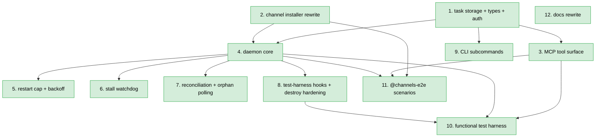

# PLAN: Cross-Session Communication

## Status

Draft

## Scope Summary

Rewrite niwa's mesh: messages route through per-role inboxes provisioned
at apply time; tasks are first-class per-directory state machines; a
central-loop daemon claims queued envelopes and spawns ephemeral
`claude -p` workers; per-session stdio MCP servers expose a task-
lifecycle tool surface with three-factor worker authorization; a flat
`niwa-mesh` skill is installed into every agent; a test harness decouples
acceptance criteria from live Claude. Twelve issues implement the design
in one PR on the current branch, with twelve commits.

## Decomposition Strategy

**Horizontal decomposition.** The upstream design's Implementation
Approach is already sequenced layer-by-layer with explicit inter-phase
dependencies (Phase 1 → 3, Phase 2 → 4a, etc.). Each phase delivers a
working layer of the mesh, not a stub. Issues map 1:1 to design phases,
with the design's Phase 4 split into 4a–4e landing as Issues 4–8.

No walking-skeleton "stub-first" issue is useful here because the design
is a rewrite of existing, working code (not a greenfield feature). Early
integration is naturally achieved by Issue 4 (daemon core) exercising
Issue 1's storage and Issue 3's tools end-to-end, and by the functional
harness in Issue 10 that runs through the real spawn path.

Execution mode is **single-pr**: all twelve commits land on the current
branch (`docs/cross-session-communication`) as one PR. Dependency waves
inform work order within the branch but do not gate merges — no
user-facing behavior ships until the full mesh is in place.

## Issue Outlines

### Issue 1: feat(mcp): task storage primitives, types, and authorization helper

**Complexity**: critical — touches the authorization boundary for every
task-lifecycle tool; state-transition atomicity determines whether
concurrent writers can corrupt task state.

#### Goal

Establish the foundation types, per-task storage primitives, and
authorization helper that every other niwa-mesh component depends on —
`state.json` + NDJSON `transitions.log` schemas, a per-task `.lock`
flock with a 30-second bounded timeout, a `TaskStore.UpdateState`
transactional API, `PPIDChain(1)` walking exactly one level up from the
MCP server to the `claude -p` worker, and `authorizeTaskCall`
implementing the kindDelegator / kindExecutor / kindParty checks.

#### Acceptance Criteria

- [ ] `internal/mcp/types.go` defines `TaskEnvelope` (PRD R15 v=1 schema), `TaskState` (Decision 1 schema), `StateTransition`, and `TaskEventKind` / `taskEvent` types.
- [ ] New `internal/mcp/taskstore.go` exposes `OpenTaskLock`, `ReadState`, and `UpdateState(taskDir, mutator)` where mutator returns the new state and a transition log entry.
- [ ] `UpdateState` critical section: flock → read → validate → mutate → write tmp → fsync → atomic rename → fsync parent → append transitions.log → fsync log → release.
- [ ] All flock acquisitions use a 30-second bounded timeout; returns `ErrLockTimeout` on expiry.
- [ ] All opens of `state.json`, `envelope.json`, `.lock`, and `transitions.log` use `O_NOFOLLOW`; symlink-substitution test fails closed.
- [ ] Task IDs are UUIDv4 via `crypto/rand`; 10 000-sample uniqueness+format unit test.
- [ ] Schema validation on every read (`v == 1`, state in enum, UUID-shaped IDs); malformed content returns `ErrCorruptedState`.
- [ ] `transitions.log` is NDJSON with a `kind` discriminator; progress entries log only the 200-char `summary`, not the full body.
- [ ] `internal/mcp/liveness.go` grows `PPIDChain(n int) ([]int, error)`; structured error when a PID in the chain does not exist.
- [ ] New `internal/mcp/auth.go` exposes `authorizeTaskCall(s, taskID, kind)` with `kindDelegator`, `kindExecutor`, `kindParty`.
- [ ] `kindExecutor` on Linux verifies `PPIDChain(1)` PID's start_time matches `state.json.worker.{pid, start_time}`; macOS degrades to PID-match-only per PRD Known Limitation.
- [ ] Unauthorized callers receive PRD R50 error codes only (`NOT_TASK_OWNER`, `NOT_TASK_PARTY`, `TASK_ALREADY_TERMINAL`); no new codes introduced.
- [ ] Concurrent-writer stress test (two processes × 1 000 `UpdateState` calls): no torn reads, no lost transitions, final `state_transitions` length equals sum of successes.

#### Dependencies

None. Blocks Issues 3, 4, 9.

---

### Issue 2: feat(workspace): rewrite channel installer for per-role inboxes, skill install, and layout migration

**Complexity**: testable — rewrites a provisioning step; integration with existing `ManagedFiles` pattern is proven; no auth or crypto surface.

#### Goal

Rewrite `InstallChannelInfrastructure` (pipeline step 4.75) to provision
the new mesh layout — per-role inbox directories, `.niwa/tasks/`,
`.mcp.json` at instance and per repo, flat uniform `niwa-mesh/SKILL.md`
with hash-based idempotency, minimal `## Channels` section in
`workspace-context.md`, SessionStart + UserPromptSubmit hooks via the
existing `HooksMaterializer`, and a one-shot migration helper that
removes pre-1.0 `.niwa/sessions/<uuid>/` directories with a single
stderr warning.

#### Acceptance Criteria

- [ ] Any of `[channels.mesh]` config, `--channels` flag, or `NIWA_CHANNELS=1` env creates `.niwa/roles/<role>/inbox/{,in-progress,cancelled,expired,read}/` for every topology-derived role. (PRD AC-P1, AC-P2, AC-R1)
- [ ] `--no-channels` suppresses provisioning; no triggers = no mesh line in `niwa status`. (AC-P3, AC-P4)
- [ ] `.niwa/tasks/`, empty `sessions.json`, `daemon.pid`/`daemon.log` present on channeled workspace. (AC-P5)
- [ ] `.mcp.json` written at instance root and mirrored per repo, each pointing to `niwa mcp-serve`. (AC-P6)
- [ ] `niwa-mesh/SKILL.md` exists at instance root and each repo; frontmatter has `name`, `description` (under 1 536-char cap), `allowed-tools`; body contains PRD R10's six section headings. (AC-P7, AC-P8)
- [ ] Idempotency via sha256 `ContentHash`: second apply with unchanged output = no drift warning, mtime stable. Hand-edit triggers stderr drift warning and overwrite. (AC-P13)
- [ ] Personal-scope `~/.claude/skills/niwa-mesh/SKILL.md` is not modified by apply. (AC-P12)
- [ ] `## Channels` in `workspace-context.md` contains exactly: role, `NIWA_INSTANCE_ROOT`, tool names, single pointer line. (AC-P15)
- [ ] Role collision detection for basename collisions (AC-R2); reserved `coordinator` check (AC-R3); name format validation (AC-R4).
- [ ] New repo on second apply creates its inbox without modifying others (AC-P9).
- [ ] Second apply with queued/in-progress envelopes leaves them byte-identical (AC-P10).
- [ ] File mode 0600 / dir mode 0700 under `umask 0000` (AC-P14).
- [ ] Migration helper detects `.niwa/sessions/<uuid>/` with absent `.niwa/roles/`; emits one stderr warning; removes old dirs; preserves `sessions.json`.
- [ ] `workspace.toml` parser rejects any `NIWA_WORKER_SPAWN_COMMAND` key with a parse error; regression test asserts this.
- [ ] Every installer-written path in `InstanceState.ManagedFiles`; runtime artifacts (`.niwa/tasks/`, `.niwa/roles/*/inbox/`) NOT tracked.
- [ ] SessionStart + UserPromptSubmit hooks injected into `cfg.Claude.Hooks`; written per-repo for coordinator role only.

#### Dependencies

None. Blocks Issues 4, 11.

---

### Issue 3: feat(mcp): new task-lifecycle tool surface and per-session fsnotify watcher

**Complexity**: testable — 11-tool surface exercising the Issue 1 helper.

#### Goal

Implement the revised MCP tool surface on the existing per-session stdio
server: eight new task-lifecycle tools (`niwa_delegate`,
`niwa_query_task`, `niwa_await_task`, `niwa_report_progress`,
`niwa_finish_task`, `niwa_list_outbound_tasks`, `niwa_update_task`,
`niwa_cancel_task`) plus revised peer-messaging tools (`niwa_ask`,
`niwa_send_message`, `niwa_check_messages`), with `awaitWaiters` size-1
buffered channels and per-session fsnotify watcher routing task-terminal
messages through an extended `notifyNewFile`.

#### Acceptance Criteria

- [ ] `Server` struct gains `taskID string` (from `NIWA_TASK_ID` env) and `awaitWaiters map[string]chan taskEvent` (size-1 buffered; protected by `waitersMu`).
- [ ] Each per-session MCP server starts its own fsnotify watch on `.niwa/roles/<s.role>/inbox/` at startup.
- [ ] `notifyNewFile` routes `task.completed`/`task.abandoned`/`task.cancelled` to `awaitWaiters[body.task_id]` before existing `reply_to` paths.
- [ ] `niwa_delegate(to, body, mode, expires_at?)` — async returns `{task_id}` in ≤100 ms (AC-D1); sync blocks on `awaitWaiters` returning `{status:"completed"|"abandoned"|"cancelled", ...}` (AC-D7/D8/D9).
- [ ] `parent_task_id` auto-populated from `s.taskID` for delegations from within a running worker (AC-D18).
- [ ] `niwa_query_task` returns state + transitions + restart_count + last_progress + terminal fields; non-parties receive `NOT_TASK_PARTY` (AC-D12, AC-D13).
- [ ] `niwa_await_task(task_id, timeout_seconds?)` registers waiter with `defer cancel()` before the race-guard state read; non-delegator receives `NOT_TASK_OWNER` (AC-D10, AC-D11, AC-D14).
- [ ] `niwa_report_progress(task_id, summary, body?)` truncates summary to 200 chars with `…`, logs summary-only to `transitions.log`, updates `state.json.last_progress`, delivers `task.progress` message within 5 s (AC-D15, AC-D16, AC-D17).
- [ ] `niwa_finish_task(task_id, outcome, result?, reason?)` — `BAD_PAYLOAD` on mismatch; `TASK_ALREADY_TERMINAL` on second call; writes `task.completed`/`task.abandoned` to delegator's inbox (AC-D6, AC-D8a, AC-L7, AC-L8).
- [ ] `niwa_list_outbound_tasks(to?, status?)` returns only caller's tasks (AC-Q1, AC-Q2).
- [ ] `niwa_update_task(task_id, body)` — `{status:"updated"}` while queued, `{status:"too_late"}` otherwise; non-delegator receives `NOT_TASK_OWNER` (AC-Q3–Q6).
- [ ] `niwa_cancel_task(task_id)` atomic rename to `inbox/cancelled/<id>.json`; ENOENT → `too_late`; non-delegator → `NOT_TASK_OWNER` (AC-Q7–Q9).
- [ ] `niwa_ask(to, body, timeout_seconds?)` creates first-class task with `body.kind="ask"` when target unregistered; default timeout 600 s (AC-M1–M3).
- [ ] `niwa_send_message` validates type format (`BAD_TYPE` on fail), rejects unknown roles (`UNKNOWN_ROLE`), atomic-rename write, no delivery-status response field (AC-M4–M7).
- [ ] `niwa_check_messages` returns unread markdown-formatted; moves returned files to `inbox/read/`; sweeps expired to `inbox/expired/` first (AC-M4, AC-M8).
- [ ] Retrieved `task.delegate` bodies wrapped in a delimited outer envelope marker (data-plane prompt-injection defense).
- [ ] Handler-level unit tests for each happy path + each PRD R50 error code. Race-window coverage deferred to Issue 10.

#### Dependencies

Blocked by Issue 1. Blocks Issues 10, 11.

---

### Issue 4: feat(daemon): central event loop, consumption claim, and worker spawn

**Complexity**: critical — the daemon is the process-supervision authority; spawn contract affects every worker's security posture (PATH, permission mode, MCP config).

#### Goal

Rewrite `niwa mesh watch` to a central event loop plus per-task
supervisor goroutines: fsnotify watches per-role inboxes;
consumption-rename claim under `taskstore.UpdateState`;
`exec.LookPath("claude")` resolved once at startup with the absolute
path + owning UID + st_mode logged at INFO; fixed argv + niwa-owned env
overrides (`NIWA_INSTANCE_ROOT`, `NIWA_SESSION_ROLE`, `NIWA_TASK_ID`);
per-worker supervisor goroutine calling `cmd.Wait()`; taskEvent channel
aggregating exit and progress events for central state-transition
decisions.

#### Acceptance Criteria

- [ ] Central goroutine owns: fsnotify watcher on `.niwa/roles/*/inbox/`, central `taskEvent` channel, state.json writes for spawn decisions.
- [ ] `exec.LookPath("claude")` resolved once at startup (or `NIWA_WORKER_SPAWN_COMMAND` when set); absolute path + UID + mode logged at INFO; same path reused for every spawn.
- [ ] Catch-up inbox scan after fsnotify registration.
- [ ] Consumption rename: atomic `inbox/<id>.json` → `inbox/in-progress/<id>.json` under per-task `.lock`; state transition `queued` → `running`; `worker.{role, spawn_started_at}` written.
- [ ] Spawn argv: `-p "<bootstrap prompt with <task-id>>" --permission-mode=acceptEdits --mcp-config=<instanceRoot>/.claude/.mcp.json --strict-mcp-config`. Bootstrap never contains task body. (AC-D5)
- [ ] Env: pass-through + last-wins `NIWA_INSTANCE_ROOT`, `NIWA_SESSION_ROLE`, `NIWA_TASK_ID`. (AC-D4)
- [ ] CWD: target role's repo dir (or instance root for coordinator).
- [ ] After `cmd.Start()`, re-acquire lock and backfill `worker.{pid, start_time}`; append `spawn` entry to `transitions.log`.
- [ ] Per-task supervisor goroutine with `cmd.Wait()`; reports `{TaskID, evtUnexpectedExit, ExitCode}` on return.
- [ ] Central exit handling: if state.json already terminal, log+release; else classify unexpected and hand off to Issue 5's pipeline.
- [ ] `Setsid: true`; PID file written atomically AFTER central goroutine operational.
- [ ] `NIWA_WORKER_SPAWN_COMMAND` substitutes the resolved binary path; argv/env/CWD unchanged.
- [ ] Unit tests: argv matches fixed shape; argv contains no body field (AC-D5); `LookPath` logged once; Go-side spawn double verifies env + CWD.
- [ ] All daemon flock acquisitions use Issue 1's 30-second bounded timeout.

#### Dependencies

Blocked by Issues 1, 2. Blocks Issues 5, 6, 7, 8, 10, 11.

---

### Issue 5: feat(daemon): restart cap with backoff and unexpected-exit classification

**Complexity**: testable.

#### Goal

Enforce the 3-restart cap (4 total attempts) with linear 30/60/90s
backoff (configurable via `NIWA_RETRY_BACKOFF_SECONDS`); classify every
`cmd.Wait()` return against `state.json.state`; treat still-`running` as
unexpected exit; bump `restart_count` and schedule the next spawn after
configured backoff, or transition to `abandoned` with
`reason: "retry_cap_exceeded"` at cap.

#### Acceptance Criteria

- [ ] Central loop increments `state.json.worker.restart_count` under lock on unexpected-exit events.
- [ ] Retry schedules next spawn via `time.AfterFunc(backoff[restart_count-1], ...)` using `NIWA_RETRY_BACKOFF_SECONDS` (comma-separated integer seconds; default `30,60,90`).
- [ ] Abandon path: state → `abandoned`; `reason: "retry_cap_exceeded"`; `task.abandoned` message to delegator's inbox. (AC-L3)
- [ ] Worker exiting code 0 without `niwa_finish_task` classified as unexpected exit (AC-L1).
- [ ] Worker exiting non-zero without `niwa_finish_task` classified as unexpected exit (AC-L2).
- [ ] Worker transitioning state to `completed` before exit: no restart_count bump.
- [ ] `niwa_fail_task` path: state → `abandoned` without `restart_count` bump; no retry scheduled (AC-L6).
- [ ] Backoff timing with `NIWA_RETRY_BACKOFF_SECONDS=1,2,3`: three restarts at ~1s, ~2s, ~3s; measured from state.json transition timestamps (AC-L5).
- [ ] `spawn_started_at` marker: set before `cmd.Start`, cleared on real PID backfill; crash between write and `cmd.Start` lets Issue 7's reconciliation allocate fresh retry without double-counting.

#### Dependencies

Blocked by Issue 4. Downstream via Issue 10.

---

### Issue 6: feat(daemon): stalled-progress watchdog and SIGTERM/SIGKILL escalation

**Complexity**: testable.

#### Goal

Add per-supervisor `time.Timer` reset on detected progress (2 s poll of
`state.json.last_progress.at`); SIGTERM on stall; SIGKILL after
`NIWA_SIGTERM_GRACE_SECONDS`; defensive reap for workers that hang after
`niwa_finish_task`.

#### Acceptance Criteria

- [ ] Timer initialized to `NIWA_STALL_WATCHDOG_SECONDS` (default 900 s); reset on every detected progress update.
- [ ] Progress detection: 2-second ticker reads `last_progress.at` under shared flock; timestamp advance → reset timer.
- [ ] Watchdog fire → SIGTERM worker; append `watchdog_signal` entry to `transitions.log`.
- [ ] After SIGTERM: wait `NIWA_SIGTERM_GRACE_SECONDS` (default 5 s); if not exited, `cmd.Process.Kill()` (SIGKILL); second `watchdog_signal` entry.
- [ ] Watchdog-triggered exits classified as unexpected (consume retry slot via Issue 5). (R36; AC-L4)
- [ ] Defensive reap: state terminal but worker process alive after `NIWA_SIGTERM_GRACE_SECONDS` → SIGTERM then SIGKILL; does NOT consume retry slot (state is already terminal).
- [ ] Test with `NIWA_STALL_WATCHDOG_SECONDS=2`: stall triggers SIGTERM after ~2 s; SIGTERM-ignoring worker killed after `NIWA_SIGTERM_GRACE_SECONDS=1` (AC-L4).
- [ ] Test: worker calling `niwa_report_progress` every 1 s does not trigger watchdog.
- [ ] Default compliance: no env overrides → 900 s watchdog, 5 s grace per PRD Configuration Defaults.

#### Dependencies

Blocked by Issue 4. Downstream via Issue 10.

---

### Issue 7: feat(daemon): crash reconciliation and adopted-orphan polling

**Complexity**: critical — crash recovery correctness; double-spawning or misclassifying orphans produce silent correctness failures.

#### Goal

On daemon startup, classify each `.niwa/tasks/*/state.json` with state
`running` as adopted orphan (PID + start_time alive) or unexpected exit
(dead or start_time diverges — PID reuse defense). Central loop polls
adopted orphans every 2 s via `IsPIDAlive`; divergent start_time
classified as unexpected exit. `daemon.pid.lock` flock prevents two
concurrent daemons.

#### Acceptance Criteria

- [ ] Startup enumerates `.niwa/tasks/*/state.json`; applies classification to every `running` task.
- [ ] Live-orphan: PID > 0 AND `IsPIDAlive(pid, start_time)` true → add to orphan list; set `worker.adopted_at`; append `adoption` entry.
- [ ] Spawn-never-completed: `pid == 0` AND `spawn_started_at` present → allocate fresh retry without bumping `restart_count`.
- [ ] Dead worker: PID > 0 AND `IsPIDAlive` false → unexpected-exit path (Issue 5).
- [ ] PID reuse: PID > 0 AND `IsPIDAlive` true but start_time diverges → unexpected-exit path.
- [ ] Central-loop 2-second ticker polls each orphan; transition to dead or diverged start_time → unexpected-exit hand-off.
- [ ] Catch-up inbox scan follows reconciliation; queued envelopes without in-progress counterpart flow through normal claim path.
- [ ] `.niwa/daemon.pid.lock` flock: concurrent `niwa apply` observes lock held; two daemons never spawned (AC-C3).
- [ ] `niwa apply` reads PID under shared flock, verifies liveness, only spawns if no live daemon.
- [ ] Test: SIGKILL daemon with live worker; new daemon adopts orphan; worker's subsequent `niwa_finish_task` transitions state as usual (AC-L9).
- [ ] Test: SIGKILL both daemon and worker; new daemon → unexpected-exit → retry with backoff (AC-L10).
- [ ] Test: crash mid-spawn (state.json written, `cmd.Start` not called); new daemon → fresh retry with no `restart_count` increment.
- [ ] Test: envelope in inbox at startup; catch-up claim proceeds normally (AC-L11).

#### Dependencies

Blocked by Issue 4. Downstream via Issue 10.

---

### Issue 8: feat(daemon): test-harness pause hooks and destroy-phase worker SIGKILL hardening

**Complexity**: testable.

#### Goal

Implement `NIWA_TEST_PAUSE_BEFORE_CLAIM` and `NIWA_TEST_PAUSE_AFTER_CLAIM`
env-gated pause hooks at the consumption-rename boundary so race-window
AC are deterministic. Update `niwa destroy` to SIGKILL worker process
groups first (before daemon grace period), minimizing the
`acceptEdits`-enabled worker's exfiltration window during teardown.

#### Acceptance Criteria

- [ ] `NIWA_WORKER_SPAWN_COMMAND` literal-path substitution documented audibly (daemon log on startup logs resolved binary's absolute path + UID + mode).
- [ ] Argv, env, CWD, process-group behavior identical between `claude` and override.
- [ ] `NIWA_TEST_PAUSE_BEFORE_CLAIM=1`: daemon creates `.niwa/.test/paused_before_claim` atomically and blocks before rename until marker removed.
- [ ] `NIWA_TEST_PAUSE_AFTER_CLAIM=1`: daemon performs rename, creates `.niwa/.test/paused_after_claim`, blocks before `exec.Command` until marker removed.
- [ ] Test: pause-before-claim; delegate task; marker appears within 1 s; envelope still in `inbox/<id>.json`; remove marker → daemon proceeds.
- [ ] Test: pause-after-claim; delegate task; marker appears; envelope in `inbox/in-progress/<id>.json`; `niwa_cancel_task` in this window returns `too_late`.
- [ ] `niwa destroy`: list `running` tasks; SIGKILL each worker PGID (negative PID signal); then SIGTERM daemon; wait `NIWA_DESTROY_GRACE_SECONDS` (default 5 s); SIGKILL daemon if needed; remove instance directory.
- [ ] Test: worker ignoring SIGTERM is immediately SIGKILLed by `niwa destroy`; daemon still gets grace window (AC-P11 compliance).

#### Dependencies

Blocked by Issue 4. Blocks Issue 10.

---

### Issue 9: feat(cli): niwa task list/show subcommands and mesh summary in niwa status

**Complexity**: testable.

#### Goal

Add `niwa task list` and `niwa task show` subcommands; simplify
`niwa session list` to coordinators only; add the one-line mesh summary
to `niwa status` detail view.

#### Acceptance Criteria

- [ ] `niwa task list` enumerates `.niwa/tasks/*/state.json`; columns: task ID, target role, state, restart count, age, delegator role, body summary (200 chars, single line). Header row matches `niwa status` conventions. (R42, AC-O3)
- [ ] `--state running` filter (AC-O4); `--role web` filter (AC-O5); `--delegator coordinator` filter (AC-O6); `--since 1h` filter (AC-O7); filters AND-compose (AC-O8).
- [ ] `niwa task show <task-id>` displays envelope summary + current state + transitions history ordered by timestamp; non-existent ID exits non-zero with `task not found: <id>` on stderr (AC-O9).
- [ ] `niwa session list` shows coordinator entries only; `sessions.json` literally contains no worker entries after worker runs (AC-O1, AC-O2).
- [ ] `niwa status` detail on channeled workspace contains `<queued> queued, <running> running, <completed_24h> completed (last 24h), <abandoned_24h> abandoned (last 24h)` (AC-O10).
- [ ] Non-channeled workspace: no mesh line in `niwa status` detail.
- [ ] Uses existing `formatRelativeTime`; no new dependencies.

#### Dependencies

Blocked by Issue 1. No direct downstream (Issue 10 exercises CLI as observation).

---

### Issue 10: test(channels): deterministic functional test harness with scripted worker fake

**Complexity**: testable.

#### Goal

Build the deterministic functional test harness: Go binary at
`test/functional/worker_fake/` acting as MCP client; Gherkin step
helpers (`runWithFakeWorker`, `pauseDaemonAt`, `setTimingOverrides`);
rewritten `mesh.feature` covering sync/async delegation, queue mutation,
restart cap, abandonment, crash recovery, and race windows.

#### Acceptance Criteria

- [ ] `test/functional/worker_fake/main.go` compiles to a binary invoked via `NIWA_WORKER_SPAWN_COMMAND`; reads env (`NIWA_INSTANCE_ROOT`, `NIWA_SESSION_ROLE`, `NIWA_TASK_ID`); starts niwa MCP server as stdio subprocess; executes scenario from `NIWA_FAKE_SCENARIO` env var.
- [ ] Fake exercises real MCP tools (not direct filesystem writes): `niwa_check_messages`, `niwa_report_progress`, `niwa_finish_task` per scripted scenario.
- [ ] Fake retries authorization-path tool calls on `NOT_TASK_PARTY` for up to 2 s (covers `worker.pid == 0` backfill window).
- [ ] Step helpers: `runWithFakeWorker(scenario)`, `pauseDaemonAt(hook)` (returns release function), `setTimingOverrides(map)`.
- [ ] Gherkin scenarios cover: async/sync delegation (AC-D7, D8, D9); queue mutation races (AC-Q10, Q11); restart cap (AC-L3); watchdog (AC-L4); daemon crash with live/dead worker (AC-L9, L10); concurrent apply (AC-C3); authorization failures.
- [ ] `suite_test.go` registers new step definitions.
- [ ] All `@critical` scenarios pass under `make test-functional-critical` in < 60 s wall-clock (timing overrides keep each scenario < 10 s).
- [ ] Daemon-log grep regression test: no envelope/result/reason/progress-body content in `.niwa/daemon.log` after a full scenario run.
- [ ] Authorization negative: fake with wrong `NIWA_TASK_ID` receives `NOT_TASK_PARTY` from `niwa_finish_task`; fake with spoofed PPID chain fails executor check on Linux.

#### Dependencies

Blocked by Issues 3, 4, 8.

---

### Issue 11: test(channels): @channels-e2e scenarios covering MCP-config loadability and bootstrap-prompt effectiveness

**Complexity**: testable.

#### Goal

Add two `@channels-e2e` scenarios exercising real `claude -p` to cover
the niwa surface the harness cannot reach: MCP-config loadability by
Claude Code and bootstrap-prompt effectiveness. Both skipped when
`claude` not on `PATH` or `ANTHROPIC_API_KEY` unset; both outside
`@critical` so CI latency is unaffected.

#### Acceptance Criteria

- [ ] Scenario "MCP-config loadability": `niwa create --channels`; real `claude -p` from instance root with anchored prompt; session emits numeric value from `niwa_check_messages` to stdout.
- [ ] Scenario "Bootstrap-prompt effectiveness": queued task envelope; real daemon spawns real `claude -p` (no `NIWA_WORKER_SPAWN_COMMAND`); task `state.json.state` transitions to terminal within ≤120 s via worker's `niwa_finish_task` call.
- [ ] Both tagged `@channels-e2e`, NOT `@critical`.
- [ ] Skipped when `claude` not on PATH OR `ANTHROPIC_API_KEY` unset (via existing `claudeIsAvailable` guard).
- [ ] Prompts anchored for deterministic match; documented in feature-file comment.
- [ ] Bootstrap scenario asserts on `state.json.state == "completed"` (not LLM text).
- [ ] `make test-functional NIWA_TEST_TAGS=@channels-e2e` runs both to pass when credentials present.
- [ ] Old `@channels-e2e` scenarios from the superseded DESIGN removed from `mesh.feature`.

#### Dependencies

Blocked by Issues 2, 3, 4.

---

### Issue 12: docs(channels): rewrite cross-session guide and extend functional-testing guide

**Complexity**: simple — doc rewrite against stable field names.

#### Goal

Rewrite `docs/guides/cross-session-communication.md` for the revised
mesh (new tool surface, task lifecycle, worker spawn model, override
mechanisms, operational guidance) and extend
`docs/guides/functional-testing.md` with a "Testing the mesh" section
covering `NIWA_WORKER_SPAWN_COMMAND`, timing overrides, and daemon
pause hooks.

#### Acceptance Criteria

- [ ] `docs/guides/cross-session-communication.md` rewritten with: Overview, Quickstart, Tool Reference (11 tools), Task Lifecycle (state diagram), Worker Spawn Model, Override Mechanisms (flags/env/overlay), Operational Guidance.
- [ ] Operational Guidance covers: PATH-resolution implication, `NIWA_WORKER_SPAWN_COMMAND` shell-profile caution, macOS-vs-Linux auth note, backup-exclusion advice, migration behavior, destroy-order change (worker SIGKILL first).
- [ ] Referenced PRD Known Limitations: `acceptEdits` blast radius, `transitions.log` body retention, env cross-pollination, macOS degradation.
- [ ] `docs/guides/functional-testing.md` new "Testing the mesh" section covers: spawn-command override, scripted fake, timing override env vars, daemon pause hooks with race-window example.
- [ ] Cross-references: guide links to PRD + design + functional-testing guide; functional-testing links back.
- [ ] `CLAUDE.md` top-level docs updated where they reference the old mesh model (removals/minor edits only).
- [ ] No reference to `niwa_wait`, `sessions/<uuid>/inbox/`, or `claude --resume` remains under `docs/guides/` or `CLAUDE.md`.
- [ ] `wip/handoff-channels-e2e.md` removed.

#### Dependencies

None directly. Finalized last for naming stability.

---

## Phase 2: Post-Implementation Review Polish (Issues 13-24)

Issues 1-12 landed and the audit-telemetry add-on (`DESIGN-mcp-call-telemetry.md`)
shipped on the same branch. A five-reviewer panel scrutinized the result from
architecture, maintainability, pragmatism, security, and realistic-application
angles; reports live at `wip/scrutiny_*.md`. The triaged list below tracks the
follow-up work that lands as twelve more commits on the same branch / PR before
merge.

Naming convention: pre-merge **F**ixes/cleanups (Issues 13-19) come first so the
documentation in **L**imitations issues (Issues 20-24) reflects the simplified
code.

### Issue 13: fix(mcp): correct extractErrorCode regex to match production error format

**Complexity**: testable — the existing unit test passes against synthetic uppercase strings that don't exist in production; replacing both the regex and the test fixtures is a real behavioral change that needs new coverage.

#### Goal

`internal/mcp/audit.go::extractErrorCode` currently uses regex
`^([A-Z][A-Z_]*[A-Z])(?::|$)` to pull a leading code from a tool result's
text. Production errors are formatted by `errResultCode` (in `server.go`) as
`"error_code: <CODE>\ndetail: <text>"` — leading word is **lowercase**
`error_code:`. The regex never matches; the audit log's `error_code` field
is always either empty or the literal `"ERROR"` fallback. Decision-5 of
`DESIGN-mcp-call-telemetry.md` is dead on the wire. Replace the regex with
a parser that matches the real `errResultCode` shape and add a test that
pipes a real `errResultCode(...)` output through `buildAuditEntry` so the
bug can't reappear.

#### Acceptance Criteria

- [ ] `extractErrorCode` matches text starting with `error_code: <CODE>` (case-sensitive `error_code` literal, then a code token of one or more `[A-Z_]` characters).
- [ ] When matched, returns the `<CODE>` token (e.g. `NOT_TASK_PARTY`, `UNKNOWN_ROLE`, `BAD_TYPE`, `TASK_ALREADY_TERMINAL`, `TASK_NOT_FOUND`, `INVALID_ARGS`).
- [ ] When `IsError` is true but no `error_code:` prefix is found, falls back to literal `"ERROR"` (existing fallback unchanged).
- [ ] When `IsError` is false, returns `""` (existing happy path unchanged).
- [ ] New unit test in `internal/mcp/audit_test.go` constructs a `toolResult` via the real `errResultCode(code, detail)` helper for at least three known codes and asserts `extractErrorCode` returns the code, not `"ERROR"`.
- [ ] Existing `TestExtractErrorCode` table is updated: any case that fed synthetic uppercase-only text gets replaced with text that actually matches what production handlers emit.
- [ ] `go test ./internal/mcp/` passes.

#### Dependencies

None. Standalone fix.

---

### Issue 14: refactor(test): functional tests import mcp.AuditEntry instead of redeclaring

**Complexity**: simple — pure delete-and-import refactor, no behavior change; existing graph-e2e assertions cover.

#### Goal

`test/functional/mesh_steps_test.go` re-declares `auditEntry`,
`auditFilter`, `mcpReadAuditLog`, and `filterAudit` rather than importing
the canonical types from `internal/mcp` (`AuditEntry`, `AuditFilter`,
`ReadAuditLog`, `FilterAudit`). This is a divergent-twin trap — the schema
can change in `internal/mcp` without breaking the functional tests, and
vice versa. Other functional-test files already import `internal/mcp`
(`mesh_watch_test.go`), so the package boundary isn't a concern.

#### Acceptance Criteria

- [ ] `test/functional/mesh_steps_test.go` deletes the local `auditEntry`, `auditFilter`, `mcpReadAuditLog`, and `filterAudit` declarations.
- [ ] Adds `import "github.com/tsukumogami/niwa/internal/mcp"`.
- [ ] All call sites use `mcp.AuditEntry`, `mcp.AuditFilter`, `mcp.ReadAuditLog`, `mcp.FilterAudit`.
- [ ] No behavior change in any scenario; `make test-functional-channels-e2e-graph` still passes (16/16 steps).
- [ ] `make test-functional-critical` still passes.
- [ ] Net-line-count delta is negative (the duplication removed exceeds the import line added).

#### Dependencies

Touches the same file as Issue 13 (which adds a test) but neither modifies the same blocks. Order between 13 and 14 is interchangeable; either order produces a clean rebase.

---

### Issue 15: refactor(daemon): single source of truth for mcp__niwa__* allowed-tools list

**Complexity**: simple — extract a constant; consumers swap to use it; no behavior change.

#### Goal

The `mcp__niwa__*` tool-name list appears in two places today:
`internal/cli/mesh_watch.go::niwaMCPAllowedToolNames` (used in
`spawnWorker`) and an inline literal in
`test/functional/mesh_steps_test.go::runClaudePPreservingCaseCtx`. If the
two drift (e.g., a new tool is added to one but not the other), the
worker spawn includes it but the coordinator test invocation doesn't,
causing the coordinator test to deny that tool — a 15-minute
stall-watchdog DoS in the test path. Promote the production list to a
single exported constant and make the test reference it.

#### Acceptance Criteria

- [ ] The 11 `mcp__niwa__*` names live in exactly one location (either exported from `internal/cli` or moved to `internal/mcp`).
- [ ] `spawnWorker` references the canonical list.
- [ ] `runClaudePPreservingCaseCtx` references the canonical list (no inline duplicate).
- [ ] Removing or renaming a tool name in the canonical list compiles to a single-line update; no test grep for stale names is required.
- [ ] `make test-functional-critical` and `make test-functional-channels-e2e-graph` still pass.

#### Dependencies

None. Independent of all other Issues 13-19.

---

### Issue 16: refactor(daemon): tighten daemonOwnsInboxFile to type=task.delegate only

**Complexity**: testable — the predicate's behavior changes (rejects two previously-accepted shapes), and the test matrix must be updated to verify the new contract.

#### Goal

`internal/cli/mesh_watch.go::daemonOwnsInboxFile` accepts three shapes:
typed `task.delegate`, untyped envelope where filename matches `task_id`,
and untyped envelope where `task_id` is empty. The latter two are
"legacy" branches for an on-disk format that has never existed on `main`
— `internal/mcp/` is greenfield from main's perspective, no upgrade path
is required. The legacy branches widen the daemon's claim surface back
toward the racy shape the original fix was closing. Accept only
`type == "task.delegate"` and remove the fallbacks.

#### Acceptance Criteria

- [ ] `daemonOwnsInboxFile` returns true only when the file's body has `type == "task.delegate"`.
- [ ] All other types (terminal events, peer messages, untyped legacy) return false.
- [ ] Function comment is rewritten to remove the "(legacy)" branches and explains the simpler contract.
- [ ] `TestDaemonOwnsInboxFile_DelegatesAndPeerMessages` table is updated: the two legacy-untyped subtests are deleted; the malformed-JSON case still returns false.
- [ ] `TestHandleInboxEvent_LeavesPeerMessagesAlone` still passes unchanged.
- [ ] `make test-functional-channels-e2e-graph` still passes (regression check that real `task.delegate` envelopes produced by `niwa_delegate` are still accepted).
- [ ] `go test ./internal/cli/` passes.

#### Dependencies

None. Independent of Issues 13-15.

---

### Issue 17: refactor(mcp): drop AuditSink interface, use concrete fileAuditSink

**Complexity**: simple — collapse interface to concrete type; no test substitutes a recording sink today, so removing the abstraction doesn't lose coverage.

#### Goal

`internal/mcp/audit.go` exports an `AuditSink` interface with two
implementations (`fileAuditSink`, `nopAuditSink`) and a `SetAuditSink`
seam on `Server`. No test substitutes a recording sink — every audit
test reads the file written by `fileAuditSink`. The interface is
speculative future-flexibility that the spec
(`DESIGN-mcp-call-telemetry.md` Decision 7) called out as a "seam for
when telemetry graduates"; we can re-introduce the interface in the
commit that introduces the second implementation, without a sweeping
refactor. Today, drop it.

#### Acceptance Criteria

- [ ] `AuditSink` interface is removed from `internal/mcp/audit.go`.
- [ ] `nopAuditSink` is removed (no caller after collapse).
- [ ] `Server.audit` is typed `*fileAuditSink` (concrete pointer) or the field name is renamed to reflect the concrete type.
- [ ] `NewFileAuditSink` returns `*fileAuditSink` with `path == ""` when `instanceRoot == ""`; `Emit` becomes a no-op when `path == ""` (the empty-path sentinel replaces the `nopAuditSink` type-based no-op).
- [ ] `SetAuditSink` is removed or replaced with a `setAuditPath(path string)` test helper (private, in `_test.go`); existing tests that need to redirect emission update accordingly.
- [ ] All `audit_test.go` tests still pass; the `TestNewFileAuditSink_EmptyInstanceIsNop` test asserts the empty-path sentinel behavior.
- [ ] `go test ./internal/mcp/` passes; `make test-functional-channels-e2e-graph` still passes.

#### Dependencies

None. Independent of Issues 13-16.

---

### Issue 18: refactor(mcp): drop unused AuditFilter.TaskID and AuditFilter.HasKey

**Complexity**: simple — delete unused fields and their case branches in `FilterAudit`; only the unit test references them.

#### Goal

`internal/mcp/audit_reader.go::AuditFilter` has five fields. Only `Role`,
`Tool`, and `OK` are used by the graph-e2e step helpers
(`theCoordinatorEmittedDelegateCallsForRoles`, `roleEmittedFinishTaskCalls`).
`TaskID` and `HasKey` are exercised only by `TestFilterAudit` itself —
no production caller. Drop them; re-add when a real consumer needs them.

#### Acceptance Criteria

- [ ] `AuditFilter.TaskID` and `AuditFilter.HasKey` are removed from `internal/mcp/audit_reader.go`.
- [ ] The corresponding match clauses in `FilterAudit` are removed.
- [ ] `TestFilterAudit` cases for "by task_id" and "by has-key" are removed; remaining cases (`by tool`, `by role`, `by tool and role`, `only ok=true`, `only ok=false`, `no match`) still pass.
- [ ] `internal/mcp/audit_reader.go::contains` helper is removed if unused after the deletions.
- [ ] `go test ./internal/mcp/` passes.

#### Dependencies

Should land after Issue 14 (which switches the functional test to import `mcp.AuditFilter`); otherwise the test file's local copy keeps the unused fields alive in functional-test space. Acceptable to merge in either order if Issue 14's import sweep already removed the local copy.

---

### Issue 19: docs(mcp): cross-reference bootstrap prompt and in-progress envelope retrieval

**Complexity**: simple — comment-only edits at two sites.

#### Goal

`internal/cli/mesh_watch.go::bootstrapPromptTemplate` instructs every
worker to "Call niwa_check_messages to retrieve your task envelope." That
retrieval works only because of a special-case lookup in
`internal/mcp/server.go::handleCheckMessages` that reads
`inbox/in-progress/<task-id>.json` when `NIWA_TASK_ID` is set. The
contract is invisible from either site alone — a maintainer changing
either piece can break the other silently. Add cross-referencing
comments at both sites so the round-trip is discoverable.

#### Acceptance Criteria

- [ ] `bootstrapPromptTemplate`'s comment block in `mesh_watch.go` notes that the prompt depends on `handleCheckMessages` returning the worker's own in-progress envelope, and points to the file/function.
- [ ] `handleCheckMessages` in `server.go` (specifically the in-progress lookup block) notes that it implements the bootstrap contract from `mesh_watch.go::bootstrapPromptTemplate`.
- [ ] Both comments include a one-line summary of the contract: "filename of in-progress envelope is `<task-id>.json`; worker reads its own `NIWA_TASK_ID`".
- [ ] No code change. `go vet ./...` passes.

#### Dependencies

None. Comment-only; can land before or after any other Issue 13-18.

---

### Issue 20: docs(channels): document audit log threat model in DESIGN-mcp-call-telemetry.md

**Complexity**: simple — design-doc Security section addendum.

#### Goal

The audit log at `<instance>/.niwa/mcp-audit.log` is writable by any
process running as the same uid (workers run with `--permission-mode=acceptEdits`,
which auto-approves Edit/Write to any path the user can reach). A
prompt-injected worker can therefore inject NDJSON lines that read
`role=coordinator, tool=niwa_delegate, ok=true` and fool the graph-e2e
audit assertions. The audit log is **honest-worker observability, not a
security boundary**. Make this explicit in the design doc so a future
reader doesn't accidentally rely on the audit log for security decisions.

The deeper hardening (restricting worker Edit/Write reach via `--add-dir
<repo-dir>`) is a separate follow-up issue not in this slice.

#### Acceptance Criteria

- [ ] `docs/designs/current/DESIGN-mcp-call-telemetry.md`'s "Security Considerations" table gains a row: "Same-uid worker forges audit lines via Edit/Write — Mitigation: documented as honest-worker observability; not a security boundary. Hardening via worker `--add-dir` is a follow-up."
- [ ] A new short paragraph after the table states the trust model in plain English (one sentence): "the audit log is trustworthy for honest workers; a prompt-injected worker can forge entries by direct file write."
- [ ] References the graph-e2e assertion's actual guarantee: detects accidental coordinator non-use of niwa, not deliberate forgery.
- [ ] No other content changes; design doc status stays Accepted.

#### Dependencies

Independent of all F-items. Land after Issue 17 (which simplifies the audit code) so the doc can reference the final shape without rework.

---

### Issue 21: docs(channels): document log-growth limitation and operator guidance

**Complexity**: simple — guide addendum.

#### Goal

`mcp-audit.log`, per-task `transitions.log`, and per-task `stderr.log`
all grow append-only with no rotation. At current usage (one developer,
dozens of tasks per day) the growth is invisible; at a year of heavy use
it accumulates. The actual rotation feature is a separate engineering
issue; this issue documents the current behavior so an operator hitting
the disk-fill condition has a clear, supported workaround
(`niwa workspace destroy && niwa create`, or manual log truncation
between tasks).

#### Acceptance Criteria

- [ ] `docs/guides/cross-session-communication.md` gains a short "Log Growth and Rotation" subsection under "Operational Guidance".
- [ ] Lists the three growing files with their rough per-call size (~250 B for audit, similar for transitions, variable for stderr).
- [ ] States the supported workaround: destroy + recreate the instance, or manually rotate `.niwa/mcp-audit.log` while the daemon is stopped.
- [ ] Notes that a future issue will add automatic rotation (no link required — it's an internal tracking concern).
- [ ] No code change.

#### Dependencies

None.

---

### Issue 22: docs(channels): tighten niwa_await_task long-task guidance

**Complexity**: simple — skill text + guide example.

#### Goal

`niwa_await_task` defaults to `timeout_seconds=600`. Real coding tasks
routinely exceed 10 minutes; an LLM coordinator that calls
`niwa_await_task` without an explicit timeout sees a `{"status":"timeout"}`
return and may give up or hallucinate a result rather than re-await. The
`niwa-mesh` skill should make the explicit-timeout pattern obvious for
long-running work.

#### Acceptance Criteria

- [ ] `internal/workspace/channels.go::buildSkillContent` updates the "Common Patterns" section with an explicit "long-running task" pattern: "for tasks expected to take more than 10 minutes, pass `timeout_seconds` of (estimated_minutes * 60 + buffer)".
- [ ] Includes one one-line example of the re-await loop pattern: call `niwa_await_task`, on `status:timeout` re-call with the returned current state.
- [ ] `docs/guides/cross-session-communication.md` gains a short subsection under "Operational Guidance" with the same pattern, fleshed out with prose.
- [ ] The cross-session design doc's "Known Limitations" entry on `niwa_await_task` timeout (if present) is cross-referenced from the new guide subsection.
- [ ] `internal/workspace/channels_test.go::TestBuildSkillContent` (or equivalent) is updated to assert the new pattern text appears in the skill output.

#### Dependencies

None.

---

### Issue 23: docs(channels): document fsnotify dropped-event limitation

**Complexity**: simple — guide addendum + comment in the watcher code.

#### Goal

Both the daemon's central watcher (`internal/cli/mesh_watch.go`) and
each MCP server's role-inbox watcher (`internal/mcp/watcher.go`) call
`fsnotify.NewWatcher` and silently swallow `watcher.Errors`. Linux
inotify queue overflow (default 16384 events) drops events; if a
`task.completed` notification is in the dropped batch, the receiving
side never wakes. At workspace scales documented today (a handful of
roles, tens of tasks/day) overflow is unrealistic; at high-volume use
it's a real failure mode. Document the limitation and the manual
recovery (restart the daemon and the affected coordinator session,
which causes both watchers to resync state from disk on startup).

The actual periodic-resync feature is a separate engineering issue, not
in this slice.

#### Acceptance Criteria

- [ ] `docs/guides/cross-session-communication.md` gains a "Watcher Overflow" subsection under "Operational Guidance" describing the symptom (`niwa_await_task` hangs to its timeout) and the manual recovery (restart daemon / coordinator).
- [ ] Both watcher sites in `mesh_watch.go` and `internal/mcp/watcher.go` gain a one-line comment noting that `watcher.Errors` is intentionally swallowed today and that a periodic resync is tracked as a separate follow-up.
- [ ] No code behavior change.

#### Dependencies

None.

---

### Issue 24: docs(channels): document coordinator-restart wakeup behavior

**Complexity**: simple — guide subsection.

#### Goal

`internal/mcp/server.go::awaitWaiters` is an in-memory map: a
coordinator session that crashes mid-`niwa_await_task` loses its
wake-up channel. The worker's eventual `niwa_finish_task` writes the
terminal state to `state.json` correctly (on disk, authoritative), but
the new coordinator session won't be notified spontaneously. The
recovery path is "the new coordinator calls `niwa_query_task` (or
`niwa_check_messages`, which surfaces the task.completed message that
landed in the coordinator inbox before the crash)." Make this contract
explicit so a maintainer doesn't try to fix the symptom by persisting
`awaitWaiters` to disk.

#### Acceptance Criteria

- [ ] `docs/guides/cross-session-communication.md` gains a "Coordinator Restart" subsection that states: state.json on disk is authoritative; awaitWaiters is best-effort wakeup; on coordinator restart the user runs `niwa task list` (or a `niwa_query_task` from the new coordinator session) to recover terminal state.
- [ ] The subsection notes that the daemon-spawned worker's terminal-event message also lands in the coordinator's inbox; running `niwa_check_messages` from the new coordinator session surfaces it.
- [ ] No code change.

#### Dependencies

None.

---

## Dependency Graph

### Phase 1 (Issues 1-12): mesh rework + audit telemetry

### Phase 2 (Issues 13-24): post-implementation review polish

```mermaid
graph TD
    I13["13. fix extractErrorCode regex"]:::ready
    I14["14. test imports mcp.AuditEntry"]:::ready
    I15["15. single allowed-tools list"]:::ready
    I16["16. tighten daemonOwnsInboxFile"]:::ready
    I17["17. drop AuditSink interface"]:::ready
    I18["18. drop unused AuditFilter fields"]:::blocked
    I19["19. bootstrap-prompt cross-ref comments"]:::ready
    I20["20. document audit threat model"]:::blocked
    I21["21. document log-growth limitation"]:::ready
    I22["22. tighten niwa_await_task guidance"]:::ready
    I23["23. document fsnotify overflow"]:::ready
    I24["24. document coordinator-restart"]:::ready

    I14 --> I18
    I17 --> I20

    classDef done fill:#d4edda,stroke:#28a745,color:#000
    classDef ready fill:#d1ecf1,stroke:#17a2b8,color:#000
    classDef blocked fill:#fff3cd,stroke:#ffc107,color:#000
```

**Legend**: Green = done, Blue = ready (no blockers), Yellow = blocked (waiting on predecessor).

## Implementation Sequence

### Phase 1 (Issues 1-12) — landed

**Critical path**: Issue 1 → Issue 4 → Issue 8 → Issue 10 (length 4).

**Work order taken within the single PR**:

- **Wave 1 (parallel)**: Issues 1, 2, 12. Foundation types + installer
  rewrite + docs drafting. Issue 12's final polish waits for naming
  stability but the structure can be written alongside.
- **Wave 2 (after Issue 1)**: Issues 3 and 9 in parallel. MCP tool
  surface + CLI subcommands.
- **Wave 3 (after Issues 1 + 2)**: Issue 4. Daemon core.
- **Wave 4 (after Issue 4)**: Issues 5, 6, 7, 8 in parallel. Restart
  cap, watchdog, reconciliation, harness hooks. Issue 11 can start here
  (it is blocked only by 2, 3, 4).
- **Wave 5 (after Issue 8)**: Issue 10. Functional test harness.
- **Wave 6**: Finalize Issue 12 (docs) against the now-stable naming.

### Phase 2 (Issues 13-24) — pre-merge polish

**Critical path**: Issue 14 → Issue 18, and Issue 17 → Issue 20 (length 2 each).

**Work order**: F-items first (so doc updates land against the
simplified code), L-items last. Within each group, items are largely
independent and can land in any order.

- **Wave A (bug fixes — land first for review clarity)**: Issues 13,
  14, 15. Real bugs (`extractErrorCode` mismatch) and drift traps
  (functional-test schema duplicate, allowed-tools-list duplicate).
- **Wave B (cleanups, after Wave A)**: Issues 16, 17, 19. Tighten
  `daemonOwnsInboxFile`, collapse the `AuditSink` interface, add the
  bootstrap-prompt cross-reference comments. Issue 18 (drop unused
  `AuditFilter` fields) waits for Issue 14's import sweep.
- **Wave C (documentation, after Wave B)**: Issues 20-24. Audit threat
  model addendum, log-growth note, `niwa_await_task` guidance, fsnotify
  overflow note, coordinator-restart note. Issue 20 documents the audit
  code's final shape, so it lands after Issue 17.

All twelve Phase-2 commits land on the same branch
(`docs/cross-session-communication`) as the Phase-1 commits. PR #71 stays
open through Phase 2; merge happens once Wave C is complete.

## Next Step

Phase 1 (Issues 1-12) has landed on branch
`docs/cross-session-communication`. PR #71 is open and CI is green.

Phase 2 (Issues 13-24) is the pre-merge polish slice. Implement Wave A
first (Issues 13, 14, 15), then Wave B (16, 17, 18, 19), then Wave C
(20-24). Each issue lands as one commit on the same branch / same PR.
Once Wave C is complete, request review and merge.
