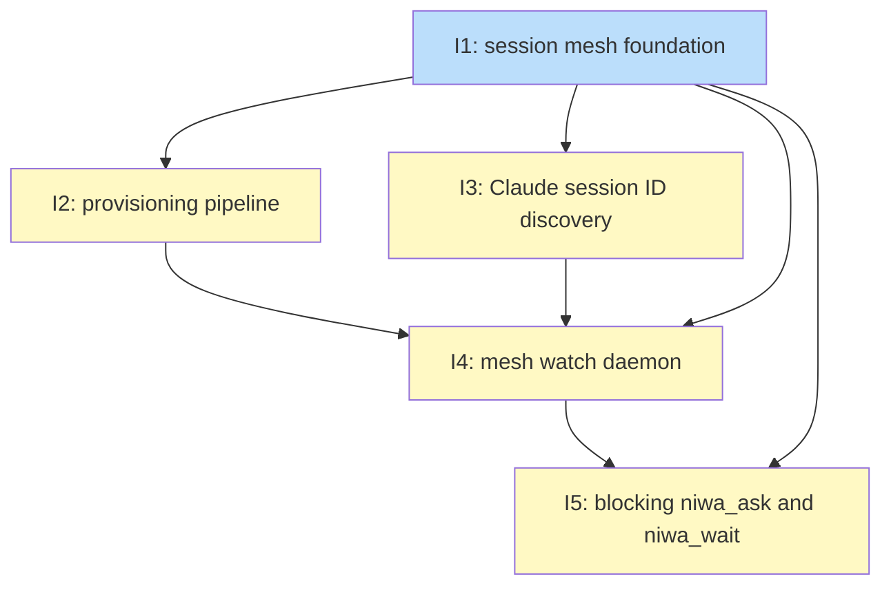

# PLAN: Cross-Session Communication

## Status

Draft

## Scope Summary

Implements a file-based session mesh for niwa workspace instances: config types and inbox filesystem schema, provisioning infrastructure written by `niwa apply`, Claude session ID discovery for the SessionStart hook, a persistent daemon (`niwa mesh watch`) that resumes idle Claude sessions via `claude --resume`, and four MCP tools (`niwa_check_messages`, `niwa_send_message`, `niwa_ask`, `niwa_wait`) that let concurrent Claude sessions exchange messages without user intermediation.

## Decomposition Strategy

**Walking skeleton.** Five components interact at runtime across process boundaries: the provisioner writes directories the daemon watches; the daemon reads `sessions.json` the registration step writes; MCP tools use watcher goroutines to signal blocked dispatch goroutines. A thin vertical slice that exercises the full message-exchange path end-to-end (Issue 1) surfaces integration failures before any individual layer is built out. Issues 2–5 thicken each layer in dependency order, and each must not break the E2E flow the skeleton established.

## Issue Outlines

---

### Issue 1: feat(mesh): thin session mesh foundation

**Goal**

Establish the schema (`ChannelsMeshConfig`, `Message` struct, `SessionEntry.ClaudeSessionID` stub), sessions directory layout, and two stateless MCP tools (`niwa_check_messages`, `niwa_send_message`) so that two sessions in the same instance can exchange a message via the filesystem inbox.

**Acceptance Criteria**

- `internal/config/config.go` defines `ChannelsMeshConfig` (at minimum `Roles map[string]string`) and `ChannelsConfig`; `WorkspaceConfig` gains `Channels ChannelsConfig`
- `internal/mcp/` defines `Message` struct with `ID`, `Type`, `From`, `To`, `Body`, `TaskID` (omitempty), `ReplyTo` (omitempty), `ExpiresAt` (omitempty) — all JSON-tagged
- `SessionEntry` gains `ClaudeSessionID string \`json:"claude_session_id,omitempty"\``
- Sessions directory structure documented in code: `<instance-root>/.niwa/sessions/<session-uuid>/inbox/` and `inbox/read/`
- `niwa session register` creates the session's inbox directory if absent
- `niwa_send_message`: resolves target UUID from `sessions.json` by role, writes `Message` JSON via atomic rename (`<uuid>.json.tmp` → `<uuid>.json`), returns assigned message ID, returns clear error if role not found
- `niwa_check_messages`: reads all `.json` in `inbox/` (excludes `read/`), skips expired messages, returns formatted list (ID, type, from, body preview), does not move or delete files
- Gherkin `@critical` scenario: `niwa session register` for two roles, call `niwa_send_message` from role A to role B, call `niwa_check_messages` as role B, verify message body appears
- `go test ./...` passes; E2E flow carries forward to all subsequent issues

**Dependencies**

None

---

### Issue 2: feat(mesh): provisioning pipeline integration

**Goal**

Add `InstallChannelInfrastructure` at step 4.75 in `runPipeline` so that `niwa apply` (and `niwa create`) write the sessions directory tree, `sessions.json` (if absent), `.claude/.mcp.json`, and the `## Channels` section in `workspace-context.md`, all idempotently, with 0700/0600 permissions. Hook scripts for `SessionStart` and `UserPromptSubmit` are injected into `cfg.Claude.Hooks` from `[channels.mesh]` config so `HooksMaterializer` writes them per-repo without modification.

**Acceptance Criteria**

- `InstallChannelInfrastructure(ctx, cfg, instanceRoot, writtenFiles)` called at step 4.75; returns immediately when `cfg.Channels` is empty
- Creates `.niwa/sessions/` with mode `0700` via `os.MkdirAll` (idempotent)
- Creates `sessions.json` only if absent (initial content: `[]`, mode `0600`)
- Writes `.claude/.mcp.json` with `niwa mcp-serve` entry and `NIWA_INSTANCE_ROOT` baked in (mode `0600`); overwrite-safe
- Appends `## Channels` section to `workspace-context.md` idempotently (check-then-append; not duplicated on re-apply)
- `SessionStart` and `UserPromptSubmit` hook entries injected into `cfg.Claude.Hooks` at top of `runPipeline`; `HooksMaterializer` at step 6.5 writes them per-repo unchanged
- All modes set explicitly independent of umask
- Gherkin `@critical` scenario: apply with `[channels.mesh]` creates all five artifacts; second apply does not duplicate or overwrite; workspace without `[channels.mesh]` untouched
- Real session validation: MCP server registered, four channel tools visible in session tool list
- `go test ./...` passes; E2E flow from Issue 1 still passes

**Dependencies**

Issue 1

---

### Issue 3: feat(mesh): Claude session ID discovery

**Goal**

Implement the three-tier `discoverClaudeSessionID` — `CLAUDE_SESSION_ID` env var → `~/.claude/sessions/<ppid>.json` PPID walk with cwd cross-check → mtime-sorted scan of `~/.claude/projects/<base64url-cwd>/` — so `niwa session register` populates `claude_session_id` in `sessions.json` with input validation (`^[a-zA-Z0-9_-]{8,128}$`) and graceful empty fallback when all three tiers fail.

**Acceptance Criteria**

- Tier 1: reads `CLAUDE_SESSION_ID` env var first; validates against regex; returns immediately if valid
- Tier 2: two-level PPID walk to Claude process PID; reads `~/.claude/sessions/<pid>.json`; parses `sessionId` and `cwd`; cross-checks `cwd` against `os.Getwd()` to reject stale PID-recycled entries
- Tier 3: base64url-encodes CWD (no padding); lists `*.jsonl` files in `~/.claude/projects/<encoded>/` sorted by mtime descending; extracts session ID from most recent file
- All tiers validate value against `^[a-zA-Z0-9_-]{8,128}$` before use; invalid values are rejected and logged, never written to `sessions.json` or passed to `exec.Command`
- Fallback: if all tiers fail, `discoverClaudeSessionID` returns `("", nil)`; `SessionEntry` written with `claude_session_id` omitted; warning logged
- Gherkin scenarios: happy path (fake `~/.claude/sessions/<pid>.json` fixture), no-fixture fallback, cwd mismatch triggers tier skip
- Real session validation: open a real Claude Code session in a niwa workspace instance; inspect `sessions.json` to verify `claude_session_id` populated (or confirm warning when not); record which tier succeeded
- `go test ./...` passes; E2E flow from Issue 1 still passes

**Dependencies**

Issue 1

---

### Issue 4: feat(mesh): mesh watch daemon

**Goal**

Implement `niwa mesh watch` — fsnotify watcher loop, `IsPIDAlive` check, `claude --resume` invocation, SIGTERM handler with in-flight drain, atomic PID file, daemon spawn in `Applier.Apply`/`Create` (`Setsid: true`, `exec.LookPath` once), `niwa destroy` SIGTERM extension, sessions.json advisory locking, and self-exit on missing instance root.

**Acceptance Criteria**

- `internal/cli/mesh_watch.go` implements `niwa mesh watch --instance-root=<path>`; exits with error if instance root absent
- Resolves `claude` binary path with `exec.LookPath` once at startup; exits with error if not found
- Writes PID file atomically: `daemon.pid.tmp` (format: `<pid>\n<start-jiffies>\n`) → rename to `daemon.pid`; rename happens only after watch loop is established
- fsnotify watcher on `<instance-root>/.niwa/sessions/*/inbox/`; on new file: reads `sessions.json`, calls `IsPIDAlive` from `internal/mcp/liveness.go`; if dead and `claude_session_id` non-empty, calls `claude --resume <session-id>`
- Per-iteration existence check of `.niwa/sessions/`; exits cleanly with warning when missing (handles `rm -rf` case)
- Logs to `<instance-root>/.niwa/daemon.log` (append); logs message ID and type, never body content
- SIGTERM handler: stops accepting fsnotify events, drains in-progress file moves (5-second grace), removes `daemon.pid`, exits
- sessions.json reads and writes use advisory file lock on `.niwa/.sessions.lock`; lock acquisition times out at 1 second (skips event rather than blocking watch loop)
- Daemon spawn in `runPipeline` after `SaveState`: gated on `cfg.Channels` non-empty + `!IsPIDAlive(readPIDFile(instanceRoot))`; `Setsid: true`; stdout/stderr to `daemon.log`; `cmd.Start()` not `cmd.Run()`
- `niwa destroy`: reads `daemon.pid`, sends SIGTERM, polls `IsPIDAlive` up to 5s, sends SIGKILL if still alive, removes `daemon.pid`, then proceeds with `DestroyInstance`
- Gherkin `@critical` scenario: apply spawns daemon; second apply does not spawn second; destroy terminates daemon; daemon self-exits on removed sessions dir
- Real session validation: idle coordinator is resumed by daemon; round-trip latency recorded; `rm -rf` self-exit path verified
- `go test ./...` passes; E2E flow from Issues 1 and 2 still passes

**Dependencies**

Issues 1, 2, 3

---

### Issue 5: feat(mesh): blocking niwa_ask and niwa_wait

**Goal**

Add `niwa_ask` (waiter map + dispatch goroutine blocks on buffered-1 reply channel + `defer cancel()`) and `niwa_wait` (typeWaiters map + count threshold), with `notifyNewFile` extension, `handleSendMessage` refactor to return a struct, message field input validation, message retention TTL sweep, and log-IDs-not-bodies discipline.

**Acceptance Criteria**

- `Server` struct gains `waitersMu sync.Mutex`, `waiters map[string]chan toolResult`, `typeWaiters map[string]*typeWaiter`
- `registerWaiter(msgID)` allocates a buffered-1 channel, stores in `waiters`, returns `(ch, cancel)` where `cancel` deletes the entry under `waitersMu`
- `handleSendMessage` refactored to return `sendResult{MessageID, Status}` struct; tool output remains human-readable
- `handleAsk`: resolves target by role; writes `question.ask` via `handleSendMessage`; calls `registerWaiter`; always defers `cancel()`; selects on `replyCh` and `time.After(10 min default)`; returns answer body or `ASK_TIMEOUT` error
- `handleWait`: registers `typeWaiter` with filter sets (types, from), count threshold, accumulation buffer, capacity-1 signal channel; defer cancel() on both exit paths; returns all accumulated messages on threshold or timeout
- `notifyNewFile`: checks `m.ReplyTo` against `waiters`; if match: moves file to `inbox/read/` atomically then sends on channel (move-then-send prevents double-delivery); checks `typeWaiters` for type/sender matches; appends to buffer and fires signal when threshold reached
- Message field validation: `Type`, `From`, `To` validated against `^[a-zA-Z0-9._-]{1,64}$`; `Body` non-empty, max 64 KB; path traversal characters (`/`, `\`, `..`) rejected; invalid fields return tool error, no file written
- TTL sweep: `inbox/read/` swept on startup and hourly; files older than TTL (default 24h, configurable via `message_ttl` in `[channels.mesh]`) deleted
- No message `Body` content in any log output at any level
- Polling fallback (`watchInboxPolling`) calls same `notifyNewFile`
- Gherkin `@critical` scenarios: ask/answer cycle; `ASK_TIMEOUT` with no goroutine leak; `niwa_wait` count threshold; field validation rejection
- Real session validation: full ask/answer cycle with daemon (idle coordinator resumed mid-flight); timeout path with real session; `niwa_wait` unblock
- `go test ./...` passes; all prior E2E flows still pass

**Dependencies**

Issues 1, 4

---

## Dependency Graph

**Legend**: Green = done, Blue = ready, Yellow = blocked, Purple = needs-design, Orange = tracks-design/tracks-plan

## Implementation Sequence

### Critical Path

I1 → I2 (or I3, parallel) → I4 → I5

All five issues lie on the critical path due to the walking skeleton structure. The only parallelism is between Issues 2 and 3, which are both unblocked by Issue 1 and have no coupling between them.

### Recommended Order

1. **Issue 1** (skeleton) — no dependencies; must ship first; establishes the filesystem schema and stateless tools that everything else builds on
2. **Issues 2 and 3** — can be worked in parallel after Issue 1 merges; provisioning pipeline and session ID discovery are independent
3. **Issue 4** (daemon) — blocked until Issues 1, 2, and 3 are all complete; integrates their outputs
4. **Issue 5** (blocking tools) — final layer; depends on Issue 4 for the running daemon needed in the real-session E2E test

### Carry-forward invariant

Every issue must include the criterion: "E2E flow from prior issues still passes." This prevents the walking skeleton from being broken as each layer is thickened. The Issue 1 Gherkin `@critical` scenario is the regression anchor for the full implementation sequence.
