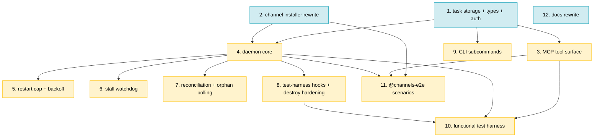

# PLAN: Cross-Session Communication

## Status

Draft

## Scope Summary

Rewrite niwa's mesh: messages route through per-role inboxes provisioned
at apply time; tasks are first-class per-directory state machines; a
central-loop daemon claims queued envelopes and spawns ephemeral
`claude -p` workers; per-session stdio MCP servers expose a task-
lifecycle tool surface with three-factor worker authorization; a flat
`niwa-mesh` skill is installed into every agent; a test harness decouples
acceptance criteria from live Claude. Twelve issues implement the design
in one PR on the current branch, with twelve commits.

## Decomposition Strategy

**Horizontal decomposition.** The upstream design's Implementation
Approach is already sequenced layer-by-layer with explicit inter-phase
dependencies (Phase 1 → 3, Phase 2 → 4a, etc.). Each phase delivers a
working layer of the mesh, not a stub. Issues map 1:1 to design phases,
with the design's Phase 4 split into 4a–4e landing as Issues 4–8.

No walking-skeleton "stub-first" issue is useful here because the design
is a rewrite of existing, working code (not a greenfield feature). Early
integration is naturally achieved by Issue 4 (daemon core) exercising
Issue 1's storage and Issue 3's tools end-to-end, and by the functional
harness in Issue 10 that runs through the real spawn path.

Execution mode is **single-pr**: all twelve commits land on the current
branch (`docs/cross-session-communication`) as one PR. Dependency waves
inform work order within the branch but do not gate merges — no
user-facing behavior ships until the full mesh is in place.

## Issue Outlines

### Issue 1: feat(mcp): task storage primitives, types, and authorization helper

**Complexity**: critical — touches the authorization boundary for every
task-lifecycle tool; state-transition atomicity determines whether
concurrent writers can corrupt task state.

#### Goal

Establish the foundation types, per-task storage primitives, and
authorization helper that every other niwa-mesh component depends on —
`state.json` + NDJSON `transitions.log` schemas, a per-task `.lock`
flock with a 30-second bounded timeout, a `TaskStore.UpdateState`
transactional API, `PPIDChain(1)` walking exactly one level up from the
MCP server to the `claude -p` worker, and `authorizeTaskCall`
implementing the kindDelegator / kindExecutor / kindParty checks.

#### Acceptance Criteria

- [ ] `internal/mcp/types.go` defines `TaskEnvelope` (PRD R15 v=1 schema), `TaskState` (Decision 1 schema), `StateTransition`, and `TaskEventKind` / `taskEvent` types.
- [ ] New `internal/mcp/taskstore.go` exposes `OpenTaskLock`, `ReadState`, and `UpdateState(taskDir, mutator)` where mutator returns the new state and a transition log entry.
- [ ] `UpdateState` critical section: flock → read → validate → mutate → write tmp → fsync → atomic rename → fsync parent → append transitions.log → fsync log → release.
- [ ] All flock acquisitions use a 30-second bounded timeout; returns `ErrLockTimeout` on expiry.
- [ ] All opens of `state.json`, `envelope.json`, `.lock`, and `transitions.log` use `O_NOFOLLOW`; symlink-substitution test fails closed.
- [ ] Task IDs are UUIDv4 via `crypto/rand`; 10 000-sample uniqueness+format unit test.
- [ ] Schema validation on every read (`v == 1`, state in enum, UUID-shaped IDs); malformed content returns `ErrCorruptedState`.
- [ ] `transitions.log` is NDJSON with a `kind` discriminator; progress entries log only the 200-char `summary`, not the full body.
- [ ] `internal/mcp/liveness.go` grows `PPIDChain(n int) ([]int, error)`; structured error when a PID in the chain does not exist.
- [ ] New `internal/mcp/auth.go` exposes `authorizeTaskCall(s, taskID, kind)` with `kindDelegator`, `kindExecutor`, `kindParty`.
- [ ] `kindExecutor` on Linux verifies `PPIDChain(1)` PID's start_time matches `state.json.worker.{pid, start_time}`; macOS degrades to PID-match-only per PRD Known Limitation.
- [ ] Unauthorized callers receive PRD R50 error codes only (`NOT_TASK_OWNER`, `NOT_TASK_PARTY`, `TASK_ALREADY_TERMINAL`); no new codes introduced.
- [ ] Concurrent-writer stress test (two processes × 1 000 `UpdateState` calls): no torn reads, no lost transitions, final `state_transitions` length equals sum of successes.

#### Dependencies

None. Blocks Issues 3, 4, 9.

---

### Issue 2: feat(workspace): rewrite channel installer for per-role inboxes, skill install, and layout migration

**Complexity**: testable — rewrites a provisioning step; integration with existing `ManagedFiles` pattern is proven; no auth or crypto surface.

#### Goal

Rewrite `InstallChannelInfrastructure` (pipeline step 4.75) to provision
the new mesh layout — per-role inbox directories, `.niwa/tasks/`,
`.mcp.json` at instance and per repo, flat uniform `niwa-mesh/SKILL.md`
with hash-based idempotency, minimal `## Channels` section in
`workspace-context.md`, SessionStart + UserPromptSubmit hooks via the
existing `HooksMaterializer`, and a one-shot migration helper that
removes pre-1.0 `.niwa/sessions/<uuid>/` directories with a single
stderr warning.

#### Acceptance Criteria

- [ ] Any of `[channels.mesh]` config, `--channels` flag, or `NIWA_CHANNELS=1` env creates `.niwa/roles/<role>/inbox/{,in-progress,cancelled,expired,read}/` for every topology-derived role. (PRD AC-P1, AC-P2, AC-R1)
- [ ] `--no-channels` suppresses provisioning; no triggers = no mesh line in `niwa status`. (AC-P3, AC-P4)
- [ ] `.niwa/tasks/`, empty `sessions.json`, `daemon.pid`/`daemon.log` present on channeled workspace. (AC-P5)
- [ ] `.mcp.json` written at instance root and mirrored per repo, each pointing to `niwa mcp-serve`. (AC-P6)
- [ ] `niwa-mesh/SKILL.md` exists at instance root and each repo; frontmatter has `name`, `description` (under 1 536-char cap), `allowed-tools`; body contains PRD R10's six section headings. (AC-P7, AC-P8)
- [ ] Idempotency via sha256 `ContentHash`: second apply with unchanged output = no drift warning, mtime stable. Hand-edit triggers stderr drift warning and overwrite. (AC-P13)
- [ ] Personal-scope `~/.claude/skills/niwa-mesh/SKILL.md` is not modified by apply. (AC-P12)
- [ ] `## Channels` in `workspace-context.md` contains exactly: role, `NIWA_INSTANCE_ROOT`, tool names, single pointer line. (AC-P15)
- [ ] Role collision detection for basename collisions (AC-R2); reserved `coordinator` check (AC-R3); name format validation (AC-R4).
- [ ] New repo on second apply creates its inbox without modifying others (AC-P9).
- [ ] Second apply with queued/in-progress envelopes leaves them byte-identical (AC-P10).
- [ ] File mode 0600 / dir mode 0700 under `umask 0000` (AC-P14).
- [ ] Migration helper detects `.niwa/sessions/<uuid>/` with absent `.niwa/roles/`; emits one stderr warning; removes old dirs; preserves `sessions.json`.
- [ ] `workspace.toml` parser rejects any `NIWA_WORKER_SPAWN_COMMAND` key with a parse error; regression test asserts this.
- [ ] Every installer-written path in `InstanceState.ManagedFiles`; runtime artifacts (`.niwa/tasks/`, `.niwa/roles/*/inbox/`) NOT tracked.
- [ ] SessionStart + UserPromptSubmit hooks injected into `cfg.Claude.Hooks`; written per-repo for coordinator role only.

#### Dependencies

None. Blocks Issues 4, 11.

---

### Issue 3: feat(mcp): new task-lifecycle tool surface and per-session fsnotify watcher

**Complexity**: testable — 11-tool surface exercising the Issue 1 helper.

#### Goal

Implement the revised MCP tool surface on the existing per-session stdio
server: eight new task-lifecycle tools (`niwa_delegate`,
`niwa_query_task`, `niwa_await_task`, `niwa_report_progress`,
`niwa_finish_task`, `niwa_list_outbound_tasks`, `niwa_update_task`,
`niwa_cancel_task`) plus revised peer-messaging tools (`niwa_ask`,
`niwa_send_message`, `niwa_check_messages`), with `awaitWaiters` size-1
buffered channels and per-session fsnotify watcher routing task-terminal
messages through an extended `notifyNewFile`.

#### Acceptance Criteria

- [ ] `Server` struct gains `taskID string` (from `NIWA_TASK_ID` env) and `awaitWaiters map[string]chan taskEvent` (size-1 buffered; protected by `waitersMu`).
- [ ] Each per-session MCP server starts its own fsnotify watch on `.niwa/roles/<s.role>/inbox/` at startup.
- [ ] `notifyNewFile` routes `task.completed`/`task.abandoned`/`task.cancelled` to `awaitWaiters[body.task_id]` before existing `reply_to` paths.
- [ ] `niwa_delegate(to, body, mode, expires_at?)` — async returns `{task_id}` in ≤100 ms (AC-D1); sync blocks on `awaitWaiters` returning `{status:"completed"|"abandoned"|"cancelled", ...}` (AC-D7/D8/D9).
- [ ] `parent_task_id` auto-populated from `s.taskID` for delegations from within a running worker (AC-D18).
- [ ] `niwa_query_task` returns state + transitions + restart_count + last_progress + terminal fields; non-parties receive `NOT_TASK_PARTY` (AC-D12, AC-D13).
- [ ] `niwa_await_task(task_id, timeout_seconds?)` registers waiter with `defer cancel()` before the race-guard state read; non-delegator receives `NOT_TASK_OWNER` (AC-D10, AC-D11, AC-D14).
- [ ] `niwa_report_progress(task_id, summary, body?)` truncates summary to 200 chars with `…`, logs summary-only to `transitions.log`, updates `state.json.last_progress`, delivers `task.progress` message within 5 s (AC-D15, AC-D16, AC-D17).
- [ ] `niwa_finish_task(task_id, outcome, result?, reason?)` — `BAD_PAYLOAD` on mismatch; `TASK_ALREADY_TERMINAL` on second call; writes `task.completed`/`task.abandoned` to delegator's inbox (AC-D6, AC-D8a, AC-L7, AC-L8).
- [ ] `niwa_list_outbound_tasks(to?, status?)` returns only caller's tasks (AC-Q1, AC-Q2).
- [ ] `niwa_update_task(task_id, body)` — `{status:"updated"}` while queued, `{status:"too_late"}` otherwise; non-delegator receives `NOT_TASK_OWNER` (AC-Q3–Q6).
- [ ] `niwa_cancel_task(task_id)` atomic rename to `inbox/cancelled/<id>.json`; ENOENT → `too_late`; non-delegator → `NOT_TASK_OWNER` (AC-Q7–Q9).
- [ ] `niwa_ask(to, body, timeout_seconds?)` creates first-class task with `body.kind="ask"` when target unregistered; default timeout 600 s (AC-M1–M3).
- [ ] `niwa_send_message` validates type format (`BAD_TYPE` on fail), rejects unknown roles (`UNKNOWN_ROLE`), atomic-rename write, no delivery-status response field (AC-M4–M7).
- [ ] `niwa_check_messages` returns unread markdown-formatted; moves returned files to `inbox/read/`; sweeps expired to `inbox/expired/` first (AC-M4, AC-M8).
- [ ] Retrieved `task.delegate` bodies wrapped in a delimited outer envelope marker (data-plane prompt-injection defense).
- [ ] Handler-level unit tests for each happy path + each PRD R50 error code. Race-window coverage deferred to Issue 10.

#### Dependencies

Blocked by Issue 1. Blocks Issues 10, 11.

---

### Issue 4: feat(daemon): central event loop, consumption claim, and worker spawn

**Complexity**: critical — the daemon is the process-supervision authority; spawn contract affects every worker's security posture (PATH, permission mode, MCP config).

#### Goal

Rewrite `niwa mesh watch` to a central event loop plus per-task
supervisor goroutines: fsnotify watches per-role inboxes;
consumption-rename claim under `taskstore.UpdateState`;
`exec.LookPath("claude")` resolved once at startup with the absolute
path + owning UID + st_mode logged at INFO; fixed argv + niwa-owned env
overrides (`NIWA_INSTANCE_ROOT`, `NIWA_SESSION_ROLE`, `NIWA_TASK_ID`);
per-worker supervisor goroutine calling `cmd.Wait()`; taskEvent channel
aggregating exit and progress events for central state-transition
decisions.

#### Acceptance Criteria

- [ ] Central goroutine owns: fsnotify watcher on `.niwa/roles/*/inbox/`, central `taskEvent` channel, state.json writes for spawn decisions.
- [ ] `exec.LookPath("claude")` resolved once at startup (or `NIWA_WORKER_SPAWN_COMMAND` when set); absolute path + UID + mode logged at INFO; same path reused for every spawn.
- [ ] Catch-up inbox scan after fsnotify registration.
- [ ] Consumption rename: atomic `inbox/<id>.json` → `inbox/in-progress/<id>.json` under per-task `.lock`; state transition `queued` → `running`; `worker.{role, spawn_started_at}` written.
- [ ] Spawn argv: `-p "<bootstrap prompt with <task-id>>" --permission-mode=acceptEdits --mcp-config=<instanceRoot>/.claude/.mcp.json --strict-mcp-config`. Bootstrap never contains task body. (AC-D5)
- [ ] Env: pass-through + last-wins `NIWA_INSTANCE_ROOT`, `NIWA_SESSION_ROLE`, `NIWA_TASK_ID`. (AC-D4)
- [ ] CWD: target role's repo dir (or instance root for coordinator).
- [ ] After `cmd.Start()`, re-acquire lock and backfill `worker.{pid, start_time}`; append `spawn` entry to `transitions.log`.
- [ ] Per-task supervisor goroutine with `cmd.Wait()`; reports `{TaskID, evtUnexpectedExit, ExitCode}` on return.
- [ ] Central exit handling: if state.json already terminal, log+release; else classify unexpected and hand off to Issue 5's pipeline.
- [ ] `Setsid: true`; PID file written atomically AFTER central goroutine operational.
- [ ] `NIWA_WORKER_SPAWN_COMMAND` substitutes the resolved binary path; argv/env/CWD unchanged.
- [ ] Unit tests: argv matches fixed shape; argv contains no body field (AC-D5); `LookPath` logged once; Go-side spawn double verifies env + CWD.
- [ ] All daemon flock acquisitions use Issue 1's 30-second bounded timeout.

#### Dependencies

Blocked by Issues 1, 2. Blocks Issues 5, 6, 7, 8, 10, 11.

---

### Issue 5: feat(daemon): restart cap with backoff and unexpected-exit classification

**Complexity**: testable.

#### Goal

Enforce the 3-restart cap (4 total attempts) with linear 30/60/90s
backoff (configurable via `NIWA_RETRY_BACKOFF_SECONDS`); classify every
`cmd.Wait()` return against `state.json.state`; treat still-`running` as
unexpected exit; bump `restart_count` and schedule the next spawn after
configured backoff, or transition to `abandoned` with
`reason: "retry_cap_exceeded"` at cap.

#### Acceptance Criteria

- [ ] Central loop increments `state.json.worker.restart_count` under lock on unexpected-exit events.
- [ ] Retry schedules next spawn via `time.AfterFunc(backoff[restart_count-1], ...)` using `NIWA_RETRY_BACKOFF_SECONDS` (comma-separated integer seconds; default `30,60,90`).
- [ ] Abandon path: state → `abandoned`; `reason: "retry_cap_exceeded"`; `task.abandoned` message to delegator's inbox. (AC-L3)
- [ ] Worker exiting code 0 without `niwa_finish_task` classified as unexpected exit (AC-L1).
- [ ] Worker exiting non-zero without `niwa_finish_task` classified as unexpected exit (AC-L2).
- [ ] Worker transitioning state to `completed` before exit: no restart_count bump.
- [ ] `niwa_fail_task` path: state → `abandoned` without `restart_count` bump; no retry scheduled (AC-L6).
- [ ] Backoff timing with `NIWA_RETRY_BACKOFF_SECONDS=1,2,3`: three restarts at ~1s, ~2s, ~3s; measured from state.json transition timestamps (AC-L5).
- [ ] `spawn_started_at` marker: set before `cmd.Start`, cleared on real PID backfill; crash between write and `cmd.Start` lets Issue 7's reconciliation allocate fresh retry without double-counting.

#### Dependencies

Blocked by Issue 4. Downstream via Issue 10.

---

### Issue 6: feat(daemon): stalled-progress watchdog and SIGTERM/SIGKILL escalation

**Complexity**: testable.

#### Goal

Add per-supervisor `time.Timer` reset on detected progress (2 s poll of
`state.json.last_progress.at`); SIGTERM on stall; SIGKILL after
`NIWA_SIGTERM_GRACE_SECONDS`; defensive reap for workers that hang after
`niwa_finish_task`.

#### Acceptance Criteria

- [ ] Timer initialized to `NIWA_STALL_WATCHDOG_SECONDS` (default 900 s); reset on every detected progress update.
- [ ] Progress detection: 2-second ticker reads `last_progress.at` under shared flock; timestamp advance → reset timer.
- [ ] Watchdog fire → SIGTERM worker; append `watchdog_signal` entry to `transitions.log`.
- [ ] After SIGTERM: wait `NIWA_SIGTERM_GRACE_SECONDS` (default 5 s); if not exited, `cmd.Process.Kill()` (SIGKILL); second `watchdog_signal` entry.
- [ ] Watchdog-triggered exits classified as unexpected (consume retry slot via Issue 5). (R36; AC-L4)
- [ ] Defensive reap: state terminal but worker process alive after `NIWA_SIGTERM_GRACE_SECONDS` → SIGTERM then SIGKILL; does NOT consume retry slot (state is already terminal).
- [ ] Test with `NIWA_STALL_WATCHDOG_SECONDS=2`: stall triggers SIGTERM after ~2 s; SIGTERM-ignoring worker killed after `NIWA_SIGTERM_GRACE_SECONDS=1` (AC-L4).
- [ ] Test: worker calling `niwa_report_progress` every 1 s does not trigger watchdog.
- [ ] Default compliance: no env overrides → 900 s watchdog, 5 s grace per PRD Configuration Defaults.

#### Dependencies

Blocked by Issue 4. Downstream via Issue 10.

---

### Issue 7: feat(daemon): crash reconciliation and adopted-orphan polling

**Complexity**: critical — crash recovery correctness; double-spawning or misclassifying orphans produce silent correctness failures.

#### Goal

On daemon startup, classify each `.niwa/tasks/*/state.json` with state
`running` as adopted orphan (PID + start_time alive) or unexpected exit
(dead or start_time diverges — PID reuse defense). Central loop polls
adopted orphans every 2 s via `IsPIDAlive`; divergent start_time
classified as unexpected exit. `daemon.pid.lock` flock prevents two
concurrent daemons.

#### Acceptance Criteria

- [ ] Startup enumerates `.niwa/tasks/*/state.json`; applies classification to every `running` task.
- [ ] Live-orphan: PID > 0 AND `IsPIDAlive(pid, start_time)` true → add to orphan list; set `worker.adopted_at`; append `adoption` entry.
- [ ] Spawn-never-completed: `pid == 0` AND `spawn_started_at` present → allocate fresh retry without bumping `restart_count`.
- [ ] Dead worker: PID > 0 AND `IsPIDAlive` false → unexpected-exit path (Issue 5).
- [ ] PID reuse: PID > 0 AND `IsPIDAlive` true but start_time diverges → unexpected-exit path.
- [ ] Central-loop 2-second ticker polls each orphan; transition to dead or diverged start_time → unexpected-exit hand-off.
- [ ] Catch-up inbox scan follows reconciliation; queued envelopes without in-progress counterpart flow through normal claim path.
- [ ] `.niwa/daemon.pid.lock` flock: concurrent `niwa apply` observes lock held; two daemons never spawned (AC-C3).
- [ ] `niwa apply` reads PID under shared flock, verifies liveness, only spawns if no live daemon.
- [ ] Test: SIGKILL daemon with live worker; new daemon adopts orphan; worker's subsequent `niwa_finish_task` transitions state as usual (AC-L9).
- [ ] Test: SIGKILL both daemon and worker; new daemon → unexpected-exit → retry with backoff (AC-L10).
- [ ] Test: crash mid-spawn (state.json written, `cmd.Start` not called); new daemon → fresh retry with no `restart_count` increment.
- [ ] Test: envelope in inbox at startup; catch-up claim proceeds normally (AC-L11).

#### Dependencies

Blocked by Issue 4. Downstream via Issue 10.

---

### Issue 8: feat(daemon): test-harness pause hooks and destroy-phase worker SIGKILL hardening

**Complexity**: testable.

#### Goal

Implement `NIWA_TEST_PAUSE_BEFORE_CLAIM` and `NIWA_TEST_PAUSE_AFTER_CLAIM`
env-gated pause hooks at the consumption-rename boundary so race-window
AC are deterministic. Update `niwa destroy` to SIGKILL worker process
groups first (before daemon grace period), minimizing the
`acceptEdits`-enabled worker's exfiltration window during teardown.

#### Acceptance Criteria

- [ ] `NIWA_WORKER_SPAWN_COMMAND` literal-path substitution documented audibly (daemon log on startup logs resolved binary's absolute path + UID + mode).
- [ ] Argv, env, CWD, process-group behavior identical between `claude` and override.
- [ ] `NIWA_TEST_PAUSE_BEFORE_CLAIM=1`: daemon creates `.niwa/.test/paused_before_claim` atomically and blocks before rename until marker removed.
- [ ] `NIWA_TEST_PAUSE_AFTER_CLAIM=1`: daemon performs rename, creates `.niwa/.test/paused_after_claim`, blocks before `exec.Command` until marker removed.
- [ ] Test: pause-before-claim; delegate task; marker appears within 1 s; envelope still in `inbox/<id>.json`; remove marker → daemon proceeds.
- [ ] Test: pause-after-claim; delegate task; marker appears; envelope in `inbox/in-progress/<id>.json`; `niwa_cancel_task` in this window returns `too_late`.
- [ ] `niwa destroy`: list `running` tasks; SIGKILL each worker PGID (negative PID signal); then SIGTERM daemon; wait `NIWA_DESTROY_GRACE_SECONDS` (default 5 s); SIGKILL daemon if needed; remove instance directory.
- [ ] Test: worker ignoring SIGTERM is immediately SIGKILLed by `niwa destroy`; daemon still gets grace window (AC-P11 compliance).

#### Dependencies

Blocked by Issue 4. Blocks Issue 10.

---

### Issue 9: feat(cli): niwa task list/show subcommands and mesh summary in niwa status

**Complexity**: testable.

#### Goal

Add `niwa task list` and `niwa task show` subcommands; simplify
`niwa session list` to coordinators only; add the one-line mesh summary
to `niwa status` detail view.

#### Acceptance Criteria

- [ ] `niwa task list` enumerates `.niwa/tasks/*/state.json`; columns: task ID, target role, state, restart count, age, delegator role, body summary (200 chars, single line). Header row matches `niwa status` conventions. (R42, AC-O3)
- [ ] `--state running` filter (AC-O4); `--role web` filter (AC-O5); `--delegator coordinator` filter (AC-O6); `--since 1h` filter (AC-O7); filters AND-compose (AC-O8).
- [ ] `niwa task show <task-id>` displays envelope summary + current state + transitions history ordered by timestamp; non-existent ID exits non-zero with `task not found: <id>` on stderr (AC-O9).
- [ ] `niwa session list` shows coordinator entries only; `sessions.json` literally contains no worker entries after worker runs (AC-O1, AC-O2).
- [ ] `niwa status` detail on channeled workspace contains `<queued> queued, <running> running, <completed_24h> completed (last 24h), <abandoned_24h> abandoned (last 24h)` (AC-O10).
- [ ] Non-channeled workspace: no mesh line in `niwa status` detail.
- [ ] Uses existing `formatRelativeTime`; no new dependencies.

#### Dependencies

Blocked by Issue 1. No direct downstream (Issue 10 exercises CLI as observation).

---

### Issue 10: test(channels): deterministic functional test harness with scripted worker fake

**Complexity**: testable.

#### Goal

Build the deterministic functional test harness: Go binary at
`test/functional/worker_fake/` acting as MCP client; Gherkin step
helpers (`runWithFakeWorker`, `pauseDaemonAt`, `setTimingOverrides`);
rewritten `mesh.feature` covering sync/async delegation, queue mutation,
restart cap, abandonment, crash recovery, and race windows.

#### Acceptance Criteria

- [ ] `test/functional/worker_fake/main.go` compiles to a binary invoked via `NIWA_WORKER_SPAWN_COMMAND`; reads env (`NIWA_INSTANCE_ROOT`, `NIWA_SESSION_ROLE`, `NIWA_TASK_ID`); starts niwa MCP server as stdio subprocess; executes scenario from `NIWA_FAKE_SCENARIO` env var.
- [ ] Fake exercises real MCP tools (not direct filesystem writes): `niwa_check_messages`, `niwa_report_progress`, `niwa_finish_task` per scripted scenario.
- [ ] Fake retries authorization-path tool calls on `NOT_TASK_PARTY` for up to 2 s (covers `worker.pid == 0` backfill window).
- [ ] Step helpers: `runWithFakeWorker(scenario)`, `pauseDaemonAt(hook)` (returns release function), `setTimingOverrides(map)`.
- [ ] Gherkin scenarios cover: async/sync delegation (AC-D7, D8, D9); queue mutation races (AC-Q10, Q11); restart cap (AC-L3); watchdog (AC-L4); daemon crash with live/dead worker (AC-L9, L10); concurrent apply (AC-C3); authorization failures.
- [ ] `suite_test.go` registers new step definitions.
- [ ] All `@critical` scenarios pass under `make test-functional-critical` in < 60 s wall-clock (timing overrides keep each scenario < 10 s).
- [ ] Daemon-log grep regression test: no envelope/result/reason/progress-body content in `.niwa/daemon.log` after a full scenario run.
- [ ] Authorization negative: fake with wrong `NIWA_TASK_ID` receives `NOT_TASK_PARTY` from `niwa_finish_task`; fake with spoofed PPID chain fails executor check on Linux.

#### Dependencies

Blocked by Issues 3, 4, 8.

---

### Issue 11: test(channels): @channels-e2e scenarios covering MCP-config loadability and bootstrap-prompt effectiveness

**Complexity**: testable.

#### Goal

Add two `@channels-e2e` scenarios exercising real `claude -p` to cover
the niwa surface the harness cannot reach: MCP-config loadability by
Claude Code and bootstrap-prompt effectiveness. Both skipped when
`claude` not on `PATH` or `ANTHROPIC_API_KEY` unset; both outside
`@critical` so CI latency is unaffected.

#### Acceptance Criteria

- [ ] Scenario "MCP-config loadability": `niwa create --channels`; real `claude -p` from instance root with anchored prompt; session emits numeric value from `niwa_check_messages` to stdout.
- [ ] Scenario "Bootstrap-prompt effectiveness": queued task envelope; real daemon spawns real `claude -p` (no `NIWA_WORKER_SPAWN_COMMAND`); task `state.json.state` transitions to terminal within ≤120 s via worker's `niwa_finish_task` call.
- [ ] Both tagged `@channels-e2e`, NOT `@critical`.
- [ ] Skipped when `claude` not on PATH OR `ANTHROPIC_API_KEY` unset (via existing `claudeIsAvailable` guard).
- [ ] Prompts anchored for deterministic match; documented in feature-file comment.
- [ ] Bootstrap scenario asserts on `state.json.state == "completed"` (not LLM text).
- [ ] `make test-functional NIWA_TEST_TAGS=@channels-e2e` runs both to pass when credentials present.
- [ ] Old `@channels-e2e` scenarios from the superseded DESIGN removed from `mesh.feature`.

#### Dependencies

Blocked by Issues 2, 3, 4.

---

### Issue 12: docs(channels): rewrite cross-session guide and extend functional-testing guide

**Complexity**: simple — doc rewrite against stable field names.

#### Goal

Rewrite `docs/guides/cross-session-communication.md` for the revised
mesh (new tool surface, task lifecycle, worker spawn model, override
mechanisms, operational guidance) and extend
`docs/guides/functional-testing.md` with a "Testing the mesh" section
covering `NIWA_WORKER_SPAWN_COMMAND`, timing overrides, and daemon
pause hooks.

#### Acceptance Criteria

- [ ] `docs/guides/cross-session-communication.md` rewritten with: Overview, Quickstart, Tool Reference (11 tools), Task Lifecycle (state diagram), Worker Spawn Model, Override Mechanisms (flags/env/overlay), Operational Guidance.
- [ ] Operational Guidance covers: PATH-resolution implication, `NIWA_WORKER_SPAWN_COMMAND` shell-profile caution, macOS-vs-Linux auth note, backup-exclusion advice, migration behavior, destroy-order change (worker SIGKILL first).
- [ ] Referenced PRD Known Limitations: `acceptEdits` blast radius, `transitions.log` body retention, env cross-pollination, macOS degradation.
- [ ] `docs/guides/functional-testing.md` new "Testing the mesh" section covers: spawn-command override, scripted fake, timing override env vars, daemon pause hooks with race-window example.
- [ ] Cross-references: guide links to PRD + design + functional-testing guide; functional-testing links back.
- [ ] `CLAUDE.md` top-level docs updated where they reference the old mesh model (removals/minor edits only).
- [ ] No reference to `niwa_wait`, `sessions/<uuid>/inbox/`, or `claude --resume` remains under `docs/guides/` or `CLAUDE.md`.
- [ ] `wip/handoff-channels-e2e.md` removed.

#### Dependencies

None directly. Finalized last for naming stability.

---

## Dependency Graph

**Legend**: Blue = ready (no blockers), Yellow = blocked (waiting on predecessor).

## Implementation Sequence

**Critical path**: Issue 1 → Issue 4 → Issue 8 → Issue 10 (length 4).

**Recommended work order within the single PR**:

- **Wave 1 (parallel)**: Issues 1, 2, 12. Foundation types + installer
  rewrite + docs drafting. Issue 12's final polish waits for naming
  stability but the structure can be written alongside.
- **Wave 2 (after Issue 1)**: Issues 3 and 9 in parallel. MCP tool
  surface + CLI subcommands.
- **Wave 3 (after Issues 1 + 2)**: Issue 4. Daemon core.
- **Wave 4 (after Issue 4)**: Issues 5, 6, 7, 8 in parallel. Restart
  cap, watchdog, reconciliation, harness hooks. Issue 11 can start here
  (it is blocked only by 2, 3, 4).
- **Wave 5 (after Issue 8)**: Issue 10. Functional test harness.
- **Wave 6**: Finalize Issue 12 (docs) against the now-stable naming.

Since execution is single-pr, all twelve commits land on the current
branch and submit as one PR. Dependency waves inform work order; they
do not gate intermediate merges.

## Next Step

Run `/implement-doc docs/plans/PLAN-cross-session-communication.md` to
begin implementation once PR #71 is reconciled (close, retarget, or
carry) and `wip/handoff-channels-e2e.md` is removed as part of the
Issue 12 cleanup.
