# PLAN: Cross-Session Communication — Pre-Merge Polish

## Status

Draft

## Scope Summary

Twelve polish items derived from a five-reviewer panel scrutiny of the
cross-session-communication branch after the mesh rework and audit-telemetry
add-on landed (12 prior commits, now squashed out of this plan's scope).
Real bugs (`extractErrorCode` regex mismatch), drift traps (functional-test
schema duplicate, allowed-tools-list duplicate), over-engineering cleanups
(`AuditSink` interface, unused filter fields), and documentation of known
limitations (audit threat model, log growth, await timeout, fsnotify
overflow, coordinator restart). All twelve commits land on the same branch
and PR (`docs/cross-session-communication`, PR #71) before merge.

## Decomposition Strategy

Independent polish items, no feature decomposition required. Items group
into three waves by class — bug fixes (Issues 1-3), cleanups (Issues 4-7),
documentation (Issues 8-12) — for review clarity, but most items are
independent and could land in any order. Two real intra-plan dependencies
exist (Issue 2 → Issue 6, Issue 5 → Issue 8) and are reflected in the
graph below.

Single-pr execution because none of the items justify a separate PR — they
are all small, scoped, and reviewed together with the rest of the
cross-session-communication change.

## Issue Outlines

### Issue 1: fix(mcp): correct extractErrorCode regex to match production error format

**Complexity**: testable — the existing unit test passes against synthetic uppercase strings that don't exist in production; replacing both the regex and the test fixtures is a real behavioral change that needs new coverage.

#### Goal

`internal/mcp/audit.go::extractErrorCode` currently uses regex
`^([A-Z][A-Z_]*[A-Z])(?::|$)` to pull a leading code from a tool result's
text. Production errors are formatted by `errResultCode` (in `server.go`) as
`"error_code: <CODE>\ndetail: <text>"` — leading word is **lowercase**
`error_code:`. The regex never matches; the audit log's `error_code` field
is always either empty or the literal `"ERROR"` fallback. Decision-5 of
`DESIGN-mcp-call-telemetry.md` is dead on the wire. Replace the regex with
a parser that matches the real `errResultCode` shape and add a test that
pipes a real `errResultCode(...)` output through `buildAuditEntry` so the
bug can't reappear.

#### Acceptance Criteria

- [ ] `extractErrorCode` matches text starting with `error_code: <CODE>` (case-sensitive `error_code` literal, then a code token of one or more `[A-Z_]` characters).
- [ ] When matched, returns the `<CODE>` token (e.g. `NOT_TASK_PARTY`, `UNKNOWN_ROLE`, `BAD_TYPE`, `TASK_ALREADY_TERMINAL`, `TASK_NOT_FOUND`, `INVALID_ARGS`).
- [ ] When `IsError` is true but no `error_code:` prefix is found, falls back to literal `"ERROR"` (existing fallback unchanged).
- [ ] When `IsError` is false, returns `""` (existing happy path unchanged).
- [ ] New unit test in `internal/mcp/audit_test.go` constructs a `toolResult` via the real `errResultCode(code, detail)` helper for at least three known codes and asserts `extractErrorCode` returns the code, not `"ERROR"`.
- [ ] Existing `TestExtractErrorCode` table is updated: any case that fed synthetic uppercase-only text gets replaced with text that actually matches what production handlers emit.
- [ ] `go test ./internal/mcp/` passes.

#### Dependencies

None. Standalone fix.

---

### Issue 2: refactor(test): functional tests import mcp.AuditEntry instead of redeclaring

**Complexity**: simple — pure delete-and-import refactor, no behavior change; existing graph-e2e assertions cover.

#### Goal

`test/functional/mesh_steps_test.go` re-declares `auditEntry`,
`auditFilter`, `mcpReadAuditLog`, and `filterAudit` rather than importing
the canonical types from `internal/mcp` (`AuditEntry`, `AuditFilter`,
`ReadAuditLog`, `FilterAudit`). This is a divergent-twin trap — the schema
can change in `internal/mcp` without breaking the functional tests, and
vice versa. Other functional-test files already import `internal/mcp`
(`mesh_watch_test.go`), so the package boundary isn't a concern.

#### Acceptance Criteria

- [ ] `test/functional/mesh_steps_test.go` deletes the local `auditEntry`, `auditFilter`, `mcpReadAuditLog`, and `filterAudit` declarations.
- [ ] Adds `import "github.com/tsukumogami/niwa/internal/mcp"`.
- [ ] All call sites use `mcp.AuditEntry`, `mcp.AuditFilter`, `mcp.ReadAuditLog`, `mcp.FilterAudit`.
- [ ] No behavior change in any scenario; `make test-functional-channels-e2e-graph` still passes (16/16 steps).
- [ ] `make test-functional-critical` still passes.
- [ ] Net-line-count delta is negative (the duplication removed exceeds the import line added).

#### Dependencies

Touches the same file as Issue 1 (which adds a test) but neither modifies the same blocks. Order between Issues 1 and 2 is interchangeable; either order produces a clean rebase.

---

### Issue 3: refactor(daemon): single source of truth for mcp__niwa__* allowed-tools list

**Complexity**: simple — extract a constant; consumers swap to use it; no behavior change.

#### Goal

The `mcp__niwa__*` tool-name list appears in two places today:
`internal/cli/mesh_watch.go::niwaMCPAllowedToolNames` (used in
`spawnWorker`) and an inline literal in
`test/functional/mesh_steps_test.go::runClaudePPreservingCaseCtx`. If the
two drift (e.g., a new tool is added to one but not the other), the
worker spawn includes it but the coordinator test invocation doesn't,
causing the coordinator test to deny that tool — a 15-minute
stall-watchdog DoS in the test path. Promote the production list to a
single exported constant and make the test reference it.

#### Acceptance Criteria

- [ ] The 11 `mcp__niwa__*` names live in exactly one location (either exported from `internal/cli` or moved to `internal/mcp`).
- [ ] `spawnWorker` references the canonical list.
- [ ] `runClaudePPreservingCaseCtx` references the canonical list (no inline duplicate).
- [ ] Removing or renaming a tool name in the canonical list compiles to a single-line update; no test grep for stale names is required.
- [ ] `make test-functional-critical` and `make test-functional-channels-e2e-graph` still pass.

#### Dependencies

None. Independent of all other issues.

---

### Issue 4: refactor(daemon): tighten daemonOwnsInboxFile to type=task.delegate only

**Complexity**: testable — the predicate's behavior changes (rejects two previously-accepted shapes), and the test matrix must be updated to verify the new contract.

#### Goal

`internal/cli/mesh_watch.go::daemonOwnsInboxFile` accepts three shapes:
typed `task.delegate`, untyped envelope where filename matches `task_id`,
and untyped envelope where `task_id` is empty. The latter two are
"legacy" branches for an on-disk format that has never existed on `main`
— `internal/mcp/` is greenfield from main's perspective, no upgrade path
is required. The legacy branches widen the daemon's claim surface back
toward the racy shape the original fix was closing. Accept only
`type == "task.delegate"` and remove the fallbacks.

#### Acceptance Criteria

- [ ] `daemonOwnsInboxFile` returns true only when the file's body has `type == "task.delegate"`.
- [ ] All other types (terminal events, peer messages, untyped legacy) return false.
- [ ] Function comment is rewritten to remove the "(legacy)" branches and explains the simpler contract.
- [ ] `TestDaemonOwnsInboxFile_DelegatesAndPeerMessages` table is updated: the two legacy-untyped subtests are deleted; the malformed-JSON case still returns false.
- [ ] `TestHandleInboxEvent_LeavesPeerMessagesAlone` still passes unchanged.
- [ ] `make test-functional-channels-e2e-graph` still passes (regression check that real `task.delegate` envelopes produced by `niwa_delegate` are still accepted).
- [ ] `go test ./internal/cli/` passes.

#### Dependencies

None. Independent of Issues 1-3.

---

### Issue 5: refactor(mcp): drop AuditSink interface, use concrete fileAuditSink

**Complexity**: simple — collapse interface to concrete type; no test substitutes a recording sink today, so removing the abstraction doesn't lose coverage.

#### Goal

`internal/mcp/audit.go` exports an `AuditSink` interface with two
implementations (`fileAuditSink`, `nopAuditSink`) and a `SetAuditSink`
seam on `Server`. No test substitutes a recording sink — every audit
test reads the file written by `fileAuditSink`. The interface is
speculative future-flexibility that the spec
(`DESIGN-mcp-call-telemetry.md` Decision 7) called out as a "seam for
when telemetry graduates"; we can re-introduce the interface in the
commit that introduces the second implementation, without a sweeping
refactor. Today, drop it.

#### Acceptance Criteria

- [ ] `AuditSink` interface is removed from `internal/mcp/audit.go`.
- [ ] `nopAuditSink` is removed (no caller after collapse).
- [ ] `Server.audit` is typed `*fileAuditSink` (concrete pointer) or the field name is renamed to reflect the concrete type.
- [ ] `NewFileAuditSink` returns `*fileAuditSink` with `path == ""` when `instanceRoot == ""`; `Emit` becomes a no-op when `path == ""` (the empty-path sentinel replaces the `nopAuditSink` type-based no-op).
- [ ] `SetAuditSink` is removed or replaced with a `setAuditPath(path string)` test helper (private, in `_test.go`); existing tests that need to redirect emission update accordingly.
- [ ] All `audit_test.go` tests still pass; the `TestNewFileAuditSink_EmptyInstanceIsNop` test asserts the empty-path sentinel behavior.
- [ ] `go test ./internal/mcp/` passes; `make test-functional-channels-e2e-graph` still passes.

#### Dependencies

None. Independent of Issues 1-4.

---

### Issue 6: refactor(mcp): drop unused AuditFilter.TaskID and AuditFilter.HasKey

**Complexity**: simple — delete unused fields and their case branches in `FilterAudit`; only the unit test references them.

#### Goal

`internal/mcp/audit_reader.go::AuditFilter` has five fields. Only `Role`,
`Tool`, and `OK` are used by the graph-e2e step helpers
(`theCoordinatorEmittedDelegateCallsForRoles`, `roleEmittedFinishTaskCalls`).
`TaskID` and `HasKey` are exercised only by `TestFilterAudit` itself —
no production caller. Drop them; re-add when a real consumer needs them.

#### Acceptance Criteria

- [ ] `AuditFilter.TaskID` and `AuditFilter.HasKey` are removed from `internal/mcp/audit_reader.go`.
- [ ] The corresponding match clauses in `FilterAudit` are removed.
- [ ] `TestFilterAudit` cases for "by task_id" and "by has-key" are removed; remaining cases (`by tool`, `by role`, `by tool and role`, `only ok=true`, `only ok=false`, `no match`) still pass.
- [ ] `internal/mcp/audit_reader.go::contains` helper is removed if unused after the deletions.
- [ ] `go test ./internal/mcp/` passes.

#### Dependencies

Should land after Issue 2 (which switches the functional test to import `mcp.AuditFilter`); otherwise the test file's local copy keeps the unused fields alive in functional-test space. Acceptable to merge in either order if Issue 2's import sweep already removed the local copy.

---

### Issue 7: docs(mcp): cross-reference bootstrap prompt and in-progress envelope retrieval

**Complexity**: simple — comment-only edits at two sites.

#### Goal

`internal/cli/mesh_watch.go::bootstrapPromptTemplate` instructs every
worker to "Call niwa_check_messages to retrieve your task envelope." That
retrieval works only because of a special-case lookup in
`internal/mcp/server.go::handleCheckMessages` that reads
`inbox/in-progress/<task-id>.json` when `NIWA_TASK_ID` is set. The
contract is invisible from either site alone — a maintainer changing
either piece can break the other silently. Add cross-referencing
comments at both sites so the round-trip is discoverable.

#### Acceptance Criteria

- [ ] `bootstrapPromptTemplate`'s comment block in `mesh_watch.go` notes that the prompt depends on `handleCheckMessages` returning the worker's own in-progress envelope, and points to the file/function.
- [ ] `handleCheckMessages` in `server.go` (specifically the in-progress lookup block) notes that it implements the bootstrap contract from `mesh_watch.go::bootstrapPromptTemplate`.
- [ ] Both comments include a one-line summary of the contract: "filename of in-progress envelope is `<task-id>.json`; worker reads its own `NIWA_TASK_ID`".
- [ ] No code change. `go vet ./...` passes.

#### Dependencies

None. Comment-only; can land before or after any other Issue 1-6.

---

### Issue 8: docs(channels): document audit log threat model in DESIGN-mcp-call-telemetry.md

**Complexity**: simple — design-doc Security section addendum.

#### Goal

The audit log at `<instance>/.niwa/mcp-audit.log` is writable by any
process running as the same uid (workers run with `--permission-mode=acceptEdits`,
which auto-approves Edit/Write to any path the user can reach). A
prompt-injected worker can therefore inject NDJSON lines that read
`role=coordinator, tool=niwa_delegate, ok=true` and fool the graph-e2e
audit assertions. The audit log is **honest-worker observability, not a
security boundary**. Make this explicit in the design doc so a future
reader doesn't accidentally rely on the audit log for security decisions.

The deeper hardening (restricting worker Edit/Write reach via `--add-dir
<repo-dir>`) is a separate follow-up issue not in this slice.

#### Acceptance Criteria

- [ ] `docs/designs/current/DESIGN-mcp-call-telemetry.md`'s "Security Considerations" table gains a row: "Same-uid worker forges audit lines via Edit/Write — Mitigation: documented as honest-worker observability; not a security boundary. Hardening via worker `--add-dir` is a follow-up."
- [ ] A new short paragraph after the table states the trust model in plain English (one sentence): "the audit log is trustworthy for honest workers; a prompt-injected worker can forge entries by direct file write."
- [ ] References the graph-e2e assertion's actual guarantee: detects accidental coordinator non-use of niwa, not deliberate forgery.
- [ ] No other content changes; design doc status stays Accepted.

#### Dependencies

Independent of Issues 1-4 and 6-7. Land after Issue 5 (which simplifies the audit code) so the doc can reference the final shape without rework.

---

### Issue 9: docs(channels): document log-growth limitation and operator guidance

**Complexity**: simple — guide addendum.

#### Goal

`mcp-audit.log`, per-task `transitions.log`, and per-task `stderr.log`
all grow append-only with no rotation. At current usage (one developer,
dozens of tasks per day) the growth is invisible; at a year of heavy use
it accumulates. The actual rotation feature is a separate engineering
issue; this issue documents the current behavior so an operator hitting
the disk-fill condition has a clear, supported workaround
(`niwa workspace destroy && niwa create`, or manual log truncation
between tasks).

#### Acceptance Criteria

- [ ] `docs/guides/cross-session-communication.md` gains a short "Log Growth and Rotation" subsection under "Operational Guidance".
- [ ] Lists the three growing files with their rough per-call size (~250 B for audit, similar for transitions, variable for stderr).
- [ ] States the supported workaround: destroy + recreate the instance, or manually rotate `.niwa/mcp-audit.log` while the daemon is stopped.
- [ ] Notes that a future issue will add automatic rotation (no link required — it's an internal tracking concern).
- [ ] No code change.

#### Dependencies

None.

---

### Issue 10: docs(channels): tighten niwa_await_task long-task guidance

**Complexity**: simple — skill text + guide example.

#### Goal

`niwa_await_task` defaults to `timeout_seconds=600`. Real coding tasks
routinely exceed 10 minutes; an LLM coordinator that calls
`niwa_await_task` without an explicit timeout sees a `{"status":"timeout"}`
return and may give up or hallucinate a result rather than re-await. The
`niwa-mesh` skill should make the explicit-timeout pattern obvious for
long-running work.

#### Acceptance Criteria

- [ ] `internal/workspace/channels.go::buildSkillContent` updates the "Common Patterns" section with an explicit "long-running task" pattern: "for tasks expected to take more than 10 minutes, pass `timeout_seconds` of (estimated_minutes * 60 + buffer)".
- [ ] Includes one one-line example of the re-await loop pattern: call `niwa_await_task`, on `status:timeout` re-call with the returned current state.
- [ ] `docs/guides/cross-session-communication.md` gains a short subsection under "Operational Guidance" with the same pattern, fleshed out with prose.
- [ ] The cross-session design doc's "Known Limitations" entry on `niwa_await_task` timeout (if present) is cross-referenced from the new guide subsection.
- [ ] `internal/workspace/channels_test.go::TestBuildSkillContent` (or equivalent) is updated to assert the new pattern text appears in the skill output.

#### Dependencies

None.

---

### Issue 11: docs(channels): document fsnotify dropped-event limitation

**Complexity**: simple — guide addendum + comment in the watcher code.

#### Goal

Both the daemon's central watcher (`internal/cli/mesh_watch.go`) and
each MCP server's role-inbox watcher (`internal/mcp/watcher.go`) call
`fsnotify.NewWatcher` and silently swallow `watcher.Errors`. Linux
inotify queue overflow (default 16384 events) drops events; if a
`task.completed` notification is in the dropped batch, the receiving
side never wakes. At workspace scales documented today (a handful of
roles, tens of tasks/day) overflow is unrealistic; at high-volume use
it's a real failure mode. Document the limitation and the manual
recovery (restart the daemon and the affected coordinator session,
which causes both watchers to resync state from disk on startup).

The actual periodic-resync feature is a separate engineering issue, not
in this slice.

#### Acceptance Criteria

- [ ] `docs/guides/cross-session-communication.md` gains a "Watcher Overflow" subsection under "Operational Guidance" describing the symptom (`niwa_await_task` hangs to its timeout) and the manual recovery (restart daemon / coordinator).
- [ ] Both watcher sites in `mesh_watch.go` and `internal/mcp/watcher.go` gain a one-line comment noting that `watcher.Errors` is intentionally swallowed today and that a periodic resync is tracked as a separate follow-up.
- [ ] No code behavior change.

#### Dependencies

None.

---

### Issue 12: docs(channels): document coordinator-restart wakeup behavior

**Complexity**: simple — guide subsection.

#### Goal

`internal/mcp/server.go::awaitWaiters` is an in-memory map: a
coordinator session that crashes mid-`niwa_await_task` loses its
wake-up channel. The worker's eventual `niwa_finish_task` writes the
terminal state to `state.json` correctly (on disk, authoritative), but
the new coordinator session won't be notified spontaneously. The
recovery path is "the new coordinator calls `niwa_query_task` (or
`niwa_check_messages`, which surfaces the task.completed message that
landed in the coordinator inbox before the crash)." Make this contract
explicit so a maintainer doesn't try to fix the symptom by persisting
`awaitWaiters` to disk.

#### Acceptance Criteria

- [ ] `docs/guides/cross-session-communication.md` gains a "Coordinator Restart" subsection that states: state.json on disk is authoritative; awaitWaiters is best-effort wakeup; on coordinator restart the user runs `niwa task list` (or a `niwa_query_task` from the new coordinator session) to recover terminal state.
- [ ] The subsection notes that the daemon-spawned worker's terminal-event message also lands in the coordinator's inbox; running `niwa_check_messages` from the new coordinator session surfaces it.
- [ ] No code change.

#### Dependencies

None.

---

## Dependency Graph

```mermaid
graph TD
    I1["1. fix extractErrorCode regex"]:::ready
    I2["2. test imports mcp.AuditEntry"]:::ready
    I3["3. single allowed-tools list"]:::ready
    I4["4. tighten daemonOwnsInboxFile"]:::ready
    I5["5. drop AuditSink interface"]:::ready
    I6["6. drop unused AuditFilter fields"]:::blocked
    I7["7. bootstrap-prompt cross-ref comments"]:::ready
    I8["8. document audit threat model"]:::blocked
    I9["9. document log-growth limitation"]:::ready
    I10["10. tighten niwa_await_task guidance"]:::ready
    I11["11. document fsnotify overflow"]:::ready
    I12["12. document coordinator-restart"]:::ready

    I2 --> I6
    I5 --> I8

    classDef ready fill:#d1ecf1,stroke:#17a2b8,color:#000
    classDef blocked fill:#fff3cd,stroke:#ffc107,color:#000
```

**Legend**: Blue = ready (no blockers), Yellow = blocked (waiting on predecessor).

## Implementation Sequence

**Critical path**: Issue 2 → Issue 6, and Issue 5 → Issue 8 (length 2 each).

**Work order**: bug fixes first (so doc updates land against the
simplified code), docs last. Within each group, items are largely
independent and can land in any order.

- **Wave A — bug fixes (land first for review clarity)**: Issues 1, 2, 3.
  Real bugs (`extractErrorCode` mismatch) and drift traps (functional-test
  schema duplicate, allowed-tools-list duplicate).
- **Wave B — cleanups (after Wave A)**: Issues 4, 5, 7. Tighten
  `daemonOwnsInboxFile`, collapse the `AuditSink` interface, add the
  bootstrap-prompt cross-reference comments. Issue 6 (drop unused
  `AuditFilter` fields) waits for Issue 2's import sweep.
- **Wave C — documentation (after Wave B)**: Issues 8-12. Audit threat
  model addendum, log-growth note, `niwa_await_task` guidance, fsnotify
  overflow note, coordinator-restart note. Issue 8 documents the audit
  code's final shape, so it lands after Issue 5.

All twelve commits land on branch `docs/cross-session-communication` /
PR #71. Merge happens once Wave C is complete.

## Next Step

The Phase-1 mesh rework and audit telemetry have already landed on
branch `docs/cross-session-communication` (12 prior commits, CI green,
PR #71 mergeable). This plan tracks the pre-merge polish derived from
the panel scrutiny.

Implement Wave A first (Issues 1, 2, 3), then Wave B (4, 5, 6, 7), then
Wave C (8-12). Each issue lands as one commit on the same branch / same
PR. Once Wave C is complete, request review and merge.
