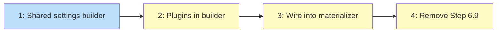

# PLAN: Declarative Plugin Management

## Status

Draft

## Scope Summary

Move plugins and marketplaces from CLI subprocess calls into the settings
materializer output. Remove Step 6.9. Refactor shared settings generation
logic between repos and instance root.

## Decomposition Strategy

**Walking skeleton.** The refactor (issue 1) establishes the shared foundation
that both repos and the instance root build on. Issues 2-3 wire the new fields
into the shared builder. Issue 4 removes the old code.

## Issue Outlines

### 1. Extract shared settings builder

**Goal:** Extract the duplicated settings generation logic from
`SettingsMaterializer.Materialize` and `InstallWorkspaceRootSettings` into
a shared `buildSettingsDoc` function.

**Acceptance criteria:**
- `buildSettingsDoc(cfg BuildSettingsConfig) map[string]any` function that
  produces the permissions, hooks, and env blocks
- `BuildSettingsConfig` struct with fields: effective settings, effective
  hooks (as InstalledHookEntry), effective env vars, plugins list,
  marketplaces list, repoIndex, localRenameHooks bool, includeGitInstructions
  *bool
- `SettingsMaterializer` calls `buildSettingsDoc` then writes the result
- `InstallWorkspaceRootSettings` calls `buildSettingsDoc` then writes the result
- Both produce identical output to before (no behavior change)
- All existing tests still pass

**Dependencies:** None

**Complexity:** testable

### 2. Add plugins and marketplaces to shared builder

**Goal:** Extend `buildSettingsDoc` to emit `enabledPlugins` and
`extraKnownMarketplaces` blocks. Add `RepoIndex` to `MaterializeContext`.

**Acceptance criteria:**
- `buildSettingsDoc` emits `enabledPlugins` when plugins list is non-empty
  (maps each plugin string to `true`)
- `buildSettingsDoc` emits `extraKnownMarketplaces` when marketplaces list
  is non-empty (GitHub refs -> github source, repo: refs -> directory source
  using repoIndex)
- `mapMarketplaceSourceWithIndex(source, repoIndex)` handles both GitHub
  and repo: refs (repo: refs use ResolveMarketplaceSource for path resolution)
- `MaterializeContext.RepoIndex` field added and populated in apply.go
- Tests: plugins emitted, GitHub marketplace mapped, repo: marketplace mapped,
  missing repo: ref produces error

**Dependencies:** <<ISSUE:1>> (shared builder)

**Complexity:** testable

### 3. Wire plugins into SettingsMaterializer

**Goal:** The settings materializer passes effective plugins and marketplaces
to the shared builder so repos get declarative plugin config.

**Acceptance criteria:**
- `SettingsMaterializer` passes `EffectiveConfig.Plugins` and
  `EffectiveConfig.Claude.Marketplaces` to `buildSettingsDoc`
- Per-repo plugin overrides work (replace semantics via MergeOverrides)
- Repos with `claude.enabled = false` still skip settings entirely
- Generated `settings.local.json` includes `enabledPlugins` and
  `extraKnownMarketplaces` alongside existing fields
- Tests for: repo with plugins, repo with empty plugins (disabled),
  repo without plugin override (inherits workspace)

**Dependencies:** <<ISSUE:2>> (plugins in builder)

**Complexity:** simple

### 4. Remove Step 6.9 and clean up

**Goal:** Delete the CLI-based plugin pipeline step and unused functions.

**Acceptance criteria:**
- Step 6.9 removed from apply.go (marketplace registration + plugin install)
- `RegisterMarketplaces`, `InstallPlugins`, `FindClaude` deleted from plugin.go
- `ResolveMarketplaceSource` retained (used by marketplace mapper)
- Plugin-related CLI tests removed from plugin_test.go
- Merge tests for plugins retained in plugin_test.go
- `InstallWorkspaceRootSettings` updated to use shared builder (if not
  already done in issue 1)
- All tests pass, `go vet` clean

**Dependencies:** <<ISSUE:3>> (repos use declarative path)

**Complexity:** simple

## Dependency Graph

**Legend**: Blue = ready, Yellow = blocked

## Implementation Sequence

Strictly sequential: 1 -> 2 -> 3 -> 4. Each issue builds on the previous.
The refactor (1) must land first so 2-3 don't duplicate code.
