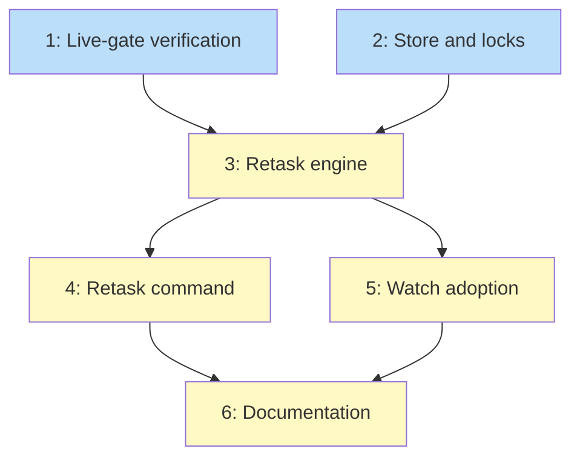

# PLAN: Dispatch handle retask

## Status

Active

Single-pr plan authored from the Accepted design; auto-transitioned on
authoring completion per the single-pr lifecycle. Implementation runs
through /work-on against the outlines below on one branch and one PR.

## Scope Summary

Implement `niwa retask <target> <prompt>` — safe re-tasking of a
dispatched session through its handle — plus the shared engine watch's
continuation adopts to chain past once-per-session, per
DESIGN-dispatch-handle-retask.

## Decomposition Strategy

Horizontal. The components have clear, stable interfaces (store and
locks feed the engine; the engine feeds the command and the watch
adoption), so layer-by-layer beats a walking skeleton. The design's
real integration risk is two extrapolated platform behaviors, and that
risk gets a dedicated live-gate issue sequenced first — the
de-risking a skeleton would provide, without contorting the layer
order.

## Issue Outlines

### 1. Live-gate: verify the platform assumptions

**Goal**: Confirm on a disposable host that (a) stop-then-resume
delivers an instruction into a job entry whose process is genuinely
dead, and (b) a second retask chains after an exclude-known capture
(two consecutive resumes, context preserved). Record results in the
issue/PR notes; if (a) fails, activate the design's respawn fallback
before <<ISSUE:3>> lands.

**Complexity**: testable

**Dependencies**: None

**Acceptance Criteria**:
- [ ] Both behaviors exercised on a real dispatched throwaway session,
  with the observed command sequences and outcomes recorded.
- [ ] A stopped worker (job entry present, process dead) receives a
  resume-delivered instruction and acts on it.
- [ ] Three consecutive resumes against one target carry accumulated
  context forward (PRD integration criterion, manual form).
- [ ] Field semantics used by the activity classifier re-confirmed
  against the live host's state files.

### 2. Store and lock groundwork

**Goal**: `workspace.RebindMapping` (write-new-then-delete-old,
preserving Label/Ephemeral/Origin/KeepAlive), per-instance flock
helpers under `.niwa/locks/` with the path-component assertion
(R-SEC-4), reap's trylock-and-skip plus live-mapping-wins collision
preference with the existing `instanceHasLiveJob` guard retained.

**Complexity**: critical

**Dependencies**: None

**Acceptance Criteria**:
- [ ] Unit tests cover both crash interleavings of the rebind
  (write-new done/delete-old pending; both pending) and assert the
  next sweep self-heals to the live mapping.
- [ ] Concurrent rebind attempts through the lock: exactly one wins;
  the loser's failure is the conflict sentinel (PRD N2 unit
  criterion).
- [ ] Reap skips a locked instance and never yields a reaped instance
  with a live session across the tested interleavings.
- [ ] Lock filenames reject non-bare path components (traversal cases
  covered by tests).
- [ ] go vet and the full unit suite pass.

### 3. Retask engine

**Goal**: `retask_engine.go`: `classifyWorker` wrapping
`watch.ClassifySessionActivity` (default-deny, seven sentinel errors),
`resumeDelivery` (stop → dispatchLaunch with `--resume` → capture),
the exclusion parameter on the cwd-correlation capture seam, and the
`retaskDeliver` func-var delivery seam (R9).

**Complexity**: critical

**Dependencies**: <<ISSUE:1>>, <<ISSUE:2>>

**Acceptance Criteria**:
- [ ] Exclude-known capture unit tests: two entries on one cwd resolve
  to the single non-excluded candidate; residual ambiguity and invalid
  ids fail closed (PRD unit criterion).
- [ ] Classification unit tests over fixture state files cover
  retaskable, busy, blocked, gone, and undecodable-refuses.
- [ ] Session ids read from mapping bodies are revalidated at point of
  use (R-SEC-3), covered by a test with a corrupt mapping.
- [ ] Delivery failures before rebind leave the prior job entry and
  mapping untouched (fail-closed unit tests through the seams).

### 4. Retask command

**Goal**: `retask.go`: cobra wiring in the dispatch/reap house style,
target resolution (instance name, then short id), watch-staged/sandbox
refusal (R-SEC-1), `--json` output, prompt as single argv element,
SessionMapping rebind and superseded-entry removal, lock lifecycle.

**Complexity**: testable

**Dependencies**: <<ISSUE:3>>

**Acceptance Criteria**:
- [ ] Unknown target, gone session, busy worker, and sandboxed
  instance each produce their distinct sentinel error and leave state
  unchanged (unit, via seams).
- [ ] Successful retask against a fake-backed target rebinds the
  mapping, removes the superseded entry, and reports old/new ids in
  `--json`.
- [ ] A prompt containing `$(...)`, quotes, and newlines reaches the
  launch seam byte-identical (PRD integration criterion, unit form at
  the seam).
- [ ] A failed superseded-entry removal after a durable rebind reports
  the leftover entry without failing the retask.
- [ ] Integration smoke on a local daemon: retask a live-idle and a
  stopped throwaway worker; `niwa list --json` shows exactly one
  session matching the on-disk mapping afterward.

### 5. Watch adoption

**Goal**: `continueReview` swaps its inline stop/relaunch/re-capture
block for the engine call (PreLaunch = ApplyReviewSettings, exclusion
= staged record's session id) and updates the staged record from the
returned ids, chaining continuation past once-per-session and closing
#211. Defer/degrade policies unchanged.

**Complexity**: testable

**Dependencies**: <<ISSUE:3>>

**Acceptance Criteria**:
- [ ] After a continuation, the staged record holds the surviving
  session's validated ids (not empty, not stale) — the #211
  acceptance line.
- [ ] A second and third re-request at newer heads continue (chain)
  under the functional suite's fake seams, rather than deferring.
- [ ] Existing watch functional and unit suites stay green; the
  two-live-sessions invariant and fail-closed degrades are preserved.
- [ ] The egress live gate (`TestResumedSessionDeniesEgress_OnHarness`)
  still passes on a disposable host (PRD live-gate criterion).

### 6. Documentation

**Goal**: `docs/guides/session-retask.md` (states, sentinel errors,
fork-under-the-hood and keep-alive caveats, sandboxed refusal),
CLAUDE.md index line, and a short upstream-facts note recording the
platform constraints for the separate Claude Code feature request.

**Complexity**: simple

**Dependencies**: <<ISSUE:4>>, <<ISSUE:5>>

**Acceptance Criteria**:
- [ ] Guide documents every sentinel error and the rotation caveat
  with the `--json` id-reporting example.
- [ ] CLAUDE.md indexes the guide.
- [ ] Upstream-facts note captures the verified platform behaviors
  without referencing any non-durable path.

## Implementation Issues

Single-pr mode: no GitHub issues or milestone; the Issue Outlines
above are the decomposition /work-on consumes.

## Dependency Graph

Legend: `ready` (blue) has no unmet dependencies, `blocked` (yellow)
waits on an edge, `done` (green) is complete.

## Implementation Sequence

Critical path: 2 → 3 → 4/5 → 6. Issues 1 and 2 start in parallel (the
live gate needs only a disposable host; the store work is offline).
Issues 4 and 5 parallelize after the engine lands. The live gate (1)
must conclude before 3 merges its delivery sequence — a failed (a)
result reroutes 3 to the respawn fallback documented in the design.
Single session per issue; the tree stays green after each.
