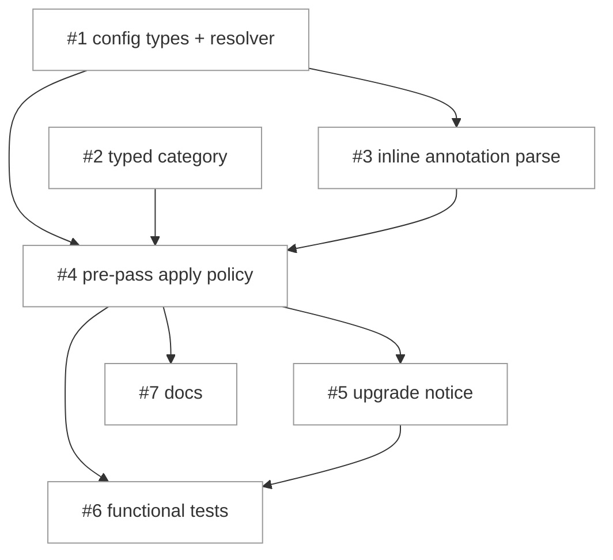

# PLAN: env-example failure policy

## Status

Active

## Scope Summary

Implement the configurable `.env.example` failure policy from
`DESIGN-env-example-failure-policy.md`: warn-by-default, per-category warn/fail
resolved at user/project/variable granularity, inline annotations, removal of the
public-remote branch, and the broadened per-run bypass. One PR.

## Decomposition Strategy

**Horizontal.** The design is layered with clear interfaces and a prerequisite
order: the config types and pure resolver come first, the detection-category and
annotation-parser changes are independent of each other, and the pre-pass rewire
consumes all three before tests and docs describe the finished behavior. The
components have well-defined boundaries and little runtime interaction beyond the
pre-pass wiring, so horizontal layer-by-layer build fits better than a walking
skeleton. Single-pr execution: no layer delivers user-observable value on its own
(config types and the resolver are inert until the pre-pass consumes them), so the
whole feature is one usable increment landing in one PR.

## Issue Outlines

### Issue 1: feat(config): add env_example_policy types and resolver

**Goal**: Add the policy config surface and a pure resolver implementing the
most-specific-wins cascade.

**Acceptance Criteria**:
- [ ] An `Action` enum (`warn`, `fail`) and `EnvExamplePolicy` struct
  (`VendorToken *Action`, `Entropy *Action`, and project-scope-only
  `Vars map[string]Action`) parse from `[env_example_policy]` TOML.
- [ ] `EnvExamplePolicy` fields are added to `WorkspaceMeta`, `RepoOverride`, and
  (net-new) `GlobalOverride`, with the global deep-copy
  (`internal/vault/resolve/deepcopy.go`) and any per-field global-override merge
  updated.
- [ ] `EffectiveEnvExamplePolicy(globalPolicy, ws, repoName, key, category, inline)`
  resolves most-specific-first: operator per-variable (per-repo `vars` ->
  workspace `vars`) -> inline annotation -> per-category (per-repo -> workspace ->
  global) -> default `warn`, with unset levels inheriting the next-broader level.
- [ ] An `ignore_inline_annotations` switch (workspace/global) makes the resolver
  disregard the inline argument.
- [ ] Unit tests cover every precedence rung, inheritance fall-through,
  inline-vs-config, `ignore_inline_annotations`, and the warn default.

**Dependencies**: None

**Type**: code
**Files**: `internal/config/config.go`, `internal/config/env_example.go`, `internal/vault/resolve/deepcopy.go`

### Issue 2: refactor(workspace): classifyEnvValue returns a typed category

**Goal**: Replace reason-string control flow with a typed detection category.

**Acceptance Criteria**:
- [ ] `classifyEnvValue` returns `(category EnvDetectionCategory, reason string)`
  with categories for vendor-token, entropy, and safe.
- [ ] The reason string stays value-free (no value, fragment, or entropy score).
- [ ] The sole production caller and existing tests are updated.

**Dependencies**: None

**Type**: code
**Files**: `internal/workspace/envclassify.go`

### Issue 3: feat(workspace): parse inline policy annotations in .env.example

**Goal**: Extract per-key `# niwa: warn|fail` annotations independent of value
quoting.

**Acceptance Criteria**:
- [ ] `parseDotEnvExample` returns per-key annotations parsed by a quoting-
  independent pass (unquoted, single-, and double-quoted values).
- [ ] A `# niwa:` sequence inside a quoted value is not treated as a marker.
- [ ] An unknown marker warns naming the key only (never echoing the marker
  payload) and is ignored; an annotation on a declared or excluded key is a no-op.
- [ ] Unit tests cover all three value forms, spoofing, unknown markers, and no-op
  cases.

**Dependencies**: Blocked by <<ISSUE:1>>

**Type**: code
**Files**: `internal/workspace/env_example.go`

### Issue 4: feat(workspace): apply the failure policy in the pre-pass

**Goal**: Rewire the pre-pass to resolve and apply warn/fail per key+category and
remove the public-remote branch.

**Acceptance Criteria**:
- [ ] For each undeclared, non-excluded key the pre-pass classifies, resolves the
  action via `EffectiveEnvExamplePolicy` (passing the inline annotation, honoring
  `ignore_inline_annotations`), and warns or fails accordingly; warn-by-default
  holds when nothing is configured.
- [ ] The `EnumerateGitHubRemotes`/`publicRemotes`/`haveGit` branch is removed.
- [ ] `--allow-plaintext-secrets` downgrades every resolved `fail` to `warn` for
  the run, emitting a per-key audit diagnostic; an inline annotation lowering a
  configured `fail` also emits a distinct greppable diagnostic.
- [ ] The resolved global policy is threaded through `MaterializeContext`,
  populated once on the shared Applier path used by both `apply` and `create`.
- [ ] All new diagnostics name the key and category only (value-free).
- [ ] Pre-pass unit tests are updated.

**Dependencies**: Blocked by <<ISSUE:1>>, <<ISSUE:2>>, <<ISSUE:3>>

**Type**: code
**Files**: `internal/workspace/env_example_prepass.go`, `internal/workspace/materialize.go`, `internal/workspace/apply.go`

### Issue 5: feat(cli): one-time warn-by-default upgrade notice

**Goal**: Announce the default change once per instance.

**Acceptance Criteria**:
- [ ] A one-time notice (per `docs/guides/one-time-notices.md`) states that
  `.env.example` detections now warn by default and shows how to restore failing.
- [ ] The notice is shown at most once per workspace instance.

**Dependencies**: Blocked by <<ISSUE:4>>

**Type**: code

### Issue 6: test(functional): env-example failure policy scenarios

**Goal**: Cover every PRD acceptance criterion end-to-end.

**Acceptance Criteria**:
- [ ] Gherkin scenarios in `test/functional/features/` cover warn-by-default,
  per-category fail, each of the three precedence levels, user-only inheritance
  fall-through, inline-vs-config override, the per-run downgrade, remote-visibility
  removal, and scan-disabled.
- [ ] A scenario greps stderr to assert no value bytes, fragment, or entropy score
  appear in any diagnostic.
- [ ] The suite passes.

**Dependencies**: Blocked by <<ISSUE:4>>, <<ISSUE:5>>

**Type**: code
**Files**: `test/functional/features/env-example-failure-policy.feature`

### Issue 7: docs: document the env-example failure policy

**Goal**: Document the new configuration and behavior for users.

**Acceptance Criteria**:
- [ ] The relevant config/contributor guide documents the `[env_example_policy]`
  block, the three levels and precedence, the inline annotation, the
  `ignore_inline_annotations` switch, and the warn-by-default change.

**Dependencies**: Blocked by <<ISSUE:4>>

**Type**: docs
**Files**: `docs/guides/workspace-config-sources.md`

## Dependency Graph

## Implementation Sequence

- **Critical path:** Issue 1 -> Issue 3 -> Issue 4 -> Issue 5 -> Issue 6.
- **Parallelizable:** Issues 1 and 2 can start together (independent). After
  Issue 4, Issues 5 and 7 can proceed in parallel; Issue 6 follows Issue 5 so the
  upgrade-notice path is exercised.
- **Highest-risk unit:** Issue 4 (the behavior change, the bypass blast radius, and
  the value-free-diagnostics guarantee converge there); land it with its unit
  tests before the functional suite in Issue 6.
