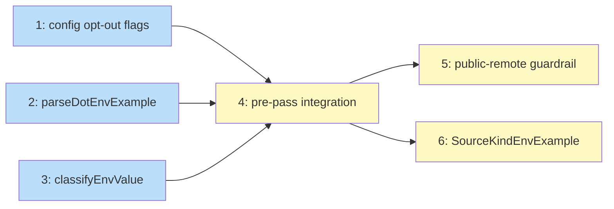

# PLAN: .env.example Integration

## Status

Active

## Scope Summary

Add `.env.example` as the lowest-priority layer in `ResolveEnvVars`. Requires a new
Node-style parser, an entropy-based secret classifier, a pre-pass in
`EnvMaterializer.Materialize`, and source attribution in `niwa status --verbose`.

## Decomposition Strategy

**Horizontal.** The design specifies six sequential phases with stable interfaces between
them. Issues 1-3 are independently testable pure functions; Issue 4 wires them together;
Issues 5-6 extend the pre-pass and add observability. Walking skeleton was not used
because the parser and classifier are prerequisites for any meaningful end-to-end slice.

## Issue Outlines

### Issue 1: feat(config): add read_env_example opt-out flags to workspace config

**Complexity:** simple

**Goal:** Add `read_env_example *bool` to `WorkspaceMeta` and `RepoOverride`, and a
resolver helper `effectiveReadEnvExample` that Issue 4 calls to gate the pre-pass.

**Acceptance Criteria:**
- [ ] `WorkspaceMeta` in `internal/config/workspace.go` gains `ReadEnvExample *bool` with TOML tag `read_env_example`; nil means true (opt-out default)
- [ ] `RepoOverride` gains `ReadEnvExample *bool` with TOML tag `read_env_example`; nil means inherit workspace setting
- [ ] `effectiveReadEnvExample(ws *config.WorkspaceConfig, repoName string) bool` defined; returns `true` when both are nil
- [ ] workspace=false, no per-repo → `false`
- [ ] workspace=false, per-repo=true → `true` (per-repo override wins)
- [ ] both nil → `true` (default-on)
- [ ] workspace=true, per-repo=false → `false` (per-repo suppression wins)
- [ ] Existing `config_test.go` round-trip tests pass

**Dependencies:** None

---

### Issue 2: feat(workspace): implement parseDotEnvExample for Node-style .env.example syntax

**Complexity:** testable

**Goal:** Implement `parseDotEnvExample(path string) (map[string]string, []string, error)` in
`internal/workspace/env_example.go` with per-line tolerance and no value text in warnings.

**Acceptance Criteria:**
- [ ] Function defined in `internal/workspace/env_example.go`; test file at `internal/workspace/env_example_test.go`
- [ ] Per-line warnings in format `file:line:problem`; no value text in any warning
- [ ] Whole-file error for permission denied, binary content, >512 KB; per-line errors don't set error return
- [ ] Precondition documented: only called after `os.Lstat` confirms existence; tests must not call with nonexistent path
- [ ] Single-quoted values treated as literals (no escape processing)
- [ ] Double-quoted values support `\n`, `\t`, `\"`, `\\`; other backslash sequences → per-line warning + skip
- [ ] `export KEY=VALUE` prefix accepted; `export` stripped
- [ ] CRLF normalized to `\n`
- [ ] Blank lines and `#`-prefixed lines skipped silently
- [ ] Key validated against `[A-Za-z0-9_]`; invalid characters → per-line warning + skip
- [ ] No `=` separator → per-line warning + skip
- [ ] Valid key with empty value → included with empty string value
- [ ] Duplicate keys: last occurrence wins
- [ ] `go test ./internal/workspace/...` passes with no failures

**Dependencies:** None

---

### Issue 3: feat(workspace): implement classifyEnvValue for probable-secret detection

**Complexity:** testable

**Goal:** Implement `classifyEnvValue(value string) (isSafe bool, reason string)` in
`internal/workspace/envclassify.go` using Shannon entropy (3.5 bit/char threshold),
a vendor-prefix blocklist, and a safe-pattern allowlist.

**Acceptance Criteria:**
- [ ] Function defined in `internal/workspace/envclassify.go` (unexported); `envPrefixBlocklist` and `envSafeAllowlist` are package-level `[]string` vars in the same file
- [ ] Test file `internal/workspace/envclassify_test.go` uses `package workspace`
- [ ] Blocklist test table hardcodes all 16 prefixes by name (not range-iterated from variable): `sk_live_`, `sk_test_`, `AKIA`, `ASIA`, `ghp_`, `gho_`, `ghu_`, `ghs_`, `ghr_`, `github_pat_`, `glpat-`, `xoxb-`, `xoxp-`, `xapp-`, `sq0atp-`, `sq0csp-`; each → `isSafe=false`, reason contains prefix string
- [ ] Blocklist result holds even when entropy is below threshold
- [ ] Allowlist test table hardcodes (not range-iterated): `""`, `"changeme"`, `"placeholder"`, `"pk_test_xxxxxxxxxxxx"`, `"pk_live_xxxxxxxxxxxx"`, `"<your-api-key>"`, `"https://example.com/callback"`, `"localhost"`, `"127.0.0.1"`; each → `isSafe=true`
- [ ] Allowlist overrides entropy: allowlist match with entropy >3.5 → `isSafe=true`
- [ ] Entropy strictly <3.5, no blocklist/allowlist match → `isSafe=true`
- [ ] Entropy exactly 3.5 boundary explicitly tested; implementation documents whether equal is safe or unsafe
- [ ] Entropy strictly >3.5, no prefix, no allowlist → `isSafe=false`, reason contains `"entropy > 3.5"`
- [ ] `classifyEnvValue("")` → `isSafe=true`
- [ ] R22: reason never contains value string or entropy score; tests assert reason does not contain literal value for every `isSafe=false` case
- [ ] No external dependencies beyond stdlib

**Dependencies:** None

---

### Issue 4: feat(workspace): integrate .env.example pre-pass into EnvMaterializer

**Complexity:** critical

**Goal:** Wire opt-out check, parser, secrets exclusion, and classifier into a pre-pass in
`EnvMaterializer.Materialize`; store results on `MaterializeContext`; seed `ResolveEnvVars`
via a nil-guarded opening block.

**Acceptance Criteria:**
- [ ] `EnvMaterializer` has `Stderr io.Writer` field and private `stderr() io.Writer` helper (returns field when non-nil, else `os.Stderr`)
- [ ] Tests inject `*bytes.Buffer` as `Stderr` and assert all pre-pass warnings (symlink, parse, size, undeclared key, classification) appear in buffer, not `os.Stderr`
- [ ] Opt-out: workspace `read_env_example=false` skips pre-pass for all repos; per-repo `false` skips that repo; both nil → runs
- [ ] `os.Lstat`: symlink → warning to `f.stderr()`, `ctx.EnvExampleVars` not set; not-exist → silent short-circuit; other error → warning + skip
- [ ] File >512 KB → warning to `f.stderr()` + skip
- [ ] `parseDotEnvExample` per-line warnings emitted to `f.stderr()` (no value text); whole-file error → single warning + skip
- [ ] Secrets exclusion walks `ctx.Effective.Env.Secrets.{Values,Required,Recommended,Optional}`, `ctx.Effective.Claude.Env.Secrets.{Values,Required,Recommended,Optional}`, and `ctx.Effective.Repos[ctx.RepoName].Env.Secrets.{Values,Required,Recommended,Optional}`; does NOT iterate over all Repos entries
- [ ] Declared vars (`ctx.Effective.Env.Vars.Values`) included without classification
- [ ] Undeclared safe key → warning naming key (not value) to `f.stderr()`; key included
- [ ] Undeclared probable secret → error accumulated (key+reason, no value text); all accumulated errors emitted + return error; `ctx.EnvExampleVars` not set
- [ ] `ctx.EnvExampleVars` set to filtered map; `ctx.EnvExampleSources` set to `[]SourceEntry` with `Kind: SourceKindEnvExample`
- [ ] `ResolveEnvVars` nil-guard: non-nil `ctx.EnvExampleVars` seeds `vars` and appends `ctx.EnvExampleSources` before merge layers; nil path unchanged
- [ ] Integration tests: absent file, symlink, secrets exclusion (workspace layer), secrets exclusion (Claude env layer), secrets exclusion (per-repo layer), declared var, undeclared safe, undeclared probable secret
- [ ] No diagnostic output contains value text; tests capture stderr and assert no substring of classified secret value

**Dependencies:** Blocked by Issue 1, Issue 2, Issue 3

---

### Issue 5: feat(workspace): add per-repo public-remote guardrail for .env.example secrets

**Complexity:** testable

**Goal:** After classification, call `enumerateGitHubRemotes(ctx.RepoDir)` to check whether
the managed app repo is public; accumulate a guardrail error for public repos with
probable-secret keys unless `--allow-plaintext-secrets` is set.

**Acceptance Criteria:**
- [ ] When `enumerateGitHubRemotes(ctx.RepoDir)` returns error → warning to `f.stderr()`, guardrail skipped; apply does not fail from this alone; other errors still reported
- [ ] Public remote + probable-secret undeclared key → guardrail error accumulated; apply fails
- [ ] Public remote + probable-secret + `--allow-plaintext-secrets` → apply succeeds; key in `ctx.EnvExampleVars`
- [ ] Private remote + probable-secret → `err != nil` AND error message contains "probable secret" AND does NOT contain "public remote"
- [ ] No value text in any diagnostic; tests capture stderr and assert no substring of classified secret value
- [ ] Guardrail targets `ctx.RepoDir` (managed app repo), not workspace config dir

**Dependencies:** Blocked by Issue 4

---

### Issue 6: feat(workspace): add SourceKindEnvExample and verbose source attribution

**Complexity:** testable

**Goal:** Define `SourceKindEnvExample` constant and update `niwa status --verbose` to
display `.env.example` as the source label for keys from that file.

**Acceptance Criteria:**
- [ ] `SourceKindEnvExample` defined in `internal/workspace/state.go` or `materialize.go` with string value `"env_example"`
- [ ] Unit test: `SourceKindEnvExample == "env_example"` AND `!= SourceKindPlaintext` AND `!= SourceKindVault`
- [ ] `EnvExampleSources` entries produced by pre-pass use `Kind: SourceKindEnvExample`
- [ ] `niwa status --verbose` displays `.env.example` (literally) for keys with `SourceEntry.Kind == SourceKindEnvExample`
- [ ] Integration test: after `niwa apply`, `niwa status --verbose` shows `.env.example` label (not `plaintext`, `vault`, or other) for keys from `.env.example`
- [ ] Existing source kinds unaffected; no regressions in existing `--verbose` output

**Dependencies:** Blocked by Issue 4

---

## Implementation Issues

_(single-pr mode: no GitHub issues created)_

## Dependency Graph

**Legend**: Blue = ready, Yellow = blocked

## Implementation Sequence

**Critical path:** Issue 1 (or 2 or 3) → Issue 4 → Issue 5 (or 6)

**Parallelization:**
- Issues 1, 2, 3 can start immediately in any order or in parallel
- After Issues 1 + 2 + 3: Issue 4
- After Issue 4: Issues 5 and 6 in parallel

**Recommended order for sequential execution:**
1. Issue 2 (parser) — highest complexity of the three independent issues
2. Issue 3 (classifier) — second most complex
3. Issue 1 (config schema) — simplest, can slot in any time before Issue 4
4. Issue 4 (pre-pass integration) — critical path; blocked until 1+2+3 done
5. Issue 5 (public-remote guardrail) — extends the pre-pass
6. Issue 6 (source attribution) — extends display; can run in parallel with 5
