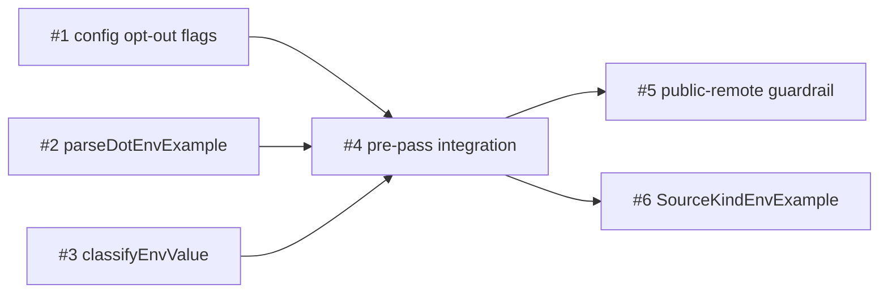

# PLAN: .env.example Integration

## Overview

Six issues in a single PR. Issues 1, 2, and 3 are independent and can be
implemented in any order or in parallel. Issue 4 is the central integration and
is blocked by all three. Issues 5 and 6 both depend on Issue 4 and can be
implemented in parallel once Issue 4 lands.

Design: `docs/designs/current/DESIGN-env-example-integration.md`

## Implementation Issues

| # | Title | Complexity | Blocked By |
|---|-------|------------|------------|
| 1 | feat(config): add read_env_example opt-out flags to workspace config | simple | — |
| 2 | feat(workspace): implement parseDotEnvExample for Node-style .env.example syntax | testable | — |
| 3 | feat(workspace): implement classifyEnvValue for probable-secret detection | testable | — |
| 4 | feat(workspace): integrate .env.example pre-pass into EnvMaterializer | critical | 1, 2, 3 |
| 5 | feat(workspace): add per-repo public-remote guardrail for .env.example secrets | testable | 4 |
| 6 | feat(workspace): add SourceKindEnvExample and verbose source attribution | testable | 4 |

## Issue 1: feat(config): add read_env_example opt-out flags to workspace config

**Complexity**: simple

**Goal**: Add `read_env_example *bool` opt-out fields to the workspace-level and
per-repo config structs, and a resolver helper that downstream issues can call to
determine whether `.env.example` materialization is enabled for a given repo.

**Acceptance Criteria**:

- `WorkspaceMeta` in `internal/config/workspace.go` gains `ReadEnvExample *bool`
  with TOML tag `read_env_example`; godoc states nil means true (opt-out default).
- `RepoOverride` in `internal/config/workspace.go` gains `ReadEnvExample *bool`
  with TOML tag `read_env_example`; godoc states nil means inherit the workspace
  setting.
- `effectiveReadEnvExample(ws *config.WorkspaceConfig, repoName string) bool` is
  added in `internal/config/` (or `internal/workspace/`); it resolves workspace
  default then per-repo override using nil-pointer semantics, returning `true`
  when both are nil.
- The function signature accepts `*config.WorkspaceConfig` and `repoName string`
  so Issue 4 can call it as `effectiveReadEnvExample(ctx.Config, ctx.RepoName)`.
- TOML round-trip test: workspace `read_env_example = false`, no per-repo override
  — `effectiveReadEnvExample` returns `false`.
- TOML round-trip test: workspace `read_env_example = false`, per-repo
  `read_env_example = true` — returns `true` (per-repo override wins).
- TOML round-trip test: neither workspace nor per-repo field set (all nil) —
  returns `true` (default-on).
- TOML round-trip test: workspace `read_env_example = true`, per-repo
  `read_env_example = false` — returns `false` (per-repo suppression wins).
- Existing `config_test.go` round-trip tests continue to pass.

**Dependencies**: None

---

## Issue 2: feat(workspace): implement parseDotEnvExample for Node-style .env.example syntax

**Complexity**: testable

**Goal**: Implement `parseDotEnvExample`, a new package-private function in
`internal/workspace/env_example.go` that parses `.env.example` files using
Node-style syntax with per-line tolerance.

**Acceptance Criteria**:

- `internal/workspace/env_example.go` exports (package-private)
  `parseDotEnvExample(path string) (map[string]string, []string, error)`.
- The `[]string` return carries per-line warning strings in format
  `file:line:problem`. No value text appears in any warning string.
- The `error` return is non-nil only for whole-file failures (permission denied,
  binary content detection, file larger than 512 KB). Per-line parse errors do not
  set the error return.
- **Precondition**: this function is called only after `os.Lstat` confirms the
  path exists and is not a symlink (the pre-pass in Issue 4 handles absence and
  symlink detection). File-not-found is not a valid input; tests must not call
  `parseDotEnvExample` with a nonexistent path.
- Single-quoted values are treated as literals: no escape processing inside single
  quotes.
- Double-quoted values support `\n`, `\t`, `\"`, and `\\`. Other backslash
  sequences produce a per-line warning and the line is skipped.
- The `export KEY=VALUE` prefix is accepted; `export` is stripped.
- CRLF line endings are normalized to `\n` before processing.
- Blank lines and `#`-prefixed lines are skipped silently.
- Key names are validated against `[A-Za-z0-9_]`. Invalid characters produce a
  per-line warning and the line is skipped.
- A line with no `=` separator produces a per-line warning and is skipped.
- Lines with a valid key but empty value are included with an empty string value.
- Duplicate keys: last occurrence wins.
- `internal/workspace/env_example_test.go` covers every syntax variant with
  table-driven tests.
- `go test ./internal/workspace/...` passes.

**Dependencies**: None

---

## Issue 3: feat(workspace): implement classifyEnvValue for probable-secret detection

**Complexity**: testable

**Goal**: Implement `classifyEnvValue` in `internal/workspace/envclassify.go` to
detect probable secrets via Shannon entropy and known-vendor-prefix matching, with
an allowlist that overrides the entropy check for known-safe patterns.

**Acceptance Criteria**:

- `classifyEnvValue(value string) (isSafe bool, reason string)` is defined in
  `internal/workspace/envclassify.go` as an unexported function.
- `envPrefixBlocklist` and `envSafeAllowlist` are package-level `[]string`
  variables in the same file.
- A paired `internal/workspace/envclassify_test.go` exists (`package workspace`).
- Blocklist test table contains one or more literal cases for each of these 16
  prefixes hardcoded by name (not range-iterated from `envPrefixBlocklist`):
  `sk_live_`, `sk_test_`, `AKIA`, `ASIA`, `ghp_`, `gho_`, `ghu_`, `ghs_`,
  `ghr_`, `github_pat_`, `glpat-`, `xoxb-`, `xoxp-`, `xapp-`, `sq0atp-`,
  `sq0csp-`. For each: `isSafe=false`, `reason` contains the matched prefix.
- Allowlist test table contains literal cases for: empty string, `"changeme"`,
  `"placeholder"`, `"pk_test_xxxxxxxxxxxx"`, `"pk_live_xxxxxxxxxxxx"`,
  `"<your-api-key>"`, `"https://example.com/callback"`, `"localhost"`,
  `"127.0.0.1"`. For each: `isSafe=true`. Allowlist overrides high entropy.
- Entropy boundary: value strictly below 3.5 bits/char, no blocklist/allowlist
  match → `isSafe=true`. Value strictly above 3.5 → `isSafe=false`, `reason`
  contains the threshold (e.g. `"entropy > 3.5"`). Equal-to-3.5 boundary is
  explicitly tested and the implementation documents whether equal is safe or unsafe.
- `classifyEnvValue("")` returns `isSafe=true`.
- R22: `reason` must not include the value string, any substring of the value, or
  the raw floating-point entropy score. Tests assert `reason` does not contain the
  literal value string for any `isSafe=false` case.
- No external dependencies beyond Go stdlib.

**Dependencies**: None

---

## Issue 4: feat(workspace): integrate .env.example pre-pass into EnvMaterializer

**Complexity**: critical

**Goal**: Wire the opt-out check, Node-style parser, secrets exclusion set, and
value classifier into a pre-pass inside `EnvMaterializer.Materialize`, store
results on `MaterializeContext`, and seed `ResolveEnvVars` from those fields so
`.env.example` becomes the lowest-priority env layer.

**Acceptance Criteria**:

**Stderr field and routing**:
- `EnvMaterializer` has a `Stderr io.Writer` field and a private `stderr()` helper
  that returns `Stderr` when non-nil, `os.Stderr` otherwise.
- Tests inject a `*bytes.Buffer` as `EnvMaterializer.Stderr` and assert that
  symlink warnings, per-line parse warnings, whole-file skip warnings,
  undeclared-key warnings, and classification warnings all appear in that buffer —
  not on `os.Stderr`.

**Pre-pass 9-step data flow**:
- Step 1 — Opt-out check: workspace-level `read_env_example = false` skips all
  repos; per-repo `false` skips that repo; both nil runs (default-true).
- Step 2 — Symlink/existence check: `os.Lstat` on `.env.example`; symlink emits
  warning and skips; not-exist short-circuits silently; other error emits warning
  and skips.
- Step 3 — File size guard: `>512*1024` emits warning and skips.
- Step 4 — `parseDotEnvExample`: per-line warnings written to `f.stderr()`
  (`file:line:problem`; no value text); whole-file error emits one warning and
  skips remaining steps.
- Step 5 — Secrets exclusion set: walk only the current repo's config layers —
  `ctx.Effective.Env.Secrets.{Values,Required,Recommended,Optional}`,
  `ctx.Effective.Claude.Env.Secrets.{Values,Required,Recommended,Optional}`, and
  `ctx.Effective.Repos[ctx.RepoName].Env.Secrets.{Values,Required,Recommended,Optional}`.
  The walk does NOT iterate over all entries in `ctx.Effective.Repos`; it reads
  only `ctx.Effective.Repos[ctx.RepoName]`. Excluded keys removed silently.
- Step 6 — Per-key classification: declared vars (`ctx.Effective.Env.Vars.Values`)
  included without classification; undeclared keys passed to `classifyEnvValue`:
  safe → warning naming key (not value), included; probable secret → error
  accumulated (file, line, key, reason — no value text).
- Step 7 — Probable-secret error gate: if errors accumulated, emit all to
  `f.stderr()` and return error; `ctx.EnvExampleVars` not set.
- Step 8 — Store results: `ctx.EnvExampleVars` set to filtered map;
  `ctx.EnvExampleSources` set to `[]SourceEntry` with `Kind: SourceKindEnvExample`.
- Step 9 — `ResolveEnvVars` nil-guard: opening block seeds `vars` from
  `ctx.EnvExampleVars` and appends `ctx.EnvExampleSources` when non-nil; nil path
  (settings path, opt-out) behaves exactly as before.

**Security**: no warning or error message includes value text. Tests capture
`f.stderr()` output and assert it contains no substring of any classified secret
value.

**Integration test scenarios**:
- Absent file: `ctx.EnvExampleVars` nil; `ResolveEnvVars` output identical to
  pre-feature output.
- Symlink: pre-pass emits warning to injected writer and skips;
  `ctx.EnvExampleVars` nil.
- Secrets exclusion (workspace layer): a key in `ctx.Effective.Env.Secrets.Values`
  present in `.env.example` does not appear in `ctx.EnvExampleVars`.
- Secrets exclusion (Claude env layer): a key in
  `ctx.Effective.Claude.Env.Secrets.Values` present in `.env.example` does not
  appear in `ctx.EnvExampleVars`.
- Secrets exclusion (per-repo layer): a key in
  `ctx.Effective.Repos[ctx.RepoName].Env.Secrets.Values` present in `.env.example`
  does not appear in `ctx.EnvExampleVars`.
- Declared var: key in `ctx.Effective.Env.Vars.Values` present in `.env.example`
  appears in `ctx.EnvExampleVars` without triggering classification.
- Undeclared safe value: undeclared key with low-entropy placeholder appears in
  `ctx.EnvExampleVars`; warning naming the key (not value) written to injected
  writer.
- Undeclared probable secret: high-entropy undeclared key causes pre-pass to return
  error; `ctx.EnvExampleVars` not set; error message names key and reason, no value
  text.

**Files modified**:
- `internal/workspace/materialize.go` — `EnvMaterializer` (Stderr field,
  `stderr()` helper, pre-pass), `MaterializeContext` (EnvExampleVars,
  EnvExampleSources fields), `ResolveEnvVars` (nil-guard opening block),
  `SourceKindEnvExample` constant.
- `internal/workspace/apply.go` — materializer construction updated so
  `EnvMaterializer.Stderr` is populated correctly.

**Dependencies**: Issues 1, 2, 3

---

## Issue 5: feat(workspace): add per-repo public-remote guardrail for .env.example secrets

**Complexity**: testable

**Goal**: Add a per-repo public-remote guardrail to the `.env.example` pre-pass so
that probable-secret keys found in public repos are rejected unless
`--allow-plaintext-secrets` is set.

**Acceptance Criteria**:

- When `enumerateGitHubRemotes(ctx.RepoDir)` returns an error, the pre-pass emits
  a warning to `f.stderr()` and skips the guardrail check for that repo. Apply does
  not fail due to remote-detection failure alone; other errors (e.g., classification
  errors) are still reported normally.
- When the managed app repo's remote is public and an undeclared key's value is
  classified as a probable secret, apply accumulates a guardrail error and fails at
  the end of the pre-pass loop.
- When the managed app repo's remote is public and an undeclared key's value is
  classified as a probable secret but `--allow-plaintext-secrets` is set, apply
  succeeds and the key is included in `ctx.EnvExampleVars`.
- Test for private remote + high-entropy value asserts: `err != nil` AND error
  message contains classification language (e.g., "probable secret") AND error
  message does NOT contain guardrail language (e.g., "public remote").
- No value text, value fragment, or entropy score appears in any diagnostic output.
  Tests capture stderr and assert it contains no substring of any classified secret
  value.
- The guardrail targets `ctx.RepoDir` (the managed app repo), not the workspace
  config dir.

**Dependencies**: Issue 4

---

## Issue 6: feat(workspace): add SourceKindEnvExample and verbose source attribution

**Complexity**: testable

**Goal**: Add `SourceKindEnvExample` to the `SourceKind` enumeration and update
`niwa status --verbose` to display `.env.example` as the source label for keys
originating from that file.

**Acceptance Criteria**:

- `SourceKindEnvExample` is defined in `internal/workspace/state.go` (or
  `materialize.go`) with the string value `"env_example"`, which is distinct from
  `"plaintext"` and `"vault"`.
- A unit test asserts that `SourceKindEnvExample == "env_example"` and that this
  value does not equal `SourceKindPlaintext` or `SourceKindVault`.
- `EnvExampleSources` entries produced by the `EnvMaterializer` pre-pass use
  `Kind: SourceKindEnvExample`.
- `niwa status --verbose` displays `.env.example` (literally) as the source for
  keys whose `SourceEntry.Kind` is `SourceKindEnvExample`.
- A test confirms that after `niwa apply` against a workspace with a managed repo
  containing a `.env.example` file, `niwa status --verbose` shows `.env.example`
  as the source label for keys from that file — not `plaintext`, `vault`, or any
  other label.
- Existing source kinds are unaffected: keys from `[env.files]`, `[env.vars]`, and
  `[env.secrets]` continue to display their prior labels under `--verbose`.

**Dependencies**: Issue 4
