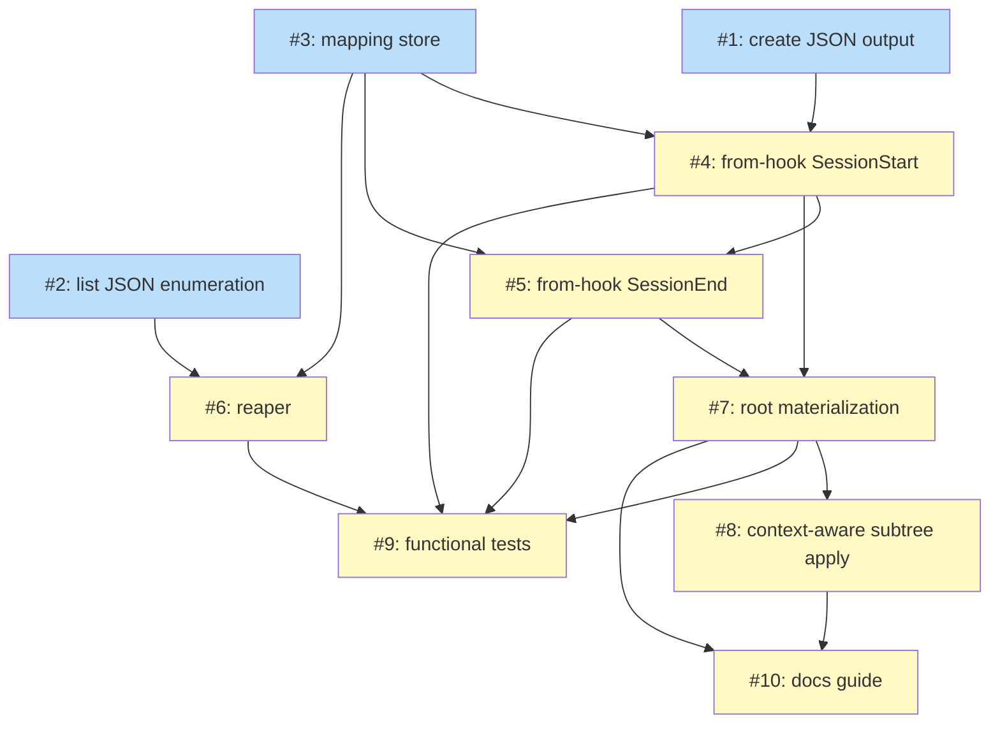

# PLAN: one ephemeral niwa instance per Claude Code session

## Status

Draft

Single-pr plan: the issues below are implemented on one branch and shipped as one
PR. No GitHub issues are materialized.

## Scope Summary

This plan implements the DESIGN's mechanism for "1 Claude Code session == 1
ephemeral niwa instance": workspace-root SessionStart/SessionEnd hooks delegating
to a new `niwa instance from-hook` subcommand, a session-to-instance mapping store,
a `niwa reap` orphan sweep, the supporting `niwa create --json` / `niwa list
--json` primitives, and the root-config materialization path (`niwa init` install
plus context-aware `niwa apply`, which converges the subtree at the current scope and
caps at the current node with `--no-cascade`). It does not re-open the requirements
(PRD R1-R14) or the architecture
(the DESIGN's seven decisions); it slices them into atomic issues.

## Decomposition Strategy

**Hybrid, walking-skeleton-first.** The three primitive issues (machine-readable
`create`, `list` enumeration, the mapping store) carry no dependencies and form the
foundation. The two `from-hook` branches and the reaper build on the primitives;
the root materializer and context-aware `apply` build on the hook subcommand existing; the
functional tests and the guide close the chain. Grouping rule: one issue per new
CLI surface or store, with the SessionStart and SessionEnd branches split so the
provisioning path (guard + create + inject) and the teardown path (resolve +
destroy) are reviewed independently. Cross-batch dependency edges: 15.

## Issue Outlines

### Issue 1: feat(create): machine-readable JSON output

**Complexity:** testable

**Goal:** Add a `--json` mode to `niwa create` (in `internal/cli/create.go`)
emitting a single JSON object with the created instance's `name`, `number`, and
absolute `path`, so the provisioning hook learns the path without parsing human
output or re-deriving the name (PRD R9).

**Acceptance Criteria:**
- `niwa create --json` prints one JSON object with `name`, `number`, and absolute
  `path`, and nothing else on stdout
- Human (non-`--json`) output is unchanged
- A unit test in `create_test.go` asserts the JSON shape and that `path` is the
  created instance directory
- `go test ./...` passes

**Dependencies:** None

---

### Issue 2: feat(cli): niwa list with JSON enumeration

**Complexity:** testable

**Goal:** Add a public `niwa list` command (`internal/cli/list.go`) over the
existing internal instance enumeration, with a `--json` mode emitting each
instance's `name`, `path`, and `ephemeral` marker for the reaper (PRD R10).

**Acceptance Criteria:**
- `niwa list` enumerates all instances under the workspace root
- `niwa list --json` emits an array of records with `name`, `path`, and `ephemeral`
  per instance
- A unit test covers enumeration over a fixture workspace with two instances
- `go test ./...` passes

**Dependencies:** None

---

### Issue 3: feat(session): session-to-instance mapping store

**Complexity:** testable

**Goal:** Add a workspace-root `.niwa/sessions/<session_id>.json` mapping store
(`internal/workspace/session_map.go`) with write/read/delete helpers, the single
source of truth for teardown and the reaper (PRD R2).

**Acceptance Criteria:**
- Helpers persist `session_id`, `instance_name`, `instance_path`,
  `transcript_path`, `created`, `ephemeral: true`, and an optional `label` alias
  (filled later from the session topic; never used to rename the on-disk instance)
- `session_id` is validated against the UUID format before use as a path component;
  an invalid id is rejected without writing
- Unit tests cover round-trip write/read/delete and rejection of a malformed
  `session_id`
- `go test ./...` passes

**Dependencies:** None

---

### Issue 4: feat(session): from-hook SessionStart provisioning

**Complexity:** complex

**Goal:** Add the `niwa instance from-hook` SessionStart branch in a NEW file
(`internal/cli/instance_from_hook.go`, distinct from the existing per-repo
`session_from_hook_cmd.go`): the three-part guard, `niwa create --json`, the mapping
write, and the `additionalContext` injection (PRD R1, R3, R6).

**Acceptance Criteria:**
- Reads hook JSON on stdin and runs only when the workspace is in ephemeral-session
  mode, the session's job state (`~/.claude/jobs/<session-id>/state.json`) has
  `template == "bg"`, and the launch cwd does not already resolve inside a niwa
  instance; otherwise it is a no-op
- The guard locates the job dir by `session_id` (the dir name is the session-id
  prefix; the full `sessionId` in `state.json` confirms the match) and does NOT rely
  on the `CLAUDE_JOB_DIR` env var, which is not reliably set
- On passing the guard, runs `niwa create --json --name <session-id-prefix>` (a
  >=12-char prefix of the UUID, since no topic slug exists yet at SessionStart; this
  also dodges the `NextInstanceNumber` race), writes the Issue-3 mapping, and emits a
  `hookSpecificOutput.additionalContext` JSON carrying the instance path, the instance
  `CLAUDE.md`, and a cd instruction
- Unit tests cover the guard matrix (mode off, `template != "bg"`,
  already-inside-instance, worker) using a fixture job-state file, and the injection
  JSON shape
- `go test ./...` passes

**Dependencies:** <<ISSUE:1>>, <<ISSUE:3>>

---

### Issue 5: feat(session): from-hook SessionEnd teardown

**Complexity:** testable

**Goal:** Add the SessionEnd branch to `niwa instance from-hook`: resolve the
instance by `session_id` (never cwd) and `niwa destroy --force` it (PRD R4).

**Acceptance Criteria:**
- Resolves the instance from the Issue-3 mapping by `session_id` and ignores the
  hook's reported cwd
- Destroys only when the mapping is marked `ephemeral: true`, via `niwa destroy
  --force`, then deletes the mapping entry
- A SessionEnd with no mapping (non-worker / already reaped) is a clean no-op
- Unit tests cover resolve-and-destroy, the cwd-is-ignored path, and the no-mapping
  no-op
- `go test ./...` passes

**Dependencies:** <<ISSUE:3>>, <<ISSUE:4>>

---

### Issue 6: feat(reap): orphan instance reaper

**Complexity:** complex

**Goal:** Add `niwa reap` (`internal/cli/reap.go`) to reclaim ephemeral instances
whose session ended without clean teardown, and invoke it opportunistically at
`niwa create` start (PRD R5, R11).

**Acceptance Criteria:**
- `niwa reap` joins `niwa list --json` against the mapping store and reclaims an
  instance only when it is marked ephemeral and its session is dead by the liveness
  rule: the mapping's `session_id` has no live job at `~/.claude/jobs/<session-id>/`
  (entry gone, or job `state` terminal / `updatedAt` older than a TTL). Job-state, not
  transcript mtime, is the primary signal
- `niwa reap` never destroys a non-ephemeral instance and never destroys solely on a
  TTL without the ephemeral marker
- `niwa create` invokes the reaper opportunistically at start
- Unit tests cover a dead ephemeral orphan reclaimed, a live-but-idle ephemeral
  instance spared (recent/live job state), and a non-ephemeral instance never targeted
- `go test ./...` passes

**Dependencies:** <<ISSUE:2>>, <<ISSUE:3>>

---

### Issue 7: feat(init): workspace-root config materialization

**Complexity:** complex

**Goal:** Add the root materializer (`internal/workspace/root_materializer.go`),
reusing the existing `buildSettingsDoc`, that writes the workspace-root managed
config -- `.claude/settings.json` (SessionStart/SessionEnd hook entries, the
permission posture `permissions.defaultMode`, and the ephemeral-mode flag) plus a
workspace-root `CLAUDE.md` (workspace-context content at root altitude) -- and install
it by default at `niwa init` with a persisted opt-out (PRD R7, R12).

**Acceptance Criteria:**
- The materializer writes `.claude/settings.json` at the workspace root (via
  `buildSettingsDoc`) with SessionStart and SessionEnd entries piping stdin to
  `niwa instance from-hook`, the permission posture, and the ephemeral-mode flag
- The SessionStart/SessionEnd hook entries carry a generous timeout (>=120s) to
  absorb `niwa create`'s clone + vault cost without tripping the harness timeout
- The materializer writes a workspace-root `CLAUDE.md` carrying workspace-context
  content at root altitude
- `niwa init` installs the root config by default, non-interactively, with no TTY
  attached
- An init-time opt-out flag, persisted in root state via the existing
  `LoadState`/`SaveState` plumbing (the additive-field pattern used by
  `ConfigNameOverride`), suppresses the install; re-running init without it (then
  `niwa apply` from the root) installs it
- Unit tests cover the materialized settings content (hooks + permission posture), the
  root `CLAUDE.md`, and the opt-out path
- `go test ./...` passes

**Dependencies:** <<ISSUE:4>>, <<ISSUE:5>>

---

### Issue 8: feat(apply): context-aware subtree apply with --no-cascade

**Complexity:** complex

**Goal:** Extend `cwd_classify` with an inside-worktree scope and make `niwa apply`
context-aware (`internal/cli/apply.go`, `internal/workspace/cwd_classify.go`,
`internal/workspace/scope.go`): it converges the subtree at the current scope
(workspace root / instance / worktree), never climbing above it, with a `--no-cascade`
flag that caps the operation at the current scope (PRD R8, R13, R14). This is an
intentional pre-1.0 behavior change -- today `ResolveApplyScope` converges the whole
instance from anywhere inside it.

**Acceptance Criteria:**
- `cwd_classify` distinguishes an inside-worktree cwd from inside-instance; `apply`
  resolves its scope from cwd (or `--instance`/registry name)
- `scope.go` `ResolveApplyScope` gains a worktree scope mode; the existing
  `scope_test.go` cases (`TestResolveApplyScope_SingleFromInstance` /
  `_SingleFromNestedDir`) and the `apply` help text are updated to the new semantics
- At the workspace root, `apply` regenerates the root-managed files idempotently (via
  `buildSettingsDoc` + content-materializer hashing; no-op when current), then runs
  the existing per-instance apply for each instance and each instance's worktrees
- At an instance, `apply` converges that instance and its worktrees; at a worktree,
  only that worktree -- never climbing to a parent or touching siblings
- `niwa apply --no-cascade` converges only the current scope without descending (at
  the root: root config only, no instance reconvergence)
- `apply` re-runs vault resolution for the scope and destroys nothing
- Worktree-scope `apply` delegates to the upstream inherit primitive (PR #168): the
  worktree path inherits the instance's already-materialized environment and does NOT
  resolve secrets on the worktree path
- Unit tests cover each scope (root / instance / worktree), the `--no-cascade` cap,
  and the no-op-when-current case
- `go test ./...` passes

**Dependencies:** <<ISSUE:7>>

---

### Issue 9: test(functional): critical provision-teardown and reaper scenarios

**Complexity:** testable

**Goal:** Add `@critical` functional Gherkin coverage of the provision/teardown and
reaper paths against the offline `localGitServer` helper (PRD acceptance criteria).

**Acceptance Criteria:**
- A `@critical` scenario drives provision-on-start and teardown-on-end for a
  simulated dispatched session
- A scenario forces a session to end without firing SessionEnd and asserts
  `niwa reap` reclaims the orphan (present before, gone after)
- Scenarios run under `make test-functional-critical`

**Dependencies:** <<ISSUE:4>>, <<ISSUE:5>>, <<ISSUE:6>>, <<ISSUE:7>>

---

### Issue 10: docs(guides): ephemeral session instances guide

**Complexity:** simple

**Goal:** Write `docs/guides/ephemeral-session-instances.md` (mirroring the worktree
guide) and add it to the CLAUDE.md "Contributor Guides" list (PRD R7, R8 surfaces).

**Acceptance Criteria:**
- The guide documents the SessionStart/End hooks, the mapping store, `niwa reap`,
  context-aware `niwa apply` (the subtree model, `--no-cascade`, and the blast-radius
  table per scope), the workspace-root `CLAUDE.md`, and the opt-out, mirroring the
  worktree guide's shape
- The guide is added to the CLAUDE.md "Contributor Guides" list

**Dependencies:** <<ISSUE:7>>, <<ISSUE:8>>

---

## Dependency Graph

**Legend**: Green = done, Blue = ready, Yellow = blocked

## Implementation Sequence

**Critical path:** Issues 1 + 3 → Issue 4 → Issue 5 → Issue 7 → Issue 9.

- **Batch 1 (foundation, parallel):** Issues 1, 2, 3 — no dependencies, open them
  first.
- **Batch 2:** Issue 4 (needs 1, 3) and Issue 6 (needs 2, 3) in parallel.
- **Batch 3:** Issue 5 (needs 3, 4).
- **Batch 4:** Issue 7 (needs 4, 5) — root materializer and default install.
- **Batch 5:** Issue 8 (needs 7) and Issue 9 (needs 4, 5, 6, 7) in parallel.
- **Batch 6:** Issue 10 (needs 7, 8) — the guide, last.

**Parallelization opportunity:** after Batch 1, the provisioning branch (Issue 4)
and the reaper (Issue 6) proceed independently until they converge at the
functional tests.

## References

- docs/designs/DESIGN-ephemeral-session-instances.md — the architecture this plan
  decomposes (seven decisions, the end-to-end flow).
- docs/prds/PRD-ephemeral-session-instances.md — the requirements (R1-R14) the
  issues cite.
- docs/guides/worktree.md — the `niwa worktree from-hook` precedent the hook
  subcommand and functional tests mirror.
- tsukumogami/niwa#170 — the worktree-vs-apply overlay-vault resolution asymmetry.
  Resolved upstream by tsukumogami/niwa#168, which had the worktree path inherit the
  instance's already-materialized environment instead of resolving secrets, so #170 is
  no longer part of this plan and Issue 8's worktree-scope `apply` delegates to #168's
  inherit primitive.
