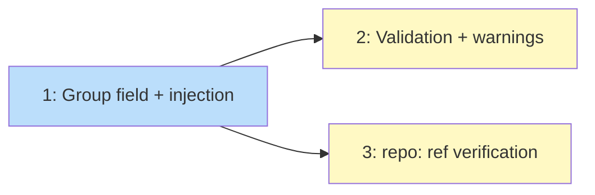

# PLAN: Explicit Repos

## Status

Draft

## Scope Summary

Support repos from outside source discovery via `[repos]` with `url` + `group`
fields. Explicit repos inject after classification and flow through the full
pipeline including `repo:` reference resolution.

## Decomposition Strategy

**Horizontal.** Config field first, then injection logic, then validation and
warning suppression.

## Issue Outlines

### 1. Add Group field and inject explicit repos

**Goal:** Add `Group string` to `RepoOverride`. Implement `InjectExplicitRepos`
that scans `[repos]` for entries with `url` + `group`, skips those already
discovered, and appends them to the classified list.

**Acceptance criteria:**
- `RepoOverride.Group` field (`string`, `toml:"group,omitempty"`)
- `InjectExplicitRepos(classified, repos, groups)` returns extended list
- Explicit repos create a `ClassifiedRepo` with synthetic `github.Repo`
  (name from key, clone URL from `url`, visibility inferred from group)
- Repos already in classified list (by name) are skipped (no duplicate)
- Called between Step 2 (classify) and Step 2.5 (warn unknown) in `runPipeline`
- Tests: explicit repo added, collision skipped, empty url+group ignored

**Dependencies:** None

**Complexity:** testable

### 2. Validation and warning suppression

**Goal:** Validate that `group` references a defined group. Suppress
"unknown repo override" warnings for repos with `url` set.

**Acceptance criteria:**
- Error if `group` doesn't match any key in `[groups]`
- Error if `group` is set but `url` is empty (and vice versa)
- `WarnUnknownRepos` skips repos where `URL != ""`
- Config parsing tests for valid and invalid group references
- Scaffold template updated with commented explicit repo example

**Dependencies:** <<ISSUE:1>>

**Complexity:** simple

### 3. Verify repo: reference resolution for explicit repos

**Goal:** Verify that `repo:` marketplace refs resolve correctly for repos
added via explicit entries (not discovered from sources).

**Acceptance criteria:**
- `repoIndex` built in Step 6.9 includes explicit repos
- `repo:tools/.claude-plugin/marketplace.json` resolves when `tools` is
  an explicit repo with `url` + `group`
- Test: explicit repo in repoIndex, marketplace resolution succeeds

**Dependencies:** <<ISSUE:1>>

**Complexity:** simple

## Dependency Graph

**Legend**: Blue = ready, Yellow = blocked

## Implementation Sequence

Issue 1 first (the core change). Issues 2 and 3 can be done in parallel after 1.
