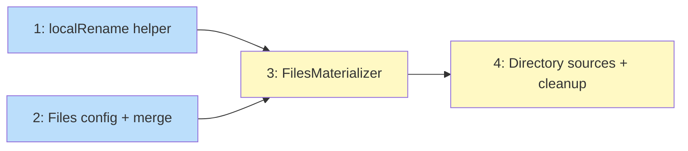

# PLAN: File Distribution

## Status

Draft

## Scope Summary

Implement the `[files]` section in workspace.toml for arbitrary file distribution
with `.local`-aware renaming, per-repo overrides, and cleanup on removal.

## Decomposition Strategy

**Horizontal.** Each issue builds one layer: config types, then the core materializer
with single-file support, then directory sources and cleanup. A fourth issue covers
the `.local` renaming helper independently since it has no dependencies and can be
tested in isolation.

## Issue Outlines

### 1. Add `localRename` helper

**Goal:** Implement and test the `localRename` function that inserts `.local` before
a file's extension.

**Acceptance criteria:**
- `localRename("design.md")` returns `"design.local.md"`
- `localRename("config.json")` returns `"config.local.json"`
- `localRename("script.sh")` returns `"script.local.sh"`
- `localRename("Makefile")` returns `"Makefile.local"` (no extension)
- `localRename(".eslintrc")` returns `".eslintrc.local"` (dotfile, no extension)
- Function is exported for use by FilesMaterializer
- Unit tests cover all cases above

**Dependencies:** None

**Complexity:** simple

### 2. Add files config and merge logic

**Goal:** Add `Files map[string]string` to `WorkspaceConfig` and `RepoOverride`.
Update `MergeOverrides` with source-key override semantics and empty-string removal.

**Acceptance criteria:**
- `WorkspaceConfig.Files` and `RepoOverride.Files` parse from TOML
- `MergeOverrides` merges workspace and repo files: repo wins per source key
- Empty string value in repo override removes the workspace-level mapping
- New keys in repo override are additive
- Scaffold template updated with commented `[files]` example
- Config parsing test with `[files]` section
- Merge tests for: override, removal, additive

**Dependencies:** None

**Complexity:** simple

### 3. Implement FilesMaterializer (single file)

**Goal:** New materializer that copies single files from the config directory to
repo directories with `.local` renaming when the destination is a directory.

**Acceptance criteria:**
- `FilesMaterializer` implements `Materializer` interface
- For each mapping in effective config:
  - Source path validated with `checkContainment`
  - If dest ends with `/`: copy file, auto-rename with `localRename`
  - If dest has explicit filename: copy file as-is
- Written files returned for instance.json tracking
- Added to pipeline in `apply.go` after existing materializers
- Tests: single file with dir dest (auto-rename), single file with explicit dest
  (no rename), path traversal rejection, empty config (noop)

**Dependencies:** <<ISSUE:1>> (localRename), <<ISSUE:2>> (config types)

**Complexity:** testable

### 4. Directory sources and cleanup

**Goal:** Support directory sources (trailing `/` on source key) that walk and copy
all files. Support cleanup of removed mappings on re-apply.

**Acceptance criteria:**
- Source ending with `/` walks the directory and copies each file individually
- Each file in the directory gets `.local` renaming (same rules as single file)
- Directory structure is preserved relative to the destination
- Removing a mapping from config and re-running apply deletes the previously
  installed files (cleanup via instance.json tracking)
- Tests: directory copy with multiple files, nested directory structure,
  removal cleanup, re-apply idempotency

**Dependencies:** <<ISSUE:3>> (FilesMaterializer)

**Complexity:** testable

## Dependency Graph

**Legend**: Blue = ready, Yellow = blocked

## Implementation Sequence

Issues 1 and 2 are independent and can be done in parallel. Issue 3 depends on
both and is the core integration point. Issue 4 extends issue 3 with directory
walking and cleanup.

Critical path: max(1, 2) -> 3 -> 4.

Suggested commit sequence:
1. Issue 1 (localRename helper + tests)
2. Issue 2 (config types + merge + tests)
3. Issue 3 (FilesMaterializer + pipeline integration)
4. Issue 4 (directory sources + cleanup)
5. Clean up wip/ artifacts before merge
