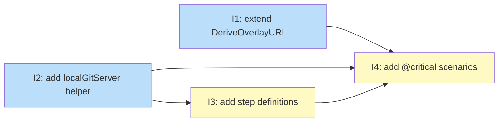

# PLAN: Functional tests for the critical path (init / create / apply)

## Status

Draft

## Scope Summary

Add e2e functional test coverage for the `niwa init`, `niwa create`, and `niwa apply`
critical path using local bare git repos (`file://` URLs) and the existing godog suite,
with five `@critical` scenarios that catch the two known v0.7.x regressions plus
idempotency and overlay env resolution.

## Decomposition Strategy

**Horizontal decomposition.** Each issue builds one complete layer before the next
begins: production code extension first, then test helper, then Gherkin step
definitions, then the feature file that uses them all. Components have clearly
defined interfaces (localGitServer API, godog step signatures) and stable boundaries,
making layer-by-layer the natural fit. Issues 1 and 2 have no mutual dependency and
can be implemented in parallel.

## Issue Outlines

### Issue 1: test(overlay): extend DeriveOverlayURL and OverlayDir for file:// URLs

**Goal**: Extend `DeriveOverlayURL` and `OverlayDir` in `internal/config/overlay.go`
to handle `file://` URLs so that convention overlay discovery works in functional
tests that use local bare git repos.

**Acceptance Criteria**:
- [ ] `DeriveOverlayURL("file:///path/to/ws.git")` returns `("file:///path/to/ws-overlay.git", true)`
- [ ] `DeriveOverlayURL("file:///path/to/ws")` returns `("file:///path/to/ws-overlay.git", true)`
- [ ] `DeriveOverlayURL` still returns `ok=false` for unrecognised inputs (no regression on existing cases)
- [ ] `OverlayDir` called with a `file://` overlay URL returns a path under `$XDG_CONFIG_HOME/niwa/overlays/` with a `file-` prefixed directory name derived from the last path component of the URL
- [ ] `OverlayDir` called with a `file://` URL whose last path component ends in `.git` strips the suffix before constructing the directory name (e.g. `ws-overlay.git` → `file-ws-overlay`)
- [ ] `TestDeriveOverlayURL` in `internal/config/overlay_test.go` includes at least two `file://` table entries (with `.git` suffix and without)
- [ ] A corresponding `TestOverlayDir` table entry (or new sub-test) covers the `file://` case
- [ ] `go test ./internal/config/...` passes with no failures

**Dependencies**: None

---

### Issue 2: test(functional): add localGitServer helper for offline git clone tests

**Goal**: Add a `localGitServer` helper to the functional test suite that creates
in-process bare git repos under the scenario sandbox and returns `file://` URLs for
offline clone tests.

**Acceptance Criteria**:
- [ ] `test/functional/localrepo_test.go` is created with `localGitServer` struct holding a `root string` field
- [ ] `newLocalGitServer(dir string) (*localGitServer, error)` creates the server root directory and returns a ready instance
- [ ] `Repo(name string) (fileURL string, err error)` runs `git init --bare <root>/<name>.git` and returns a `file://` URL
- [ ] `ConfigRepo(name, toml string) (fileURL string, err error)` creates a bare repo, clones it into a temp dir, writes `workspace.toml` with the given TOML body, commits it, pushes back, and returns a `file://` URL
- [ ] `testState` gains a `gitServer *localGitServer` field
- [ ] The godog Before hook initializes `gitServer` by calling `newLocalGitServer` with a subdirectory of the scenario sandbox
- [ ] All new code passes `go vet ./...`

**Dependencies**: None

---

### Issue 3: test(functional): add step definitions for local git repo setup and assertions

**Goal**: Implement the eight new Gherkin step definitions for local git repo setup
and filesystem outcome assertions, and register them in the godog suite.

**Acceptance Criteria**:
- [ ] `a local git server is set up` — creates a `localGitServer` in the scenario state
- [ ] `a config repo "name" exists with body: <TOML>` — calls `ConfigRepo`, stores URL in state keyed by name
- [ ] `a source repo "name" exists` — calls `Repo`, stores URL in state keyed by name
- [ ] `I run niwa init from config repo "name"` — runs `niwa init --from <url>` using the stored URL for the named config repo
- [ ] `I run niwa init from config repo "name" with overlay "overlay-name"` — runs `niwa init --from <url> --overlay <overlay-url>` using stored URLs
- [ ] `the instance "name" exists` — asserts that `<workspaceRoot>/<name>` is a directory
- [ ] `the instance "name" does not exist` — asserts that `<workspaceRoot>/<name>` is absent
- [ ] `the repo "group/repo" exists in instance "name"` — asserts that `<workspaceRoot>/<name>/<group>/<repo>` is a directory
- [ ] All eight step definitions are registered in `suite_test.go`'s `initializeScenario`
- [ ] Existing steps (`I run "niwa create"`, `I run "niwa apply"`, `the exit code is N`, `the error output contains "..."`) remain unchanged

**Dependencies**: Blocked by Issue 2

---

### Issue 4: test(functional): add @critical scenarios for init/create/apply critical path

**Goal**: Add five `@critical` Gherkin scenarios covering the init/create/apply
happy path, the -2 instance regression, orphan cleanup, overlay env resolution, and
apply idempotency.

**Acceptance Criteria**:
- [ ] Scenario 1 (init + create happy path) passes: exit 0, instance directory exists, both repo directories cloned
- [ ] Scenario 2 (create -2 instance succeeds) passes: regression for `ConfigSourceURL` bug; both `testws` and `testws-2` exist with the same repo layout
- [ ] Scenario 3 (failed create leaves no orphan directory) passes: exit non-zero, error output contains "required env keys", `testws` directory does not exist
- [ ] Scenario 4 (overlay-provided env key resolves on -2 instance) passes: both create runs exit 0 using convention overlay discovery
- [ ] Scenario 5 (apply is idempotent) passes: exit 0 and managed files (CLAUDE.local.md) re-written without error
- [ ] `make test-functional-critical` target runs and all five scenarios pass
- [ ] `make test-functional` confirms no regressions in existing scenarios

**Dependencies**: Blocked by Issues 1, 2, and 3

---

## Dependency Graph

**Legend**: Green = done, Blue = ready, Yellow = blocked, Purple = needs-design, Orange = tracks-design/tracks-plan

## Implementation Sequence

**Critical path**: Issue 2 → Issue 3 → Issue 4 (3 hops)

**Recommended order**:

1. Start Issues 1 and 2 in parallel — no dependencies between them.
2. Start Issue 3 once Issue 2 merges.
3. Start Issue 4 once Issues 1, 2, and 3 are complete.

**Parallelization**: Issues 1 and 2 are fully independent and can be worked
simultaneously. Issue 3 can begin as soon as Issue 2 is complete, even before
Issue 1 is done (Issue 4 is the only consumer of Issue 1).
