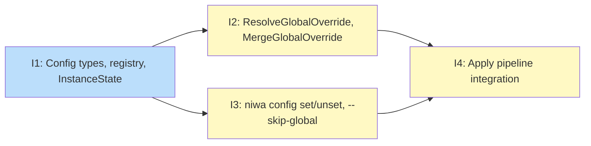

# PLAN: Global config

## Status

Draft

## Scope Summary

Implement the global config layer for niwa: a user-owned GitHub-backed config source that overlays workspace config at apply time, enabling personal hooks, env vars, plugins, managed files, and Claude instructions without modifying shared team repos.

## Decomposition Strategy

**Horizontal decomposition.** Four blocks with stable interfaces between them. Block 1 defines the foundation types and registry helpers that Blocks 2 and 3 depend on. Blocks 2 and 3 can be worked in parallel after Block 1 lands. Block 4 wires them together in the apply pipeline. The ordering is dictated by Go's type dependencies: merge functions and CLI commands both reference the types defined in Block 1.

## Issue Outlines

### Issue 1: feat(config): add GlobalOverride types, registry, and InstanceState flag

**Goal**: Add the foundational Go types, registry helpers, and state flag that the global config feature depends on.

**Acceptance Criteria**:
- [ ] `GlobalOverride` and `GlobalConfigOverride` types are defined in `internal/config/config.go` with the fields specified in the design (`Claude *ClaudeConfig`, `Env EnvConfig`, `Files map[string]string`, `Global GlobalOverride`, `Workspaces map[string]GlobalOverride`)
- [ ] `ParseGlobalConfigOverride` parses TOML into `GlobalConfigOverride` and rejects `Files` destination values containing `..` traversal or absolute paths
- [ ] `ParseGlobalConfigOverride` rejects `Env.Files` source paths containing `..` traversal or absolute paths (same logic as `validateContentSource`)
- [ ] `GlobalConfigSource` struct is defined in `internal/config/registry.go` with a single `Repo string` field; local path is derived at runtime, not stored
- [ ] `LoadGlobalConfig` reads machine-level config and returns the registered `GlobalConfigSource`; returns a zero value (not an error) when no global config is registered
- [ ] `SaveGlobalConfigTo` writes config to a given path with `0o600` file permissions
- [ ] `SkipGlobal bool` field is added to `InstanceState` in `internal/workspace/state.go` with JSON tag `skip_global,omitempty`
- [ ] Unit tests cover: successful parse round-trip for `ParseGlobalConfigOverride`; rejection of absolute path in `Files` destination; rejection of `..` traversal in `Files` destination; rejection of absolute path in `Env.Files` source; rejection of `..` traversal in `Env.Files` source
- [ ] `go test ./internal/config/... ./internal/workspace/...` passes
- [ ] `go vet ./...` reports no issues
- [ ] Must deliver: `GlobalOverride`, `GlobalConfigOverride` types importable from `internal/config` (required by Issue 2)
- [ ] Must deliver: `GlobalConfigSource`, `LoadGlobalConfig`, `SaveGlobalConfigTo`, `SkipGlobal` in `InstanceState` (required by Issue 3)

**Dependencies**: None

---

### Issue 2: feat(workspace): implement ResolveGlobalOverride and MergeGlobalOverride

**Goal**: Implement `ResolveGlobalOverride` and `MergeGlobalOverride` in `internal/workspace/override.go` to apply the global config layer on top of a workspace config baseline.

**Acceptance Criteria**:
- [ ] `ResolveGlobalOverride(g *config.GlobalConfigOverride, workspaceName string) config.GlobalOverride` is implemented in `internal/workspace/override.go`
- [ ] `MergeGlobalOverride(ws *config.WorkspaceConfig, g config.GlobalOverride, globalConfigDir string) *config.WorkspaceConfig` is implemented in `internal/workspace/override.go`
- [ ] `MergeGlobalOverride` does not mutate the input `ws`; it returns a new `*WorkspaceConfig`
- [ ] Claude.Hooks: global hooks are appended after workspace hooks; each global hook script path is resolved to an absolute path using `filepath.Join(globalConfigDir, script)` before merging
- [ ] Claude.Settings: global value wins per key when both workspace and global define the same key
- [ ] Claude.Env.Promote: both sets are unioned (no entries dropped from either source)
- [ ] Claude.Env.Vars: global value wins per key when both workspace and global define the same key
- [ ] Claude.Plugins: global plugins are added to workspace plugins, deduplicated; existing workspace plugins are never removed (union, not replace)
- [ ] Env.Files: global env files are appended after workspace env files
- [ ] Env.Vars: global value wins per key when both workspace and global define the same key
- [ ] Files: global value wins per key; an empty string global value suppresses the workspace mapping for that key
- [ ] `ResolveGlobalOverride` merges `[global]` and `[workspaces.<name>]` sections with workspace-specific values winning per field; returns the flat `[global]` section unchanged when no matching workspace entry exists
- [ ] Table-driven unit tests cover all field types listed above, including: hooks append with absolute path verification, Settings global-wins, Env.Promote union, Env.Vars global-wins, plugins union and deduplication, Env.Files append, Files global-wins, Files empty-string suppression
- [ ] `go test ./internal/workspace/...` passes
- [ ] Must deliver: `ResolveGlobalOverride` and `MergeGlobalOverride` callable from apply pipeline (required by Issue 4)

**Dependencies**: Blocked by Issue 1

---

### Issue 3: feat(cli): add niwa config set/unset global and --skip-global to init

**Goal**: Add the `niwa config set global`, `niwa config unset global`, and `niwa init --skip-global` commands that let users register, replace, and remove a global config repo and opt specific instances out of global config.

**Acceptance Criteria**:
- [ ] `internal/cli/config.go` defines `configCmd` as a command group with no `RunE`, registered under `rootCmd`
- [ ] `internal/cli/config_set.go` defines `configSetCmd` group and `configSetGlobalCmd` leaf accepting one positional argument (`<repo>`)
- [ ] `internal/cli/config_unset.go` defines `configUnsetCmd` group and `configUnsetGlobalCmd` leaf
- [ ] `runConfigSetGlobal` loads config via `config.LoadGlobalConfig()`, resolves the clone URL from `<repo>` using `workspace.ResolveCloneURL`, clones to `filepath.Join(xdgConfigHome, "niwa", "global")` via `workspace.Cloner{}`, updates `[global_config]` in `GlobalConfig`, and saves with `config.SaveGlobalConfigTo` at `0o600`
- [ ] Re-running `niwa config set global <repo>` when a global config is already registered silently replaces the registration and re-clones from the new URL
- [ ] If the specified repo is unreachable, `niwa config set global` fails with an error and the prior registration is preserved
- [ ] `runConfigUnsetGlobal` loads config, prints a message and exits cleanly if no global config is registered, otherwise calls `os.RemoveAll` on the clone directory, clears `[global_config]`, and saves config
- [ ] `niwa init` accepts a `--skip-global` flag; when provided, `SkipGlobal: true` is written to `.niwa/instance.json`
- [ ] Tests: registration stores the repo URL in `GlobalConfigSource`; unregistration removes the clone directory and clears the stored URL; `niwa init --skip-global` sets `SkipGlobal: true` in `InstanceState`
- [ ] `go test ./internal/cli/...` passes
- [ ] `go vet ./...` reports no issues
- [ ] Must deliver: `SkipGlobal` readable from `.niwa/instance.json` (required by Issue 4)
- [ ] Must deliver: `GlobalConfigSource.Repo` readable from machine config (required by Issue 4)

**Dependencies**: Blocked by Issue 1

---

### Issue 4: feat(workspace): integrate global config into apply pipeline

**Goal**: Wire the global config layer into the apply pipeline so that `niwa apply` syncs, parses, merges, and installs global config when registered, with zero behavior change when it is not.

**Acceptance Criteria**:
- [ ] `globalConfigDir` (derived from `$XDG_CONFIG_HOME/niwa/global`) is threaded into `apply.go` and `runPipeline`; the value is empty string when global config is not registered
- [ ] Step 2a: when `!SkipGlobal` and global config is registered, `SyncConfigDir(globalConfigDir)` is called before workspace config is loaded; a sync failure aborts apply with an error identifying the global config as the cause
- [ ] Steps 3a–3c: `GlobalConfigOverride` is parsed from `globalConfigDir`, `ResolveGlobalOverride` is called with the current workspace name, and `MergeGlobalOverride` produces an intermediate `*WorkspaceConfig` that is passed to `MergeOverrides` in place of the original `ws`
- [ ] Step 5c: `InstallGlobalClaudeContent(globalConfigDir, instanceRoot)` is called after `InstallWorkspaceContext`; `CLAUDE.global.md` is copied to the instance root and an `@import` directive is added to `CLAUDE.md`
- [ ] When `CLAUDE.global.md` does not exist in `globalConfigDir`, `InstallGlobalClaudeContent` returns `nil, nil` and apply continues without error
- [ ] `InstallGlobalClaudeContent` is implemented in `internal/workspace/workspace_context.go` following the same copy-then-import pattern as `InstallWorkspaceContext`
- [ ] When `SkipGlobal: true` is set on the instance, all steps 2a, 3a–3c, and 5c are skipped; the apply output is identical to a run with no global config registered
- [ ] When global config is not registered (no entry in machine config), all new steps are skipped without error
- [ ] `--allow-dirty` bypasses the dirty-state check for the global config repo in addition to the workspace config repo
- [ ] Integration test: apply with global config registered produces an effective config that reflects global hooks, env vars, and managed files merged according to the documented semantics
- [ ] Integration test: global hook scripts are copied to the instance and are executable after apply
- [ ] Integration test: an instance with `SkipGlobal: true` is unaffected by global config changes
- [ ] Integration test: a global config sync failure aborts apply and returns a non-zero exit code

**Dependencies**: Blocked by Issue 2, Issue 3

## Dependency Graph

**Legend**: Green = done, Blue = ready, Yellow = blocked, Purple = needs-design, Orange = tracks-design/tracks-plan

## Implementation Sequence

**Critical path**: Issue 1 → Issue 2 → Issue 4 (or Issue 1 → Issue 3 → Issue 4)

**Recommended order**:
1. Issue 1 — no dependencies; start here
2. Issues 2 and 3 — can be worked in parallel after Issue 1 merges
3. Issue 4 — start after both Issue 2 and Issue 3 are complete

**Parallelization**: After Issue 1 is merged, Issues 2 (merge functions) and 3 (CLI commands) are completely independent and can be implemented simultaneously on separate branches.
