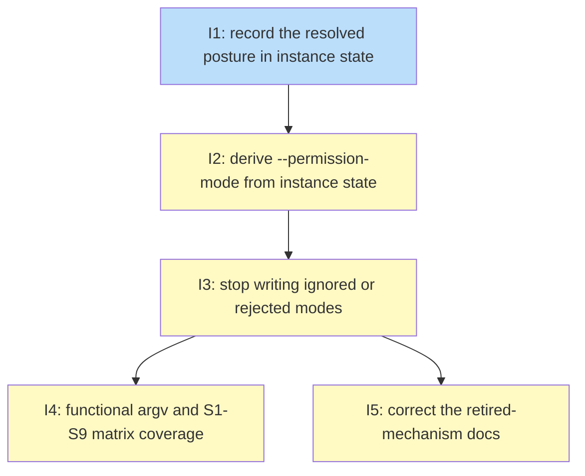

# PLAN: Inert defaultMode key

## Status

Active

## Scope Summary

Stop niwa writing Claude Code permission modes that don't take effect
(`bypassPermissions`) or that void the whole settings file (`askPermissions`).
Move `niwa dispatch`'s `--permission-mode` derivation off the materialized
settings file and onto a posture niwa records in its own instance state.

## Decomposition Strategy

**Horizontal decomposition.** This is a refactor of code that exists today: the
posture mapping, the instance pipeline, the dispatch derivation, and the tests
around them. The design names every interface the issues build on
(`instancePermissionsPosture`, `InstanceState.ClaudePermissions`,
`derivePermissionMode`, `buildDispatchPassthrough` with an explicit
permission-mode parameter, `claudeDefaultMode`), so there is no integration risk
for a walking skeleton to surface. Each issue implements one of the design's
five implementation phases.

The order is forced, not chosen, and it comes from two design decisions.

The first is that dispatch reads the posture from `.niwa/instance.json` rather
than from the generated settings file (design Decision 1). Today dispatch reads
`permissions.defaultMode` back out of the instance-root `.claude/settings.json`.
That's the value this plan stops writing. If the materializer changed first,
every dispatched bypass worker would lose `--permission-mode bypassPermissions`
in the window between the two changes, and the `@critical` dispatch scenarios
would go red. So the reader has to move before the producer changes. The reader
can't move until there's something to read, so the posture has to be recorded
first. That gives Issue 1 (record), then Issue 2 (move the reader), then Issue 3
(change the producer). Each of the three leaves `go test ./...` and
`make test-functional-critical` green on its own, which is what lets a single
PR be bisected.

The second is that coverage is organized by observable (design Decision 3). The
Go tests in Issues 1-3 pin single functions, byte comparisons, and the recorded
field. Two things can only be seen from outside the process: the argv a
launched worker actually receives, and the worktree document that
`niwa worktree create` writes through its own config path. Those need the
functional suite and the final materializer output, so they sit after Issue 3
as Issue 4. The documentation corrections in Issue 5 describe what the code
does after Issue 3, so they sit there too. Issues 4 and 5 don't depend on each
other.

Two smaller shape decisions also come from the design. The recorded value uses
niwa's own vocabulary (`bypass`, `ask`, or empty), and the resolver doesn't
validate, so Issue 1 builds against today's materializer without waiting on
Issue 3's mapping change. And `buildDispatchPassthrough` takes the permission
mode as an argument instead of reading a package global (design Decision 4), so
`niwa watch`'s two launch sites visibly pass `""`. That change travels with the
reader move in Issue 2, because both touch the same derivation code.

## Issue Outlines

### Issue 1: feat(workspace): record the resolved permission posture in instance state

**Goal**: Record the instance's resolved permission posture (`"bypass"`, `"ask"`, or empty) in `InstanceState` during every instance `Create` and `Apply`, without changing any generated settings document.

**Context**: The instance pipeline already holds the effective config (`effectiveCfg` from `ResolveAndMergeEffectiveConfig` in `runPipeline`), and the instance-root settings materializer reads its posture from `MergeInstanceOverrides(effectiveCfg)`. That's the PRD's precedence for the instance posture: the workspace overlay, then the workspace, then the personal overlay, then `[instance.claude.settings]`. Per-repo overrides don't affect it. The pipeline already carries facts into state through `pipelineResult`, and `Create` and `Apply` copy `result.shadows` and `result.trustKeys`; this adds one more. Validation stays in the materializer, which rejects an invalid value before state is saved. Every state file the instance pipeline writes records the posture. A multi-instance workspace root's state file, written by `niwa init` and `saveWorkspaceRootDisclosures` outside the pipeline, doesn't. In the single-instance layout (no child instances), `niwa apply` runs the instance pipeline on the workspace root, so the root's state file is the instance's and records it. Issue 3's same-run reconcile scenario depends on that.

**Acceptance Criteria**:
- [x] `InstanceState` in `internal/workspace/state.go` has a field `ClaudePermissions string` with JSON tag `json:"claude_permissions,omitempty"`. Its doc comment says it holds the declared posture the instance-root settings document resolved from (`"bypass"`, `"ask"`, or empty), that it's niwa's own record rather than a Claude Code mode string, and that only `niwa dispatch` reads it, for the instance it just provisioned.
- [x] A new function `instancePermissionsPosture(cfg *config.WorkspaceConfig) string` in `internal/workspace`, in a new file beside `materialize.go`, reads `MergeInstanceOverrides(cfg).Claude.Settings["permissions"]` through `maybeSecretString`. It returns `"bypass"` or `"ask"` when the value is exactly one of those, and `""` otherwise, including when the key is absent. It never returns any other string and it doesn't return an error.
- [x] Unit tests for `instancePermissionsPosture` show it returns `""` for an absent key, `""` for an unrecognized value such as `"bypassPermissions"`, `"bypass"` and `"ask"` for those literals, and the `[instance.claude.settings]` value when it and the workspace `[claude.settings]` value differ.
- [x] Workspace-overlay precedence: a unit test builds the effective config with `MergeWorkspaceOverlay` (`internal/workspace/override.go`) and passes it to `instancePermissionsPosture`. An overlay declaring `bypass` under a workspace declaring `ask` yields `"ask"`. An overlay declaring `bypass` under a workspace that declares nothing yields `"bypass"`.
- [x] `pipelineResult` in `internal/workspace/apply.go` has a `claudePermissions string` field. `runPipeline` fills it from `instancePermissionsPosture(effectiveCfg)` and returns it in the same `pipelineResult` literal that sets `shadows` and `trustKeys`.
- [x] Both `Create` and `Apply` set `ClaudePermissions: result.claudePermissions` in the `InstanceState` they build, at the sites that copy `result.shadows` and `result.trustKeys`. `Apply` takes the value from the current run's result, never from `existingState`.
- [x] Go tests run a real `Applier.Create` in a temporary workspace (following `TestApplyPersistsShadowsInState` in `internal/workspace/apply_vault_test.go`), load the result with `workspace.LoadState(instanceRoot)`, and check `ClaudePermissions` for each of these declarations:
  - workspace `[claude.settings] permissions = "bypass"` records `"bypass"`
  - workspace `permissions = "ask"` records `"ask"`
  - no declaration records `""`, and the raw `instance.json` contains no `claude_permissions` key
  - workspace `bypass` with `[instance.claude.settings] permissions = "ask"` records `"ask"`
  - workspace `ask` with `[instance.claude.settings] permissions = "bypass"` records `"bypass"`
  - workspace `bypass` with `[repos.<name>.claude.settings] permissions = "ask"` records `"bypass"` (per-repo overrides don't affect the instance posture)
  - no workspace declaration, with a personal overlay (`applier.GlobalConfigDir` set to a directory whose `niwa.toml` declares `permissions = "bypass"` for the workspace) records `"bypass"`
  - workspace `bypass` with a personal overlay declaring `ask` records `"ask"`
- [x] A Go test runs `Create` with workspace `bypass`, then changes the declaration to undeclared and runs `Apply` on the same instance. The reloaded state then records `""`. The value is recomputed on every apply and never carried over from earlier state.
- [x] Every settings document is byte-identical to before this change: `internal/workspace/materialize.go`'s permission mapping is unmodified, no file under `internal/workspace/testdata/characterization/` changes, and the characterization test passes without regenerating goldens.
- [x] Only the instance pipeline writes the field: no code outside the `Create`/`Apply` state construction sets `ClaudePermissions`, and `git grep -n ClaudePermissions -- internal/workspace` shows only the field definition, the two copy sites, and tests. The workspace-root state built by `buildInitState` in `internal/cli/init.go` and by `saveWorkspaceRootDisclosures` in `internal/workspace/apply.go` doesn't set it.
- [x] A state file written by an older binary, without a `claude_permissions` key, loads through `LoadState` with no error and an empty `ClaudePermissions`.
- [x] Must deliver: `InstanceState.ClaudePermissions`, set by both `Create` and `Apply` to exactly `"bypass"`, `"ask"`, or `""`, persisted under the JSON key `claude_permissions` in `.niwa/instance.json`, and readable through `workspace.LoadState` (required by Issue 2).
- [x] `go test ./...` and `make test-functional-critical` pass.

**Dependencies**: None

**Type**: code

### Issue 2: refactor(dispatch): derive --permission-mode from instance state and pass it explicitly to the argv builder

**Goal**: Make `niwa dispatch` derive `--permission-mode bypassPermissions` from the posture recorded in the instance's `.niwa/instance.json` rather than from the generated `.claude/settings.json`, and pass the permission mode to `buildDispatchPassthrough` as an explicit argument so `niwa watch` visibly passes none.

**Context**: Right now `runDispatch` (`internal/cli/dispatch.go`, the "(9a-derive)" block) reads the instance-root `.claude/settings.json` back through `readInstanceSettings` and checks `inst.Permissions.DefaultMode == "bypassPermissions"`. Issue 3 stops writing that value, and a hand-edited or deleted settings file can grant or withhold bypass. The derived value also goes into the package global `dispatchPermissionMode`, which `buildDispatchPassthrough` reads implicitly. `niwa watch` calls the same builder at two sites (the fresh review in `stageReview` and the `--resume` continuation), and those get an empty value only because nothing in a watch process sets the global. The materializer still writes the old values after this issue, so dispatch behavior doesn't change; only the derivation's input does.

**Acceptance Criteria**:

Derivation and state load:
- [x] `runDispatch` loads the dispatched instance's state with `workspace.LoadState(instancePath)` and passes `state.ClaudePermissions` to `derivePermissionMode`. The "(9a-derive)" block no longer references `inst.Permissions`, and no permission value is read from any `.claude/settings.json` on the dispatch path.
- [x] `derivePermissionMode(explicit, recorded string, flags agentplan.LaunchFlags) (mode string, derived bool)` returns `(explicit, false)` when the operator's value is non-empty. Otherwise it returns `("bypassPermissions", true)` exactly when `flags.PermissionMode == "--permission-mode"` and `recorded == "bypass"`, and `("", false)` otherwise. A table-driven unit test covers explicit plus `bypass`, explicit plus empty, `bypass` with Claude flags, `ask`, `""`, an unrecognized recorded value, and `bypass` with the Codex launch flags. The Codex case returns `("", false)`.
- [x] When `derived` is true, dispatch still prints the existing stderr notice that the flag was derived. The notice wording no longer names Claude Code 2.1.258 or the settings file as the source.
- [x] Broken-state handling is tested on a bypass instance, so a derivation that never forwards the flag can't pass. Each of three tests materializes S1 (`permissions = "bypass"` in the workspace `[claude.settings]`) through a real `Applier.Create`, and first asserts that the state records `claude_permissions: "bypass"` and that the unbroken derivation path yields `--permission-mode bypassPermissions`. It then breaks `.niwa/instance.json` one way: removing it, setting its permissions to 0000 (skipped when running as root), or overwriting it with invalid JSON. After the break, the dispatch derivation path prints a stderr warning that contains the state file's path, forwards no `--permission-mode`, and doesn't fail.
- [x] On the same broken S1 instance, an explicit `--permission-mode acceptEdits` still produces exactly one `--permission-mode` on the argv, with the value `acceptEdits`.
- [x] `runDispatch` no longer assigns to `dispatchPermissionMode`. `git grep -n 'dispatchPermissionMode' -- internal/cli ':!*_test.go'` returns only the Cobra flag binding, the variable declaration, and the single read in `runDispatch` that passes the operator's value to `derivePermissionMode`.

Argv builder and watch:
- [x] `buildDispatchPassthrough` has the signature `(flags agentplan.LaunchFlags, slug, model, permissionMode string) []string` and doesn't read `dispatchPermissionMode`. The dispatch call site passes the derived mode. Both call sites in `internal/cli/watch.go` (fresh review and `--resume` continuation) pass the literal `""`. The test caller in `internal/cli/dispatch_wiring_remotecontrol_test.go` is updated.
- [x] Unit-level watch argv test: materialize S1 through a real `Applier.Create` and confirm the instance's `.niwa/instance.json` records `claude_permissions: "bypass"`. Then assert that the argv from watch's fresh-review launch and from its continuation launch contains no `--permission-mode`. The test must fail if either watch site is changed to call `derivePermissionMode` or to read `ClaudePermissions`. Build the argv through the same function or seam the production watch code uses, not a copy. Extracting a small helper from each watch site to make that possible is in scope.

Tamper test:
- [x] Case one: materialize S3 (undeclared) through a real `Applier.Create` in a temporary workspace (the existing `internal/cli` tests that build a real workspace through `Applier.Create` are a usable model). Overwrite the instance-root `.claude/settings.json` with `{"permissions":{"defaultMode":"bypassPermissions"}}`, run the derivation path used by `runDispatch` (state load plus `derivePermissionMode` plus `buildDispatchPassthrough`), and assert the argv contains no `--permission-mode`.
- [x] Case two: materialize S1 through a real `Applier.Create`, delete the instance-root `.claude/settings.json`, run the same path, and assert the argv contains `--permission-mode bypassPermissions` exactly once.

Test rewrite:
- [x] The seven tests in `internal/cli/dispatch_permissionmode_test.go` that hand-write a `.claude/settings.json` are replaced with tests whose posture comes from a `workspace.toml` declaration run through real materialization. At minimum this covers S1 (flag derived), S1 with explicit `--permission-mode acceptEdits` (exactly one `--permission-mode`, value `acceptEdits`, no `bypassPermissions`), S2 and S3 (no `--permission-mode`), Codex under S1 (no `--permission-mode`), and S1 with remote control on (argv carries both `--permission-mode bypassPermissions` and the remote-control `--settings` pair, and keep-alive resolution is unchanged).
- [x] Across `internal/cli`, no test that asserts on a forwarded `--permission-mode` gets its posture from a hand-written settings document, apart from the tamper cases. A test whose fake provisioner writes `instance.json` with `claude_permissions` set by hand, with no real materialization, doesn't count as declaration-driven for this criterion.
- [x] Every fake `provisionInstanceFunc` in the dispatch unit tests (`internal/cli/dispatch_test.go`, `internal/cli/dispatch_wiring_remotecontrol_test.go`, and any other test that drives `runDispatch`) writes a minimal valid `.niwa/instance.json`, so the missing-state warning doesn't fire in tests that aren't about the posture. A test that isn't about the posture doesn't assert on the warning's absence to pass.

Static checks and removals:
- [x] A Go test scans the non-test sources under `internal/` and asserts that `ClaudePermissions` is read in exactly one place outside `internal/workspace`: the load site in `runDispatch`. Nothing in `internal/cli/watch.go` or `internal/watch` references it. The scan also asserts that no code copies `ClaudePermissions` from existing state, including the `workspace.SaveState(workspaceRoot, ...)` path in `internal/cli/init.go` and the `LoadState(workspaceRoot)` read in `internal/cli/effective_name.go`. The writes Issue 1 added in `internal/workspace` (the pipeline carry and the Create and Apply copies) are the allowed writers.
- [x] A comment at the `runDispatch` load site says the recorded value is trusted only for the instance this process just provisioned, and that code needing an existing instance's posture must re-resolve it from configuration.
- [x] The `Permissions` field is removed from `instanceSettings` in `internal/cli/dispatch_plugins.go`. The struct's doc comment no longer lists "permissions", and the `readInstanceSettings` doc comment no longer points at `internal/workspace/permissions.go`. `readInstanceSettings` stays and still serves plugin prewarm, remote control, and keep-alive.
- [x] `internal/workspace/permissions.go` and `internal/workspace/permissions_test.go` are deleted, and `git grep -n WorkerPermissionMode -- '*.go'` returns nothing. The one current design document that still names it is corrected by Issue 5; PRDs and archived designs keep their historical text.

Re-entry:
- [x] Tests assert that each of the four re-entry surfaces for a Claude dispatch produces `claude attach <handle>` with no further arguments, where `<handle>` equals the handle recorded for the dispatched session. The four surfaces are dispatch's final attach (the `reentryArgs` call in `dispatch.go`), the printed attach hint (`reentryHints`), the attach-failure fallback (`reentryCommand` in the fallback branch of `dispatch.go`), and the `niwa list` resume column (`sessionResumeCommand` in `internal/cli/list.go`). Each test runs under a `bypass` materialization, so a future change that appends a permission flag to re-entry fails the test. Existing tests in `internal/cli/dispatch_reentry_test.go` and `internal/cli/list_test.go` can be extended rather than duplicated.

Behavior unchanged:
- [x] The existing `@critical` scenarios in `test/functional/features/dispatch.feature` for the derived flag and the explicit flag pass unmodified.
- [x] `go test ./...` and `make test-functional-critical` pass.
- [x] Must deliver: a dispatch derivation that reads no permission value from any generated settings document, so the materializer's output can change without changing what dispatch forwards (required by Issue 3). This issue verifies the "before" half: the tamper tests and the declaration-driven S1 tests pass against today's materializer. Issue 3 verifies the "after" half by running the same tests, unedited, after its materializer change.

**Dependencies**: Blocked by <<ISSUE:1>>

**Type**: code

### Issue 3: fix(workspace): stop writing permission modes Claude Code ignores or rejects

**Goal**: Make `buildSettingsDoc` write no `permissions.defaultMode` for `bypass` and `default` for `ask`, reject invalid values with an error that doesn't leak secrets, and bring every test and golden that pinned the old bytes in line with the PRD's expected-value table.

**Context**: `permissionsMapping` in `internal/workspace/materialize.go` maps `bypass` to `bypassPermissions`, which Claude Code 2.1.257 and later ignores from project scope and then downgrades to `default`, overriding the developer's own mode. It maps `ask` to `askPermissions`, which was never a valid mode, so Claude Code throws out the whole file, including the hooks, deny rules, and plugins niwa writes into `ask` scopes and the sandbox and guard hooks `niwa watch` merges into an `ask` instance root. All four generated documents go through `buildSettingsDoc`: the instance-root `.claude/settings.json`, each repo's `.claude/settings.local.json`, each worktree's `.claude/settings.local.json`, and the workspace-root `.claude/settings.json` (via `writeRootSettings` in `internal/workspace/root_materializer.go`). This issue changes what's written, not which config inputs each document resolves from. The three errors in `buildSettingsDoc` echo their resolved value today, so a `vault://`-backed plaintext can reach plain `fmt.Errorf` text the pipeline's redactor never scrubs. `claudeDefaultMode` takes a plain string and can't tell whether the value was secret-backed, so `buildSettingsDoc`, which holds the original `MaybeSecret`, formats the message. The PRD's S1-S9 expected-value table and its AC12, AC13, AC14, AC16, and AC19 are the test oracle.

**Acceptance Criteria**:

Mapping and errors:
- [ ] `permissionsMapping` no longer exists (`git grep -n permissionsMapping` returns nothing). In its place, `internal/workspace/materialize.go` has `claudeDefaultMode(posture string) (mode string, write bool, err error)`, which returns `("", false, nil)` for `"bypass"`, `("default", true, nil)` for `"ask"`, and a non-nil error for any other input. Its doc comment explains why `bypass` writes nothing: the posture reaches dispatched workers on the `--permission-mode` flag. The error it returns doesn't contain its input string.
- [x] `buildSettingsDoc` adds `permissions.defaultMode` only when `claudeDefaultMode` reports `write == true`. The worktree-delegation `deny` entries still go into the same `permissions` map and coexist with `defaultMode: "default"`. `permissions` is left out of the document when the map ends up empty. One unit test covers `bypass` plus unsupported delegation (only `deny` is present) and another covers `ask` plus unsupported delegation (both `deny` and `defaultMode: "default"` are present).
- [x] The invalid-value error that `buildSettingsDoc` returns names `bypass` and `ask`. For a plain value, it quotes that value. For a secret-backed value (`MaybeSecret.IsSecret()` true), it names the config key and the secret's `Origin()` and never includes the resolved plaintext. The test calls `buildSettingsDoc` (or a materializer that calls it), not `claudeDefaultMode` directly, with a secret-backed invalid value carrying a distinctive plaintext, and asserts that the plaintext is absent from `err.Error()` and that the origin is present. A second test passes a plain invalid value and asserts that it's quoted.
- [x] The parse errors for `config.RemoteControlAtStartupKey` and `config.KeepAliveOnDispatchKey` in `buildSettingsDoc` use the same secret-safe form. For each key, a unit test passes a secret-backed unparseable value through `buildSettingsDoc` and asserts that its plaintext is absent from the error while the key name is present. The existing plain-value tests in `materialize_remotecontrol_test.go` and `materialize_keepalive_test.go` still pass.

Document matrix (Go level):
- [x] AC12: at each of the four locations (workspace root, instance root, a repo, and a worktree), a test materializes S2 (workspace `ask`) and S3 (undeclared) and asserts that the S2 document parsed as JSON equals the S3 document plus `permissions.defaultMode: "default"`, with every other key identical. Hooks and plugins are configured in the fixture, so identical documents can't pass the test just by being empty.
- [x] AC13 re-apply repair: a test materializes a multi-instance workspace (a workspace root plus one created instance with two repos, A and B) under S4, that is, workspace `bypass` with `[repos.A.claude.settings] permissions = "ask"`. It then overwrites four documents with pre-change content:
  - the workspace-root `settings.json` with `defaultMode: "bypassPermissions"` (its cell is none)
  - the instance-root `settings.json` with `defaultMode: "bypassPermissions"` (none)
  - repo A's `settings.local.json` with `defaultMode: "askPermissions"` (`default`)
  - repo B's `settings.local.json` with a hand-set `defaultMode: "plan"` (none)

  It runs apply from the workspace root through the path `niwa apply` takes there (the `runApplyAtRoot` helper in `internal/cli/apply_test.go` drives it: workspace-root materialization, then each instance's `Apply`). For each of those four documents, by name, the test asserts three things: the seeded value is gone, `permissions.defaultMode` matches the expected cell, and every other key equals the same document from a fresh materialization of the same config in a separate directory.
- [x] AC14: at each of the workspace, `[instance.claude.settings]`, `[repos.<name>.claude.settings]`, and personal-overlay levels, declaring `permissions = "bypassPermissions"`, `"auto"`, or `"acceptEdits"` makes apply fail with an error that contains both `bypass` and `ask`. The test also asserts that no settings document on disk afterward carries the invalid value.
- [x] Recorded posture agreement: for each of S1-S9, a test runs a real `Applier.Create` and asserts that the `ClaudePermissions` value saved to `.niwa/instance.json` (`"bypass"`, `"ask"`, or empty) is the posture that produced the instance-root document's `permissions.defaultMode` cell: absent for `bypass` and undeclared, `default` for `ask`. Issue 1 delivers the field; if it's missing when this issue starts, stop and report it rather than redefining it here.
- [x] AC16: for each of S1, S2, and S3, a test runs a real materialization, calls `ApplyReviewSettings` from `internal/watch/containment.go` in both the operator-approval posture and the hard-deny posture, and asserts that `VerifyReviewSettings` passes each time. After operator-approval, the instance root has `permissions.defaultMode: "default"`. After hard-deny, it has the table's value: absent for S1 and S3, `default` for S2. `internal/watch/containment.go` has no non-comment changes in this issue.
- [x] AC19 parse test: a unit test parses `permissions = "bypass"` and `permissions = "ask"` without error at the workspace `[claude.settings]`, `[instance.claude.settings]`, `[repos.<name>.claude.settings]`, and personal-overlay (`ParseGlobalConfigOverride` / `[global.claude.settings]` and `[workspaces.<name>.claude.settings]`) levels.

Dispatch unaffected by the flip:
- [x] The tamper tests (both cases) and the declaration-driven S1 dispatch tests that Issue 2 added pass after this issue's materializer change with no edit to those tests; `git diff` of this issue shows no change to them.

Existing tests and goldens:
- [x] Every Go test that asserted `bypassPermissions` or `askPermissions` as a written value now asserts the new value: `internal/workspace/materialize_test.go` (including `TestSettingsMaterializerAskPermissions`, which now expects `default`), `root_materializer_test.go`, `apply_test.go`, `materialize_worktree_test.go`, and `worktree_secret_ref_test.go`. Each keeps its original subject (hooks, deny rules, or secret resolution) and its assertions on that subject. A `bypass` case asserts that `defaultMode` is absent, not just that it isn't `bypassPermissions`. After this issue, `git grep -n -E 'bypassPermissions|askPermissions' -- internal/workspace` matches only negative assertions and comments.
- [ ] The characterization goldens under `internal/workspace/testdata/characterization/` are regenerated with `NIWA_UPDATE_CHARACTERIZATION=1 go test ./internal/workspace/ -run Characterization`. The PR description says the live bytes printed on mismatch were reviewed and that the only content change is the `permissions.defaultMode` value.

Same-run reconcile regression scenario:
- [x] The `@critical` scenario "niwa apply reconciles a settings change from the source on the same run" in `test/functional/features/workspace-config-sources.feature` keeps its `workspace.toml` bodies byte-for-byte unchanged and gains no `niwa create` step. The scenario creates no child instance, so `niwa apply` treats the workspace root as the sole instance and the root's `.niwa/instance.json` is that instance's state file. The existing final step (`the file ".claude/settings.json" under the workspace root contains "bypassPermissions"`) is replaced with three assertions:
  - after the first `niwa apply` and before the force-push: the workspace root's `.niwa/instance.json` has no `claude_permissions` key
  - after the single `niwa apply` that follows the push: that same file records `claude_permissions` as `"bypass"`
  - after that apply: the workspace root's `.claude/settings.json` parses as JSON and has no `permissions.defaultMode`

  If no step definition exists for reading a key from a state file, this issue adds one. It reads the path it's given, so the scenario names the workspace root explicitly.
- [x] No functional scenario's `workspace.toml` body changes in this issue (`git diff` over `test/functional/features/` touches only step lines).
- [x] Must deliver: materializer output matching the PRD's S1-S9 expected-value table at all four locations, so the functional document matrix can assert each cell (required by Issue 4).
- [x] Must deliver: materializer behavior where `bypass` writes no `permissions.defaultMode`, `ask` writes `default`, and invalid values fail naming `bypass` and `ask`, so the corrected docs describe what the code does (required by Issue 5).
- [x] `go test ./...` and `make test-functional-critical` pass.

**Dependencies**: Blocked by <<ISSUE:2>>

**Type**: code

### Issue 4: test(functional): cover dispatch argv and the S1-S9 document matrix end to end

**Goal**: Cover the dispatch argv and the S1-S9 settings-document matrix end to end in the functional suite, so a broken derivation or materializer change fails a scenario run against the real binary.

**Context**: The Go tests pin single functions and byte comparisons. Two things can only be seen from outside the process: the argv the launched worker gets, recorded by the functional suite's fake `claude` (to `$HOME/dispatch-launch-argv`) and fake `codex` (to `$HOME/dispatch-codex-argv`), and the worktree document that `niwa worktree create` writes, which resolves through its own config path and skips the personal overlay. Every scenario takes its posture from a real `workspace.toml` or personal overlay, never from a hand-written settings file. The anchors exist today: the two `@critical` permission-mode scenarios in `dispatch.feature`, the claude and codex argv steps, `a personal overlay exists with body:` (writes `$HOME/.config/niwa/global/niwa.toml`), `I call niwa worktree create for repo "..." with purpose "..." in instance "..."`, and `[global].remote_control_on_dispatch` in the host `config.toml`. Three steps are missing and this issue adds them: one that appends a `[global]` body to the sandboxed host `config.toml` (it must append, because `niwa init` writes the workspace registry into the same file), one that counts how many times a fragment appears in the recorded claude argv, and one that reads a generated settings document's `permissions.defaultMode`.

**Acceptance Criteria**:

Dispatch argv, in `test/functional/features/dispatch.feature`:
- [x] The existing `@critical` scenario "dispatch derives --permission-mode from a bypass-declared workspace" (S1: workspace `bypass`, `niwa dispatch <task> --detach`, no permission flag) is still present, still tagged `@critical`, and still asserts the argv contains `--permission-mode bypassPermissions`.
- [x] A new S1 scenario sets `[global]` `remote_control_on_dispatch = true` in the host config through the new host-config step. It asserts the argv contains `--permission-mode bypassPermissions`, `--settings`, and `remoteControlAtStartup`.
- [x] The existing explicit-flag scenario (S1 with `--permission-mode acceptEdits`) keeps its current assertions and gains one: `--permission-mode` appears exactly once in the recorded argv. Its `workspace.toml` body is unchanged.
- [x] A scenario for S2 (workspace `ask`) dispatched with `--permission-mode bypassPermissions` asserts `--permission-mode bypassPermissions` appears in the argv, and `--permission-mode` appears exactly once.
- [x] Scenarios for S3, S5, and S7 each assert the argv doesn't contain `--permission-mode`. S3 is undeclared. S5 is workspace `bypass` with `[instance.claude.settings]` `permissions = "ask"`. S7 is workspace `ask` with `[repos.<name>.claude.settings]` `permissions = "bypass"`. Each override is written in the config repo's `workspace.toml` body, not in a settings file.
- [x] Scenarios for S4 and S6 each assert the argv contains `--permission-mode bypassPermissions`. S4 is workspace `bypass` with a repo `[repos.<name>.claude.settings]` `permissions = "ask"`. S6 is workspace `ask` with `[instance.claude.settings]` `permissions = "bypass"`. The S4 and S7 fixtures declare the named repo in `workspace.toml`.
- [x] Scenarios for S8 and S9 declare their personal-overlay posture through `a personal overlay exists with body:`, under `[global.claude.settings]` or `[workspaces.<name>.claude.settings]`. S8 is undeclared workspace plus personal overlay `bypass`, and its argv contains `--permission-mode bypassPermissions`. S9 is workspace `bypass` plus personal overlay `ask`, and its argv doesn't contain `--permission-mode`.
- [x] A scenario for S1 dispatched with `--harness codex`, no permission flag, and the existing fake codex asserts the recorded codex argv contains neither `--permission-mode` nor `--sandbox`.
- [x] None of the new dispatch scenarios gets its posture from a hand-written `.claude/settings.json`, `.claude/settings.local.json`, or `.niwa/instance.json`. Every posture comes from a config repo body or a personal overlay body run through `niwa init`.

Document matrix, in a new feature file under `test/functional/features/`:
- [x] A new step definition takes a document location (workspace root, instance root, a named repo in an instance, or the last worktree) and an expected value, where `none` means absent. It fails when the file is missing, when it doesn't parse as JSON, when `permissions.defaultMode` differs from the expected value, and, for `none`, when the key is present. The four files are the workspace-root `.claude/settings.json`, the instance-root `.claude/settings.json`, the repo's `.claude/settings.local.json`, and the worktree's `.claude/settings.local.json`.
- [x] A Scenario Outline runs one row per scenario, S1 through S9. Each row runs `niwa init` from a config repo, then `niwa create`, then `niwa worktree create` against a repo. The fixture declares two repos: the one that carries the per-repo override in S4 and S7, and one with no override. The worktree is created in the repo that carries the override.
- [x] Before any value check, each row asserts that all four settings documents exist and parse as JSON.
- [x] Each row then asserts the workspace root, instance root, both repo documents, and the worktree document against the expected-value table. S1, S3, and S8 are none everywhere. S2 is `default` everywhere. S4 is none at both roots, `default` for the override repo and its worktree, and none for the other repo. S5 is `default` at both roots and none for the repos and the worktree. S6 is none at both roots and `default` for the repos and the worktree. S7 is `default` at both roots, none for the override repo and its worktree, and `default` for the other repo. S9 is none at the workspace root and `default` at the instance root and for both repos.
- [x] For S1 through S8 the worktree cell is checked right after `niwa worktree create`, with no apply in between. For S9 an instance `niwa apply` runs after `niwa worktree create`, and then the worktree document is asserted to be `default`.
- [x] Across every document the outline checks, the new step (or a companion assertion) fails if `permissions.defaultMode` is `bypassPermissions`, `auto`, or `askPermissions`, or is any value outside `default`, `acceptEdits`, `plan`, and `dontAsk`.
- [x] Only the S1 row is tagged `@critical`, for example by putting S1 in its own tagged `Examples` block. S2 through S9 run only in the full functional suite.

Compatibility and suite health:
- [x] No `workspace.toml` body in a functional scenario that existed before this issue changes. `git diff` on the pre-existing feature files shows only added scenarios and added assertion steps, with no edited line inside an existing config-repo docstring.
- [x] `make test-functional-critical` and the full functional suite pass.

**Dependencies**: Blocked by <<ISSUE:3>>

**Type**: code

### Issue 5: docs: correct the documents that describe the retired permission mechanism

**Goal**: Correct the seven committed documents that still describe the materialized `permissions.defaultMode` as the route to bypass, so they describe the `--permission-mode` dispatch flag instead.

**Context**: Several committed documents still say the settings file carries the posture, that a root-level bypass applies to every session at the root, or that the break came in 2.1.258. The real version is 2.1.257. This issue corrects them and the comment block above the permission-mode scenarios in the functional feature file. Archived designs and existing PRDs are historical records and are not edited. The PRD's R15 and AC18 list the documents.

**Acceptance Criteria**:
- [x] `docs/guides/file-distribution.md` does not contain "maps to Claude Code's", and its trust-prompt section states that `bypass` reaches dispatched workers through `niwa dispatch`.
- [x] `docs/guides/ephemeral-session-instances.md` does not contain the phrase "applies to **every** session launched at the root", checked with line breaks collapsed to spaces (the current text wraps the phrase across two lines, so a single-line grep misses it).
- [x] `docs/guides/ephemeral-session-instances.md` contains `--permission-mode`, and states that sessions a developer starts at the root, including ephemeral workers, get the developer's own settings, with `--permission-mode` on the developer's own launch as the route to bypass.
- [x] `docs/designs/current/DESIGN-workspace-root-claude.md` contains "superseded" inside the "Decision 2: Settings file for non-git instance root" section, next to the "`settings.json` with `bypassPermissions`: works in non-git" experimental finding.
- [x] `docs/designs/current/DESIGN-mcp-root-instance-distribution.md` contains "2.1.257", recording in or next to "Decision 5: MCP trust prompt" that the decision rested on behavior Claude Code 2.1.257 removed.
- [x] `docs/designs/current/DESIGN-agent-capability-contract.md` contains `--permission-mode`, noting next to the `permissionsMapping` / `permissions.defaultMode` passage that Claude's posture now travels on the dispatch flag.
- [x] `docs/designs/current/DESIGN-dispatch-permission-mode.md` does not contain "2.1.258" (all seven current occurrences corrected to 2.1.257).
- [x] `docs/designs/current/DESIGN-dispatch-permission-mode.md` contains "superseded", recording that its R5 ("reads the already-materialized `.claude/settings.json`, never `workspace.toml` directly") is superseded by R3 of `docs/prds/PRD-inert-defaultmode-key.md`.
- [x] The passage in `docs/designs/current/DESIGN-dispatch-permission-mode.md` that names `WorkerPermissionMode` states that the function was removed and that dispatch reads the recorded posture from instance state.
- [x] `test/functional/features/dispatch.feature` does not contain "2.1.258"; the comment block above the permission-mode scenarios names 2.1.257 and describes the derivation as reading the declared posture rather than the materialized settings file.
- [x] This issue's own changes to `test/functional/features/dispatch.feature` touch only comment lines. Scenarios Issue 4 adds to the same file are outside this check.
- [x] No file under `docs/designs/archive/` or `docs/prds/` is modified by this issue.

**Dependencies**: Blocked by <<ISSUE:3>>

**Type**: docs

## Dependency Graph

**Legend**: Green = done, Blue = ready, Yellow = blocked, Purple = needsDesign, Cyan = needsPrd, Red = needsSpike, Lavender = needsDecision, Orange = tracksDesign/tracksPlan

## Implementation Sequence

**Critical path**: Issue 1, then Issue 2, then Issue 3, then Issue 4. Four
issues long.

**Recommended order**: 1, 2, 3, then 4 and 5 in either order. The first three
are serial by design: each is the precondition the next one's tests stand on,
and each leaves the `@critical` dispatch scenarios green.

**Parallelization**: After Issue 3 lands, Issues 4 and 5 can be worked in
parallel. Both touch `test/functional/features/dispatch.feature`, Issue 4 by
adding scenarios and Issue 5 by editing the comment block above the existing
ones. Doing Issue 5's comment edit in its own commit keeps that overlap easy to
review.
