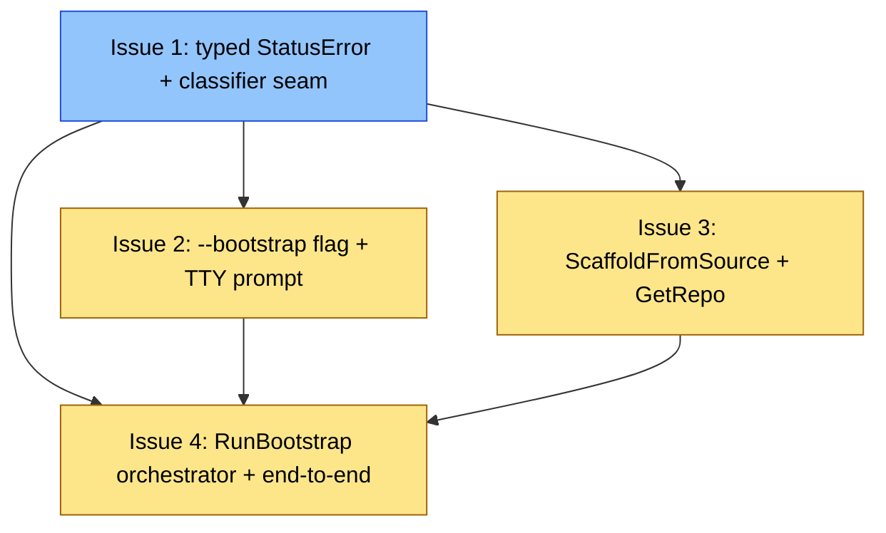

# PLAN: init bootstrap from empty source

## Status

Draft

## Scope Summary

Adds a `--bootstrap` flag to `niwa init <name> --from <empty-remote>`
that scaffolds a minimal `.niwa/workspace.toml` in-place when the
source remote has no niwa config, committing the scaffold on a
`niwa-bootstrap` branch and surfacing case-specific hints for adjacent
materialize failures (401/403, 404, ambiguous markers).

## Decomposition Strategy

Horizontal decomposition with four layered issues. Rationale: the
design's Implementation Approach itself is layered — typed errors
first, flag surface on top, scaffold derivation independent, then
bootstrap orchestration wiring everything together. Walking-skeleton
would force inventing a placeholder bootstrap path before the
typed-error infrastructure exists. Horizontal matches the design's
own structure and produces four issues with stable interfaces between
them.

In single-pr execution mode, the four issues collapse into one PR
with sequential commits — Issue 1 → (Issue 2 || Issue 3) → Issue 4.
The outlines below structure the work for review, not separate merges.

## Issue Outlines

### Issue 1: feat(init): typed github.StatusError and init classifier seam

**Goal**: Introduce a typed `*github.StatusError` and an `errors.As`
classifier seam at `runInit` so adjacent failure modes (auth, 404,
ambiguous, no-marker) can dispatch to case-specific Detail+Suggestion
output without changing today's wording for callers that print errors
verbatim.

**Acceptance Criteria**:

- [ ] `internal/github/fetch.go` defines `type StatusError struct { StatusCode int; Message string; URL string }` with an `Error()` method whose returned string preserves today's wording at each of the four construction sites (lines 69, 72, 145, 149).
- [ ] The four error-construction sites in `internal/github/fetch.go` return `&StatusError{...}` values instead of `fmt.Errorf` strings.
- [ ] The fifth wrap at `internal/workspace/snapshotwriter.go:503` (inside `materializeFromGitHub`) switches from `fmt.Errorf("...returned %d", code)` to a `%w`-style wrap so that `errors.As` from the `runInit` classifier reaches the underlying `*StatusError`.
- [ ] The four test fakes in `internal/workspace/snapshotwriter_test.go` are updated to construct `&github.StatusError{StatusCode: ...}` rather than string-formatted errors, and existing assertions still pass.
- [ ] `internal/cli/init.go:265` replaces the bare `"materializing config repo: %w"` wrap with an `errors.As` classifier ordered most-specific-first: `*config.AmbiguousMarkersError` → `*config.NoMarkerError` → `*github.StatusError` with `StatusCode == 401 || StatusCode == 403` → `*github.StatusError` with `StatusCode == 404` → today's generic wrap as fall-through.
- [ ] Each non-default classifier arm emits output shaped as `InitConflictError{Detail, Suggestion}`, reusing the existing display machinery at `init.go:174,183,201`.
- [ ] The `*NoMarkerError` arm emits today's existing remediation text in this issue; the `--bootstrap`-retry hint is added by <<ISSUE:2>>.
- [ ] The 404 arm emits the zero-commit / typo / private-repo guidance text from the design's Decision 2; the `--bootstrap`-retry hint is added by <<ISSUE:2>>.
- [ ] The 401/403 arm emits the `GH_TOKEN` scope guidance text from Decision 3.
- [ ] Unit tests cover each typed-error classifier arm: ambiguous, no-marker, 401, 403, 404, generic fall-through. Each test asserts the resulting `Detail` and `Suggestion` strings.
- [ ] **Classifier ordering is exercised, not assumed.** A table-driven test constructs an error chain that simultaneously satisfies more than one arm (e.g., a wrapped `*config.NoMarkerError` whose inner cause is also a `*github.StatusError{StatusCode: 404}`, and an `*AmbiguousMarkersError` chained with a status error). For each row the test asserts the classifier picks the most-specific arm per the documented order. A wrong implementation that reorders the `errors.As` switch must fail this test.
- [ ] `@critical` Gherkin scenarios under `test/functional/features/` cover the 401, 403, and 404 user-visible messages end-to-end via the `localGitServer` test helper.

**Dependencies**: None.

**Type**: code
**Files**: `internal/github/fetch.go`, `internal/workspace/snapshotwriter.go`, `internal/workspace/snapshotwriter_test.go`, `internal/cli/init.go`

### Issue 2: feat(init): --bootstrap flag with TTY-gated prompt

**Goal**: Add the `--bootstrap` / `--no-bootstrap` flag pair with
mutual exclusion, the TTY-gated prompt that fires on `*NoMarkerError`
in interactive contexts, and the non-TTY refusal-with-hint that
matches niwa's existing destroy.go template. Bootstrap dispatch is a
stub until <<ISSUE:4>> lands the real orchestrator.

**Acceptance Criteria**:

- [ ] `--bootstrap` and `--no-bootstrap` flags declared on `initCmd` in `internal/cli/init.go`.
- [ ] Mutual-exclusion check rejects both-set with the same wording pattern `--overlay`/`--no-overlay` uses at `init.go:135-137`.
- [ ] When `cli.IsStdinTTY()` returns true and `*NoMarkerError` fires without either flag, the classifier prompts via `cli.ReadConfirmation` with text like "Remote has no .niwa/workspace.toml. Scaffold a minimal config and stage it on a `niwa-bootstrap` branch? [Y/n]". No scaffolding runs without explicit Y.
- [ ] Non-TTY without `--bootstrap` falls through with an `InitConflictError`-shaped refusal pointing at `--bootstrap` (matches `destroy.go:117,242,329` template).
- [ ] `--no-bootstrap` in any context fails fast with the explicit-decline message; bypasses the TTY prompt.
- [ ] Bootstrap dispatch from the classifier is a stub returning `errors.New("bootstrap not implemented yet")`; full integration ships in <<ISSUE:4>>.
- [ ] The `*NoMarkerError` arm of <<ISSUE:1>>'s classifier gains the "retry with --bootstrap to scaffold" hint.
- [ ] The 404 arm gains the "retry with --bootstrap if the repo is brand new" hint.
- [ ] Unit tests cover: flag wiring, mutual-exclusion error, TTY-prompt yes-path, TTY-prompt no-path, non-TTY refusal-with-hint, `--no-bootstrap` decline path.

**Dependencies**: Blocked by <<ISSUE:1>>.

**Type**: code
**Files**: `internal/cli/init.go`, `internal/cli/init_test.go`

### Issue 3: feat(workspace): ScaffoldFromSource and GetRepo visibility lookup

**Goal**: Add `(*github.APIClient).GetRepo` and
`workspace.ScaffoldFromSource` so the bootstrap orchestrator can write
a minimal-ideal `.niwa/workspace.toml` with `[groups.<vis>]` derived
from a single GitHub API call, with a `.niwa/claude/.gitkeep` so the
content directory pushes cleanly.

**Acceptance Criteria**:

- [ ] New method `(*github.APIClient).GetRepo(ctx context.Context, owner, repo string) (*Repo, error)` added in `internal/github/client.go`. Returns the existing `*Repo` struct on success and a `*github.StatusError` (from <<ISSUE:1>>) on non-2xx responses.
- [ ] The `Repo.Private` (bool) → `Visibility` (string `"public"` | `"private"`) normalization that `ListRepos` performs inline today is extracted into a small unexported helper. `GetRepo` and `ListRepos` both use it.
- [ ] **Load-bearing security invariant**: `ScaffoldFromSource` derives its `[groups.<vis>]` value from `Repo.Private` (bool), NEVER from `Repo.Visibility` (string). The `ScaffoldFromSource` docstring calls this out so a future refactor cannot silently flip the source field. A malicious GitHub API host could send a `"visibility"` string carrying TOML metacharacters; only the bool-to-enum path produces guaranteed-safe values.
- [ ] New `workspace.ScaffoldOptions` struct in `internal/workspace/scaffold.go` with `Name string`, `Org string`, `Visibility string` (`"public"` | `"private"` | `""`), `IncludeGitkeep bool`.
- [ ] New `workspace.ScaffoldFromSource(dir string, opts ScaffoldOptions) error` in `internal/workspace/scaffold.go` as sibling of the existing `Scaffold(dir, name)` function. The existing function and its callers (`modeScaffold`, `modeNamed`) stay unchanged.
- [ ] `ScaffoldFromSource` emits the minimal-ideal TOML body per the design's Decision 4: active `[workspace]` with `name` + `content_dir = "claude"` (no `default_branch`), active `[[sources]] org = "<Org>"`, active `[groups.<vis>] visibility = "<vis>"` (defaulting to `"public"` when `opts.Visibility` is empty), commented `[claude.content.workspace] source = "workspace.md"` hint, and a single schema doc-link footer.
- [ ] When `opts.IncludeGitkeep` is true, `ScaffoldFromSource` writes an empty `.niwa/claude/.gitkeep` file (creating `.niwa/claude/` if needed) so the directory pushes cleanly when the user later uncomments `[claude.content.workspace]`.
- [ ] When the orchestrator's visibility lookup fails (network, auth, 404), the caller defaults `opts.Visibility` to `""` and emits a stderr `note:` line matching `emitVaultBootstrapPointer`'s idiom, explaining the fallback.
- [ ] A shared helper produces the schema doc-link footer reused between `Scaffold` and `ScaffoldFromSource` (small extraction; no behavior change for the existing scaffold).
- [ ] Unit tests cover: scaffold body matches expected TOML literally for each `Visibility` value; `.gitkeep` written when `IncludeGitkeep` is true and absent when false; visibility-lookup soft-fail path (orchestrator-side, stubbed `GetRepo` returning `*github.StatusError`) emits the expected stderr `note:` and produces `[groups.public]`; `GetRepo` and `ListRepos` produce consistent visibility values for the same `private` bool.
- [ ] **Visibility-from-bool is asserted, not assumed.** An adversarial fixture constructs a `*Repo` whose `Private` bool DISAGREES with its `Visibility` string (e.g., `Private: true, Visibility: "public"`; and `Private: false, Visibility: "<toml metacharacter>"`). The test asserts `ScaffoldFromSource` emits `[groups.private]` for the first case and `[groups.public]` for the second. A wrong implementation that flips the visibility helper to read `Repo.Visibility` string must fail this test.

**Dependencies**: Blocked by <<ISSUE:1>>.

**Type**: code
**Files**: `internal/github/client.go`, `internal/github/client_test.go`, `internal/workspace/scaffold.go`, `internal/workspace/scaffold_test.go`

### Issue 4: feat(init): RunBootstrap orchestrator and end-to-end bootstrap flow

**Goal**: Land `workspace.RunBootstrap` and wire it into `runInit` so
`niwa init <name> --from <empty-github-remote> --bootstrap` produces
a ready-to-push workspace on a `niwa-bootstrap` branch in a single
command, with the four load-bearing security invariants from the
design's Security Considerations preserved and tested.

**Acceptance Criteria**:

- [ ] New file `internal/workspace/bootstrap.go` containing `workspace.RunBootstrap(ctx context.Context, workspaceRoot, workspaceName string, src source.Source, fetcher github.FetchClient, reporter *Reporter) error`.
- [ ] **Host check runs FIRST**, before any git invocation. Bootstrap is GitHub-only in v1; non-GitHub sources are refused with a clear "v1 supports GitHub sources only; file a follow-up if you need `<host>`" error. No `git init`, `git remote add`, or `git fetch` runs on the non-GitHub path. The function's docstring calls this invariant out.
- [ ] The `cloneURL` passed to `git fetch` is derived inside `RunBootstrap` via `workspace.ResolveCloneURL(src, …)`; it is not passed in as a separate string argument. Single source of truth between the host check (on `src.Host`) and the URL that reaches the git invocation.
- [ ] After the host check, the orchestrator runs in order: `git -C <workspaceRoot> init` → `git remote add origin <cloneURL>` → `git fetch --depth 1 origin HEAD` → `git checkout -b niwa-bootstrap FETCH_HEAD`.
- [ ] Visibility lookup uses `(*github.APIClient).GetRepo` from <<ISSUE:3>>. Any lookup failure soft-fails to `Visibility=""`, which `ScaffoldFromSource` interprets as `[groups.public]`, plus the stderr `note:` shipped in <<ISSUE:3>>.
- [ ] Scaffold call: `workspace.ScaffoldFromSource(workspaceRoot, ScaffoldOptions{Name: workspaceName, Org: src.Org, Visibility: visibility, IncludeGitkeep: true})`.
- [ ] Stage and commit: `git -C <workspaceRoot> add .niwa/` followed by `git -C <workspaceRoot> commit -m "Initial niwa workspace config"`. **No `--author` flag. No `GIT_AUTHOR_*` / `GIT_COMMITTER_*` environment override.** The commit uses the user's normal git identity. The orchestrator's docstring calls this invariant out.
- [ ] All git invocations use `exec.CommandContext("git", args...)` with arguments as separate elements, matching the pattern in `internal/workspace/clone.go:63`. No shell, no string interpolation. The niwa-controlled args (`"niwa-bootstrap"` branch name, `"Initial niwa workspace config"` commit message) are fixed strings, not user-derived.
- [ ] **Host-check ordering is asserted at the exec layer**, not only at the docstring. The orchestrator accepts an injected exec invoker (interface or function field, defaulting to `exec.CommandContext`) so tests can record every git invocation. A unit test calls `RunBootstrap` with a non-GitHub `src` (e.g., `src.Host = "gitlab.com"`) and asserts: (a) the returned error is the v1 GitHub-only refusal, AND (b) the injected invoker recorded ZERO git invocations.
- [ ] **No-author / no-GIT_AUTHOR_* override is asserted at the argv layer.** Using the same injected exec invoker, a unit test captures the `*exec.Cmd` passed to the commit invocation and asserts: (a) `cmd.Args` contains no `--author` element, AND (b) `cmd.Env` contains no entry whose key matches `GIT_AUTHOR_*` or `GIT_COMMITTER_*`.
- [ ] **Cleanup-defer transition is asserted in both directions.** (a) Force-failure path — a fake exec invoker returns non-zero on `git fetch`. After `runInit` returns, the workspace directory at `<cwd>/<name>/` does NOT exist on disk. (b) Success path — the directory DOES exist with `.niwa/workspace.toml` written.
- [ ] **Caller-side cleanup defer contract.** In `internal/cli/init.go`, `workspaceCreated = false` flips only after `RunBootstrap` returns success — not before the call. Any partial-failure path inside `RunBootstrap` falls back to the caller's deferred `os.RemoveAll(workspaceRoot)`. `RunBootstrap` does not attempt internal directory cleanup. The orchestrator's docstring documents the contract.
- [ ] `internal/cli/init.go` replaces <<ISSUE:2>>'s `errors.New("bootstrap not implemented yet")` stub at the classifier seam with the real `workspace.RunBootstrap` call. Control falls through to the unchanged post-flight block: `config.Load` → `emitVaultBootstrapPointer` → `globalCfg.SetRegistryEntry` → `workspace.SaveState` → `printSuccess` → `writeLandingPath`. `RunBootstrap` does not duplicate any of that work.
- [ ] Success message: a stderr WARNING-style block matching the prominence of the `--rebind` precedent at `init.go:351-359`. Includes (a) the `niwa-bootstrap` branch name, (b) a **`Worktree:` line with the absolute filesystem path** where the bootstrap branch is checked out (in the in-place model this is the same directory as the workspace root; the label is "Worktree" because that's what the user `cd`s into to inspect), and (c) next steps: `git show HEAD` to inspect, `git push -u origin niwa-bootstrap` to publish, then `niwa apply`.
- [ ] `@critical` Gherkin scenario added under `test/functional/features/` covering the full `niwa init <name> --from <empty-remote> --bootstrap` flow with the `localGitServer` test helper. Asserts: `<workspaceRoot>/.niwa/workspace.toml` exists on disk and parses; `<workspaceRoot>/.niwa/claude/.gitkeep` exists; the `niwa-bootstrap` branch exists with exactly one commit authored by the user's configured git identity (not "niwa"); the global registry has an entry whose `name` equals the bootstrap target name AND whose `path` equals the absolute workspace root path (content equality, not bare existence); the shell-wrapper landing-path file's contents equal the resolved workspace root path string.
- [ ] `README.md` and/or a page under `docs/guides/` updated to describe the `--bootstrap` flag, the end-to-end bootstrap UX flow, the resulting `niwa-bootstrap` branch, and the publish instructions.

**Dependencies**: Blocked by <<ISSUE:1>>, <<ISSUE:2>>, <<ISSUE:3>>.

**Type**: code
**Files**: `internal/workspace/bootstrap.go`, `internal/workspace/bootstrap_test.go`, `internal/cli/init.go`, `internal/cli/init_test.go`, `test/functional/features/init_bootstrap.feature`, `README.md`, `docs/guides/`

## Dependency Graph

**Legend**: Blue = ready, Yellow = blocked, Green = done. In single-pr
mode these states track commit progression within the single PR rather
than separate merges.

## Implementation Sequence

**Critical path**: Issue 1 → Issue 2 → Issue 4 (or equivalently Issue
1 → Issue 3 → Issue 4). Length 3 hops. Issues 2 and 3 are
interchangeable in the middle and can be implemented in either order
or as commits that interleave.

**Parallelization** (within the single PR): Issues 2 and 3 touch
different packages — Issue 2 modifies `internal/cli/init.go`, Issue 3
adds new files in `internal/workspace/scaffold.go` and a new method in
`internal/github/client.go`. Their only shared dependency is the typed
`*github.StatusError` introduced by Issue 1. They can be written as
separate commits in either order; reviewers can read them
independently.

**Recommended commit order**:

1. **Issue 1** as foundational commit(s) — typed `*github.StatusError`,
   classifier seam, unit tests, `@critical` Gherkin for 401/403/404.
2. **Issue 2** OR **Issue 3** (either order works) — flag wiring with
   stub dispatch, or scaffold + GetRepo. Land the typed-error-aware
   adversarial visibility test (Issue 3) and the classifier-ordering
   test (Issue 1's tightened AC) before Issue 4 starts.
3. **Issue 4** as the closing commit(s) — `RunBootstrap` orchestrator,
   replace Issue 2's stub, success-message block, end-to-end Gherkin
   scenario, README/docs update. The four security-load-bearing
   invariants (host-check ordering, no-author argv, cleanup defer in
   both directions, registry/landing-path content checks) have
   discriminating tests in this commit.

## Next steps

Run `/shirabe:work-on docs/plans/PLAN-init-bootstrap-empty-source.md`
to begin implementation on this branch.
