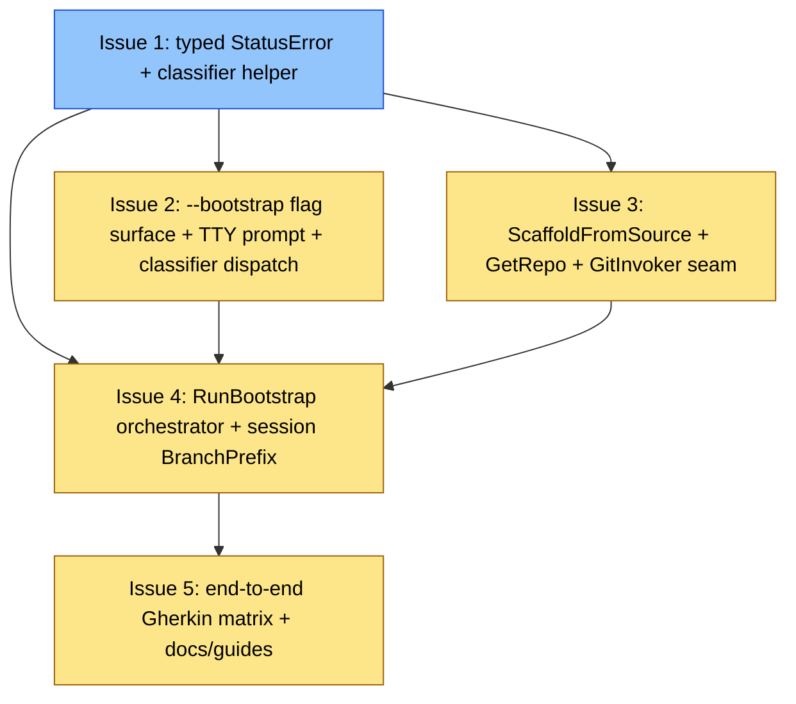

# PLAN: init bootstrap from empty source

## Status

Draft

## Scope Summary

Implement `niwa init <name> --from <slug> --bootstrap` as a turnkey
lifecycle command: chain init → create → session-create so the user
lands inside a real niwa worktree at
`<instanceRoot>/.niwa/worktrees/<repo>-<sid>/` with a scaffolded
`.niwa/workspace.toml` committed on the `niwa-bootstrap/<sid>`
branch.

## Decomposition Strategy

Horizontal decomposition with five issues, one per design phase
(PRD Implementation Approach Phase 1 through Phase 5). Each issue
corresponds to a commit-boundary in the single PR and ends with a
CI-green, meaningful user-visible state.

Dependency shape: Issue 1 has no dependencies; Issues 2 and 3 both
depend only on Issue 1 (can be committed in either order); Issue 4
depends on 1, 2, and 3; Issue 5 depends on Issue 4.

In single-pr execution mode, these five issues collapse into one PR
on the existing `docs/init-bootstrap-empty-source` branch.

## Issue Outlines

### Issue 1: feat(github): typed StatusError + fifth-wrap fix + classifier helper

**Goal**: Introduce a typed `*github.StatusError`, fix the fifth
error-wrap site so `errors.As` can reach it, and add a
`classifyMaterializeError` helper with PRD-N2 precedence — all
without changing user-visible behavior.

**Acceptance Criteria**:

- [ ] New file `internal/github/errors.go` defines `type StatusError struct { StatusCode int; Message string; URL string }` with an `Error()` method that preserves today's exact wrapped text.
- [ ] All four error-construction sites in `internal/github/fetch.go` (lines 69, 72, 145, 149) return `&StatusError{...}` instead of `fmt.Errorf` strings.
- [ ] The fifth wrap at `internal/workspace/snapshotwriter.go:503` (inside `materializeFromGitHub`) switches from `fmt.Errorf("...: %s", err)` to `fmt.Errorf("...: %w", err)` so `errors.As` can reach the typed `*github.StatusError`.
- [ ] The four test fakes in `internal/workspace/snapshotwriter_test.go` are updated to construct `&github.StatusError{StatusCode: ...}` directly.
- [ ] New file `internal/cli/init_classifier.go` defines `classifyMaterializeError(err error, hasBootstrap bool) (*workspace.InitConflictError, error)`. Constructed and unit-tested in isolation; `runInit` still uses the bare wrap until <<ISSUE:2>>.
- [ ] Classifier precedence (PRD N2) ordered most-specific-first:
  1. `*config.AmbiguousMarkersError`
  2. `*config.NoMarkerError`
  3. `*github.StatusError` with `StatusCode == 401 || StatusCode == 403`
  4. `*github.StatusError` with `StatusCode == 404`
  5. Generic fall-through (returns original error unchanged)
- [ ] Table-driven test in `internal/cli/init_classifier_test.go` exercises error chains satisfying multiple arms simultaneously to prove the precedence order.
- [ ] 401/403 arm emits `*workspace.InitConflictError` whose `Detail`+`Suggestion` contains the exact substring `verify GH_TOKEN scopes; fine-grained PATs need Contents: read, classic PATs need repo scope` (PRD R10).
- [ ] 404 arm emits `*workspace.InitConflictError` whose `Detail`+`Suggestion` contains all three PRD R11 substrings.
- [ ] Ambiguous arm preserves today's `*config.AmbiguousMarkersError.Error()` text verbatim.
- [ ] `*workspace.InitConflictError` gains an `ExitCode int` field carrying PRD R23 exit codes.
- [ ] User-visible state after this issue: NO CHANGE.
- [ ] Unit tests cover each arm with exact-substring assertions.

**Dependencies**: None.

**Type**: code
**Files**: `internal/github/errors.go`, `internal/github/fetch.go`, `internal/workspace/snapshotwriter.go`, `internal/workspace/snapshotwriter_test.go`, `internal/cli/init_classifier.go`, `internal/cli/init_classifier_test.go`, `internal/workspace/preflight.go`

### Issue 2: feat(init): --bootstrap flag surface + TTY prompt + classifier dispatch

**Goal**: Wire the `--bootstrap` / `--no-bootstrap` flag surface, the
R13 TTY prompt and non-TTY fail-fast paths, the R9 host check, and
classifier dispatch into <<ISSUE:1>>'s helper so case-specific error
messages flow for 401/403/404/ambiguous-markers while bootstrap
itself dispatches to a stub.

**Acceptance Criteria**:

- [ ] `initBootstrap` and `initNoBootstrap` package-level vars + flags declared on `initCmd` in `internal/cli/init.go` matching the `initOverlay`/`initNoOverlay` pattern.
- [ ] R25 mutual-exclusion check: passing both `--bootstrap` and `--no-bootstrap` produces the exact error string `--bootstrap and --no-bootstrap are mutually exclusive` and exit code 2.
- [ ] R2 name derivation: when `initBootstrap` is true and `len(args) == 0`, name derives from `src.Repo`. Today's non-bootstrap no-name behavior unchanged.
- [ ] R13 TTY prompt: on `*config.NoMarkerError`, when `IsStdinTTY()` is true and neither flag set, prompt with the exact string `Remote has no .niwa/workspace.toml. Scaffold a minimal config and stage it on a niwa-bootstrap branch? [Y/n] `. Accepts `y`/`Y`/bare-Enter as Yes; `n`/`N` as No; any other input re-prompts. Exit 0 on decline.
- [ ] R13 non-TTY fail-fast: non-TTY without `--bootstrap` emits the exact string `remote has no .niwa/workspace.toml and stdin is not a terminal; re-run with --bootstrap to scaffold` and exit code 4.
- [ ] R13 `--no-bootstrap` path: emits NoMarker text + explicit-decline reason and exit code 4.
- [ ] Replace the bare `"materializing config repo: %w"` wrap at `internal/cli/init.go:265` with a call into <<ISSUE:1>>'s `classifyMaterializeError`. Classifier output displayed via existing `InitConflictError` Detail+Suggestion pattern.
- [ ] On `*config.NoMarkerError` + `--bootstrap`, dispatch into a stub returning `errors.New("bootstrap step=create: not implemented yet")`. No scaffold write happens here — Issue 4 owns the workspace-root scaffold call. `workspaceCreated` defer fires on the stub error (init-step rollback per R7).
- [ ] Note: `workspaceCreated` defer arming behavior at `internal/cli/init.go:215-226` is unchanged from today. Only the disarm timing changes, and that change is owned by <<ISSUE:4>>.
- [ ] Classifier's 404 and NoMarker arms gain the `--bootstrap`-retry hint text (forward-looking from <<ISSUE:1>>).
- [ ] R23 exit-code surfacing: `*workspace.InitConflictError` carries the `ExitCode int` field, populated per PRD R23 (`0`/`1`/`2`/`3`/`4`). The binary main in `cmd/niwa/main.go` maps the field to `os.Exit(...)`.
- [ ] R9 host check (early stub for non-GitHub): inside `runInit`, immediately after `parseInitSource(source)` succeeds, the code asserts `src.IsGitHub()`. A non-GitHub source produces exit code 3 and the exact R9 stderr string `bootstrap supports only GitHub sources in v1; got host=<host>`. Implementation **must** use `Source.IsGitHub()` from `internal/source/source.go:148`, NOT `src.Host == "github.com"` (the canonical slug form leaves `Host` empty).
- [ ] **Host-check ordering at the exec layer (R9 + R21)**: a unit test injects an exec-recorder into `runInit`'s materialize path. The test invokes `runInit` with a non-GitHub `src` and asserts the recorder records ZERO git invocations across the whole `runInit` call. A wrong implementation that runs `git init` / `git fetch` BEFORE the host check, then catches the error and emits the R9 string + exit 3, would pass the final-state assertion but FAIL this exec-layer assertion.
- [ ] Unit tests cover: flag wiring; R25 mutual exclusion exact string + exit 2; R2 derivation; R13 TTY-yes/TTY-no/TTY-other-then-Y re-prompt paths; R13 non-TTY fail-fast; `--no-bootstrap` decline; classifier dispatch wiring.
- [ ] `@critical` Gherkin scenarios under `test/functional/features/` cover: 401 text; 403 text; 404 text (all three R11 substrings); R25 exact string + exit 2; R13 TTY-yes/TTY-no proceeds/declines; R13 non-TTY fail-fast text + exit 4.

**Dependencies**: Blocked by <<ISSUE:1>>.

**Type**: code
**Files**: `internal/cli/init.go`, `internal/cli/init_test.go`, `internal/cli/init_classifier.go`, `cmd/niwa/main.go`, `test/functional/features/init_bootstrap_failures.feature`

### Issue 3: feat(workspace): ScaffoldFromSource + GetRepo + GitInvoker seam

**Goal**: Build the scaffold + visibility-lookup + test-injectable
git seam, all independent of the orchestrator.

**Acceptance Criteria**:

- [ ] New method `(*github.APIClient).GetRepo(ctx context.Context, owner, repo string) (*Repo, error)` in `internal/github/client.go` returns the existing `*Repo` struct on 200 and `*github.StatusError` (from <<ISSUE:1>>) on non-2xx.
- [ ] The `Repo.Private` (bool) → `Visibility` (string `"public"`/`"private"`) normalization that `ListRepos` performs inline today is extracted into a package-internal helper; `GetRepo` and `ListRepos` both use it.
- [ ] **Load-bearing security invariant (R16)**: `ScaffoldFromSource` derives `[groups.<vis>]` from `Repo.Private` (bool), NEVER from `Repo.Visibility` (string). `ScaffoldOptions.Private` is typed `bool`. Docstring explicitly states a future refactor must not switch to a string-derived visibility (would require changing the struct field type — a visible change).
- [ ] New `workspace.ScaffoldOptions` struct in `internal/workspace/scaffold.go` with fields:
  - `Name string` — workspace name (positional or slug repo basename)
  - `Org string` — source org from `--from` slug
  - `Repo string` — bootstrap repo name from `--from` slug
  - `Private bool` — derived from `Repo.Private`
  - `IncludeGitkeep bool` — production always true; tests may suppress
- [ ] New `workspace.ScaffoldFromSource(dir string, opts ScaffoldOptions) error` in `internal/workspace/scaffold.go` (sibling of `Scaffold(dir, name)`; existing function and callers untouched).
- [ ] Scaffold body matches PRD Appendix A byte-for-byte after `<placeholder>` substitution:
  - `Private: true` → `[groups.private] visibility = "private"`
  - `Private: false` → `[groups.public] visibility = "public"`
- [ ] R15 `.gitkeep`: writes empty `.niwa/claude/.gitkeep` (zero bytes) when `opts.IncludeGitkeep` is true.
- [ ] R17 soft-fail (orchestrator-side, exercised in <<ISSUE:4>>): callers whose `GetRepo` lookup fails (network, 401, 403, 404, 5xx) fall back to `opts.Private = false` and emit the exact PRD R17 stderr `note:` line with the appropriate `<cause>` substring (`network error` / `authentication` / `not found` / `server error`).
- [ ] Shared helper produces the schema doc-link footer reused between `Scaffold` and `ScaffoldFromSource` (small extraction; no behavior change for existing scaffold).
- [ ] New `internal/workspace/bootstrap.go` (partial) containing: `GitInvoker` interface with `CommandContext(ctx, args ...string) *exec.Cmd`; `stdGitInvoker` concrete implementation calling `exec.CommandContext`; `BootstrapParams` struct fields (`WorkspaceRoot`, `WorkspaceName`, `Src`, `Fetcher`, `GitInvoker`, `Reporter`, `ScaffoldOpts ScaffoldOptions`).
- [ ] NO `RunBootstrap` body yet — that lands in <<ISSUE:4>>.
- [ ] Unit tests cover: `ScaffoldFromSource` byte-equality vs Appendix A for each visibility; `.gitkeep` byte-zero check; visibility-from-bool with adversarial fixture (mismatched `Private` vs `Visibility` string; TOML-injection-shaped `Visibility`); `GetRepo` + `ListRepos` produce consistent visibility values via the shared helper.
- [ ] N5 no-secret-on-disk: a unit test passes `GH_TOKEN=test-fixture-token-DEADBEEF` and asserts the token literal never appears in `ScaffoldFromSource`'s output bytes.
- [ ] User-visible state after this issue: NO CHANGE.

**Dependencies**: Blocked by <<ISSUE:1>> (typed `*github.StatusError` consumed by `GetRepo`).

**Type**: code
**Files**: `internal/github/client.go`, `internal/github/client_test.go`, `internal/workspace/scaffold.go`, `internal/workspace/scaffold_test.go`, `internal/workspace/bootstrap.go`

### Issue 4: feat(workspace): RunBootstrap orchestrator + session BranchPrefix

**Goal**: Land the full `workspace.RunBootstrap` orchestrator and
the session-state `BranchName` extension so the end-to-end `niwa
init --from owner/repo --bootstrap` chain composes scaffold +
create + session-create + commit while preserving every PRD
security invariant at the argv layer.

**Acceptance Criteria**:

- [ ] Session state extension: `internal/mcp/session_lifecycle.go` adds `BranchName string` to `SessionLifecycleState` with `json:"branch_name,omitempty"`. New method `EffectiveBranchName() string` returns `BranchName` when non-empty, else `"session/" + SessionID`. `NewSessionLifecycleState` signature extended to accept `branchName string`.
- [ ] Back-compat fallback: a session state JSON file pre-dating the schema (no `branch_name` field) is still readable. Unit test loads a fixture with `SessionID: "deadbeef"` and asserts `state.EffectiveBranchName()` returns the literal string `session/deadbeef`. A wrong implementation that returns an empty string (passes "no panic, no error" but breaks downstream `git branch -D <empty>` callers) must fail this test.
- [ ] `CreateSession` factoring: `internal/mcp/handlers_session.go` factors `handleCreateSession` into `CreateSession(ctx context.Context, params CreateSessionParams) (sid, worktreePath string, err error)`. The MCP handler becomes a thin wrapper passing `BranchPrefix: ""` (preserves `session/<sid>` for existing callers).
- [ ] `CreateSessionParams` carries: `Repo`, `Purpose`, `BranchPrefix string` (empty → `session/`; non-empty → `<prefix><sid>`), and the `GitInvoker` from <<ISSUE:3>>. The factored entry routes its `git worktree add` and `git branch -D` calls through the injected `GitInvoker` (R22).
- [ ] Every previous `"session/" + sid` reader uses `state.EffectiveBranchName()` instead. Destroy path at `internal/mcp/handlers_session.go:364` and push-hint warning at `internal/cli/sessionattach/worktree_warnings.go:81`.
- [ ] `runInit` changes Issue 4 makes: between the classifier returning NoMarker+bootstrap and the call to `workspace.RunBootstrap`, `runInit` invokes `workspace.ScaffoldFromSource(workspaceRoot, opts)` — the FIRST of the two scaffold writes. `ScaffoldOptions` constructed once here. `Private` derives from `(*github.APIClient).GetRepo` with R17 soft-fail to `false` on lookup error. On the call returning nil, `runInit` sets `workspaceCreated = false`. Then calls `workspace.RunBootstrap(ctx, BootstrapParams{..., ScaffoldOpts: opts, ...})`.
- [ ] Full `RunBootstrap` body in `internal/workspace/bootstrap.go`. Sequence:
  1. Re-verify `params.Src.IsGitHub()` (defense-in-depth; uses `Source.IsGitHub()` from `internal/source/source.go:148`, NOT a literal-byte check).
  2. Resolve `cloneURL` via `workspace.ResolveCloneURL(src, …)`.
  3. **NOTE**: `RunBootstrap` does NOT do its own workspace-root scaffold write. That happened in `runInit` already.
  4. Compute `instanceName := deriveInstanceName(workspaceName)`. Arm `instanceCreated` defer immediately before `Applier.Create`. Call `Applier.Create(ctx, cfg, workspaceRoot, instanceName)` — reads `<workspaceRoot>/.niwa/workspace.toml` (the file `runInit` wrote), runs pipeline, clones bootstrap repo (R4 allow-list), installs channels infra (because scaffold has `[channels.mesh]`).
  5. Disarm `instanceCreated` defer on `Applier.Create` returning nil.
  6. Call `mcp.CreateSession(ctx, CreateSessionParams{Repo: src.Repo, Purpose: "bootstrap", BranchPrefix: "niwa-bootstrap/", GitInvoker: params.GitInvoker})`.
  7. Arm `sessionCreated` defer immediately after `CreateSession` returns nil (cleanup target for failures between this point and commit success).
  8. Call the SECOND `ScaffoldFromSource(worktreePath, params.ScaffoldOpts)` — writes byte-identical `.niwa/workspace.toml` and `.gitkeep` inside the worktree.
  9. `GitInvoker`-mediated `git -C worktreePath add .niwa/` + `git -C worktreePath commit -m "Initial niwa workspace config"`.
  10. R18 invariants at argv/env layer: NO `--author`, NO `GIT_AUTHOR_*` / `GIT_COMMITTER_*` env.
  11. Disarm `sessionCreated` defer on commit success.
  12. Return.
- [ ] **Caller-side cleanup defer**: `runInit` flips `workspaceCreated = false` IMMEDIATELY after the runInit-level `ScaffoldFromSource(workspaceRoot, opts)` returns nil — NOT after `RunBootstrap` returns nil. This is what makes R7 create-step preservation work.
- [ ] **Byte-identical scaffold writes**: unit test under `internal/workspace/bootstrap_test.go` runs `RunBootstrap` happy-path with the `GitInvoker` recorder + stubbed `Applier`; asserts `os.ReadFile(<workspaceRoot>/.niwa/workspace.toml)` and `os.ReadFile(<worktreePath>/.niwa/workspace.toml)` return byte-identical content. Same for `.gitkeep`.
- [ ] R19 success-block emission: on `RunBootstrap` returning nil, `runInit` writes the PRD Appendix B body to stderr byte-for-byte, preceded by exactly one blank stderr line and followed by exactly one blank stderr line, lines in exact order.
- [ ] R20 landing-path: `writeLandingPath(worktreePath)` invoked LAST on the bootstrap success path with the absolute worktree path.
- [ ] R24 no-push: unit test using `GitInvoker` recorder asserts no `git push` invocation across the happy-path run.
- [ ] Replace <<ISSUE:2>>'s stub with the real `workspace.RunBootstrap(ctx, BootstrapParams{...})` call. Construct `stdGitInvoker{}` and pass it.
- [ ] R7 stepwise rollback unit tests using the injectable `GitInvoker`:
  - **init-step fail**: workspace dir does not exist; no registry entry; exit 1 with `bootstrap step=init:` prefix.
  - **create-step fail**: `<cwd>/<name>/.niwa/workspace.toml` exists; no `<instanceName>/`; registry entry exists; exit 1 with `bootstrap step=create:` prefix. **Load-bearing for the disarm-after-scaffold ordering.**
  - **session-step fail**: instance directory exists; workspace.toml still on disk; no worktree under `<instanceRoot>/.niwa/worktrees/`; exit 1 with `bootstrap step=session-create:` prefix.
  - **commit-step fail**: instance + workspace dirs preserved; worktree REMOVED by the `sessionCreated` defer; session state JSON REMOVED; branch REMOVED.
- [ ] **Host-check ordering at the exec layer**: unit test using the `GitInvoker` recorder runs `RunBootstrap` with non-GitHub `src` and asserts the recorder records ZERO git invocations.
- [ ] **No-author / no-GIT_AUTHOR_* argv guard**: recorder captures the commit `*exec.Cmd`. Asserts (a) `cmd.Args` has no `--author`; (b) `cmd.Env` has no `^GIT_(AUTHOR|COMMITTER)_(NAME|EMAIL|DATE)=`.
- [ ] **Env-construction provenance (R18 + N5 strengthening)**: test additionally sets `GIT_AUTHOR_NAME=injected-by-parent` and `GIT_COMMITTER_EMAIL=evil@example.com` in the parent process env before invoking `RunBootstrap`. The recorder-captured `cmd.Env` for the commit invocation must STILL contain no `GIT_AUTHOR_*` / `GIT_COMMITTER_*` entry. The implementation must explicitly filter those keys from `os.Environ()`. A wrong implementation doing `cmd.Env = os.Environ()` must fail.
- [ ] **Cleanup-defer transition asserted directly**: unit test forces failure during `Applier.Create` AFTER the runInit-level `ScaffoldFromSource(workspaceRoot, opts)` succeeds. After `runInit` returns, the test asserts `<cwd>/<name>/.niwa/workspace.toml` EXISTS on disk. Proves the defer was disarmed at the correct earlier moment, not via a coincidental end-state match.
- [ ] User-visible state after this issue: end-to-end happy path works. Adjacent failure modes route correctly. Rollback at each step preserves the right state.

**Dependencies**: Blocked by <<ISSUE:1>>, <<ISSUE:2>>, <<ISSUE:3>>.

**Type**: code
**Files**: `internal/mcp/session_lifecycle.go`, `internal/mcp/handlers_session.go`, `internal/cli/sessionattach/worktree_warnings.go`, `internal/cli/init.go`, `internal/workspace/bootstrap.go`, `internal/workspace/bootstrap_test.go`, `internal/cli/init_test.go`

### Issue 5: test+docs: end-to-end Gherkin matrix + docs/guides

**Goal**: Land the full PRD Acceptance Criteria matrix as `@critical`
Gherkin scenarios and unit tests for test-seam ACs; update
`docs/guides/` to document the bootstrap flow.

**Acceptance Criteria**:

- [ ] `@critical` Gherkin scenarios under `test/functional/features/` cover every PRD AC. Group via `localGitServer` + `tarballFakeServer` fixtures:
  - Happy path with positional name (assert workspace.toml byte-equality vs PRD Appendix A; `.niwa/claude/.gitkeep`; `instance.json` schema v4; `.niwa/roles/<repo>/` exists; cloned source at `<instance>/<group>/<repo>/.git`; worktree at `<instance>/.niwa/worktrees/<repo>-<sid>/`; branch `niwa-bootstrap/<sid>` with one commit by user's configured git identity (NOT "niwa"); registry entry name + path equality; landing-path file equals worktree absolute path).
  - Happy path no positional name (workspace at `<cwd>/foo/` with all the same artifacts).
  - 401 / 403 / 404 adjacent-failure messages with exact substrings from PRD R10/R11.
  - 404 zero-commit case explicit substring (PRD R11).
  - 404 private-no-token case explicit substring.
  - Ambiguous markers (assert verbatim `*config.AmbiguousMarkersError.Error()`).
  - Non-GitHub source (assert exact R9 string + zero git invocations recorded).
  - TTY prompt Yes / No / non-TTY refusal / `--no-bootstrap` / mutual exclusion.
  - R8 sub-cases 1 (workspace exists), 2 (registry collision), 3a (file), 3b (directory), 3c (symlink) — each with exact Detail+Suggestion substrings.
  - **Rollback at init step**: forced failure during init (e.g. pre-existing target dir) → exit 1; stderr begins with literal prefix `bootstrap step=init:`; `<cwd>/<name>/` does not exist; no registry entry; no instance.
  - **Rollback at create step**: `tarballFakeServer` 200 for the config fetch but `localGitServer` returns clone failure → exit 1; stderr prefix `bootstrap step=create:`; stderr contains the exact substring `bootstrap: create step failed; instance directory removed. Workspace at ` followed by the absolute workspace-root path followed by ` preserved; run niwa create to retry.` (test concatenates these three pieces around the runtime-resolved absolute path); `<cwd>/<name>/.niwa/workspace.toml` exists; no `<instanceName>/`; registry entry exists.
  - **Rollback at session-create step**: create succeeds; session-create fails → exit 1; stderr prefix `bootstrap step=session-create:`; stderr contains the exact substring `bootstrap: session-create step failed; instance preserved at ` followed by the absolute instance-root path followed by `. Run niwa session create ` followed by the bootstrap repo name followed by ` bootstrap to retry.`; instance + workspace remain intact; no worktree.
  - **Rollback at commit step**: `CreateSession` returned nil but `git commit` returns error → exit 1; prefix `bootstrap step=session-create:`; bootstrap branch + worktree + session state JSON all REMOVED.
  - Scaffold byte-equality + `.gitkeep` + `[channels.mesh]` active + inline comment exact (`# Bootstrap enabled mesh channels. Remove this block (and the [channels.mesh] line below) to disable.`).
  - Bootstrap commit's tree at `niwa-bootstrap/<sid>` HEAD contains `.niwa/workspace.toml` whose contents match `<cwd>/<name>/.niwa/workspace.toml` byte-for-byte (verifies the two-phase scaffold writes produced identical content).
  - Visibility-from-bool adversarial (`Private: true, Visibility: "public"` and `Private: false, Visibility: "<TOML-injection-shaped>"`).
  - Visibility soft-fail variants (server / network / auth / not-found) with exact R17 note text per cause.
  - Worktree label in success block (literal `Worktree: <abs-path>` line where path matches `git worktree list --porcelain`).
  - Success-block byte-equality (PRD Appendix B body with `<placeholder>` substitution; preceded/followed by exactly one blank stderr line).
  - Allow-list scoping (R4) — for a 3-repo source-org fixture, only the bootstrap repo is cloned into `<instance>/<group>/<repo>/`.
  - Branch-name stored in session state — `state.BranchName == "niwa-bootstrap/<sid>"`.
  - Branch-name back-compat fallback — pre-schema state JSON returns `session/<sid>` via `EffectiveBranchName()`.
  - R6 parity — `niwa session create my-project another-purpose` succeeds standalone against a bootstrapped workspace with no re-initialization.
  - R2 regression — `niwa init --from owner/foo` (no `--bootstrap`, no positional) continues today's cwd-materialize behavior.
  - No-secret-on-disk (N5) — grep `<cwd>/<name>/` for `GH_TOKEN` literal value; zero matches.
- [ ] Unit tests for test-seam ACs:
  - **Argv-injection guard (R22)**: slug literal `owner/foo;rm -rf /tmp/x` either fails `source.Parse` or reaches `exec.CommandContext` as a single argv element with no shell metacharacter expansion.
  - **Host-check ordering at exec layer**: unit test confirms zero git invocations on non-GitHub `src` (covered in <<ISSUE:4>>'s AC list but repeated here for the regression harness).
  - **Classifier ordering table**: exercises every adjacent-pair transition in N2's precedence (AmbiguousMarkers∧NoMarker; NoMarker∧StatusError{401}; StatusError{401}∧StatusError{404}; StatusError{404}∧generic). A wrong implementation swapping ONLY a middle adjacent pair (e.g., 401↔404) must fail. The table must NOT exercise only non-adjacent pairs.
  - **No-author/no-GIT_AUTHOR_* + env-construction provenance**: covered in <<ISSUE:4>>'s AC list.
  - **Cleanup-defer at create-fail**: workspace preserved; covered in <<ISSUE:4>>.
  - **Cleanup-defer at init-fail**: workspace removed.
- [ ] **Documentation**:
  - New page or extension under `docs/guides/` describes `--bootstrap`: end-to-end flow, visibility-lookup fallback, branch-name format `niwa-bootstrap/<sid>`, R19 success block format.
  - Verify the scaffold's footer link to `docs/guides/workspace-config-sources.md` is current and resolves.
  - Optional README mention if the feature warrants top-level visibility.
- [ ] **Reference hygiene**: zero `wip/...` path references in new docs (only the wip-hygiene rule's own prose is acceptable).

**Dependencies**: Blocked by <<ISSUE:4>>.

**Type**: code
**Files**: `test/functional/features/init_bootstrap.feature`, `test/functional/features/init_bootstrap_rollback.feature`, `test/functional/features/init_bootstrap_visibility.feature`, `internal/cli/init_test.go`, `internal/workspace/bootstrap_test.go`, `docs/guides/init-bootstrap.md`, `README.md`

## Dependency Graph

**Legend**: Blue = ready, Yellow = blocked, Green = done. In
single-pr mode these states track commit progression within the
single PR.

## Implementation Sequence

**Critical path**: Issue 1 → Issue 2 → Issue 4 → Issue 5 (length 4)
is one of two equivalent longest chains. Issue 1 → Issue 3 → Issue 4
→ Issue 5 is the other. Issues 2 and 3 are interchangeable in the
middle position.

**Parallelization within the single PR**: Issues 2 and 3 touch
different packages — Issue 2 modifies `internal/cli/init.go`; Issue
3 adds new files in `internal/workspace/scaffold.go`,
`internal/github/client.go`, and the partial
`internal/workspace/bootstrap.go`. Only the typed `*github.StatusError`
from Issue 1 is shared.

**Recommended commit order**:

1. **Issue 1** — typed `*github.StatusError`, fifth-wrap fix at
   `snapshotwriter.go:503`, classifier helper, unit tests. No
   user-visible change.
2. **Issue 3** OR **Issue 2** (either order) — recommend Issue 3
   first because Issue 2 will reference the `GitInvoker` and
   `BootstrapParams` from `internal/workspace/bootstrap.go` for the
   stub. Issue 3's tests stand alone.
3. The remaining of (Issue 2 OR Issue 3) — flag surface + classifier
   dispatch with stub; case-specific error messages now live.
4. **Issue 4** — `RunBootstrap` body, session-state extension,
   `CreateSession` factoring, runInit's workspace-root scaffold
   write, success-block emission, landing-path. End-to-end happy
   path works.
5. **Issue 5** — full `@critical` Gherkin matrix, unit tests for
   test-seam invariants, `docs/guides/`.

## Next steps

Run `/shirabe:work-on docs/plans/PLAN-init-bootstrap-empty-source.md`
to begin implementation on this branch.
