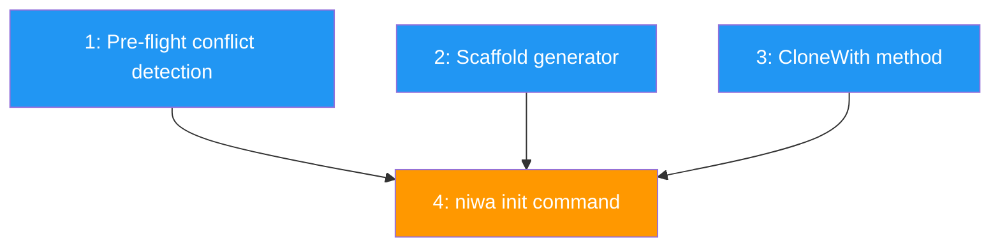

# PLAN: Init command

## Status

Draft

## Scope Summary

Implements `niwa init` with three modes: local scaffold (commented template), named init (registry lookup or scaffold), and remote clone (shallow git clone into .niwa/). Includes pre-flight conflict detection and registry integration.

## Decomposition Strategy

**Horizontal.** Components have clear interfaces: pre-flight checks, scaffold generator, clone extension, and CLI wiring. Pre-flight and scaffold are independent prerequisites; the CLI command depends on all three.

## Issue Outlines

### Issue 1: feat(cli): add pre-flight conflict detection for init

**Goal:** Implement pre-flight conflict detection for the init command. Before any filesystem writes, check for three conflict cases and return typed errors with recovery suggestions.

**Acceptance Criteria:**
- [ ] Define sentinel errors `ErrWorkspaceExists`, `ErrInsideInstance`, `ErrNiwaDirectoryExists`
- [ ] Define `InitConflictError` struct with `Err`, `Detail`, `Suggestion` fields; implement `error` interface and `errors.Is` unwrapping
- [ ] `CheckInitConflicts(dir string) error` runs detection in order: Case 1 -> Case 3 -> Case 2
- [ ] Case 1: `.niwa/workspace.toml` exists -> error suggesting `niwa apply`
- [ ] Case 3: `.niwa/` exists without workspace.toml -> error suggesting removal
- [ ] Case 2: `DiscoverInstance(dir)` finds instance -> error with instance path
- [ ] Return nil when no conflicts detected
- [ ] All checks read-only (no filesystem writes)
- [ ] Unit tests for each case, no-conflict path, and detection order

**Dependencies:** None

---

### Issue 2: feat(config): add workspace scaffold generator

**Goal:** Create `internal/workspace/scaffold.go` with `Scaffold(dir, name string) error` that writes a commented workspace.toml template and creates empty content directory.

**Acceptance Criteria:**
- [ ] `Scaffold(dir, name string) error` creates `.niwa/` directory, writes `.niwa/workspace.toml`, creates `.niwa/claude/`
- [ ] Only `[workspace]` is active; all other sections commented out with examples
- [ ] Non-empty name uses `name = "<name>"`; empty name uses `name = "workspace"`
- [ ] Template is a Go string constant
- [ ] Written file is valid TOML (parses when comments stripped)
- [ ] Unit tests cover both name variants and verify contents

**Dependencies:** None

---

### Issue 3: feat(workspace): extend Cloner with CloneWith method

**Goal:** Add `CloneWith(ctx, url, dir, opts)` to `Cloner` with `CloneOptions` (Ref, Depth). Refactor existing `Clone`/`CloneWithBranch` as wrappers. Add URL resolution from org/repo using CloneProtocol.

**Acceptance Criteria:**
- [ ] `CloneOptions` struct with `Ref string` and `Depth int`
- [ ] `CloneWith` on Cloner; `Depth > 0` adds `--depth`; `Ref` as branch adds `--branch`; `Ref` as commit SHA clones then checkouts
- [ ] `Clone` and `CloneWithBranch` delegate to `CloneWith`
- [ ] URL resolution helper: org/repo -> HTTPS or SSH URL based on protocol string
- [ ] Unit tests for shallow args, ref types, URL resolution, wrapper equivalence
- [ ] Existing tests pass

**Dependencies:** None

---

### Issue 4: feat(cli): implement niwa init command with three modes

**Goal:** Wire `niwa init` cobra subcommand integrating pre-flight checks, scaffold, clone, and registry into three modes.

**Acceptance Criteria:**
- [ ] `internal/cli/init.go` with cobra `init` subcommand, optional `<name>` arg, `--from` flag
- [ ] No-args: scaffold with name="workspace", no registry entry
- [ ] Named (unregistered): scaffold with given name, register as local-only
- [ ] Named (registered with source): clone from registered source
- [ ] `--from`: shallow clone config repo, register name-to-source
- [ ] Pre-flight checks before any writes in all modes
- [ ] Print resolved source URL before cloning (trust chain visibility)
- [ ] Post-flight: verify .niwa/workspace.toml exists and parses
- [ ] Success message with next-steps guidance
- [ ] Unit tests for mode selection, flag parsing, error paths

**Dependencies:** Issue 1, Issue 2, Issue 3

## Dependency Graph

**Legend:** Blue = ready to start, Orange = blocked by dependencies

## Implementation Sequence

**Critical path:** Any of Issues 1/2/3 -> Issue 4 (2 deep)

**Recommended order:**

1. **Issues 1, 2, 3 in parallel** -- all independent, no dependencies
2. **Issue 4 last** -- wires everything together, depends on all three
