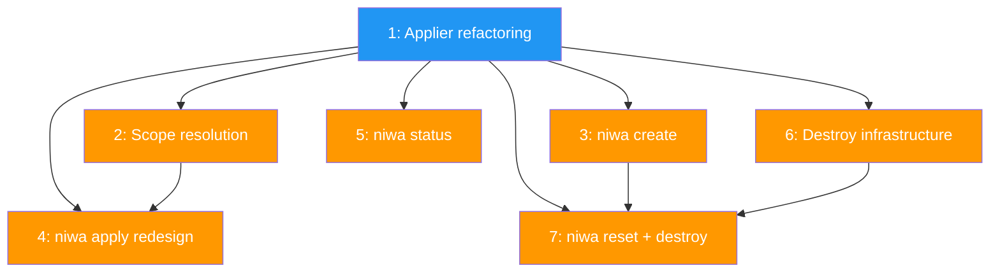

# PLAN: Instance lifecycle

## Status

Draft

## Scope Summary

Refactor the Applier into Create/Apply with shared pipeline, add scope resolution for apply's dual context, and implement niwa create, status, reset, and destroy commands. Completes roadmap features F4 and F6.

## Decomposition Strategy

**Walking skeleton.** The Applier refactoring (issue 1) is the spine -- all commands depend on the Create/Apply split. Subsequent issues add commands and infrastructure that build on the refactored API. Issues 2, 3, 5, 6 are independent after the skeleton; issues 4 and 7 depend on multiple predecessors.

## Issue Outlines

### Issue 1: refactor(workspace): split Applier into Create, Apply, and shared runPipeline

**Goal:** Split the existing Apply into Create (fresh instance in subdirectory), Apply (idempotent convergence with cleanup), and shared runPipeline. Add pipelineOpts/pipelineResult types.

**Acceptance Criteria:**
- [ ] `pipelineOpts` and `pipelineResult` types defined
- [ ] `runPipeline` unexported method extracts discover, classify, clone, install content
- [ ] `Create`: makes instance dir, calls runPipeline with nil state, assigns number, writes fresh state
- [ ] `Apply`: loads existing state (errors if missing), runs pipeline, diffs for removed repos/groups, cleans up managed files, updates state preserving Created/InstanceNumber
- [ ] Drift detection only in Apply path
- [ ] Existing tests updated for both paths
- [ ] `go test ./...` passes

**Dependencies:** None

---

### Issue 2: feat(workspace): add scope resolution for apply's dual context

**Goal:** Implement ResolveApplyScope with ApplyScope/ApplyMode types. Instance-first detection, --instance flag support.

**Acceptance Criteria:**
- [ ] ApplyMode constants: ApplySingle, ApplyAll, ApplyNamed
- [ ] ApplyScope struct with Mode, Instances, Config
- [ ] DiscoverInstance first, config.Discover fallback, EnumerateInstances for all
- [ ] --instance flag resolves by name from root
- [ ] Error on unknown instance name (lists available)
- [ ] Unit tests for all modes and error cases
- [ ] E2E flow still works

**Dependencies:** Issue 1

---

### Issue 3: feat(cli): implement niwa create command

**Goal:** Cobra create subcommand with optional --name flag, instance naming convention (config name, numbered, or custom), calling Applier.Create.

**Acceptance Criteria:**
- [ ] `internal/cli/create.go` with create subcommand
- [ ] --name flag for custom instance name
- [ ] Auto-numbering: first=config name, subsequent=config-2, config-3
- [ ] --name produces config-name (e.g., tsuku-hotfix)
- [ ] Calls Applier.Create, prints instance path
- [ ] Error if instance dir already exists
- [ ] Tests for naming logic
- [ ] E2E flow still works

**Dependencies:** Issue 1

---

### Issue 4: feat(cli): redesign niwa apply with dual scope

**Goal:** Rewrite cli/apply.go to use ResolveApplyScope. Root scope iterates all instances. Instance scope targets one. --instance flag for explicit targeting.

**Acceptance Criteria:**
- [ ] Uses ResolveApplyScope for context detection
- [ ] --instance flag added
- [ ] Workspace name arg still works via registry
- [ ] ApplyAll: iterate instances, apply each, collect errors
- [ ] ApplySingle/ApplyNamed: apply to one
- [ ] Per-instance error reporting (don't abort on first failure)
- [ ] Registry update after all instances complete
- [ ] E2E flow still works
- [ ] Tests for root/instance/named scope

**Dependencies:** Issue 1, Issue 2

---

### Issue 5: feat(cli): implement niwa status command

**Goal:** ComputeStatus function and cobra status subcommand with summary view from root, detailed view from instance.

**Acceptance Criteria:**
- [ ] ComputeStatus returns repo status (cloned/missing) and file status (ok/drifted/removed)
- [ ] Summary view from root: instance table (name, repos, drift count, last applied)
- [ ] Detailed view from instance: header, repos list, managed files list
- [ ] Optional instance arg from root shows detail
- [ ] Error when no workspace/instance found
- [ ] Unit tests for ComputeStatus
- [ ] E2E flow still works

**Dependencies:** Issue 1

---

### Issue 6: feat(workspace): add instance validation and destroy infrastructure

**Goal:** Implement ResolveInstanceTarget, ValidateInstanceDir, CheckUncommittedChanges, DestroyInstance.

**Acceptance Criteria:**
- [ ] ResolveInstanceTarget: name arg resolves from root, empty arg detects from cwd
- [ ] ValidateInstanceDir: instance.json must exist, workspace.toml must NOT
- [ ] CheckUncommittedChanges: git status --porcelain on each cloned repo
- [ ] DestroyInstance: validates then os.RemoveAll
- [ ] Tests: resolve by name, resolve from cwd, validate valid/invalid/root, dirty/clean repos, destroy valid/root-protected
- [ ] E2E flow still works

**Dependencies:** Issue 1

---

### Issue 7: feat(cli): implement niwa reset and destroy commands

**Goal:** Cobra reset and destroy subcommands with optional instance arg (detect from cwd), --force flag, uncommitted changes safety gate.

**Acceptance Criteria:**
- [ ] destroy subcommand: resolve, validate, check changes, RemoveAll
- [ ] reset subcommand: same checks, capture config, destroy, recreate via create+apply
- [ ] Optional instance arg; detect from cwd if omitted
- [ ] --force skips uncommitted changes check
- [ ] Block with dirty repo names when not forced
- [ ] Reset of local-only workspace errors with clear message
- [ ] Tests: destroy happy/blocked/forced, reset happy/local-only-error
- [ ] E2E flow still works

**Dependencies:** Issue 1, Issue 3, Issue 6

## Dependency Graph

**Legend:** Blue = ready to start, Orange = blocked by dependencies

## Implementation Sequence

**Critical path:** Issue 1 -> Issue 2 -> Issue 4 (3 deep) or Issue 1 -> Issue 6 -> Issue 7 (3 deep)

**Recommended order:**

1. **Issue 1** (skeleton) -- refactor Applier, everything depends on this
2. **Issues 2, 3, 5, 6 in parallel** -- all independent after skeleton
3. **Issue 4** after 1+2 -- apply redesign needs scope resolution
4. **Issue 7** after 1+3+6 -- reset/destroy needs create and destroy infra
