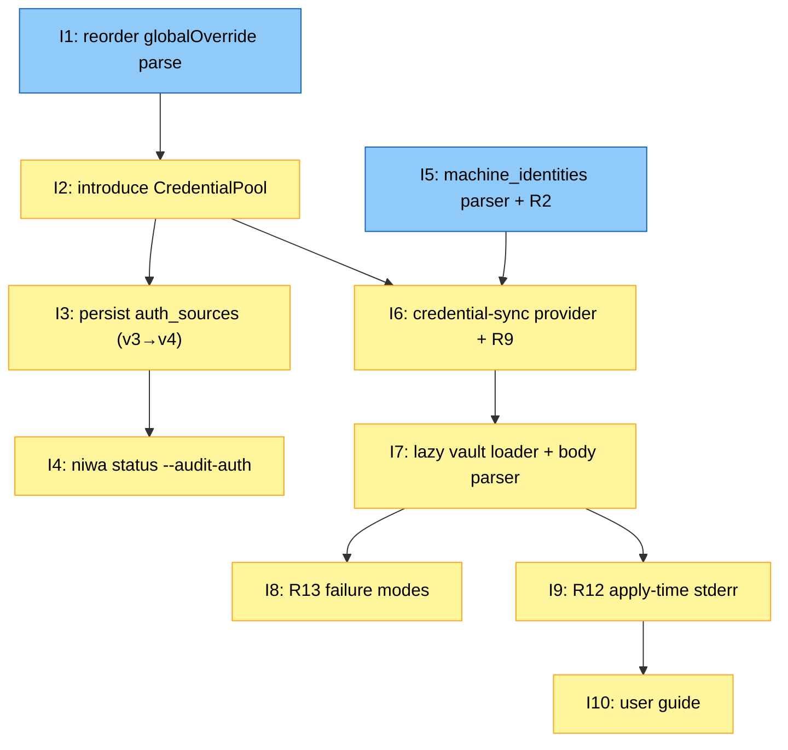

# PLAN: Machine Identity Vault Sync

## Status

Draft

## Scope Summary

Implements PRD R1-R18 by wiring the personal-overlay vault provider
into niwa's existing credential-pool plumbing so the local
`provider-auth.toml` is augmented (never replaced) by vault-sourced
machine-identity entries. Ships offline `niwa status --audit-auth`,
R12 stderr emission, structural R9 chicken-and-egg enforcement, and
an `auth_sources` field on `state.json` (schema v3 → v4). Companion
PRD: `docs/prds/PRD-machine-identity-vault-sync.md`.

## Decomposition Strategy

**Horizontal decomposition.** The design's Implementation Approach
already partitions the work into Phase A (refactor foundation),
Phase B (state + audit command), Phase C (opt-in + lazy vault
loader), and Phase D (R9, R13, R12). Each phase delivers a
coherent component before the next. There is no end-to-end
"skeleton with stubs" issue — Phase A is a no-behavior-change
refactor that lands first, and capability layers thicken in
sequence.

R9 (chicken-and-egg validation) lifts from Phase D into Phase C
(Issue 6) because it is a precondition for safely opening the
credential-sync provider — without it, opt-in could silently
create a bootstrap cycle.

## Issue Outlines

### Issue 1: refactor(workspace): reorder globalOverride parse ahead of overlay sync

**Complexity:** testable

**Goal:** Move the `globalOverride` parse from `apply.go:713-726`
to a new Step 0.3 ahead of the workspace-overlay sync block, so
opt-in detection precedes the existing `injectProviderTokens` call
at `apply.go:592`.

**Acceptance Criteria:**
- `globalOverride` parse runs as Step 0.3 in the apply pipeline
  (before the workspace-overlay sync block at the existing
  `apply.go:509` region).
- All current readers of `globalOverride` continue to work
  (CheckVaultScopeAmbiguity, the two `injectProviderTokens` calls
  at the existing 742/746, BuildBundle for the personal-overlay
  registry, plus guardrail / shadow checks).
- Representative apply scenario produces byte-identical
  stderr/stdout/exit code before vs. after this commit (PRD AC-28).
- Reorder is its own commit with a focused diff.
- No new files, no public API changes.

**Dependencies**: None.

### Issue 2: feat(workspace): introduce CredentialPool with file-only path and audit log

**Complexity:** testable

**Goal:** Add `internal/workspace/credentialpool.go` with the
`CredentialPool` type, `Source` constants, and `AuditRecord`.
Refactor `injectProviderTokens` to take a `*CredentialPool`. No
vault loader wired yet; non-opting-in users see byte-identical
behavior.

**Acceptance Criteria:**
- New `credentialpool.go` defines `Source`, `AuditRecord`,
  `CredentialPool`, and placeholder `vaultCredLoader` /
  `vaultLookupResult` types.
- `NewCredentialPool(file, loader)` builds a pool. With nil
  loader, `Lookup` consults file entries only.
- `Lookup(ctx, kind, project)` returns `(*ProviderAuthEntry,
  AuditRecord, error)`; appends an `AuditRecord` per call.
- `injectProviderTokens` signature updates to take `*CredentialPool`;
  three call sites at `apply.go:592, 742, 746` updated.
- `matchFileEntry` reuses `MatchProviderAuth` from
  `providerauth.go:102` so matching stays single-sourced.
- Existing apply unit tests pass; new unit tests cover file-only
  Lookup hit/miss, audit log accumulation.
- I1's snapshot test stays byte-identical (PRD AC-28, AC-29).
- No `secret.reveal.UnsafeReveal` use in this issue.

**Dependencies**: <<ISSUE:1>>.

### Issue 3: feat(workspace): persist credential-source records in state.json (v3→v4)

**Complexity:** testable

**Goal:** Bump `SchemaVersion` to 4 in `internal/workspace/state.go`,
add `AuthSources` field on `InstanceState`, write a v3→v4 migration
shim in `LoadState`, and persist `pool.AuditLog().AsMap()` at
state-save time.

**Acceptance Criteria:**
- `SchemaVersion = 4`.
- `InstanceState.AuthSources map[string]AuthSourceRecord` with
  `json:"auth_sources,omitempty"`.
- `AuthSourceRecord struct { Source string; Fallback string }` with
  appropriate JSON tags.
- Migration shim initializes `AuthSources` to empty map when
  reading a v3 file; v1→v2→v3 chain remains intact.
- On successful apply, saved state's `auth_sources` matches
  `pool.AuditLog()` entries.
- On failed apply, previous state file is not overwritten
  (existing semantics).
- Forward-version check still rejects v4 files when read by a
  v3-aware binary.
- Unit tests cover fresh write, v3 read with empty AuthSources,
  v3-with-other-fields preservation, round-trip with non-empty
  audit log.
- No new files under `~/.config/niwa/` (PRD AC-30).

**Dependencies**: <<ISSUE:2>>.

### Issue 4: feat(cli): add niwa status --audit-auth offline audit command

**Complexity:** testable

**Goal:** Add `--audit-auth` flag to `internal/cli/status.go` that
reads `auth_sources` from `state.json`, renders the four-column
text table per PRD R11, and sets exit code 0 unless any row has
SOURCE=`none`.

**Acceptance Criteria:**
- `--audit-auth` flag added to `niwa status`.
- One read of state.json suffices; output matches PRD R11 example
  format with KIND, PROJECT-UUID, SOURCE, FALLBACK columns.
- Rows sort by KIND ascending then PROJECT-UUID ascending,
  stable across runs (PRD AC-7 to AC-10).
- FALLBACK renders `—` (em-dash) when empty.
- Anonymous credential-sync renders `vault:(anonymous)` for
  SOURCE / FALLBACK; never bare `vault:` (PRD AC-39).
- Exit 0 when every row has non-`none` SOURCE; non-zero when any
  row has SOURCE=`none` (PRD AC-11).
- Zero network calls, verified by deny-network test (PRD AC-12).
- Help text mentions offline-only nature; references `--check-vault`
  as v1.1 deferred.
- Unit tests cover empty `auth_sources`, single-row variants for
  every SOURCE/FALLBACK combination, sort stability, and
  non-zero-exit on `none`.

**Dependencies**: <<ISSUE:3>>.

### Issue 5: feat(config): machine_identities opt-in parser with R2 validation

**Complexity:** testable

**Goal:** Add `MachineIdentitiesConfig` struct and a
`validateMachineIdentities` helper called from
`ParseGlobalConfigOverride` after `cfg.Global.Vault.Validate(...)`.

**Acceptance Criteria:**
- `MachineIdentitiesConfig struct { From string }` defined in
  `internal/config/config.go`.
- `GlobalOverride` gains `MachineIdentities *MachineIdentitiesConfig`
  field, optional.
- `validateMachineIdentities(prefix, ov)` runs the R2 check with
  diagnostics matching PRD R2.
- `ParseGlobalConfigOverride` calls helper after existing
  `Vault.Validate("global overlay")` and propagates errors.
- PRD AC-1 through AC-5 covered in unit tests.
- Absent `[global.machine_identities]` block leaves
  `MachineIdentities` nil and runs no validation.
- Unit tests include the AC-34 case where `from = "X"` matches a
  team-config provider name but not a personal-overlay one (R10
  diagnostic via R2's "not declared in this file" path).

**Dependencies**: None.

### Issue 6: feat(workspace): credential-sync provider lifecycle and R9 bootstrap check

**Complexity:** critical

**Goal:** Add `openCredentialSyncProvider` and
`validateCredentialSyncBootstrap` (two-stage). Provider opens via
`vault.DefaultRegistry.Build` + `bundle.Get`. `injectProviderTokens`
is deliberately NOT called for this spec — structural R9
enforcement.

**Acceptance Criteria:**
- `pickCredentialSyncSpec(g, mi)` resolves the spec from
  `g.Vault.Provider` (anonymous) or `g.Vault.Providers[mi.From]`
  (named).
- `openCredentialSyncProvider(ctx, g, mi)` returns the bundle
  (caller `defer CloseAll`), the provider, and the spec; uses
  `vault.DefaultRegistry.Build(ctx, []ProviderSpec{spec})` +
  `bundle.Get(spec.Name)`.
- `injectProviderTokens` is NOT called against this spec; unit
  test asserts `Config["token"]` is empty when `Get` returns the
  provider.
- `validateCredentialSyncBootstrapPreOverlay(file, globalVault,
  syncSpec)` errors when syncSpec's `(kind, project)` matches any
  file entry or any global-override vault spec.
- `validateCredentialSyncBootstrapPostOverlay(overlayVault,
  syncSpec)` errors when syncSpec's `(kind, project)` matches any
  workspace-overlay spec.
- Both errors render PRD R9 diagnostic verbatim.
- Apply.go Step 0.4 wires open + pre-overlay validation;
  post-overlay validation runs after overlay parse; on failure,
  `bundle.CloseAll()` runs cleanly via existing defer.
- PRD AC-25, AC-26, AC-27 covered.

**Dependencies**: <<ISSUE:5>>, <<ISSUE:2>>.

### Issue 7: feat(workspace): lazy vault credential loader with body parsing

**Complexity:** critical

**Goal:** Wire `vaultCredLoader` into `CredentialPool` when opt-in
is detected. Implement `Lookup` algorithm with cache;
`parseProviderAuthBody` with 8 KiB cap, R8 version validation, and
missing-field checks. Use `secret.reveal.UnsafeReveal` with
documented justification.

**Acceptance Criteria:**
- `vaultCredLoader struct { Provider, ProviderName, PathPrefix }`
  fleshed out from I2's placeholder.
- `Lookup` algorithm: file-first; on file miss with non-nil
  loader, build `vault.Ref` and call `Provider.Resolve`.
- `errors.Is(err, vault.ErrKeyNotFound)` → silent fallthrough
  (PRD R13.3).
- `errors.Is(err, vault.ErrProviderUnreachable)` → wrap and
  surface to caller (handled in I8).
- On success, call `secret.reveal.UnsafeReveal(sv)` then
  `parseProviderAuthBody(kind, project, bodyBytes)`. Call site
  has a code comment cross-referencing the Security § "New
  surfaces" entry.
- `parseProviderAuthBody` enforces 8 KiB size cap before
  `toml.Unmarshal` (oversized body test passes).
- R8 version handling: missing → "1"; not "1" → unsupported
  version error (PRD AC-23, AC-24).
- Missing `client_id` / `client_secret` → field error containing
  path and field name only.
- Apply.go Step 0.4 builds loader from I6's bundle and passes to
  `NewCredentialPool`.
- PRD AC-1, AC-2 end-to-end smoke test passes.
- PRD AC-31: second apply re-fetches.
- PRD AC-37: un-referenced pairs trigger zero `Resolve` calls.

**Dependencies**: <<ISSUE:6>>.

### Issue 8: feat(workspace): R13 failure-mode error wiring for vault credentials

**Complexity:** testable

**Goal:** Classify lookup errors per PRD R13 and connect them to
apply-time exit codes and stderr diagnostics. Cover all 10 R13
rows.

**Acceptance Criteria:**
- `wrapVaultUnreachable(err)` produces a sentinel the apply
  orchestrator can detect.
- Apply batches "vault unreachable" detections across all
  `injectProviderTokens` calls and emits R13.1 aggregated warning
  exactly once per apply (PRD AC-16).
- When at least one pair has no fallback, apply exits non-zero
  with the warning still appearing (PRD AC-17).
- `vault.ErrKeyNotFound` does NOT trigger a stderr line (PRD AC-18).
- Body parse / missing field / unsupported version errors render
  with kind+project context, never bytes (PRD AC-19, AC-20, AC-21,
  AC-23, AC-36 sentinel-byte test).
- HTTP 401 from backend wraps with `(kind, project)` context
  (PRD AC-22).
- Audit log records SOURCE=`none` for unresolvable pairs (PRD AC-11).
- Functional Gherkin scenarios (`@critical`) cover R13.1 and R13.2.

**Dependencies**: <<ISSUE:7>>.

### Issue 9: feat(workspace): R12 apply-time stderr emission for credential sources

**Complexity:** testable

**Goal:** After `injectProviderTokens` completes, walk
`pool.AuditLog()` and emit per-pair `auth: ...` stderr lines.

**Acceptance Criteria:**
- Every `Source == SourceVault` record produces exactly one
  `auth: <kind>/<project> source=vault:<provider-name>` line
  (PRD AC-13).
- Every `Source == SourceLocalFile && Fallback != ""` record
  produces one `auth: ... source=local-file fallback=<fallback>`
  line (PRD AC-14).
- No line for `cli-session`, pure local-file (no fallback), or
  `none` sources (PRD AC-15).
- Anonymous vault provider renders `vault:(anonymous)`, never
  bare `vault:` (PRD AC-39).
- Two pairs sharing a provider name produce two distinct lines
  (per-pair grouping per R12).
- Lines emit in deterministic KIND, PROJECT-UUID order.
- Lines flow through existing `Reporter` (no new stderr surface).
- No vault calls during emission.
- No-opt-in apply path emits zero `auth:` lines (PRD AC-29).
- Unit tests cover all source/fallback variants plus anonymous
  rendering.
- Functional Gherkin scenario asserts a representative two-pair
  apply produces exactly two `auth:` lines.

**Dependencies**: <<ISSUE:7>>.

### Issue 10: docs(guides): machine-identity-vault-sync user guide

**Complexity:** simple

**Goal:** Add `docs/guides/machine-identity-vault-sync.md`
covering opt-in syntax, vault key schema, populating the
personal vault, the `--audit-auth` workflow, fresh-laptop
bootstrap, rotation, and common errors. List the guide in
`niwa/CLAUDE.md`'s Contributor Guides section.

**Acceptance Criteria:**
- New file `docs/guides/machine-identity-vault-sync.md` exists.
- Sections: When to use this; Opt-in syntax; Vault key schema;
  Populating the vault; Fresh-laptop bootstrap; `--audit-auth`
  command; Rotation; Common errors with remediation hints.
- Sample `--audit-auth` output matches the actual rendered table
  from I4.
- Sample apply-time stderr matches actual R12 output from I9.
- Each error scenario includes one or two-sentence remediation
  guidance.
- `niwa/CLAUDE.md` Contributor Guides gains an entry pointing to
  the new guide.
- No emojis, no AI-attribution, no AI tells (per
  `.claude/helpers/writing-style.md`).

**Dependencies**: <<ISSUE:9>>.

## Dependency Graph

**Legend**: Blue = ready (no remaining blockers); Yellow = blocked
(waiting on a dependency).

## Implementation Sequence

**Critical path** (6 of 10 issues):
I1 → I2 → I6 → I7 → I9 → I10

The credential-sync chain dominates. I8 has no downstream
dependent so it parallels I9 once I7 lands.

**Recommended order:**

1. Land **I1** and **I5** in parallel (both have no dependencies).
   I1 is the bigger refactor; I5 is the parser change.
2. Land **I2** after I1 (the pool refactor + injectProviderTokens
   signature change).
3. Once I2 and I5 are both in, land **I6** (the credential-sync
   provider lifecycle and R9 check). This is the riskier piece —
   review carefully.
4. **I7** follows I6 (the lazy loader and body parser, with the
   new `UnsafeReveal` caller). After this, the feature is
   functionally complete on the happy path.
5. **I8** and **I9** can be developed in parallel once I7 is in.
   I8 is error wiring; I9 is stderr emission.
6. **I3** and **I4** form an independent sub-chain that can land
   any time after **I2**: I3 (state schema), then I4 (status
   command). This is useful to have early for debugging the
   Phase C work.
7. **I10** (user guide) lands last because it documents shipped
   error wording and stderr formats from I8 and I9.

**Parallelization opportunity for single-pr review**: organize
the PR so reviewers can read I1 + I5 together (foundation), then
I2 + I3 + I4 (refactor + audit infrastructure), then I6 + I7
(security-sensitive core), then I8 + I9 (visibility surfaces),
then I10 (docs). This grouping respects dependencies while
helping reviewers chunk the diff.

**Acceptance bar for the PR**: every PRD AC-1 through AC-39
passes; functional Gherkin scenarios for R13.1, R13.2, the
representative two-pair R12 emission, and the R9 chicken-and-egg
case all pass. Snapshot tests from I1 and I2 confirm
byte-identical apply output for non-opting-in users (PRD AC-28,
AC-29). No new files under `~/.config/niwa/` (PRD AC-30).
