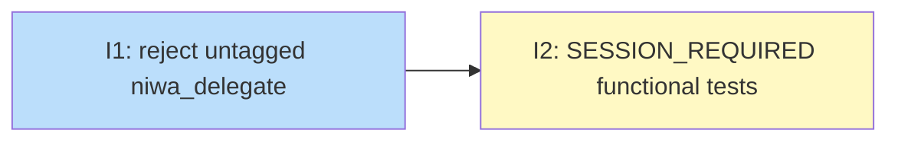

# PLAN: Mesh Session Lifecycle

## Status

Draft

## Scope Summary

Implement the remaining unfinished portion of the mesh session lifecycle design:
enforce `SESSION_REQUIRED` when `niwa_delegate` is called without a `session_id`,
add a `read_only: true` opt-out for tasks that make no git changes, and add
comprehensive functional test coverage for the new delegation contract.

## Decomposition Strategy

**Horizontal decomposition.** The remaining work is a targeted guard added to
an existing handler (`handleDelegate`) followed by test coverage of that guard.
No new end-to-end flow needs integrating — the session routing path already
works. A two-issue horizontal sequence (implementation → tests) is the
appropriate shape.

## Issue Outlines

### Issue 1: feat(mcp): reject untagged niwa_delegate; add read_only delegation opt-out

**Goal**: Add `ReadOnly bool` to `delegateArgs` and enforce `SESSION_REQUIRED` when `session_id` is empty and `read_only` is false; also fix two stale passages in the design doc and update the skill injection to document the new delegation contract.

**Acceptance Criteria**:
- [ ] `ReadOnly bool json:"read_only,omitempty"` field added to `delegateArgs` in `internal/mcp/handlers_task.go`
- [ ] `handleDelegate` returns `SESSION_REQUIRED` when `session_id == ""` and `args.ReadOnly == false`
- [ ] `handleDelegate` routes to main clone (existing behavior) when `session_id == ""` and `args.ReadOnly == true`
- [ ] `handleDelegate` routes to the session worktree inbox when `session_id` is non-empty, regardless of `read_only` value (`session_id` takes precedence)
- [ ] Unit tests cover all three cases: `SESSION_REQUIRED` path, `read_only` opt-out path, and `session_id` present path
- [ ] `buildSkillContent()` in `internal/workspace/channels.go` updated to document `session_id` as required on `niwa_delegate`, with `read_only: true` as the opt-out for tasks that make no git changes
- [ ] Decision 1 Option A text in `docs/designs/current/DESIGN-mesh-session-lifecycle.md` updated to remove the claim that the `session_id == ""` path is "byte-for-byte identical to the current behavior"
- [ ] Consequences section in `docs/designs/current/DESIGN-mesh-session-lifecycle.md` updated to remove the claim that `niwa_delegate` without `session_id` is unchanged

**Dependencies**: None

**Type**: code

### Issue 2: test(functional): SESSION_REQUIRED and read_only delegation scenarios

**Goal**: Add @critical Gherkin scenarios covering SESSION_REQUIRED rejection on untagged delegate, read_only routing to main clone, session-routed delegate regression, session_id vs read_only precedence, and the full coordinator workflow golden path.

**Acceptance Criteria**:
- [ ] All new scenarios live in `test/functional/features/mesh.feature` under a clearly commented section (e.g., `# Delegation isolation (SESSION_REQUIRED / read_only contract)`)
- [ ] All five scenarios below are tagged `@critical` so they run under `make test-functional-critical`
- [ ] All scenarios use the `localGitServer` helper so they run offline without network access
- [ ] `make test-functional-critical` passes with all five new scenarios included

**Scenario 1 — SESSION_REQUIRED rejection:**
- [ ] A scenario named "niwa_delegate without session_id returns SESSION_REQUIRED" is added
- [ ] When `niwa_delegate` is called with no `session_id` and no `read_only` flag via the MCP tool, the MCP response contains error code `SESSION_REQUIRED`
- [ ] No task envelope file exists under `.niwa/tasks/` in the instance after the call (zero `.json` files)

**Scenario 2 — read_only routing to main clone:**
- [ ] A scenario named "niwa_delegate with read_only:true and no session_id routes to main clone" is added
- [ ] When `niwa_delegate` is called with `read_only: true` and no `session_id`, the task is written to the main instance daemon's inbox (not any worktree inbox)
- [ ] The task state eventually becomes "completed" within 30 seconds
- [ ] No session worktree directory exists under `.niwa/worktrees/`

**Scenario 3 — session-routed delegate regression:**
- [ ] A scenario named "niwa_delegate with session_id routes to session worktree daemon (regression)" is added
- [ ] When `niwa_delegate` is called with a valid `session_id` (no `read_only`), the task state in the session worktree eventually becomes "completed" within 60 seconds
- [ ] No task envelope is written to the main instance daemon's inbox (main `.niwa/roles/app/inbox/` remains empty or unchanged)

**Scenario 4 — session_id takes precedence over read_only:**
- [ ] A scenario named "niwa_delegate with both session_id and read_only:true routes to session worktree" is added
- [ ] When `niwa_delegate` is called with both `session_id` and `read_only: true`, the task is routed to the session worktree daemon (not the main clone)
- [ ] The task state eventually becomes "completed" within 60 seconds

**Scenario 5 — coordinator workflow golden path:**
- [ ] A scenario named "Coordinator golden path: create session, delegate with session_id, work completes, session destroyed" is added
- [ ] When the coordinator calls `niwa_create_session` for repo "app", then `niwa_delegate` with the returned `session_id`, the task state in the session worktree eventually becomes "completed" within 60 seconds
- [ ] When the coordinator calls `niwa_destroy_session`, the session status is "ended" in the lifecycle state file and the worktree directory no longer exists on disk

**Dependencies**: Blocked by <<ISSUE:1>>

**Type**: code

## Dependency Graph

**Legend**: Green = done, Blue = ready, Yellow = blocked

## Implementation Sequence

**Critical path**: I1 → I2 (2 issues in sequence)

**Start with I1.** The handler guard, `read_only` field, unit tests, skill update, and
design doc consistency fixes are all one coherent change — implement and commit together.

**Then I2.** The functional tests depend on the guard being in place. Five @critical
Gherkin scenarios: SESSION_REQUIRED rejection, read_only routing, session-routed
regression, precedence check (session_id beats read_only), and the coordinator golden
path end-to-end.
