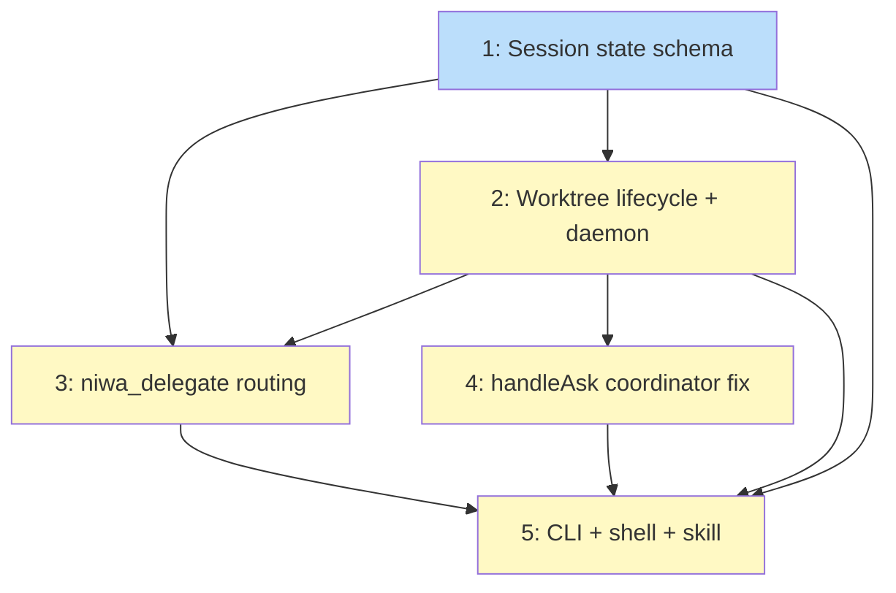

# PLAN: Mesh Session Lifecycle

## Status

Draft

## Scope Summary

Implement git worktree-based sessions for the niwa mesh: per-session lifecycle state
files, session creation and destruction with per-worktree daemons, session-targeted
task delegation via direct inbox writes, a coordinator routing fix for `handleAsk`
inside session worktrees, and CLI commands with an updated injected skill.

## Decomposition Strategy

**Horizontal.** The design has five clearly ordered phases with stable interfaces
between them. Component 1 (session state schema) outputs functions consumed by all
later components; Component 2 (worktree lifecycle) outputs daemon infrastructure
consumed by Components 3–5. The primary integration point is filesystem-based (session
state files, inbox directories), which can be verified without a running daemon.

A walking skeleton was considered and rejected: the earliest end-to-end path requires
both the daemon extension (Component 2) and the MCP handler changes (Components 3–4),
offering no earlier integration feedback than horizontal ordering while adding partial
states that complicate rollback testing.

## Issue Outlines

### Issue 1: Session lifecycle state schema and registry

**Goal**: Implement `internal/mcp/session_lifecycle.go` with the `SessionLifecycleState`
struct, atomic write/read functions, directory scanner, and ID generator — the data
layer all other components depend on.

**Acceptance Criteria**:
- [ ] `SessionLifecycleState` struct with all 11 fields: `V`, `SessionID`,
      `ParentSessionID` (omitempty), `Repo`, `Purpose`, `Status`, `CreationTime`,
      `WorktreePath`, `ClaudeConversationID` (omitempty), `CreatorPID`, `CreatorStartTime`
- [ ] `WriteSessionLifecycleState` uses temp file + rename; creates file with mode 0o600
- [ ] `ReadSessionLifecycleState` validates session ID against `^[0-9a-f]{8}$` before
      constructing any file path (path traversal guard)
- [ ] `ListSessionLifecycleStates` filters directory entries to `^[0-9a-f]{8}\.json$`,
      logs and skips corrupt files individually, does not call `IsPIDAlive` (callers
      compute liveness)
- [ ] `newSessionLifecycleID` checks for collision with existing `.json` files; retries
      up to 5 times before returning an error
- [ ] Unit tests cover: round-trip write/read, invalid session ID rejection (path
      traversal characters, wrong length), corrupt-file skip in list, collision retry

**Dependencies**: None

---

### Issue 2: Session worktree lifecycle and per-worktree daemon startup

**Goal**: Implement `niwa_create_session` and `niwa_destroy_session` MCP handlers,
extend `EnsureDaemonRunning` to forward extra env vars, and wire `ClaudeConversationID`
capture into the per-worktree daemon's task lifecycle.

**Acceptance Criteria**:
- [ ] `EnsureDaemonRunning(instanceRoot string, extraEnv []string) error` — all existing
      call sites audited (`grep -r EnsureDaemonRunning`) and updated to pass `nil`
- [ ] Extra env vars forwarded to daemon process and baked into `WorkerMCPConfig`
- [ ] Private `scaffoldWorktreeNiwa(worktreePath, repo string)` creates
      `roles/<repo>/inbox/{in-progress,cancelled,expired,read}/`, `tasks/`,
      `daemon.pid`, `daemon.log`; does NOT create `mcp.json` or `workspace-context.md`
- [ ] `niwa_create_session(repo, purpose, parent_session_id)`:
  - Validates role exists at `mainInstanceRoot/.niwa/roles/<repo>/` before any side effect
  - Creates branch `session/<session-id>` from the repo's default branch
  - Creates worktree at `<mainInstanceRoot>/.niwa/worktrees/<repo>-<session-id>/`
  - Scaffolds `.niwa/` layout; writes session state file with `status="active"`
  - On any failure after `git worktree add`: calls `git worktree remove --force`
    before returning (prevents orphaned worktrees)
  - Calls `EnsureDaemonRunning(worktreePath, ["NIWA_MAIN_INSTANCE_ROOT=<main>"])`
  - Returns session ID and worktree path
- [ ] `niwa_destroy_session(session_id)`:
  - Idempotent: returns current state if status is `"ended"` or `"abandoned"`
  - Force-kills workers with in-progress tasks in this session's inbox; writes task
    state as `abandoned` with reason `"session_destroyed"`
  - Writes session state with `status="ended"`
  - Terminates daemon; removes worktree (silently ignores ENOENT)
  - Deletes `session/<session-id>` branch if unmerged and no PR
- [ ] `ClaudeConversationID` capture: on first task `running` transition, per-worktree
      daemon reads `state.json.Worker.ClaudeSessionID`; writes to session state file
      atomically if field is absent (one-time write)
- [ ] Functional tests: create verifies state file, branch, daemon pid, scaffold dirs;
      destroy is idempotent and handles orphaned worktree silently

**Dependencies**: Blocked by <<ISSUE:1>>

---

### Issue 3: Session-targeted task routing in niwa_delegate

**Goal**: Extend `handleDelegate`, `handleCancelTask`, and `handleUpdateTask` so that
tasks with a `session_id` are delivered to the correct per-worktree daemon inbox, while
the `session_id == ""` path remains byte-for-byte identical to current behavior.

**Acceptance Criteria**:
- [ ] `delegateArgs` and `TaskState` gain `SessionID string` field (omitempty in JSON)
- [ ] `handleDelegate` with `session_id != ""`:
  - Reads session state via `ReadSessionLifecycleState`; returns `SESSION_NOT_FOUND`
    on invalid ID or missing file
  - Returns `SESSION_INACTIVE` if `session.Status != "active"`
  - Validates `WorktreePath` is a subpath of `mainInstanceRoot` before any write
  - Validates role at `<worktreePath>/.niwa/roles/<role>/`; returns `UNKNOWN_ROLE` if absent
  - Writes task envelope to `<worktreePath>/.niwa/roles/<repo>/inbox/<taskID>.json`
  - Stores `session_id` in `TaskState.SessionID`
- [ ] `handleDelegate` with `session_id == ""`: no functional change (regression tested)
- [ ] `handleCancelTask` and `handleUpdateTask` reconstruct worktree inbox path from
      `TaskState.SessionID` when set
- [ ] Unit tests cover: session-routed delegate, cancel, update; `SESSION_INACTIVE`;
      `SESSION_NOT_FOUND`; existing `session_id == ""` behavior unchanged

**Dependencies**: Blocked by <<ISSUE:1>>, <<ISSUE:2>>

---

### Issue 4: Fix coordinator ask routing from session worktrees

**Goal**: Add `mainInstanceRoot` to the MCP server struct and guard `handleAsk` so
that `niwa_ask(to="coordinator")` inside a session worktree uses the main instance's
coordinator registry, not the worktree-local one.

**Acceptance Criteria**:
- [ ] `Server` struct gains `mainInstanceRoot string`; read from `NIWA_MAIN_INSTANCE_ROOT`
      at startup; zero value for non-session workers (no behavioral change)
- [ ] `handleAsk` guard at the top of the function:
      `if args.To == "coordinator" && s.mainInstanceRoot != ""` → call
      `lookupLiveCoordinator(s.mainInstanceRoot)` not `s.instanceRoot`
- [ ] All other targets fall through to `isKnownRole` unchanged
- [ ] Unit tests: coordinator ask from session worktree routes to main instance;
      non-session coordinator ask unchanged; non-coordinator targets unaffected by guard

**Dependencies**: Blocked by <<ISSUE:2>>

---

### Issue 5: CLI commands, shell wrapper helper, and skill update

**Goal**: Wire up `niwa session create/destroy/list` CLI commands, extract a shared
`__niwa_cd_wrap` shell helper, rename the coordinator-process `niwa session list` to
`niwa mesh list` with a one-release deprecation alias, extend `niwa go` for session
worktree navigation, and update the injected niwa-mesh skill.

**Acceptance Criteria**:
- [ ] `niwa session create <repo> <purpose>`: calls `writeLandingPath` and `hintShellInit`
      for shell navigation; `niwa session destroy <session-id>`: straightforward passthrough;
      `niwa session list [--repo] [--status]`: calls `niwa_list_sessions`
- [ ] `niwa_list_sessions` MCP handler registered; calls `ListSessionLifecycleStates`;
      supports `repo` and `status` filter args
- [ ] `niwa mesh list` command added; existing coordinator-process list logic moved there
- [ ] Old `niwa session list` (coordinator view) kept as deprecated alias: prints
      deprecation warning to stderr, delegates to `niwa mesh list`
- [ ] Functional test files audited and updated: references to `niwa session list`
      (coordinator view) changed to `niwa mesh list`
- [ ] `__niwa_cd_wrap` shell function extracted into `shellWrapperTemplate`; `create`
      and `go` arms refactored to call it; new `session)` arm calls it for `$2 == create`
- [ ] `niwa go <repo> <session-id>`: second arg matching `^[0-9a-f]{8}$` resolves to
      worktree path and calls `writeLandingPath`
- [ ] `niwaMCPToolNames` extended with `niwa_create_session`, `niwa_destroy_session`,
      `niwa_list_sessions`
- [ ] `buildSkillContent()` gains Session Management section; Delegation section updated
      with `session_id` parameter description; `channels_test.go` byte-count assertion updated
- [ ] Functional tests: `niwa session create` shell navigation; `niwa go <repo> <sid>` navigation

**Dependencies**: Blocked by <<ISSUE:1>>, <<ISSUE:2>>, <<ISSUE:3>>, <<ISSUE:4>>

---

## Implementation Issues

_(Single-pr mode: no GitHub issues. See Issue Outlines above.)_

## Dependency Graph

**Legend**: Green = done, Blue = ready, Yellow = blocked

## Implementation Sequence

**Critical path:** I1 → I2 → I3 → I5

Issue 2 is the highest-risk work (git worktree orchestration, daemon lifecycle,
`ClaudeConversationID` timing) and the gate for all other issues. It should be
implemented and reviewed immediately after Issue 1.

**Parallel opportunity:** I3 and I4 can be worked concurrently once I2 is done. They
touch different files (`handlers_task.go` for I3, `server.go` struct + `handleAsk` for
I4) with no overlap.

**Recommended authoring order within the PR:** I1 → I2 → I3 → I4 → I5. Reviewers can
read the diff in this order to follow the dependency chain top-down: data layer → daemon
orchestration → handler extensions → CLI surface.
