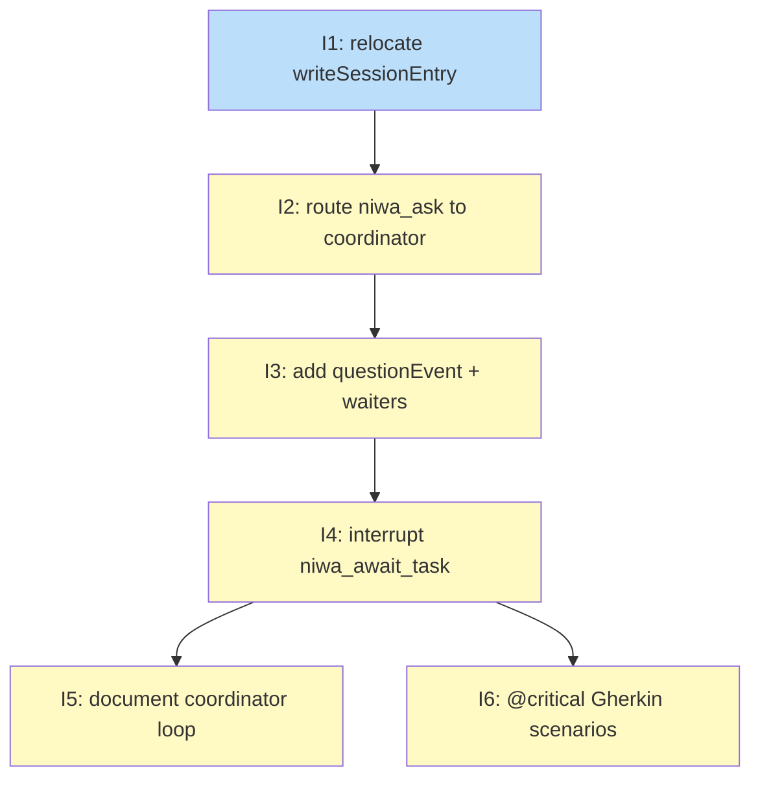

# PLAN: Route niwa_ask to live coordinator session

## Status

Draft

## Scope Summary

Route `niwa_ask(to='coordinator')` to live coordinator sessions instead of always spawning an ephemeral `claude -p` worker. Fixes the coordinator deadlock where both parties block indefinitely when a worker asks a question while the coordinator is blocking on `niwa_await_task`.

## Decomposition Strategy

**Horizontal decomposition.** Each issue delivers one complete, testable layer; the next issue builds on top of it. The strict serial order reflects hard prerequisites: the session registry must exist before routing, routing before channel dispatch, dispatch before the handler consumer, handler before docs, and docs before end-to-end tests.

## Issue Outlines

### Issue 1: feat(mcp): relocate writeSessionEntry and add maybeRegisterCoordinator

**Goal**: Move `writeSessionEntry` from `internal/cli/session_register.go` into `internal/mcp` (where `SessionEntry` and `SessionRegistry` already live), update the CLI to call the relocated function, and add a `maybeRegisterCoordinator` helper to `server.go` that writes a `SessionEntry` as a transparent side effect of the first `niwa_await_task` or `niwa_check_messages` call when `s.role == "coordinator"`.

**Acceptance Criteria**:
- [ ] `writeSessionEntry` is defined in `internal/mcp`; atomic write behavior (write to `.tmp`, rename) is preserved.
- [ ] `internal/cli/session_register.go` calls the relocated `mcp.WriteSessionEntry`; all existing CLI behavior is unchanged.
- [ ] `maybeRegisterCoordinator` exists in `internal/mcp/server.go`; it reads `sessions.json`, calls `IsPIDAlive` on any existing coordinator entry, and writes a new `SessionEntry` only when no live entry for that role exists; it is a no-op when `s.role != "coordinator"`.
- [ ] `handleAwaitTask` calls `maybeRegisterCoordinator` before blocking; `handleCheckMessages` calls it before returning results.
- [ ] Concurrent registrations are safe: `maybeRegisterCoordinator` uses the same atomic write pattern as the CLI path.
- [ ] Unit tests cover: new entry written when none exists; no-op when live entry already present; stale entry (dead PID) replaced with fresh one.
- [ ] `go test ./...` passes; `go vet ./...` reports no issues.

**Dependencies**: None

### Issue 2: feat(mcp): route niwa_ask to live coordinator inbox

**Goal**: Add registry lookup and `task.ask` notification write to `handleAsk` so that when a live coordinator session is registered and alive, worker questions queue in the coordinator's inbox with `_niwa_note` body wrapping instead of spawning an ephemeral worker.

**Acceptance Criteria**:
- [ ] `handleAsk` reads `sessions.json` and calls `IsPIDAlive` for any coordinator entry before deciding whether to spawn a worker.
- [ ] When a live coordinator is found, `handleAsk` writes a `task.ask` notification file to the coordinator's inbox directory and does not spawn an ephemeral worker.
- [ ] When no coordinator entry exists, or the entry's PID is not alive, `handleAsk` falls back to the existing ephemeral spawn path unchanged.
- [ ] Stale coordinator entries (dead PID) are pruned from `sessions.json` during the lookup.
- [ ] The notification matches the `task.ask` schema: fields `type`, `from`, `to`, `task_id`, and `body` containing `ask_task_id`, `from_role`, `_niwa_note`, and the original `question`.
- [ ] The `body` field uses `_niwa_note` wrapping (same pattern as `wrapDelegateBody`).
- [ ] The ask task is created before the branch executes so `awaitWaiters[askTaskID]` is registered regardless of which path runs.
- [ ] Unit test: fake `sessions.json` with a live PID entry → `task.ask` file written to coordinator inbox, no worker spawned.
- [ ] Unit test: fake `sessions.json` with a dead PID entry → falls back to ephemeral spawn, stale entry pruned.
- [ ] Unit test: missing `sessions.json` → falls back to ephemeral spawn without error.
- [ ] `go test ./...` passes; `go vet ./...` reports no issues.

**Dependencies**: Blocked by <<ISSUE:1>>

### Issue 3: feat(mcp): add questionEvent type and questionWaiters channel

**Goal**: Add `questionEvent` struct (`AskTaskID`, `FromRole`, `Body`) to `types.go`; add `questionWaiters map[string]chan questionEvent` to `Server` initialized under `waitersMu`; update `notifyNewFile` with a `task.ask` detection branch that dispatches to `questionWaiters[to.role]` using a non-blocking send; apply the deferred move-to-read fix to both terminal and question dispatch paths so files move to `inbox/read/` only after a successful channel send.

**Acceptance Criteria**:
- [ ] `types.go` defines `questionEvent` with fields `AskTaskID string`, `FromRole string`, and `Body json.RawMessage`.
- [ ] `questionWaiters` is typed `map[string]chan questionEvent` — not `map[string]chan taskEvent`.
- [ ] No `EvtQuestion` kind is added to `TaskEventKind`; `taskEvent` is not modified.
- [ ] `Server` struct has a `questionWaiters map[string]chan questionEvent` field; `NewServer()` initializes it alongside `awaitWaiters`; both maps are accessed under `waitersMu`.
- [ ] `notifyNewFile` detects `type == "task.ask"` and dispatches to `questionWaiters[to.role]` with a non-blocking send.
- [ ] Files move to `inbox/read/` only after a successful channel send; if the send is dropped (no waiter or full channel), the file stays in inbox.
- [ ] The deferred move-to-read fix is applied to the terminal dispatch path (`awaitWaiters`) in the same commit.
- [ ] Unit test: `notifyNewFile` with a `task.ask` file dispatches a `questionEvent` to `questionWaiters[role]` and moves the file to `inbox/read/` after the send.
- [ ] Unit test: `notifyNewFile` with a `task.ask` file and no registered waiter leaves the file in inbox.
- [ ] Unit test: `notifyNewFile` with a terminal event file moves it to `inbox/read/` only after the channel send succeeds (deferred fix regression coverage).
- [ ] `go test ./...` passes; `go vet ./...` reports no issues.

**Dependencies**: Blocked by <<ISSUE:2>>

### Issue 4: feat(mcp): interrupt niwa_await_task on incoming questions

**Goal**: Replace the single-channel receive in `handleAwaitTask` with a three-way select (terminal, question, timeout), register `questionWaiters[s.role]` before blocking, add a catch-up scan over `roleInboxDir` for pre-existing `task.ask` files after registration, and add `formatQuestionResult` to return `status:"question_pending"` with the full question payload so the coordinator can answer and re-wait.

**Acceptance Criteria**:
- [ ] `handleAwaitTask` registers both `awaitWaiters[delegatedTaskID]` and `questionWaiters[s.role]` before the catch-up scan and before blocking.
- [ ] The catch-up scan runs after both channels are registered; it lists `roleInboxDir` for `.json` files, reads each file's `type` field, and sends a non-blocking `questionEvent` to `questionWaiters[s.role]` for any file with `type == "task.ask"`; it does not filter by `seenFiles`.
- [ ] The blocking call uses a three-way select: `terminalCh` (task done), `questionCh` (question arrived), `time.After(timeout)` (timeout). The terminal and timeout arms are behaviorally identical to the current implementation.
- [ ] When `questionCh` fires, `handleAwaitTask` returns the output of `formatQuestionResult(qEvt)` immediately without waiting for the delegated task to finish.
- [ ] `formatQuestionResult` serializes `{status: "question_pending", ask_task_id, from_role, body}`; the `body` value carries the `_niwa_note` wrapper already written by `handleAsk`.
- [ ] Both `awaitWaiters[delegatedTaskID]` and `questionWaiters[s.role]` are deleted from their respective maps under `waitersMu` on every return path (terminal, question, timeout, error).
- [ ] A coordinator that receives `status:"question_pending"` can answer via `niwa_finish_task(task_id=ask_task_id, ...)` then re-call `niwa_await_task` with the original task ID without error.
- [ ] Re-calling `niwa_await_task` after a `question_pending` return registers fresh channels and repeats the catch-up scan.
- [ ] Unit test: `questionCh` fires before `terminalCh` → returns `question_pending` payload; `terminalCh` not consumed.
- [ ] Unit test: `terminalCh` fires before `questionCh` → returns terminal result; `questionWaiters` entry deregistered.
- [ ] Unit test: catch-up scan finds existing `task.ask` file before blocking → `question_pending` returned without waiting for watcher notification.
- [ ] Unit test: timeout fires when neither channel delivers → timeout result; both waiter entries deregistered.
- [ ] `go test ./...` passes; `go vet ./...` reports no issues.

**Dependencies**: Blocked by <<ISSUE:3>>

### Issue 5: docs(workspace): document coordinator question-handling loop in skill content

**Goal**: Update `buildSkillContent()` in `internal/workspace/channels.go` to document the `question_pending` status and coordinator re-wait loop pattern; add a "Coordinator question handling" section with both delivery paths and a worked example to `docs/guides/cross-session-communication.md`.

**Acceptance Criteria**:
- [ ] `buildSkillContent()` "Peer Interaction" section explains both delivery paths: `niwa_check_messages` (type == "task.ask") for a polling coordinator and `niwa_await_task` (status == "question_pending") for a blocking coordinator.
- [ ] `buildSkillContent()` "Peer Interaction" section documents `niwa_finish_task` (not `niwa_send_message`) as the mechanism for answering a question via either path.
- [ ] `buildSkillContent()` "Common Patterns" section includes the coordinator re-wait loop: `while result.status == "question_pending": niwa_finish_task(...); result = niwa_await_task(task_id)`.
- [ ] The re-wait loop pattern is consistent with the design doc's Key Interfaces section.
- [ ] `docs/guides/cross-session-communication.md` has a new "Coordinator question handling" section explaining both delivery paths with a worked example.
- [ ] The worked example covers: coordinator delegates a task, worker calls `niwa_ask` mid-task, coordinator receives `question_pending`, coordinator answers via `niwa_finish_task`, coordinator re-calls `niwa_await_task`, task reaches terminal state.
- [ ] `channels_test.go` still passes — frontmatter byte count stays under `skillFrontmatterCharLimit` (1536 bytes).
- [ ] No logic changes are made outside string literals in `buildSkillContent()` and the markdown guide.

**Dependencies**: Blocked by <<ISSUE:4>>

**Type**: docs

### Issue 6: test(functional): add @critical scenarios for live coordinator ask routing

**Goal**: Add three `@critical` Gherkin scenarios to `test/functional/features/` covering the end-to-end flows: worker question delivered via the `niwa_check_messages` path, worker question interrupting a coordinator blocked on `niwa_await_task`, and fallback to ephemeral spawn when no coordinator session is registered.

**Acceptance Criteria**:
- [ ] **Scenario 1** (`niwa_check_messages` path): coordinator polls `niwa_check_messages` after worker calls `niwa_ask`, receives a message with `type == "task.ask"`, answers via `niwa_finish_task`, and the worker's `niwa_ask` call returns the expected answer. No ephemeral spawn occurred.
- [ ] **Scenario 2** (`niwa_await_task` deadlock fix): coordinator blocks on `niwa_await_task`, worker calls `niwa_ask` mid-task, `niwa_await_task` returns with `status: "question_pending"`, coordinator answers via `niwa_finish_task`, coordinator re-calls `niwa_await_task`, task eventually completes. Neither party deadlocked or timed out.
- [ ] **Scenario 3** (fallback to spawn): no live coordinator is registered; worker calls `niwa_ask`; the spawn-command override is invoked. Confirms existing behavior is unchanged when no live coordinator is present.
- [ ] All three scenarios are tagged `@critical` and pass under `make test-functional-critical` within the 60-second wall-clock budget (each scenario under 10 seconds; timing overrides used as needed).
- [ ] Each scenario uses the `NIWA_WORKER_SPAWN_COMMAND` override and the scripted worker fake; no live Claude invocations are required.
- [ ] Worker fake scenarios are added to `test/functional/worker_fake/main.go` for each new coordination pattern.

**Dependencies**: Blocked by <<ISSUE:4>>

## Dependency Graph

**Legend**: Green = done, Blue = ready, Yellow = blocked, Purple = needs-design, Orange = tracks-design/tracks-plan

## Implementation Sequence

**Critical path**: Issue 1 → Issue 2 → Issue 3 → Issue 4 → Issue 5 (or Issue 6), depth 5.

Issues 1–4 form a strict serial chain. Each introduces types and runtime behavior that the next issue depends on directly:

- Issue 1 creates the session write path and `maybeRegisterCoordinator`; without it, Issue 2 has no registry to query.
- Issue 2 writes `task.ask` files to the coordinator inbox; without them, Issue 3's dispatch branch has nothing to detect.
- Issue 3 adds `questionWaiters` and the `notifyNewFile` branch; without the channel map, Issue 4 cannot register or receive from `questionWaiters[s.role]`.
- Issue 4 implements the three-way select and `question_pending` response; without the runtime behavior, Issues 5 and 6 have nothing to document or test.

**Parallelization**: Issues 5 and 6 can proceed concurrently after Issue 4 lands. They touch disjoint files (`internal/workspace/channels.go` + `docs/guides/` versus `test/functional/`) and have no shared state.

**Recommended order**: 1 → 2 → 3 → 4 → (5 and 6 in parallel).
