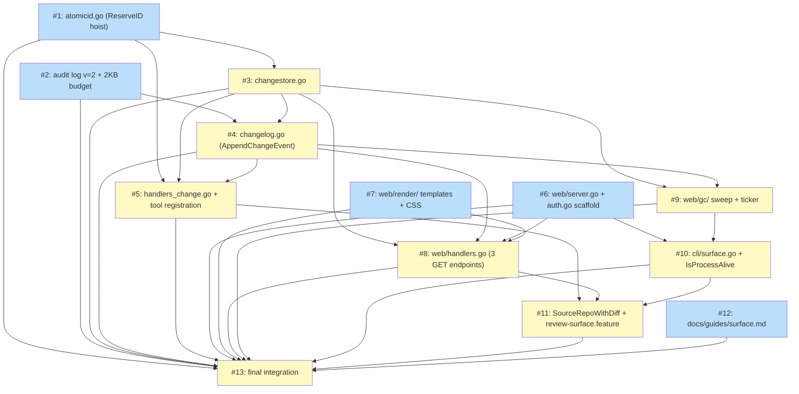

# PLAN: niwa Change-as-Reviewable Primitive and Basic Web Render (F5)

## Status

Draft

## Scope Summary

Decompose `DESIGN-niwa-change-primitive.md` into thirteen atomic
implementation issues that ship together as one PR on
`session/aa14fa23`. The plan introduces the `.niwa/changes/<id>/`
substrate, three new MCP tools, the `niwa surface serve` instance
singleton, the `internal/web/` HTTP listener, the GC sweep, and the
`@critical` Gherkin scenario that exercises the walking-skeleton path
end-to-end.

## Decomposition Strategy

**Horizontal, dependency-ordered.** The design is a substrate stack:
each layer composes on a lower one (atomic-ID hoist underpins the
change creator; the audit v=2 schema underpins the event emitter; the
event emitter and changestore underpin both the MCP handlers and the
GC sweep; the HTTP listener composes the changestore reads with the
render templates; the CLI command wires the listener to the process
lifecycle). A walking-skeleton variant was rejected because the
substrate has no useful intermediate state — a thin slice that creates
a change but cannot render it produces no observable behaviour, and a
thin slice that renders without the changestore primitive has nothing
to render.

The decomposition keeps each issue at 1–2 hours of focused work for an
agent with a fresh context window:

- Substrate hoists (#1, #2) come first and are independently testable.
- Per-change storage primitives (#3, #4) compose on the substrate but
  not on each other in the strict sense — #4 depends on #3 only for
  the path layout convention, not for code.
- The MCP tool layer (#5) composes on #1, #3, #4.
- The HTTP package decomposes by responsibility (#6 server scaffold +
  auth middleware, #7 render templates, #8 endpoint handlers, #9 GC
  sweep). #6 and #7 are independent of the substrate work and can run
  in parallel with #1–#5.
- The CLI command (#10) is the integration point for the HTTP package.
- Functional tests (#11) and the operator guide (#12) gate on the
  rest. The final issue (#13) runs the full test matrix and prepares
  the PR.

Single-PR scope is a hard requirement from the task envelope. The
estimated total LOC sits around 1,800–2,200 in production code plus
tests, which fits one reviewable PR using the conventions established
by recent niwa work (the mesh reliability cluster #115 and the session
attach feature #118).

## Pre-implementation Checklist

Before issue #1 starts, verify:

- [ ] Branch is `session/aa14fa23` (`git rev-parse --abbrev-ref HEAD`).
- [ ] DESIGN doc committed at
  `docs/designs/current/DESIGN-niwa-change-primitive.md` (HEAD ≈
  `142f734 docs(design): F5 change-as-reviewable primitive`).
- [ ] `docs/plans/PLAN-niwa-change-primitive.md` exists (this file).
- [ ] `go test ./...` passes against the baseline (no pre-existing
  failures unrelated to F5).
- [ ] `make test-functional-critical` passes against the baseline.
- [ ] `go vet ./...` is clean.
- [ ] No outstanding edits in `internal/mcp/audit.go`,
  `internal/mcp/audit_reader.go`, `internal/mcp/session_lifecycle.go`,
  `internal/mcp/server.go`, or `internal/cli/` from concurrent work
  (these files are touched by multiple issues in this plan).

## Issue Outlines

### Issue 1: refactor(mcp): hoist atomic ID reservation into atomicid.go

**Complexity:** testable

**DESIGN reference:** D8. **PRD reference:** R1 (NFR3).

**Goal:** Extract the `O_CREATE|O_EXCL` placeholder + 5-retry birthday
loop currently inlined in `newSessionLifecycleID`
(`internal/mcp/session_lifecycle.go:140-159`) into a generalised
`ReserveID` helper in a new file `internal/mcp/atomicid.go`. The
helper accepts a directory, an ID generator function, and a
placeholder-name function; the session-lifecycle caller becomes a
one-line wrapper. No behaviour change.

**Acceptance Criteria:**
- New file `internal/mcp/atomicid.go` exports
  `ReserveID(dir string, gen func() (string, error), placeholderName func(id string) string) (string, error)`.
- `newSessionLifecycleID` in `internal/mcp/session_lifecycle.go` is
  rewritten as a one-line call to `ReserveID` with a 4-byte hex
  generator and `func(id string) string { return id + ".json" }`.
- All existing session-lifecycle tests pass unchanged (no regression
  in collision-retry semantics).
- New unit tests in `internal/mcp/atomicid_test.go` cover: (a) success
  on first try, (b) retry on `EEXIST`, (c) exhaustion after 5
  collisions returns an error matching
  `"failed to generate unique .* ID after 5 attempts"`, (d)
  generator-side error propagates, (e) non-`EEXIST` filesystem error
  propagates.
- The helper's doc comment documents the TOCTOU-safety property and
  cites the precedent (existing session-lifecycle pattern).
- `go test ./...` passes; `go vet ./...` is clean.

**Dependencies:** None.

---

### Issue 2: feat(mcp): audit log v=2 schema with backward-compatible reader and 2 KB payload budget

**Complexity:** critical

**DESIGN reference:** D6, D7. **PRD reference:** R4.

**Goal:** Extend `AuditEntry` with three optional fields (`Kind`,
`Event`, `Payload`), bump the on-write `V` to `2`, add the
`effectiveKind` inference helper to the reader, and enforce the 2 KB
payload budget inside `fileAuditSink.Emit` with the documented
downgrade behaviour. The change is additive — v=1 records on disk
continue to parse cleanly.

**Acceptance Criteria:**
- `internal/mcp/audit.go`:
  - `AuditEntry` gains `Kind string \`json:"kind,omitempty"\``,
    `Event string \`json:"event,omitempty"\``,
    `Payload map[string]any \`json:"payload,omitempty"\``.
  - `Tool` and `ArgKeys` JSON tags change from required to
    `omitempty` (still populated for `kind="tool_call"` entries).
  - `fileAuditSink.Emit` increments `V` to `2` on entries with
    `e.V == 0`.
  - `Emit` marshals once, then if `len(data) > 2048` rewrites the
    entry with `Payload = map[string]any{}` and
    `ErrorCode = "payload_too_large"`, re-marshals, and writes the
    smaller buffer. The in-memory `AuditEntry` passed by the caller
    is not mutated.
  - `buildAuditEntry` sets `Kind: "tool_call"` on every entry it
    produces.
- `internal/mcp/audit_reader.go`:
  - Adds `(e *AuditEntry) effectiveKind() string` returning `e.Kind`
    when present, `"tool_call"` when `e.Tool != ""`, otherwise `""`.
- Backward-compat test: a fixture file containing v=1 NDJSON records
  (no `kind`, no `payload`) is read by `ReadAuditLog` without errors
  and every entry's `effectiveKind()` returns `"tool_call"`.
- Forward-compat test: a fixture containing mixed v=1 + v=2 NDJSON
  parses every record, with v=2 event records returning
  `effectiveKind() == "event"`.
- Budget test: emit a single `kind="event"` entry whose `Payload`
  marshals to >2 KB; assert the on-disk line has
  `"payload":{}` and `"error_code":"payload_too_large"`, and the
  caller's `AuditEntry` retains the original payload.
- Existing `internal/mcp/audit_test.go` and dispatch tests continue
  to pass.

**Dependencies:** None.

---

### Issue 3: feat(mcp): changestore.go — ChangeState v=1 read/write under per-change flock

**Complexity:** testable

**DESIGN reference:** D8 (composes on #1), "Data shapes",
"Cross-cutting interfaces". **PRD reference:** R1, R2, NFR3.

**Goal:** Add `internal/mcp/changestore.go` implementing the
`ChangeState` struct (verbatim from PRD R1), the `Read(instanceRoot,
id)` function, and the `UpdateState(instanceRoot, id, mutator)`
function. Mirrors the `taskstore.go` write-order discipline (flock →
read → validate → mutate → tmp+rename+fsync → transitions.log append
is delegated to #4 → unlock). The `ReserveChangeID` helper composes
`ReserveID` from #1.

**Acceptance Criteria:**
- New file `internal/mcp/changestore.go` exports:
  - `ChangeState` struct with JSON tags matching PRD R1 verbatim
    (`v`, `id`, `state`, `originating_session`, `originating_tasks`,
    `created_at`, `updated_at`, `base_ref`, `head_ref`, `branch`,
    `worktree_path`, `diff_path`, `verdict`, `metadata`).
  - `Verdict` typed-empty struct (serialises as `null` when the field
    is a nil `*Verdict`).
  - State constants `ChangeStatePending`, `ChangeStateInReview`,
    `ChangeStateVerdictCast`, `ChangeStateCleaned`.
  - `ReserveChangeID(instanceRoot string) (string, error)` — composes
    `ReserveID` (#1) with a UUIDv4 generator and the
    `<id>/.lock`-inside-fresh-directory protocol from D8.
  - `WriteInitial(instanceRoot, state ChangeState) error` — atomic
    tmp+rename + parent-dir fsync; `0o600` file, `0o700` directory.
  - `Read(instanceRoot, id string) (ChangeState, error)` — UUIDv4
    regex validation on `id`, `O_NOFOLLOW` read, schema validation
    (v==1, known state, well-formed UUID).
  - `UpdateState(instanceRoot, id string, mutator func(ChangeState) (ChangeState, error)) error` —
    per-change flock with 30 s bounded acquisition, atomic
    tmp+rename, `updated_at` advanced by the helper.
- File modes: `0o600` for files, `0o700` for the change directory.
- Symlink redirection guards: every open uses `O_NOFOLLOW`.
- Unit tests in `internal/mcp/changestore_test.go`:
  - Reserve → write → read round-trip.
  - State validation rejects unknown states and `v != 1`.
  - Path-traversal rejection: `Read(root, "../foo")` returns an
    error before any filesystem access.
  - Concurrent `ReserveChangeID` calls from N goroutines produce N
    distinct IDs (race-test via `go test -race`).
  - `UpdateState` flock contention: two goroutines mutate sequentially
    without state loss.

**Dependencies:** <<ISSUE:1>>.

---

### Issue 4: feat(mcp): changelog.go — AppendChangeEvent dual-target emitter

**Complexity:** testable

**DESIGN reference:** D5. **PRD reference:** R5.

**Goal:** Add `internal/mcp/changelog.go` exporting `ChangeEvent` and
`AppendChangeEvent(instanceRoot string, sink AuditSink, e ChangeEvent) error`.
The helper fans one event to the per-change `transitions.log` (when
`e.ChangeID != ""`) under the per-change `.lock`-protected `O_APPEND
+ fsync` path, and to `.niwa/mcp-audit.log` v=2 via the sink. Errors
from one target do not skip the other. The DESIGN's signature took
`*fileAuditSink` directly; switch it to a narrow `AuditSink interface
{ Emit(AuditEntry) error }` so the helper is callable from
`internal/web/gc/` without exporting the sink type.

**Acceptance Criteria:**
- New file `internal/mcp/changelog.go` exports:
  - `ChangeEvent` struct with `Kind string`, `ChangeID string`,
    `Payload map[string]any`.
  - Event kind constants: `ChangeEventReady = "change_ready"`,
    `ChangeEventSurfaceOpened = "review_surface_opened"`,
    `ChangeEventEngaged = "change_engaged"`,
    `ChangeEventCleaned = "change_cleaned"`.
  - `AuditSink interface { Emit(AuditEntry) error }`; `*fileAuditSink`
    satisfies it.
  - `AppendChangeEvent(instanceRoot string, sink AuditSink, e ChangeEvent) error`.
- The per-change append acquires the existing
  `.niwa/changes/<id>/.lock` (reuse the flock helper from #3); the
  audit append funnels through `sink.Emit` with `Kind="event"`.
- Both targets attempted: a write error on one is returned but does
  not skip the other.
- The audit `AuditEntry` produced by the helper carries
  `Kind="event"`, `Event=<e.Kind>`, `Payload=<e.Payload>`,
  `OK=true`; `Role` and `TaskID` are zero-valued (the bridge
  consumer correlates by `Event` and `Payload.change_id`).
- Unit tests in `internal/mcp/changelog_test.go`:
  - One event emitted with `ChangeID="abc"` produces exactly one
    `transitions.log` line under `.niwa/changes/abc/` AND one
    `mcp-audit.log` line.
  - One event with `ChangeID=""` (the
    `review_surface_opened` case) writes only to the audit log.
  - Over-budget payload exercises the 2 KB downgrade from #2 (the
    audit line has `"payload":{}`, the per-change line is full).
  - Both-target-failure path: simulated audit error does not prevent
    the transitions.log line from landing on disk (and vice versa).

**Dependencies:** <<ISSUE:2>>, <<ISSUE:3>>.

---

### Issue 5: feat(mcp): three change handlers + tool registration

**Complexity:** testable

**DESIGN reference:** "Key code paths", D14 (handler test fixture).
**PRD reference:** R3, R5 (change_ready), R7, R8.

**Goal:** Add `internal/mcp/handlers_change.go` implementing
`handleCreateChange`, `handleListChanges`, `handleQueryChange`.
Register the three tools in `internal/mcp/server.go` (`toolsList()`
gains three `toolDef` entries; `callTool` switch gains three cases).
Audit emission for the tool call itself is free via dispatch
(extractArgKeys); the `change_ready` event is emitted via
`AppendChangeEvent` from #4.

**Acceptance Criteria:**
- New file `internal/mcp/handlers_change.go`:
  - `handleCreateChange` implements the pipeline from DESIGN "Key
    code paths" (validate `session_id` regexp → load session →
    resolve worktree → compute `(session_id, head_ref)` idempotency
    key → scan `.niwa/changes/` for non-cleaned match → resolve
    `base_ref` (R8 precedence) → `git -C <worktree> diff <base>..<head>`
    with 4 MiB truncate trailer → `ReserveChangeID` → write
    `state.json` → write `diff.patch` 0o600 → `AppendChangeEvent`
    `change_ready` → return `{change_id, state, url, base_ref,
    head_ref}`).
  - `handleListChanges`: scan `.niwa/changes/`, filter by
    `state`/`session_id`, sort by `updated_at` desc, return
    summaries (R3 output shape).
  - `handleQueryChange`: read state.json, tail the last 20
    transitions, return `{state, transitions}`; return
    `not_found` on absent or `cleaned` state.
  - Error codes match PRD R3 table verbatim: `invalid_session_id`,
    `session_not_found`, `worktree_missing`,
    `base_ref_hint_unresolved`, `base_ref_unresolved`,
    `payload_too_large`.
  - URL composition reads `.niwa/surface.port`; on absent file
    substitutes the literal `<port>` placeholder.
- `internal/mcp/server.go`:
  - `toolsList()` gains three `toolDef` entries with the inputSchema
    matching PRD R3.
  - `callTool` switch gains three cases dispatching to the new
    handlers.
- Unit tests in `internal/mcp/handlers_change_test.go`:
  - Happy path for each handler using `t.TempDir()` +
    `localGitServer.SourceRepoWithDiff` (from #11; for now stub a
    local helper inside the test file and migrate to the shared
    helper when #11 lands — flagged as a follow-up in #5's commit
    body).
  - Idempotency: two `niwa_create_change` calls for the same
    `(session_id, head_ref)` return the same `change_id` with the
    second carrying `state: "not_modified"` and emitting no
    `change_ready` event.
  - Race test: concurrent `niwa_create_change` for the same session
    produces one `change_ready` and one no-op (mirrors
    session-lifecycle race test).
  - Base-ref discovery covers all five precedence levels and the
    final-failure error path.
  - 4 MiB diff truncation appends the documented trailer line.
  - Empty diff still produces a successful create and a
    `change_ready` event.
  - `payload_too_large` audit downgrade exercised on a large
    `change_ready` payload (R4 acceptance, end-to-end).

**Dependencies:** <<ISSUE:1>>, <<ISSUE:2>>, <<ISSUE:3>>,
<<ISSUE:4>>.

---

### Issue 6: feat(web): internal/web server.go + auth.go scaffolding

**Complexity:** critical

**DESIGN reference:** D2, D4, D10 (parse-once-at-init invariant set
up here), security-boundary table. **PRD reference:** R6, R10, NFR4.

**Goal:** Create the `internal/web/` package with `server.go` (the
`New(ctx, cfg)` constructor that builds `*http.Server` bound to
`127.0.0.1:<port>` with stdlib `net/http` method+path routes) and
`auth.go` (Bearer-token middleware compiled but applied to zero
routes at F5; the contract is locked here so F10 layers on without
inventing it). Routing is wired but the three concrete handler
bodies live in #8 — this issue ships only the boot + auth scaffold +
CORS-stripping middleware.

**Acceptance Criteria:**
- New package `internal/web/`.
- `internal/web/server.go` exports:
  - `Config struct { InstanceRoot string; Port int; ListenAddr string }`
    — `ListenAddr` defaults to `127.0.0.1` if zero-valued; `Port` 0
    means ephemeral.
  - `New(ctx context.Context, cfg Config) (*http.Server, <gc-stop-func>, error)` —
    constructs the `*http.Server` with routing wired but with #8's
    handlers stubbed (return 501 Not Implemented), wires the auth
    middleware compiled-but-unapplied, wires CORS-strip middleware.
    The GC stop func is a placeholder returning nil that #9 will
    replace.
  - The listener uses `net.Listen("tcp", listenAddr+":"+port)` and
    binds 127.0.0.1 only. A test asserts the bind address.
- `internal/web/auth.go` exports:
  - `BearerMiddleware(token string) func(http.Handler) http.Handler` —
    extracts `Authorization: Bearer <token>`, returns 401 on
    missing/mismatched header. Rejects `Authorization` values in
    cookies or query parameters explicitly.
  - F5 wires this middleware around a route group that contains zero
    routes; a unit test confirms the middleware exists, returns 401
    on an unauthenticated request to a stubbed mutation route, and
    accepts a valid Bearer header.
- CORS-strip middleware emits no `Access-Control-Allow-*` headers
  and rejects requests with non-empty `Origin` headers (cross-origin
  reads pass through to the same-origin handler chain, but the
  browser declines to render them per NFR4).
- Unit tests using `httptest.NewServer` cover: bind-address
  assertion, middleware order, Bearer middleware 401/200 cases, no
  CORS headers in responses.

**Dependencies:** None.

---

### Issue 7: feat(web): render package with embedded templates and CSS

**Complexity:** testable

**DESIGN reference:** D10, D11, D13. **PRD reference:** R12, NFR4.

**Goal:** Add `internal/web/render/` with `render.go`, `templates.go`,
`styles.css`, and the two HTML templates (`change.tmpl`,
`index.tmpl`). Templates are parsed once at package init via
`template.Must(template.ParseFS(...))`. CSS is embedded with
`//go:embed`. `html/template` automatic contextual escaping covers
the diff body (NFR4).

**Acceptance Criteria:**
- New directory `internal/web/render/`.
- `internal/web/render/templates.go` declares
  `//go:embed templates/*.tmpl` and `//go:embed styles.css`, parses
  templates once at package init.
- `internal/web/render/change.tmpl` renders the header (change ID,
  state badge, originating sessions, base→head ref summary,
  created/updated timestamps), body (`<pre>{{.Diff}}</pre>`), and
  empty footer (no buttons per R12).
- `internal/web/render/index.tmpl` renders a flat HTML list of
  changes sorted by `updated_at` desc; cleaned changes carry a
  `[cleaned]` badge and are de-emphasised.
- `internal/web/render/styles.css` lives as a real `.css` file and
  is injected into both templates via `` at
  the top of the page.
- `internal/web/render/render.go` exports `RenderChange(w
  io.Writer, data ChangeData) error` and `RenderIndex(w io.Writer,
  data IndexData) error`. Data structs carry typed fields so the
  template author can rely on the schema.
- Unit tests in `internal/web/render/render_test.go`:
  - Diff body containing `` is escaped (the
    rendered HTML contains `&lt;script&gt;` literal, not an
    executing tag) — the explicit NFR4 invariant.
  - Branch name containing HTML-active characters renders escaped.
  - Empty diff renders the documented "no changes" body.
  - The 4 MiB truncate trailer renders inside the `<pre>` block.
  - `index.tmpl` orders cleaned changes after non-cleaned ones for
    identical `updated_at` values.

**Dependencies:** None.

---

### Issue 8: feat(web): handlers.go — three GET endpoints

**Complexity:** testable

**DESIGN reference:** "Key code paths" (GET /changes/<id>),
"State transitions". **PRD reference:** R6, R12, R5
(`review_surface_opened`, `change_engaged`), R11.

**Goal:** Replace the 501 stubs from #6 with real `internal/web/
handlers.go` implementations of `GET /`, `GET /changes/`, and
`GET /changes/<id>`. The per-change handler triggers the
`pending → in-review` mutation via `changestore.UpdateState` (idempotent
under the per-change flock), emits `change_engaged` per HTTP hit,
and renders via #7. The index handler emits `review_surface_opened`
per HTTP hit.

**Acceptance Criteria:**
- `internal/web/handlers.go` exports:
  - `Handlers` struct carrying the audit sink (`mcp.AuditSink`) and
    the instance root.
  - `Handlers.RegisterRoutes(mux *http.ServeMux)` wires three
    routes using Go 1.22+ method+path patterns
    (`GET /{$}`, `GET /changes/{$}`, `GET /changes/{id}`).
- `GET /` returns 302 to `/changes/`.
- `GET /changes/` lists changes in `pending` or `in-review`
  (cleaned changes appear with the `[cleaned]` badge per R12);
  emits `review_surface_opened` via `AppendChangeEvent`; renders via
  `RenderIndex` (#7).
- `GET /changes/<id>`:
  - Validates the UUIDv4 path parameter; returns 404 on malformed
    or unknown.
  - Reads state via `changestore.Read` (#3).
  - If `state == pending`, calls `UpdateState` with a mutator that
    advances `pending → in-review`. Idempotent: a re-arrival under
    `in-review` is a no-op.
  - Reads `diff.patch` from disk.
  - Emits `change_engaged` via `AppendChangeEvent` per hit
    (independent of the state transition; emit count is one per HTTP
    hit per R5).
  - Renders via `RenderChange` (#7).
- Unit tests using `httptest.NewServer`:
  - Happy path: 200 + correct diff in body for an existing change.
  - First hit advances `pending → in-review` on disk; second hit
    leaves state at `in-review` (single transition write).
  - Both hits emit one `change_engaged` event each (count == 2).
  - Index hit emits one `review_surface_opened` event.
  - Index renders cleaned changes after non-cleaned ones.
  - 404 on UUIDv4-mismatch in path.
  - Per-instance latency assertion: `GET /changes/<id>` renders a
    50 kB diff in <50 ms on the test machine (loose bound on NFR2
    <200 ms; the production budget includes 10 k-line diffs).

**Dependencies:** <<ISSUE:3>>, <<ISSUE:4>>, <<ISSUE:6>>,
<<ISSUE:7>>.

---

### Issue 9: feat(web): gc/ — sweep + ticker

**Complexity:** testable

**DESIGN reference:** D9. **PRD reference:** R9, R5
(`change_cleaned`).

**Goal:** Add `internal/web/gc/sweep.go` exporting `Run(ctx
context.Context, instanceRoot string, sink mcp.AuditSink, cfg Config)
error`. The on-boot sweep runs synchronously inside `Run`; the
ticker goroutine spawns after. The CLI command (#10) wires `Run`
into the boot sequence and surfaces `gc_interval_hours` /
`gc_abandon_days` config validation errors before the listener
accepts requests.

**Acceptance Criteria:**
- New package `internal/web/gc/`.
- `internal/web/gc/sweep.go` exports:
  - `Config struct { IntervalHours int; AbandonDays int }`.
  - `Run(ctx context.Context, instanceRoot string, sink mcp.AuditSink, cfg Config) (stop func(), err error)` —
    validates `IntervalHours` ∈ [1, 168] and `AbandonDays` ∈ [1,
    365]; out-of-range returns the documented error matching the
    PRD R9 wording verbatim.
  - Runs `sweepOnce(now)` synchronously before spawning the ticker
    goroutine.
  - Ticker goroutine uses `time.NewTicker(cfg.IntervalHours * time.Hour)`
    and exits cleanly on `ctx.Done()`.
- `sweepOnce(now time.Time)` iterates `.niwa/changes/`:
  - Skips non-pending changes.
  - Skips changes where `now.Sub(updated_at) < cfg.AbandonDays`.
  - For each abandoned change: `UpdateState` mutator advances
    `pending → cleaned`, then `os.Remove(diff.patch)`, then
    `AppendChangeEvent(change_cleaned, payload={change_id, reason:
    "abandoned_after_n_days", n_days})`.
  - Errors per change are logged but do not abort the sweep.
- Unit tests:
  - Sweep moves a change from `pending` to `cleaned` exactly at the
    `gc_abandon_days` boundary (use a fake clock).
  - `in-review` and `verdict-cast` changes are never swept.
  - `change_cleaned` event payload matches R5.
  - `diff.patch` is removed after a successful sweep; `state.json`
    is preserved.
  - Misconfigured `gc_interval_hours` (0 and 169) cause `Run` to
    return the verbatim PRD error and no goroutine spawns.
  - Ticker exits within 100 ms of `ctx.Done()`.

**Dependencies:** <<ISSUE:3>>, <<ISSUE:4>>.

---

### Issue 10: feat(cli): niwa surface serve command + lock/port/token lifecycle + IsProcessAlive helper

**Complexity:** testable

**DESIGN reference:** D3, D4, D12. **PRD reference:** R6, R10, NFR4.

**Goal:** Add `internal/cli/surface.go` registering the `surface`
parent command and the `serve` subcommand. The boot sequence
implements PRD R10 verbatim: acquire `.niwa/surface.lock` (with the
stale-PID reap path), ensure `.niwa/surface.token` (UUIDv4, 0o600,
regenerate on `--rotate-token`), bind 127.0.0.1 ephemeral port (or
`--port N` override), write `.niwa/surface.port` atomically, print
the URL + token path to stderr (token contents never printed), run
GC sweep once synchronously via #9, start the HTTP listener via #6,
wait on `signal.NotifyContext` cancellation, `Shutdown(ctx)` with
5 s timeout, clean up `surface.lock` and `surface.port`. Adds
`IsProcessAlive(pid int)` to `internal/mcp/liveness.go` per D12 (the
existing `IsPIDAlive(pid, startTime)` stays for the daemon's
PID+start-time path).

**Acceptance Criteria:**
- New file `internal/cli/surface.go`:
  - `surfaceCmd` parent with `Use: "surface"`.
  - `serveCmd` subcommand with `Use: "serve"`; flags `--port int`
    (default 0) and `--rotate-token bool` (default false).
  - Boot sequence implements R10 steps 1–6 verbatim, in order.
  - `signal.NotifyContext(cmd.Context(), syscall.SIGINT, syscall.SIGTERM)`
    drives shutdown.
  - 5 s `http.Server.Shutdown(ctx)` timeout per D4.
- `internal/mcp/liveness.go` gains
  `IsProcessAlive(pid int) bool` implementing the `Signal(0)`
  protocol from D12: `os.ErrProcessDone` and `syscall.ESRCH` → false;
  `syscall.EPERM` and any unknown error → true (fail-closed).
- Stale-lock reap path: if `.niwa/surface.lock` exists with a dead
  PID, the lock is removed and the boot retries once. If the holder
  is alive, exits 1 with the PRD R10 message.
- `--rotate-token` regenerates `.niwa/surface.token` even when
  present; absent token always generates.
- First-boot stderr banner matches R10 step 4 wording exactly
  (token contents never printed in any form; the assertion is that
  no test ever observes the token bytes on stderr).
- Unit tests in `internal/cli/surface_test.go`:
  - Lock acquisition succeeds when absent.
  - Stale-lock reap path: a `.niwa/surface.lock` with a known-dead
    PID is reaped and boot proceeds.
  - Live-lock path: a `.niwa/surface.lock` whose PID is the
    current process exits 1 with the documented message.
  - `--rotate-token` rewrites the token file.
  - Boot reads the actual bound port from the listener and writes it
    to `.niwa/surface.port` atomically.
  - SIGTERM triggers Shutdown within 5 s; `.niwa/surface.lock` and
    `.niwa/surface.port` are removed; `.niwa/surface.token`
    persists.
- `internal/mcp/liveness_test.go` gains tests for `IsProcessAlive`
  covering dead, alive, and `EPERM` cases (the `EPERM` case uses a
  pid-1-style root-owned process; on the reference fleet this maps
  to PID 1; if unavailable, the test stubs `os.FindProcess` via a
  test seam — keep the test seam minimal).

**Dependencies:** <<ISSUE:6>>, <<ISSUE:9>>.

---

### Issue 11: test(functional): SourceRepoWithDiff helper + @critical review-surface.feature

**Complexity:** testable

**DESIGN reference:** D14, "Test fixtures". **PRD reference:** NFR5.

**Goal:** Extend `test/functional/localrepo_test.go`'s
`localGitServer` with the `SourceRepoWithDiff(name, baseContent,
headContent)` helper, and add
`test/functional/features/review-surface.feature` with the three
walking-skeleton scenarios. Step definitions live in a new
`test/functional/steps_surface_test.go` and follow the existing
godog patterns from `mesh.feature` and `session_attach.feature`.

**Acceptance Criteria:**
- `test/functional/localrepo_test.go` gains:
  - `(s *localGitServer) SourceRepoWithDiff(name, baseContent, headContent string) (string, error)` —
    creates a bare repo named `<name>.git`, commits `baseContent` as
    `content.txt` on `main`, then commits `headContent` over it. The
    returned `file://` URL clones to a worktree whose `git diff
    origin/main..HEAD` produces a non-empty unified diff.
  - Unit-style test exercising the helper in isolation (clone the
    URL, assert the diff is non-empty).
- `test/functional/features/review-surface.feature` ships with
  `@critical` tag on the feature header and the three scenarios from
  the design "Phase 6":
  - Agent creates a change; the operator opens the browser; sees diff.
  - Agent creates a change; listener not running; URL contains
    `<port>` placeholder; once listener starts, the URL resolves to
    a real port.
  - GC moves abandoned change to `cleaned`; web index reflects the
    new state.
- `test/functional/steps_surface_test.go` exports the step
  definitions: "the operator runs `niwa surface serve`", "the agent
  calls `niwa_create_change` for session `<sid>`", "the surface URL
  renders the diff", "the GC sweep runs after 14 days of simulated
  time", etc.
- `make test-functional-critical` runs the new feature and passes.
- The new feature reuses the offline-test substrate (no network
  access); `localGitServer.SourceRepoWithDiff` is the only new
  fixture path.

**Dependencies:** <<ISSUE:5>>, <<ISSUE:8>>, <<ISSUE:10>>.

---

### Issue 12: docs(guides): niwa surface operator guide

**Complexity:** simple

**DESIGN reference:** "Consequences → Negative → two processes",
"Mitigations". **PRD reference:** R10.

**Goal:** Add `docs/guides/surface.md` documenting the two-process
topology (`niwa mcp-serve` per session vs. `niwa surface serve` per
instance), how to start the surface, the token contract, how
`--rotate-token` works, where `.niwa/surface.port` lives, how
`gc_interval_hours` and `gc_abandon_days` are configured via
`workspace.toml`. Update the niwa repo CLAUDE.md's
"Contributor Guides" list to link the new guide.

**Acceptance Criteria:**
- New file `docs/guides/surface.md` with sections: Overview, Process
  topology (per-session vs. per-instance), Quick start, Auth model
  (Bearer token contract), Configuration (`workspace.toml`
  `[changes]` keys), Lifecycle (boot/shutdown stderr banner,
  signals), Troubleshooting (stale lock reap, port collision on
  `--port N`, missing `.niwa/surface.port`).
- `CLAUDE.md`'s "Contributor Guides" list (in this worktree's
  `.niwa/worktrees/niwa-aa14fa23/CLAUDE.md` and the upstream public
  niwa repo's `CLAUDE.md`) gains a bullet for the new guide.
- The guide is public-repo-safe: no private repo URLs, no internal
  jargon.
- The guide follows the workspace writing style guidelines (no AI
  tells, contractions OK, no overused words like
  "comprehensive"/"robust"/"leverage").

**Dependencies:** None.

---

### Issue 13: chore(release): final integration — full test pass and PR preparation

**Complexity:** simple

**DESIGN reference:** None directly; integration step. **PRD
reference:** acceptance-criteria table.

**Goal:** Run `go test ./...`, `go vet ./...`, `make
test-functional-critical`, and `make test-functional` (full suite)
on the integrated branch. Fix any cross-issue interaction defects.
Clean up any leftover `wip/` artifacts. Update the design status if
needed. Prepare the PR description (mapping issues #1–#12 to PRD
acceptance criteria) but do not open the PR — the coordinator opens
it.

**Acceptance Criteria:**
- `go test ./...` passes from a clean checkout of the branch.
- `go vet ./...` is clean.
- `make test-functional-critical` passes.
- `make test-functional` passes (full suite).
- No untracked or modified files outside the documented set
  (DESIGN/PRD already on the branch; PLAN, new code, new docs,
  new tests).
- A PR-description draft is prepared locally (off-branch, not
  committed) mapping each PRD acceptance-criteria row (the table in
  the PRD's "Acceptance criteria" section) to the issue that closed
  it, plus a "Test plan" section listing the manual verification
  scenarios (boot the surface, create a change, open the URL, see
  the diff). The coordinator pastes this into the PR body via
  `gh pr edit` after the final integration commit lands.
- The DESIGN doc's `status:` field is already `Planned` (set by the
  prior design task); no change needed here unless follow-up
  introspection reveals a misalignment.
- No AI attribution or co-author lines in any commits on the
  branch (workspace convention).

**Dependencies:** <<ISSUE:1>>, <<ISSUE:2>>, <<ISSUE:3>>,
<<ISSUE:4>>, <<ISSUE:5>>, <<ISSUE:6>>, <<ISSUE:7>>, <<ISSUE:8>>,
<<ISSUE:9>>, <<ISSUE:10>>, <<ISSUE:11>>, <<ISSUE:12>>.

---

## Dependency Graph

**Legend:** Blue = ready (no in-plan dependencies); Yellow = blocked
on earlier issues.

## Implementation Sequence

**Critical path:** #1 → #3 → #4 → #5 → #11 → #13. The change
substrate (#3, #4) is the chokepoint — every behaviour test needs it
on disk. After #5 lands, #11 can begin once the HTTP path is in
place (#10).

**Parallelism opportunities:**

- **Round 1 (no dependencies):** #1, #2, #6, #7, #12 can all start
  immediately and run independently. Five of thirteen issues are
  ready at the pre-implementation checkpoint.
- **Round 2 (after #1, #2):** #3 unblocks once #1 is in; #4 unblocks
  once both #2 and #3 are in. #3 and #4 are the substrate chokepoint
  for the MCP and web paths.
- **Round 3 (after #3, #4):** #5 (MCP handlers), #8 (web handlers,
  also gates on #6 and #7), and #9 (GC) can run in parallel.
- **Round 4 (after #6, #9):** #10 (CLI command) integrates the
  listener with the lifecycle.
- **Round 5 (after #5, #8, #10):** #11 (functional tests) runs.
- **Round 6 (final):** #13 (integration + PR prep).

**Recommended first work units:** #1 and #2 in parallel. Both are
small, isolated refactors that unblock the substrate stack. #6 and
#7 can also begin in parallel — they're greenfield with no
substrate dependencies. #12 (docs) is independent and a good
small-cost-low-blocker task for an idle agent.

**Single-PR composition:** all thirteen work units land as commits
on `session/aa14fa23` and ship in one PR opened by the coordinator
after #13's final integration step.

## Notes for the Implementer

- **DESIGN amendments needed inside #4:** the DESIGN's
  `AppendChangeEvent` signature took `*fileAuditSink` directly. Per
  #4's acceptance criteria, the implementation widens this to a
  narrow `AuditSink` interface so `internal/web/gc/` can call it
  without exporting the sink type. This is the only inter-package
  contract that the design did not pin and that the PLAN resolves.
- **Test seam for `IsProcessAlive`:** D12 references a fail-closed
  policy for `EPERM`. The PLAN's #10 carries a minimal test seam to
  exercise this without root; if the implementer judges the seam
  too invasive, document the gap and cover the `EPERM` path with a
  static unit test plus a manual verification in #11's PR
  description.
- **F10 surface composition:** #6's auth middleware is wired but
  applied to zero routes. Do not delete it as YAGNI cleanup — the
  F10 PRD composes on this exact contract. The DESIGN locks this
  decision and the PLAN honours it.
- **Public-repo discipline:** every commit on this branch lands in
  the public niwa repo. No private URLs, no internal jargon in
  committed prose. `wip/` artifacts are tolerated on the branch but
  must be cleaned before the PR opens per the workspace's
  `wip/`-hygiene rule (CI enforces this).
