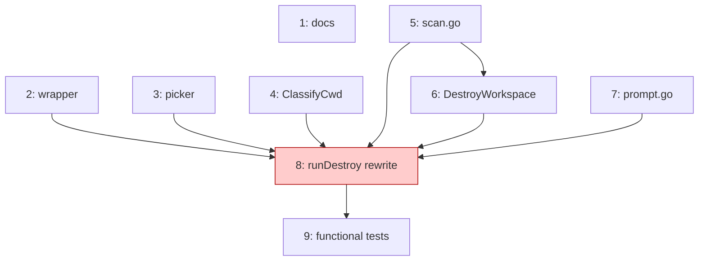

# PLAN: niwa-destroy

## Status

Draft

## Scope Summary

Decomposes the `niwa destroy` rework (per
`docs/designs/current/DESIGN-niwa-destroy.md`) into 9 atomic issues.
Implementation lands as a single squash-merged commit on PR #106 (branch
`docs/niwa-destroy-rework`). No GitHub issues, milestone, or per-issue
branches are created — issues exist as outlines in this document only.

## Decomposition Strategy

**Horizontal.** The design doc's Phase A–G layout already maps to layered
components with stable interfaces (picker package, four new helpers, command
rewrite, functional tests, doc surface). Each layer has an independent test
seam. Walking-skeleton would be appropriate if integration risk dominated;
here the wiring is mechanical once helpers exist.

## Issue Outlines

### Issue 1: Amend PRDs and design docs for new destroy semantics

**Goal:** Update existing PRDs and design docs to reflect the contextual
destroy behavior, the workspace-wipe `--force` path, and destroy's addition
to the cd-eligible command set.

**Type:** docs
**Complexity:** simple
**Dependencies:** none

**Acceptance criteria:**

- [ ] `PRD-shell-integration.md` R1 amended to add `destroy` to the
      cd-eligible command set with the inverse-payload note (destroy writes
      a safe ancestor, not a user-named target).
- [ ] `PRD-shell-integration.md` R11 amended to fire the runtime hint on
      destroy.
- [ ] `PRD-shell-integration.md` D3 / Out-of-Scope paragraph amended to
      acknowledge destroy as the explicit cd-on-removal exception.
- [ ] `PRD-cross-session-communication.md` R38 amended with the multi-
      instance clause (workspace-wide `--force` runs the daemon-shutdown
      sequence per-instance).
- [ ] `PRD-cross-session-communication.md` AC-P11 extended (or AC-P11b
      added) for picker and `--force` workspace-wipe cases.
- [ ] `PRD-workspace-config-sources.md` line 1001 softened to acknowledge
      typed-confirmation as a destructive-operation pattern exception.
- [ ] `DESIGN-instance-lifecycle.md` Decision 4 amended with cwd-context-
      driven mode selection.
- [ ] `DESIGN-shell-navigation-protocol.md` cd-eligible list amended to
      include `destroy` (and brought up to date with `init` and
      `session create`, which were added without prior doc updates).
- [ ] `DESIGN-contextual-completion.md` Decision 3 amended with the
      picker-vs-completion reconciliation note.

---

### Issue 2: Extend shell wrapper to support `niwa destroy` cd

**Goal:** Add `destroy` to the shell wrapper's cd-eligible whitelist so that
`niwa destroy` invocations flow through `__niwa_cd_wrap`, which sets
`NIWA_RESPONSE_FILE` and `cd`s the user to the landing path the CLI writes.

**Type:** code
**Complexity:** simple
**Dependencies:** none

**Acceptance criteria:**

- [ ] `internal/cli/shell_init.go:54` case label extended from
      `create|go|init)` to `create|destroy|go|init)`.
- [ ] `internal/cli/shell_init_test.go` golden-string assertions refactored
      from a single `"create|go|init)"` match to per-subcommand membership
      checks (so future additions don't churn this test).
- [ ] `go test ./internal/cli/...` passes.
- [ ] No changes to the protocol primitives (`writeLandingPath`,
      `validateResponseFilePath`, `captureNiwaResponseFile`).

---

### Issue 3: Copy tsuku TUI picker into `internal/tui/`

**Goal:** Bring the proven `Pick(prompt, []Choice) (int, error)` helper from
`tsukumogami/tsuku@c8f58101` into niwa as a new `internal/tui/` package.
Import is blocked by Go's `internal/` rule; copy is the chosen reuse path.

**Type:** code
**Complexity:** testable
**Dependencies:** none

**Acceptance criteria:**

- [ ] `internal/tui/picker.go` exists with the same exported API
      (`Pick`, `Choice`, `IsAvailable`, `ErrCanceled`).
- [ ] `internal/tui/sanitize.go` exists with `SanitizeDisplayString`.
- [ ] `internal/tui/picker_test.go` exists, passes.
- [ ] Header comment in `picker.go` references the upstream commit
      (`tsukumogami/tsuku@c8f58101 (#2369)`).
- [ ] `golang.org/x/term` is the only new import (already required by niwa's
      go.mod; no go.sum changes for new transitive deps).
- [ ] `go test ./internal/tui/...` passes.

---

### Issue 4: Add `ClassifyCwd` helper

**Goal:** Implement `workspace.ClassifyCwd(cwd) (Classify, error)` returning
an enum (`CwdInsideInstance`, `CwdAtWorkspaceRoot`, `CwdOutside`) plus the
absolute paths needed by destroy's dispatcher.

**Type:** code
**Complexity:** testable
**Dependencies:** none

**Acceptance criteria:**

- [ ] `internal/workspace/cwd_classify.go` exports `CwdClass`, `Classify`,
      `ClassifyCwd` per the design doc's helper signatures.
- [ ] Returns `CwdInsideInstance` with both `WorkspaceRoot` and `InstanceDir`
      populated when cwd is inside an instance (or any subdir).
- [ ] Returns `CwdAtWorkspaceRoot` with `WorkspaceRoot` populated and
      `InstanceDir` empty when cwd is at the workspace root.
- [ ] Returns `CwdOutside` with both fields empty when cwd is outside any
      niwa workspace.
- [ ] `internal/workspace/cwd_classify_test.go` covers each class plus the
      "deleted dir" and "broken state file" edges.
- [ ] Does not modify `DiscoverInstance` or `config.Discover`.

---

### Issue 5: Add non-pushed-work scan (`scan.go`)

**Goal:** Implement the comprehensive "would I lose work" detector for the
workspace-wipe path. Detects modified/staged/untracked files, unpushed
commits, local-only branches, stashes, detached-HEAD orphans, and external
worktrees, including state inside niwa-created session worktrees.

**Type:** code
**Complexity:** testable
**Dependencies:** none

**Acceptance criteria:**

- [ ] `internal/workspace/scan.go` exports `LossKind` constants, `Loss`,
      `RepoScan`, `InstanceScan` types per the design doc.
- [ ] `ScanInstance(instanceDir) (InstanceScan, error)` runs the per-repo
      detector sequentially within an instance.
- [ ] `ScanInstancesParallel(workspaceRoot, instanceDirs []string, workers int)`
      bounds parallelism at `workers` (default 8 to match `cloneWorkers`).
- [ ] `FormatScans(scans, w, workspaceName)` emits the human-readable output
      shown in the design doc (per-instance grouping, omitted-clean-instance
      `(clean)` line, worktree nesting).
- [ ] Worktree enumeration uses `git worktree list --porcelain`; niwa-created
      session worktrees under `.niwa/worktrees/` are scanned.
- [ ] External worktrees (outside the instance dir) emit `LossExternalWorktree`
      and are listed but not blocking.
- [ ] Edge cases (broken `.git`, missing dir, orphan instance, submodules)
      handled per the design doc's edge-case table.
- [ ] `internal/workspace/scan_test.go` covers each `LossKind` end-to-end
      using a `localGitServer` fixture or temp git repos.

---

### Issue 6: Add `DestroyWorkspace` helper

**Goal:** Implement `workspace.DestroyWorkspace(workspaceRoot, opts)` for
the workspace-wipe path. Per-instance synchronous, alphabetical order;
preserves `ValidateInstanceDir`'s "refuses workspace root" invariant.

**Type:** code
**Complexity:** testable
**Dependencies:** Issue 5 (consumes `InstanceScan` for the dirty-check path
in callers; the helper itself does the destroy after callers have already
run the scan and obtained user confirmation).

**Acceptance criteria:**

- [ ] `internal/workspace/destroy_workspace.go` exports `DestroyWorkspaceOpts`
      and `DestroyWorkspace`.
- [ ] Iterates instances in alphabetical order: `TerminateDaemon` →
      `ValidateInstanceDir` → `os.RemoveAll(instanceDir)`.
- [ ] After all instances destroyed, `os.RemoveAll(workspaceRoot)`.
- [ ] Does NOT call `ValidateInstanceDir(workspaceRoot)` — the workspace-root
      validator is preserved unchanged.
- [ ] On partial failure, completed instances stay destroyed; resuming the
      command picks up where it stopped.
- [ ] `internal/workspace/destroy_workspace_test.go` includes a regression
      test asserting `ValidateInstanceDir` is NOT called on the workspace
      root.
- [ ] `internal/workspace/destroy.go` (used by reset) is UNTOUCHED.

---

### Issue 7: Add `prompt.go` helper (TTY check + typed confirmation)

**Goal:** Establish the first interactive-prompt primitives in niwa.
`IsStdinTTY` gates the picker and typed-confirmation paths; `ReadConfirmation`
reads a line from stdin and compares against an expected token.

**Type:** code
**Complexity:** simple
**Dependencies:** none

**Acceptance criteria:**

- [ ] `internal/cli/prompt.go` exports `IsStdinTTY() bool` and
      `ReadConfirmation(prompt, expected string, in io.Reader, out io.Writer) (bool, error)`.
- [ ] `IsStdinTTY` uses `term.IsTerminal(int(os.Stdin.Fd()))`.
- [ ] `ReadConfirmation` writes the prompt to `out`, reads one line from
      `in`, trims whitespace, returns `(true, nil)` on exact match, `(false, nil)`
      on mismatch, `(false, err)` on EOF or read error.
- [ ] `internal/cli/prompt_test.go` covers match, mismatch, EOF, and the
      empty-input case (treated as mismatch).
- [ ] No new deps; `golang.org/x/term` already in `go.mod`.

---

### Issue 8: Rewrite `runDestroy` with contextual dispatch

**Goal:** Replace `internal/cli/destroy.go`'s linear flow with a contextual
command per the routing matrix. The new `runDestroy` classifies cwd via
`ClassifyCwd`, validates the `(class, args, --force)` tuple, and dispatches
to one of three mode-specific runners (`runDestroyInstance`,
`runDestroyWorkspace`, `runDestroyEmpty`).

**Type:** code
**Complexity:** critical (user-facing surface, integrates 6 dependencies)
**Dependencies:** Issue 2 (wrapper), Issue 3 (picker), Issue 4 (classify),
Issue 5 (scan), Issue 6 (destroy_workspace), Issue 7 (prompt)

**Acceptance criteria:**

- [ ] All 8 routing-matrix branches in the design doc behave as specified.
- [ ] `niwa destroy <name>` from inside an instance is rejected with the
      error "instance name is only valid from the workspace root".
- [ ] Landing-path emit (`writeLandingPath`) only fires when the enclosing
      directory is destroyed: from inside an instance (lands at workspace
      root); from workspace root with empty workspace or with `--force`
      (lands at workspace parent). Not for `niwa destroy <name>` from the
      root.
- [ ] Typed-confirmation prompt fires BEFORE `writeLandingPath`. Regression
      test asserts `NIWA_RESPONSE_FILE` is empty after a confirmation
      mismatch.
- [ ] `hintShellInit(cmd)` called on success when landing-path was written
      and `_NIWA_SHELL_INIT` is unset.
- [ ] Existing user-facing strings preserved verbatim:
      `"Destroyed instance: %s"`,
      `"instance has uncommitted changes in %d repo(s); use --force to override"`,
      `"refusing to destroy workspace root: %s exists"`.
- [ ] Picker invocation uses `tui.IsAvailable()` first; falls back to a
      non-TTY error listing available instance names plus a remediation
      hint ("pass `<name>` or `--force`").
- [ ] Single-instance case at workspace root with no name skips the picker
      and destroys directly (still subject to today's dirty-repo gate).
- [ ] `--force` at workspace root with `--force` and ≥1 instance runs
      `ScanInstancesParallel`; if any instance has loss, prints
      `FormatScans` output and prompts for the workspace name.
- [ ] `internal/cli/destroy_test.go` extended with control-flow tests
      table-driven over the 8 branches plus the order-of-operations
      regression test.
- [ ] `Long:` help text describes the routing matrix and the non-TTY
      contract.

---

### Issue 9: Add `@critical` and standard Gherkin scenarios

**Goal:** Functional-test coverage for the new contextual destroy behavior.

**Type:** code (test)
**Complexity:** testable
**Dependencies:** Issue 8 (the new behavior must exist to be tested);
Issue 2 (the wrapper extension is required for the "destroy from inside
lands at workspace root" scenario)

**Acceptance criteria:**

- [ ] `test/functional/features/destroy.feature` exists with the following
      `@critical` scenarios:
  1. Destroy from inside an instance lands the shell at the workspace root
     via `NIWA_RESPONSE_FILE`.
  2. Destroy by name from the workspace root preserves today's flow
     (destroys named instance, no shell `cd`, no picker).
  3. Destroy with no arg from the workspace root with a single instance
     skips the picker and destroys that instance directly.
  4. Workspace-self-destroy via `--force` on a clean workspace scans, wipes
     silently, and lands the shell at the workspace parent.
- [ ] The same file includes the following standard scenarios:
  5. Destroy with name from inside an instance is rejected with the
     expected error wording.
  6. `--force` workspace destroy with unpushed work lists the losses and
     aborts when the typed confirmation does not match.
  7. `--force` workspace destroy with unpushed work completes when the
     typed confirmation matches the workspace name.
- [ ] `make test-functional-critical` passes.
- [ ] `make test-functional` (full suite) passes.
- [ ] Scenarios reuse the `localGitServer` helper and the `NIWA_RESPONSE_FILE`
      pattern already established in `go.feature`.

---

## Dependency Graph

## Implementation Sequence

Single-PR delivery means issues land sequentially on `docs/niwa-destroy-rework`
in this recommended order:

1. **Issue 1** — Doc amendments (independent, low-risk, sets context).
2. **Issue 2** — Shell wrapper extension (small, independent).
3. **Issue 3** — Picker copy (independent).
4. **Issue 4** — `ClassifyCwd` helper (independent).
5. **Issue 5** — `scan.go` helper (independent, but gates Issue 6).
6. **Issue 6** — `DestroyWorkspace` helper (depends on Issue 5).
7. **Issue 7** — `prompt.go` helper (independent).
8. **Issue 8** — `runDestroy` rewrite (integrates 2–7; the critical surface).
9. **Issue 9** — Functional tests (verifies Issue 8 end-to-end).

### Critical path

`<<ISSUE:5>>` → `<<ISSUE:6>>` → `<<ISSUE:8>>` → `<<ISSUE:9>>` (4 sequential
issues). Other issues sit alongside the critical path with a single
convergence at Issue 8.

### Verification gate (between Issue 8 and Issue 9)

After Issue 8 lands, run `go test ./...` to confirm unit-test correctness
before writing the functional scenarios in Issue 9. The functional tests
require a working binary, so unit-test failures must be cleared first.

## Notes for the Implementer

- **Do NOT touch** `internal/workspace/destroy.go`,
  `internal/workspace/destroy_test.go`, or any of the four shared helpers
  (`ResolveInstanceTarget`, `ValidateInstanceDir`, `CheckUncommittedChanges`,
  `DestroyInstance`). These are shared with `niwa reset`.
- **Order-sensitive code path** (in Issue 8): the typed-confirmation prompt
  MUST run before `writeLandingPath`. A user hitting ESC must not be `cd`-ed
  away from a workspace they didn't actually destroy. Add a regression test
  in `internal/cli/destroy_test.go`.
- **Picker source**: cite `tsukumogami/tsuku@c8f58101 (#2369)` in the
  copied file's header comment so future maintainers can compare for drift.
- **Help text** in Issue 8's `Long:` is load-bearing — it documents the
  routing matrix and the non-TTY contract for users without the wrapper.
