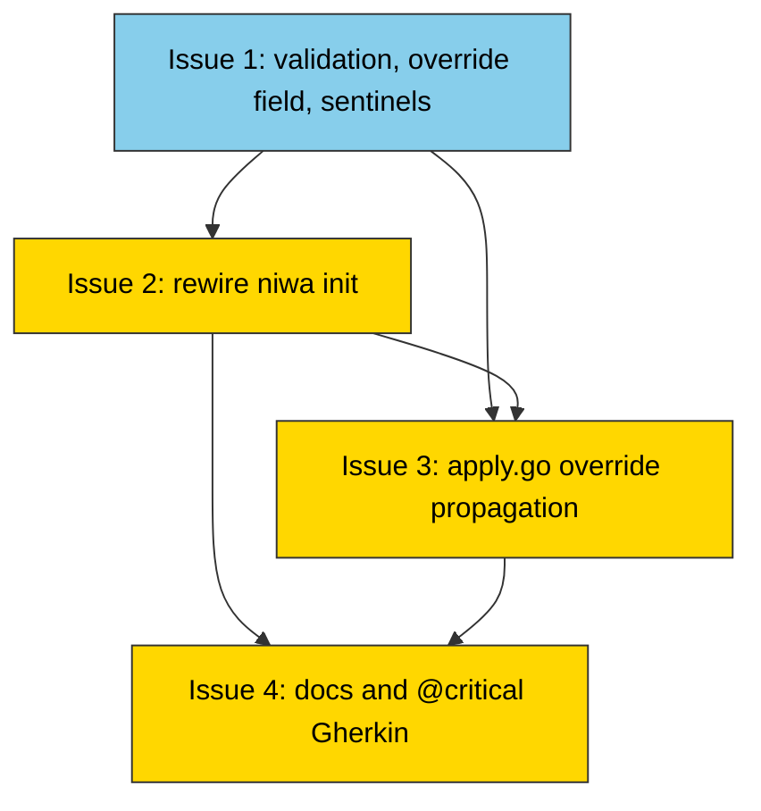

# PLAN: niwa init creates workspace directory

## Status

Draft

## Scope Summary

Make `niwa init <name>` create `<cwd>/<name>/` and treat the explicit name
as the effective workspace name across every niwa command, with safe
collision handling for both target paths and already-registered names
(gated by a new `--rebind` flag). Implementation lands as a single PR on
the current branch, decomposed into four sequential issues.

## Decomposition Strategy

Horizontal decomposition. Layer 1 lands additive primitives with no
behavior change (validation helper, state field, sentinels). Layer 2
wires the new behavior in `runInit` (target-creation + collision
handling + `--rebind`). Layer 3 propagates the override into `apply` so
status/apply surfaces show the effective name. Layer 4 finalizes docs
and end-to-end test coverage.

No walking skeleton: the user-visible feature only lights up after
issue 2 rewires `runInit`, so a thin slice would deliver no
intermediate value.

Single-PR execution mode confirmed: changes are scoped to one repo, no
merge gates between layers, and no cross-repo coordination. Issue
boundaries serve as implementer checkpoints; no GitHub issues or
milestone are created.

## Issue Outlines

### Issue 1: feat(workspace): add init-name validation, override field, and conflict sentinels

**Complexity**: testable

**Goal**: Land the additive primitives the rest of the feature
depends on: exported `ValidateInitName`, optional `ConfigNameOverride`
field on `InstanceState`, and the two new preflight sentinels
(`ErrTargetDirExists`, `ErrRegistryNameInUse`). No user-visible
behavior change ships with this issue.

**Acceptance Criteria**:

- [ ] `ValidateInitName` accepts names matching `^[a-zA-Z0-9._-]+$`.
- [ ] `ValidateInitName` rejects whitespace, path separators, and
      out-of-regex characters (PRD AC-14, AC-15).
- [ ] `ValidateInitName` rejects the literals `.`, `..`, `.niwa`, and
      the empty string with errors that quote the input verbatim and
      describe the allowed character set (PRD AC-16, AC-17, AC-18,
      Security §2).
- [ ] `InstanceState` carries `ConfigNameOverride string` tagged
      `json:"config_name_override,omitempty"`; schema version stays
      at v3.
- [ ] Non-empty `ConfigNameOverride` round-trips through
      `SaveState`/`LoadState`; empty is omitted from JSON output.
- [ ] Old state files without the override key load cleanly.
- [ ] `ErrTargetDirExists` and `ErrRegistryNameInUse` are exported,
      distinct, and wrap cleanly into `InitConflictError` (verified
      via `errors.Is`).
- [ ] `CheckInitConflicts`'s signature is unchanged.

**Dependencies**: None.

### Issue 2: feat(cli): rewire niwa init to create the workspace directory and gate registry collisions

**Complexity**: critical

**Goal**: Reorganize `runInit` so `niwa init <name>` creates
`<cwd>/<name>/`, enforces the PRD-pinned preflight order, gates
registry collisions behind `--rebind`, persists the name override into
workspace-root init state, and prints a success message that includes
the resolved absolute path. Closes the registry-hijack attack surface
the security review surfaced.

**Acceptance Criteria** (full list in
`wip/plan_niwa-init-creates-workspace-dir_issue_2_body.md`; summary
below):

- [ ] AC-1 through AC-4: directory creation in all four init modes.
- [ ] AC-9 through AC-13: target-exists rejection with the right
      qualifier (`file`/`directory`/`symlink`) and the niwa-aware
      sub-case routing (`ErrWorkspaceExists` and
      `ErrNiwaDirectoryExists` win over the generic
      `ErrTargetDirExists`).
- [ ] AC-14 through AC-18: name-validation invariants (whitespace,
      path separators, `.`, `..`, empty string).
- [ ] AC-19 / AC-19a / AC-20: registry collision errors without
      `--rebind` and succeeds with rebind warning when `--rebind` is
      passed; remediation text mentions both `--rebind` and the
      resolved `config.GlobalConfigPath()`.
- [ ] AC-20b: R5 takes precedence over R8 in both rebind branches
      (target-exists wins).
- [ ] AC-26: success message includes the resolved absolute path on
      stdout in every mode.
- [ ] R4 override note emitted when explicit name differs from
      cloned config; AC-8b suppression when names match.
- [ ] R11 help text describes all three modes, the override, and
      `--rebind`.
- [ ] Final-component creation uses `os.Mkdir`, not `MkdirAll`
      (Security §3 — symlink TOCTOU).

**Dependencies**: Blocked by Issue 1.

### Issue 3: feat(workspace): apply the init-time name override to apply.go writes

**Complexity**: testable

**Goal**: Make the init-time name override take effect on every
command that reads instance state. After this issue, `niwa status`
and `niwa apply` surface the user-given name consistently with
`niwa go`, and the override survives subsequent applies.

**Acceptance Criteria**:

- [ ] `EffectiveConfigName` returns `state.ConfigNameOverride` when
      non-empty and re-validates via `ValidateInitName` (Security §4).
- [ ] `EffectiveConfigName` returns `cfg.Workspace.Name` when override
      is empty or `state` is nil; no validation on cfg name.
- [ ] `EffectiveConfigName` returns a wrapped error when the override
      fails re-validation (persistence-boundary tampering case).
- [ ] `Applier.Create` (apply.go ~line 262) calls `EffectiveConfigName`
      and writes the resolved name into the instance-state file's
      `ConfigName` and `InstanceName`.
- [ ] `Applier.Create` passes the resolved `configName` to
      `instanceNumberFromName` (apply.go ~line 258), NOT raw
      `cfg.Workspace.Name`.
- [ ] `Applier.Apply` (apply.go ~line 407) loads init state via
      `LoadState(filepath.Dir(instanceRoot))`, calls
      `EffectiveConfigName`, and writes the resolved name into instance
      state. Tolerates `state.ErrStateNotFound`.
- [ ] AC-5: `niwa status` shows the user-given override after init.
- [ ] AC-6: `niwa apply` output shows the user-given override.
- [ ] AC-7: cloned `.niwa/workspace.toml` is not modified by this
      issue.
- [ ] AC-8c: subsequent `niwa status`/`niwa apply` do not re-emit the
      override note.
- [ ] AC-8d: registry entry key remains the user-given override.

**Dependencies**: Blocked by Issue 1, Issue 2.

### Issue 4: docs(niwa): refresh init docs and add @critical end-to-end coverage

**Complexity**: testable

**Goal**: Make the new behavior discoverable and verified end-to-end.
Refresh `init` command help text and the README, add `@critical`
Gherkin coverage for the new flow, and bring existing init unit tests
in line with the new paths.

**Acceptance Criteria**:

- [ ] `init.go`'s `initCmd.Long` describes the three modes,
      directory-creation, name override, and `--rebind` (PRD R11 /
      AC-22).
- [ ] README quickstart drops the `mkdir + cd` step (AC-23 / AC-24).
- [ ] README "shared workspace configs", registry-replay example, and
      commands-table row updated; grep for `mkdir` followed by
      `niwa init` returns zero matches.
- [ ] `@critical` Gherkin scenario in `test/functional/features/`
      exercises `niwa init <name> --from <fixture>` end-to-end:
      asserts the workspace.toml exists, the registry has the entry
      with the new `Root`, `niwa go <name>` lands in the new
      directory, and `niwa status` shows the user-given name (PRD
      AC-25). Uses the `localGitServer` helper.
- [ ] Supporting scenarios cover target-exists rejection (file /
      directory / symlink qualifiers), registry-collision rejection
      without `--rebind` (asserts the error names both `--rebind` and
      the global config path; no filesystem writes; registry
      unchanged), and successful rebind with `--rebind` (registry
      `Root` updated, old directory untouched, `niwa go` lands in
      the new location).
- [ ] Existing `internal/cli/init_test.go` cases shift assertion
      paths from `cwd` to `<cwd>/<name>` for named modes; no case
      asserts the old path.

**Dependencies**: Blocked by Issue 2, Issue 3.

## Dependency Graph

**Legend**: Blue = ready (no dependencies), Yellow = blocked (waiting on
upstream issues).

## Implementation Sequence

Strict serial chain. No parallelization opportunities — each issue
requires the prior one's primitives or behavior to be in place before
its acceptance criteria can be exercised.

**Critical path**: Issue 1 → Issue 2 → Issue 3 → Issue 4 (length 4).

**Recommended order**:

1. **Issue 1** — primitives. Pure additive; no behavior change. Land
   the helper, the field, and the sentinels with focused unit tests.
   Smallest risk, fastest to merge in isolation if you want to land
   it as a separate commit on the branch.
2. **Issue 2** — init control flow. Critical-complexity work: this is
   where path-traversal validation, symlink-TOCTOU mitigation, and
   registry-collision gating land together. Largest unit-test surface
   in the plan; expect this commit to be the largest.
3. **Issue 3** — override propagation through `Applier.Create` and
   `Applier.Apply`. Smaller, but touches two distinct code paths;
   covers the persistence-boundary re-validation defense.
4. **Issue 4** — documentation, help text, and `@critical` Gherkin.
   Lands last because the scenarios assert behavior shipped by 2 and
   3. Update existing `init_test.go` paths in the same commit.

In single-PR mode, all four issues land as commits on
`docs/niwa-init-creates-workspace-dir`. Open the PR after issue 4 to
present a coherent change set; reviewers see the layered commit
sequence rather than four separate PRs.

## Next Steps

Run `/work-on docs/plans/PLAN-niwa-init-creates-workspace-dir.md` to
begin implementation.
