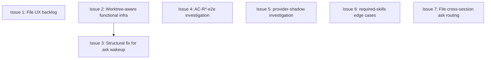

# PLAN: niwa mesh reliability follow-ups

## Status

Draft

## Scope Summary

Close out the work deliberately deferred from PR #115 (mesh reliability
cluster). Three categories: triage backlog issues that need a developer
to decide what to take (file-and-defer), small implementation gaps the
previous PR named explicitly (do now), and two test-suite anomalies that
need root-cause investigation before a fix shape is chosen.

## Decomposition Strategy

**Horizontal decomposition.** Each line item the user named is already
atomic — there's no shared code path that warrants further bundling.
Two filing-only issues (#1, #7) execute as `gh issue create` calls.
Three implementation issues (#2, #3, #6) touch independent code areas.
Two investigation issues (#4, #5) dispatch an agent to root-cause a
concrete failure and conditionally land a fix or escalate. Walking
skeleton doesn't apply — there's no end-to-end flow being built.

## Issue Outlines

### Issue 1: File UX backlog as a single needs-prd issue

**Type**: task

**Goal.** File one GitHub issue capturing the ~38 deferred UX research
findings from the PR #115 work. The issue is `needs-prd` so the
developer who picks it up decides which findings to prioritize.

**Source material.** `wip/work-on/decisions/D1_ux_scope_pruning.md`
(committed on the previous PR's branch) categorizes the deferred
findings: first-run polish (~7), CLI list/show ergonomics (~3), MCP
convention reconciliation (~6), skill/sessions guide structural reorg
(~4), confirmation prompts on session destroy (~1), plus smaller items.
The five UX research reports under `wip/work-on/ux/` are the underlying
detail.

**Acceptance.** One issue exists in the niwa repo with: (a) `needs-prd`
label, (b) a body that lists the categories with one-line summaries
each and points to the source reports' contents (inlined or summarized,
since the wip/ files won't survive merge cleanup), (c) a clear note
that the developer who works on it should pick which subset is in
scope rather than committing to all of them.

**Out of scope.** Solving any of the findings; that's the
follow-on developer's job.

### Issue 2: Worktree-aware functional test infrastructure

**Type**: code

**Goal.** Build the multi-instance test scaffolding that PR #115
deferred (Decision D2). Without it, integration scenarios that need a
session daemon plus a coordinator MCP plus cross-process wakeup must
either rely on unit tests + downstream functional coverage (the D2
choice) or hand-roll setup in each scenario.

**Acceptance.** A reusable Gherkin step set in
`test/functional/mesh_steps_test.go` for: (a) starting a session
daemon for a given session id, (b) spawning a worker fake within that
session daemon's worktree, (c) starting a coordinator MCP session at
the main instance root and answering a queued ask. The AC-S4a
scenario (`Worker in session worktree routes niwa_ask to main
coordinator`) is rewritten to use the new steps as the reference
caller. At least one additional scenario exercises a different
session-daemon flow to demonstrate reuse (e.g., session worker
delegates to a peer role).

**Out of scope.** Adding scenarios for every existing session-daemon
test path; this issue establishes the infrastructure plus one
demonstrative second use site.

### Issue 3: Structural fix for cross-process ask wakeup

**Type**: code

**Goal.** Replace the 100ms polling fallback in `handleAsk` with a
correct routing solution. Today the coordinator answering an ask
writes `task.completed` to `<mainInstance>/.niwa/roles/<role>/inbox/`,
while the session worker's fsnotify watcher is rooted at
`<worktree>/.niwa/roles/<role>/inbox/`; the two paths don't meet, so
the in-memory `awaitWaiter` never fires and the worker only learns of
the answer via polling.

**Approach.** `TaskState.SessionID` already exists and is set for
delegated session tasks. Plumb it through the ask path: (a) read
`NIWA_SESSION_ID` into `Server.sessionID` at startup, (b) set
`state.SessionID = s.sessionID` in `createAskTaskStore`, (c) in
`handleFinishTask`, when sending the answer `task.completed`, look up
`<mainInstance>/.niwa/sessions/<state.SessionID>.json` to resolve the
worktree path and write to `<worktreePath>/.niwa/roles/<role>/inbox/`
instead of `taskStoreRoot()/.niwa/roles/<role>/inbox/`.

**Acceptance.** The new unit test
`TestHandleFinishTask_AnswersAskAtSessionWorktreeInbox` (or similar)
asserts that finishing an ask whose state carries a session id writes
the answer to the worktree inbox. AC-S4a passes without the polling
fallback. The polling fallback in `handleAsk` is removed (or kept with
a comment explaining it as belt-and-suspenders, depending on what the
implementer judges right). Existing tests stay green.

**Out of scope.** Cross-session ask routing (session A worker → session
B worker) — that's Issue 7. Coordinator-targeted asks from a
non-session worker continue to use `taskStoreRoot()` as today.

### Issue 4: Root-cause AC-R2-e2e and AC-R10-e2e claude permission failure

**Type**: task

**Goal.** Two `@session-e2e` scenarios — `Real coordinator creates
session and delegates task to session worktree (AC-R2-e2e)` and
`Second task in same session resumes Claude conversation (AC-R10-e2e)`
— fail locally with `I need permission to use the niwa MCP tools.
Please approve the tool access so I can proceed with creating the
session.` This reproduces on `main` too, so it's pre-existing and not
a PR #115 regression. It's never been investigated.

**Approach.** Dispatch an investigation agent to: (a) read both
scenarios' Gherkin and the `runClaudeP` harness, (b) compare against
similar `@session-e2e` scenarios that pass, (c) identify whether the
gap is in the harness's allowed-tools wiring, the worker MCP config
permission mode, or claude CLI defaults that have changed. If the
fix is a one-or-two-line change (e.g., adding a missing
`--allowed-tools` arg or env var), apply it. Otherwise file a
follow-up issue with the diagnosis and stop.

**Acceptance.** Either both scenarios pass on this branch, or a
follow-up issue exists in the niwa repo describing the root cause
and proposing a fix shape. The work-on session reports the chosen
path back to the user.

### Issue 5: Root-cause provider-shadow scenario flake

**Type**: task

**Goal.** `provider-shadow_notice_appears_on_first_create_and_is_suppressed_on_subsequent_creates`
fails locally when the developer's `infisical` CLI login session has
expired. PR #115's Decision D3 noted this as environmental but did
not investigate whether the test could be made resilient to that
state. CI runs without `INFISICAL_CLIENT_ID` so this gap has never
been caught upstream.

**Approach.** Dispatch an investigation agent to: (a) read the
scenario and the surrounding vault provider plumbing, (b) determine
whether the failure mode is a real product gap (e.g., the provider
should fall back gracefully when login is missing) or a test-only
issue (e.g., the test should mock the vault). If the fix is small —
either a graceful fallback in the provider or a test fixture
adjustment — apply it. Otherwise file a follow-up issue with the
diagnosis.

**Acceptance.** Either the scenario passes regardless of local
infisical state, or a follow-up issue exists with the diagnosis. The
work-on session reports the chosen path.

### Issue 6: Required-skills gate edge cases

**Type**: code

**Goal.** Extend Issue 6 of PR #115 (`feat(mesh): add required_skills
queue-time gate`) to handle the edge cases the previous design
deferred: (a) plugin version pins (e.g., `shirabe@1.2.0:plan` should
not match a different installed version), (b) traversal of
`enabledPlugins` aliases that point to non-default versions, (c)
honoring user-level `~/.claude.json` plugin sources in addition to
project-level.

**Approach.** Extend `internal/mcp/required_skills.go`'s
`pluginNamespacesAt` and add new helpers as needed. The matcher
becomes version-aware where pin syntax is present, and union the
project-level + user-level plugin sources before checking
availability.

**Acceptance.** Three new unit-test cases in
`internal/mcp/required_skills_test.go` cover (a) a version-pinned
required skill matched against a non-matching installed version
(rejected), (b) an `enabledPlugins` alias resolved through to the
correct namespace (accepted), (c) a user-level-only plugin (accepted
when project-level lookup alone would have rejected). Existing tests
stay green; the wire format and warn-and-allow behavior are
unchanged.

**Out of scope.** Changing the warn-vs-block default; revisiting
Decision D2 of PR #115's design.

### Issue 7: File cross-session ask routing follow-up

**Type**: task

**Goal.** File one GitHub issue tracking the design and implementation
of cross-session ask routing — session A worker calling
`niwa_ask(to="role-in-session-B")`. PR #115's Decision 4 explicitly
bounded routing to coordinator-only; cross-session asks are not
designed today.

**Acceptance.** One issue exists in the niwa repo with: (a) a clear
problem statement (today the asker only knows roles, not target
sessions; ask envelopes have no destination session info), (b) the
two design options (have the asker name the target session
explicitly via a new arg, or have the routing layer resolve "first
live session for role" via the registry), (c) a `needs-design` label
since the trade-off needs a written decision before implementation.

**Out of scope.** Solving the design.

## Dependency Graph

Issue 3's acceptance asks for AC-S4a to pass without the polling fallback;
the cleanest way to express that is via the new infrastructure from
Issue 2, so 2 precedes 3. All other issues are independent.

## Implementation Sequence

**Critical path (must be sequential):**

1. Issue 2 (infra)
2. Issue 3 (structural fix using the infra)

**Parallelizable:**

- Issue 1 (file UX backlog) — pure `gh issue create`
- Issue 7 (file cross-session routing) — pure `gh issue create`
- Issue 4 (AC-R*-e2e investigation) — agent-driven, may produce code or
  a follow-up issue
- Issue 5 (provider-shadow investigation) — agent-driven, same
- Issue 6 (required-skills edge cases) — independent code path

**Suggested ordering for a single autonomous run:**

1. Dispatch Issues 4 and 5 agents in parallel as the run starts. They
   investigate while implementation proceeds; results land asynchronously.
2. File Issues 1 and 7 (`gh issue create` × 2). Cheap and independent.
3. Implement Issue 2 (infra). Validates that the harness work compiles
   and runs before Issue 3 builds on it.
4. Implement Issue 3 (structural fix). Verify AC-S4a passes via the new
   harness without the polling fallback.
5. Implement Issue 6 (required-skills). Independent.
6. Collect Issues 4 and 5 results. Either land their fixes (if produced)
   or confirm follow-up issues were filed.
7. Run `go vet ./...`, `go test ./...`, `make test-functional-critical`.
8. Update PR with the second-run summary.

## Item Mapping (user-numbered → plan-numbered)

The user provided 9 numbered items in the conversation, where item 9 was
explicitly skipped and item 4 was already covered by the existing #116
issue (no new issue needed). The plan re-numbers continuously:

| User # | Plan # | Item                                                     |
|--------|--------|----------------------------------------------------------|
| 1      | 1      | File UX backlog issue (`needs-prd`)                      |
| 2      | 2      | Worktree-aware functional test infrastructure            |
| 3      | 3      | Structural fix for cross-process ask wakeup              |
| 4      | —      | Already covered by existing issue #116 (no action)       |
| 5      | 4      | Root-cause AC-R2-e2e / AC-R10-e2e (agent + conditional)  |
| 6      | 5      | Root-cause provider-shadow flake (agent + conditional)   |
| 7      | 6      | Required-skills gate edge cases                          |
| 8      | 7      | File cross-session ask routing follow-up                 |
| 9      | —      | Skipped per user instruction                             |
