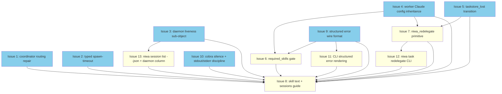

# PLAN: niwa mesh reliability

## Status

Draft

## Scope Summary

Replace four filesystem-side-channel mechanisms in the niwa mesh
subsystem with explicit API contracts, closing the cluster of nine
issues filed since #92 (#92, #97, #108, #109, #110, #111, #112, #113,
#114) in one coordinated reliability pass. Worker Claude config
inheritance, coordinator routing, daemon health, task lifecycle
truthfulness, and a new redelegate primitive land together with the
niwa-mesh skill text rewrite that brings the documented contract
back into lockstep with the runtime.

## Decomposition Strategy

**Horizontal decomposition.** The design is a coordinated
reliability pass over an existing system, with phases 1, 2, and 4
independent and phases 3-6 sequenced by logical (not e2e)
dependencies. Walking skeleton doesn't fit because there's no e2e
flow being introduced — the mesh already exists; this design fixes
specific layers. The design's six implementation phases map
naturally to atomic issues (1-2 issues per phase based on whether
the deliverables share a tight code path or address distinct
user-facing surfaces).

## UX expansion (finalized after research)

The user scoped this implementation to the full UX surface (CLI +
MCP + setup flow). A multi-agent UX research pass produced 51 raw
findings across 5 reports under `wip/work-on/ux/`. Decision D1
(`wip/work-on/decisions/D1_ux_scope_pruning.md`) pruned that to 5
new in-scope issues that close load-bearing gaps for the mesh
redesign, plus AC fold-ins on existing issues. The remaining ~38
findings will be filed as follow-on issues at PR finalization
time, labeled for follow-on milestones (first-run polish, CLI
ergonomics, MCP convention pass, docs polish, safety pass).

The new issues are numbered 9-13 below. Issue 6's dependency
expanded to include Issue 9 (structured error wire format).

## Issue Outlines

### Issue 1: fix(mesh): route coordinator-targeted role lookups to main instance

**Goal**: Unblock `niwa_ask(to="coordinator")` and
`niwa_send_message(to="coordinator")` from session workers by
introducing a `roleRoot(role)` helper that redirects
coordinator-targeted role lookups and inbox writes to the main
instance, and expand coordinator auto-registration to fire on
`niwa_delegate` and `niwa_query_task`.

**Acceptance Criteria**:
- New helper `roleRoot(role string) string` on `*mcp.Server` returns
  `s.mainInstanceRoot` when `role == "coordinator" && s.mainInstanceRoot != ""`,
  else `s.instanceRoot`.
- `isKnownRole`, `sendMessageWithID` inbox path, and `handleAsk`
  `askRoot` selection switch to the helper.
- `maybeRegisterCoordinator` is called from `handleDelegate` and
  `handleQueryTask` (existing `handleCheckMessages` and
  `handleAwaitTask` triggers stay).
- Functional test: a session worker can call
  `niwa_ask(to="coordinator")` and `niwa_send_message(to="coordinator")`
  and receive routing through the existing `task.ask` flow.
- `@critical` Gherkin scenario in `test/functional/features/`
  exercises the worker → live-coordinator path end-to-end.
- Worktree daemon's `watched_roles count=N` log line is unchanged
  (no synthetic `coordinator/` directory created in worktrees).

**Closes**: #92, #109.

**Dependencies**: None.

### Issue 2: feat(daemon): return typed spawn-timeout error from EnsureDaemonRunning

**Goal**: Make synchronous spawn failures observable by returning a
typed `ErrDaemonSpawnTimeout` from `EnsureDaemonRunning`'s 500 ms
wait and rolling back the worktree, branch, and session-state file
in `handleCreateSession` when that error class fires.

**Acceptance Criteria**:
- New error sentinel `ErrDaemonSpawnTimeout` exported from
  `internal/workspace/daemon.go`.
- `EnsureDaemonRunning` returns `ErrDaemonSpawnTimeout` (instead of
  nil) on the 500 ms PID-file poll timeout.
- `handleCreateSession` rolls back worktree, branch, and session
  state on `ErrDaemonSpawnTimeout`; returns `errResult` with
  structured error code `DAEMON_SPAWN_TIMEOUT`.
- Successful spawn paths unchanged.
- Functional tests covering #110's three named sub-cases:
  inotify exhaustion, missing/non-executable target binary,
  daemon-internal PID file write failure.

**Closes**: #110.

**Dependencies**: None.

### Issue 3: feat(mesh): expose daemon liveness on niwa_list_sessions

**Goal**: Add a computed `daemon: {alive, pid, started_at}`
sub-object to each `niwa_list_sessions` row by introducing a
wrapper response struct that embeds the persisted
`SessionLifecycleState` plus the daemon health fields probed via
`<worktreePath>/.niwa/daemon.pid` and `mcp.IsPIDAlive`.

**Acceptance Criteria**:
- `handleListSessions` returns a wrapper response struct with the
  `daemon` sub-object; `SessionLifecycleState` itself is NOT
  modified (preserves single-writer on the persisted file).
- `daemon.alive`, `daemon.pid`, `daemon.started_at` populated from
  `daemon.pid` file + `mcp.IsPIDAlive`.
- When `daemon.pid` is missing or empty, response carries
  `{alive=false, pid=0, started_at=""}`.
- `status` field keeps its lifecycle-marker meaning; doesn't mutate
  on daemon liveness.
- Functional test: a session whose daemon was killed reports
  `daemon.alive=false` while `status=active`.

**Closes**: #111. Defers `last_claim_at`, `last_progress_at`,
`watcher_count` to #116 (`needs-prd`).

**Dependencies**: None.

### Issue 4: feat(mesh): inherit workspace Claude config in spawned workers

**Goal**: Make every worker spawned by niwa inherit the same Claude
Code configuration a user would see by running `claude` directly in
the role's repo, by appending
`--add-dir <workspaceRoot> --add-dir <repoPath> --setting-sources user,project,local`
to every `claude -p` invocation, and remove the per-repo niwa-mesh
`SKILL.md` writes.

**Acceptance Criteria**:
- `spawnWorker` (`mesh_watch.go:982-1009`) appends three argv items:
  `--add-dir <workspaceRoot>`, `--add-dir <repoPath>`,
  `--setting-sources user,project,local`. Both `<workspaceRoot>`
  and `<repoPath>` derived from `s.taskStoreRootDir()` (the latter
  via `resolveRoleCWD(s.taskStoreRootDir(), evt.role)`, deliberately
  different from `cmd.Dir`).
- `InstallChannelInfrastructure` removes the per-repo skill write
  loop; only the instance-root copy at line 341 stays.
- Functional test (named-skill availability checklist): a session
  worker can invoke each of: niwa-mesh; one representative
  `shirabe:*`; one representative `tsukumogami:*`; user-level
  skills.
- Functional test (symmetry): main-instance and session workers
  produce equivalent named-skill output.
- Functional test (hook propagation): a workspace-defined
  `PreToolUse` hook fires inside the worker session.
- Functional test (skill-leak regression): no consumer repo working
  tree contains `.claude/skills/niwa-mesh/SKILL.md` after `niwa apply`.

**Closes**: #108. Resolves #97 by elimination.

**Dependencies**: None.

### Issue 5: feat(mesh): transition taskstore-lost tasks to abandoned

**Goal**: Convert the daemon's `dangling` filesystem quarantine
into a real `state.json` transition — when `handleInboxEvent`
detects a `task.delegate` envelope whose state.json is missing,
transition the task to `state="abandoned"` with
`reason="taskstore_lost"`. Add an early state guard to
`niwa_cancel_task` to remove the `{too_late, queued}` contradiction.

**Acceptance Criteria**:
- New helper `mcp.WriteAbandonedTaskStub(taskDir, reason string) error`
  in `internal/mcp/taskstore.go` (per-task flock'd, creates task
  dir if needed, writes state.json with seeded transition log).
- `handleInboxEvent` calls `WriteAbandonedTaskStub` for the
  state.json-missing sub-case; calls existing `mcp.UpdateState`
  for the state.json-present sub-case.
- `niwa_cancel_task` early state guard removes the
  `{too_late, queued}` contradiction.
- `inbox/dangling/` files continue to be created as forensic
  preservation; not the primary state signal.
- `TestHandleInboxEvent_DanglingEnvelope` extended for both
  sub-cases.
- No new task-state constant added; `validTaskStates` unchanged.

**Closes**: #112.

**Dependencies**: None.

### Issue 6: feat(mesh): add required_skills queue-time gate

**Goal**: Add a queue-time `required_skills` precondition gate to
`niwa_delegate` (and `niwa_redelegate`) that reads
`body.required_skills: string[]`, intersects with the workspace
skill manifest, and returns
`errResultCode("MISSING_SKILLS", {missing, available})`
synchronously when any required skill is absent.

**Acceptance Criteria**:
- `handleDelegate` peeks `body.required_skills` between
  `UNKNOWN_ROLE` check and `createTaskEnvelope`. Empty list = no-op.
- Manifest enumerates `<workspaceRoot>/.claude/skills/` plain skills
  plus resolves enabledPlugins from workspace settings.
- On miss, returns `MISSING_SKILLS` with `{missing, available}`
  body; no task ID allocated.
- Same gate runs in `handleRedelegate` against the merged body.
- Gate fires uniformly on `read_only=true` and session-routed
  paths.
- No top-level field on `delegateArgs`; no schema change to MCP
  wire-level descriptor.
- Functional tests: typo catch, match, omitted, read_only path.

**Closes**: #113.

**Dependencies**: Issue 4 (manifest meaningful only after workers
inherit the workspace skill set).

### Issue 7: feat(mesh): add niwa_redelegate primitive

**Goal**: Add a new MCP tool `niwa_redelegate(source_task_id, ...)`
that re-fires a previously-delegated task body without rewriting
it, accepting any source state and stamping `redelegated_from` on
the new envelope. Response carries `source_state_at_fork` so
callers distinguish recovery flows from active forks.

**Acceptance Criteria**:
- New tool registration in `internal/mcp/server.go`. Schema:
  `source_task_id (required)`, optional `to`, `session_id`,
  `read_only`, `body_overrides`, `mode`, `expires_at`.
- New `handleRedelegate` handler with `kindDelegator` auth on
  source.
- Source state allow-list: any of `{queued, running, completed, abandoned, cancelled}`.
- `from` reset to caller; `redelegated_from` points to source;
  source state unchanged.
- `body_overrides` shallow-merged into source body. Same
  `required_skills` gate runs against merged body.
- `SOURCE_BODY_LOST` error when source envelope.json missing
  (`taskstore_lost` recreate-stub case).
- Response includes `source_state_at_fork` (string).
- New `TaskEnvelope.RedelegatedFrom` field with `omitempty`.
- Functional tests: recovery from `abandoned`, `taskstore_lost`
  with envelope present, `taskstore_lost` envelope missing →
  `SOURCE_BODY_LOST`, active fork from `running`, active fork
  from `queued`, `MISSING_SKILLS` propagation, auth.
- `redelegated_from` chains correctly across multiple
  redelegations.

**Closes**: #114.

**Dependencies**: Issue 4 (manifest source for the gate),
Issue 5 (`taskstore_lost` abandoned state for dangling-source
redelegate).

### Issue 8: docs(mesh): rewrite niwa-mesh skill and sessions guide

**Goal**: Bring the niwa-mesh skill text and `docs/guides/sessions.md`
back into lockstep with the runtime that issues 1-7 deliver.

**Acceptance Criteria**:
- `buildSkillContent` (`internal/workspace/channels.go:682-833`):
  remove `question.ask`/`question.answer`/`status.update`; add
  `task.delegate`/`task.ask` to message vocabulary; replace
  "Worker asks coordinator" pattern; replace spawn-fallback prose
  with `no_live_session` contract; add `taskstore_lost`
  recovery via `niwa_redelegate` paragraph; add worker config
  inheritance contract paragraph; add `niwa_redelegate` API doc
  including `source_state_at_fork` and `MISSING_SKILLS` gate.
- `docs/guides/sessions.md`: new section on `daemon` sub-object;
  new section on `DAEMON_SPAWN_TIMEOUT` synchronous failure
  contract; new section on `taskstore_lost` recovery; new section
  on worker config inheritance contract.
- After `niwa apply`, regenerated SKILL.md contains all contract
  changes.
- No reference to `dangling` as a user-visible state remains.
- No reference to `question.ask`/`question.answer`/`status.update`
  remains.

**Closes**: completes the documentation tail; no new issue closure.

**Dependencies**: Issues 1, 2, 3, 4, 5, 6, 7.

### Issue 9: feat(mcp): structured error wire format with body

**Goal**: Replace the current `errResultCode(code, msg)` text-only
error response with a structured shape that carries a JSON body, so
errors like `MISSING_SKILLS` can return `{missing, available}`
arrays without hand-formatting prose. All existing call sites stay
working — the change is to add a body-capable variant alongside the
text-only one.

**Acceptance Criteria**:
- New helper `errResultCodeBody(code string, body any)` in
  `internal/mcp/server.go` (or sibling) that emits a JSON content
  block with shape `{"error_code": "<CODE>", "<body fields>"...}`.
- The existing `errResultCode(code, msg)` continues to work for
  prose errors; new code uses `errResultCodeBody` when carrying
  structured payload.
- The wire format is documented in `internal/mcp/audit.go`'s error
  parsing helper so structured bodies are extractable for audit.
- `MISSING_SKILLS` (Issue 6), `SOURCE_BODY_LOST` (Issue 7), and any
  future structured error use the new helper.
- Unit tests verify both text and structured shapes parse cleanly.
- Audit log captures the error code in `error_code` and the
  structured body fields don't leak into `arg_keys` (no sensitive
  data exposure).

**Closes**: enables the design's `MISSING_SKILLS` body shape that
was inexpressible under the current wire format. No issue closure
on its own; load-bearing for Issue 6.

**Dependencies**: None.

### Issue 10: fix(cli): silence cobra duplicate-error printing

**Goal**: Fix a cross-cutting CLI bug where errors print 2-3 times
(cobra prints, then `root.go:53-58` prints again, plus per-handler
stderr writes) and the usage banner dumps on every application
error.

**Acceptance Criteria**:
- Set `SilenceUsage: true` on every `RunE` command (currently only
  `mesh report-progress` does).
- Either remove the trailing `fmt.Fprintln(os.Stderr, err)` in
  `root.go:53-58` OR set `SilenceErrors: true` globally and keep
  the trailing print as the single source — pick one and document.
- Remove the redundant `fmt.Fprintf(cmd.ErrOrStderr(), "task not
  found: …")` at `task.go:258` (the returned error already prints).
- Align stdout/stderr discipline: `session create` and
  `session destroy` write success summaries to stdout (currently
  stderr at `session_lifecycle_cmd.go:76, 113`).
- Add a regression test capturing both stdout and stderr for at
  least one error path per command group.
- `niwa task list --since 5m` with no results prints a
  "no tasks found" line on empty (matching the empty-state pattern
  in `mesh_list.go:64-66`).

**Closes**: cross-cutting CLI UX bug. Production-grade quality bar
requires errors print once. No specific issue from #92-#114 closure
but explicitly required by the user's full-surface UX scope.

**Dependencies**: None.

### Issue 11: feat(cli): render structured MCP error codes with recovery hints

**Goal**: When CLI commands invoke the MCP layer
(`session create`, `session destroy`, the new `task redelegate`),
parse the structured error code prefix, look up a per-code recovery
hint, and print message + hint together. Stops users from staring
at opaque `error_code: DAEMON_SPAWN_TIMEOUT` blobs.

**Acceptance Criteria**:
- New helper in `internal/cli/` that parses the `error_code: <CODE>`
  prefix produced by `errResultCode` and `errResultCodeBody`
  (mirrors `mcp/audit.go:138`'s logic).
- Per-code recovery hints rendered after the message:
  - `DAEMON_SPAWN_TIMEOUT` → "Check `<worktree>/.niwa/daemon.log`
    for the spawn trace. The session was rolled back."
  - `MISSING_SKILLS` → "The target session is missing required
    skills: <names>. Install them or pick a different
    `--session-id`. Run `niwa session list --json` to find
    candidates."
  - `SOURCE_BODY_LOST` → "The source task's envelope.json is
    gone. Re-supply the body via `--body-overrides @body.json`."
  - `UNKNOWN_ROLE` → "Run `niwa apply` to register roles, or
    check `<workspace>/.niwa/roles/`."
  - `SESSION_NOT_FOUND` → "Run `niwa session list` to see active
    sessions."
  - `TASK_ALREADY_TERMINAL` → "Use `niwa task show <id>` to see
    the final state, or `niwa task redelegate <id>` to re-fire."
- Unknown error codes pass through unchanged so future codes
  don't break the renderer.
- Used by `session create`, `session destroy`, and the new
  `task redelegate` (Issue 12).
- Unit tests cover known and unknown codes plus the structured
  body case.

**Closes**: production-grade error rendering for the CLI surface.

**Dependencies**: Issue 9 (structured wire format makes the
parsing helper cleaner; without it the helper would have to
reverse-engineer prose).

### Issue 12: feat(cli): add niwa task redelegate as CLI mirror of niwa_redelegate

**Goal**: Provide a CLI mirror of `niwa_redelegate` so operators
who find an abandoned task in `niwa task list` can recover it
without launching a Claude session.

**Acceptance Criteria**:
- New `niwa task redelegate <source-task-id>` subcommand wired in
  `internal/cli/task.go` alongside `task list` / `task show`.
- Flag set mirrors the MCP tool: `--to <role>`,
  `--session-id <id>`, `--read-only`,
  `--mode {async,sync}` (default `async`),
  `--expires-at <RFC3339>`, `--body-overrides {<json> | @<path>}`.
- On success, print `task_id`, `redelegated_from`, and
  `source_state_at_fork` (one per line for humans;
  `--json` for scripts via Issue 13's pattern).
- Renders `SOURCE_BODY_LOST` and `MISSING_SKILLS` errors with
  actionable hints (Issue 11's helper).
- Accepts a short-prefix task ID (matches what `task list`
  shows) for ergonomics. Ambiguous prefix → list matches and
  exit non-zero.
- Functional test covering: terminal source recovery, active
  source fork, `SOURCE_BODY_LOST` recovery via
  `--body-overrides`.

**Closes**: load-bearing UX gap — the design names `niwa_redelegate`
as the canonical recovery primitive but has no CLI mirror today.

**Dependencies**: Issue 7 (the `niwa_redelegate` MCP tool must
exist before the CLI can invoke it).

### Issue 13: feat(cli): add --json output and daemon column to niwa session list

**Goal**: Surface the design's new `daemon` sub-object on the CLI
side (a `DAEMON` column in the table view, plus the full
sub-object in JSON output), and add `--json` output so structured
fields like `daemon`, `redelegated_from`, and
`source_state_at_fork` aren't only reachable from the MCP side.

**Acceptance Criteria**:
- `niwa session list` accepts `--json`. JSON shape mirrors the MCP
  `niwa_list_sessions` payload, including the new `daemon`
  sub-object from Issue 3.
- Default (table) output gains a `DAEMON` column rendering
  `alive`/`dead` (matching `mesh_list.go:71-74`'s vocabulary), so
  the two list views read consistently.
- `--verbose` exposes `pid` and `started_at` columns in table
  mode.
- Empty-state ("no sessions match filter") prints a clear line
  matching `mesh_list.go:64-66`.
- Functional tests: `--json` shape parses correctly for empty,
  single, and multi-row cases; daemon column renders alive vs
  dead correctly.
- Help text updates: document `--json`, `--verbose`, the daemon
  column, and the `NIWA_INSTANCE_ROOT` env var (the latter
  closes the cli/help drift surfaced by the CLI report).

**Closes**: CLI surface for the design's `daemon` sub-object.
Load-bearing for operators who run `niwa session list` and
expect to know whether a session is usable.

**Dependencies**: Issue 3 (the `daemon` sub-object structure must
be defined on the MCP side first).

## Dependency Graph

**Legend**: Blue = ready (no dependencies), Yellow = blocked
(waiting on a predecessor), Green = done.

## Implementation Sequence

### Critical path

Three equal-length critical paths of 3 issues:

1. Issue 4 → Issue 6 → Issue 8
2. Issue 4 → Issue 7 → Issue 8
3. Issue 5 → Issue 7 → Issue 8

Length: 3. Issues 1, 2, 3 land alongside but do not extend the
critical path.

### Parallelization opportunities

- **Immediate (5 issues)**: Issues 1, 2, 3, 4, 5 — all
  independent. In single-pr mode they still land on one branch but
  the implementation can pick them up in any order.
- **After Issue 4**: Issue 6 unblocks.
- **After Issues 4 + 5**: Issue 7 unblocks.
- **After all of 1-7**: Issue 8 (docs) lands.

### Recommended commit order

Runtime cluster (5 mutually independent + 1 each unlock for blocked tail):

1. Issue 1 (coordinator routing repair) — independent
2. Issue 2 (typed daemon-spawn timeout) — independent
3. Issue 3 (daemon liveness sub-object) — independent
4. Issue 4 (worker Claude config inheritance) — independent;
   unblocks 6, 7
5. Issue 5 (taskstore_lost transition) — independent; unblocks 7
6. Issue 9 (structured error wire format) — independent;
   unblocks 6, 11
7. Issue 10 (cobra silence + stdout/stderr discipline) —
   independent

Dependent tail:

8. Issue 6 (required_skills gate) — after 4 + 9
9. Issue 7 (niwa_redelegate primitive) — after 4 + 5
10. Issue 11 (CLI structured error rendering) — after 9
11. Issue 12 (niwa task redelegate CLI) — after 7
12. Issue 13 (niwa session list --json + daemon column) — after 3

Documentation tail:

13. Issue 8 (skill text + sessions guide) — last, after every
    runtime/CLI issue lands so the docs describe truthful behavior

### Time-budget contingency

If implementation runs out of time before reaching Issue 8, the
fallback priority is:

1. Land Issues 1-7 (the original runtime spine) plus Issue 9
   (which Issue 6 depends on). These close every issue from #92
   to #114.
2. Land Issues 10, 11 (cross-cutting CLI fixes) — production-grade
   quality bar.
3. Land Issue 8 (docs rewrite) — required for skill text to match
   runtime.
4. Land Issues 12, 13 (CLI surface for new MCP features) — if
   time remains. These are user-visible polish; the CLI without
   them works, just with the operator path being "launch Claude".
5. Defer follow-on issues (~38 raw findings) per Decision D1.
