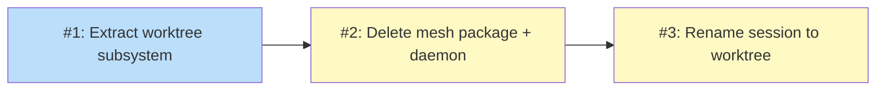

# PLAN: niwa mesh removal

## Status

Draft

## Scope Summary

Remove niwa's non-functional pre-pivot agent-facing surface in full — the
`internal/mcp` package, the pre-pivot CLI cluster, the coordinator session
registry and `niwa session register`, the change-review surface (`niwa surface`,
`internal/web/*`, the change-store and audit subsystem), the per-worktree daemon,
and apply-pipeline mesh-hook synthesis — while preserving git worktree creation
(and the worktree-attach primitive) as first-class CLI commands. No MCP, no
agent-coordination channels, and no change-review web UI remain in niwa. Lands in
a single PR.

## Decomposition Strategy

**Horizontal, single-PR.** This is a refactor-and-remove, not a new end-to-end
feature, so there is no walking skeleton to thin out. The work is three ordered
stages with hard sequential dependencies: the surviving capability must be
extracted and re-pointed before the package it lives in can be deleted, and the
preserved verbs are renamed only after the deletion settles the surface. The
design's atomic-landing requirement (R10) means none of these stages is
independently shippable — Stage 1 alone delivers no user-visible value, and
Stage 2 alone would break the build — so they land together in one PR. The three
outlines below exist to give `/work-on` a reviewable commit sequence within that
single PR, each stage leaving the tree building.

## Issue Outlines

### Issue 1: Extract the worktree subsystem and re-point all consumers

**Goal**: Create the `internal/worktree/` leaf package, move the
session-and-worktree lifecycle symbols into it, remove the daemon spawn from
worktree creation, and re-point every surviving consumer off `internal/mcp` — so
the tree still builds with `internal/mcp` present but unreferenced by surviving
code.

**Acceptance Criteria**:
- [ ] New package `internal/worktree/` holds the moved lifecycle symbols:
      `CreateSession` + `CreateSessionParams` (with the `DaemonStarter` field
      removed), `SessionLifecycleState` and its read/write/list/new helpers and
      status constants, the session-ID generator and atomic reservation,
      `scaffoldWorktreeNiwa` (without the `daemon.pid` placeholder),
      `findRepoInWorkspace`, the `GitInvoker` interface and its std
      implementation, the session registry symbols (`SessionEntry`,
      `WriteSessionEntry`, `SessionRegistry`, `DiscoverClaudeSessionID`),
      `AttachState` + I/O, `DaemonHealth`/`DaemonHealthFor`, and
      `IsPIDAlive`/`PIDStartTime`.
- [ ] `internal/worktree/` imports neither `internal/mcp` nor `internal/workspace`
      (verified leaf package; no import cycle).
- [ ] `git worktree add` invocations preserve the slice-argument form (no shell
      string interpolation of `repo`/`purpose`).
- [ ] `niwa session create/destroy` call `worktree.CreateSession` / the destroy
      path directly instead of constructing an `mcp.Server` and calling
      `CreateSessionDirect`/`DestroySessionDirect`.
- [ ] The 7 surviving CLI files (`session_lifecycle_cmd.go`, `session_register.go`,
      `daemon_starter.go`, `init.go`, `surface.go`, `go.go`, `completion.go`) and
      the `internal/cli/sessionattach/` package reference `internal/worktree/`,
      not `internal/mcp`.
- [ ] The workspace bootstrap wrapper (`createSessionWrapper` in `init.go`) calls
      `worktree.CreateSession`; the `CreateSessionFunc` test seam still works.
- [ ] `internal/cli/sessionattach/` has its daemon-supervision wiring
      (`EnsureDaemonRunningFn`/`TerminateDaemonFn`) removed; it still validates the
      worktree, acquires the in-use lock, and launches the tool.
- [ ] Tests for the moved lifecycle code move with it and pass.
- [ ] `go build ./...` and `go test ./...` pass with `internal/mcp` still present.

**Dependencies**: None

**Type**: code
**Files**: `internal/worktree/`, `internal/cli/session_lifecycle_cmd.go`, `internal/cli/session_register.go`, `internal/cli/daemon_starter.go`, `internal/cli/init.go`, `internal/cli/surface.go`, `internal/cli/go.go`, `internal/cli/completion.go`, `internal/cli/sessionattach/`, `internal/workspace/bootstrap.go`

### Issue 2: Delete the agent-facing surface in full

**Goal**: With worktree creation/attach re-pointed onto `internal/worktree/`,
delete the entire agent-facing surface — `internal/mcp`, the pre-pivot CLI
cluster, the coordinator registry and `niwa session register`, the change-review
surface (`niwa surface` + `internal/web/*` + change-store + audit), and the
per-worktree daemon — and narrow `niwa apply` so it synthesizes no mesh hooks and
spawns no background process. After this stage niwa has no MCP, no
agent-coordination channels, and no change-review web UI.

**Acceptance Criteria**:
- [ ] `internal/mcp/` is deleted in full (server, the MCP tools, audit subsystem,
      error-translation layer, task/change handlers and stores, watcher, auth,
      coordinator session registry, daemon-starter wiring).
- [ ] The pre-pivot CLI files are deleted (`mesh*.go`, `task*.go`, `mcp_*.go` and
      their tests), and the `mesh`, `task`, and `mcp-serve` cobra commands are
      unregistered (no orphaned subcommand registrations).
- [ ] `niwa session register` and its CLI file (`session_register.go`) are deleted
      — the command exists only to populate the coordinator registry consumed by
      the deleted mesh hooks.
- [ ] The change-review surface is deleted: the `niwa surface` command
      (`surface.go`), the `internal/web/*` packages (server, handlers, gc/sweep,
      render), and the change-store + audit code in `internal/mcp`. The `niwa
      surface` cobra command is unregistered.
- [ ] `internal/workspace/daemon.go` is deleted (`EnsureDaemonRunning`,
      `TerminateDaemon`); `daemon_starter.go` is deleted (its only mcp reference,
      `ErrDaemonSpawnTimeout`, dies with the daemon).
- [ ] `internal/workspace/channels.go` no longer synthesizes the mesh hooks
      (`mesh-session-start.sh`, `mesh-user-prompt-submit.sh`, `report-progress.sh`)
      and no longer calls `EnsureDaemonRunning`.
- [ ] `niwa apply` installs only declared hooks and starts no background process;
      `niwa status` no longer reports daemon health.
- [ ] Affected tests are deleted or revised; the surviving attach primitive no
      longer references mcp (its `--force` mesh-task check is already removed in
      Stage 1).
- [ ] A grep confirms zero references to `internal/mcp` remain anywhere in the
      tree.
- [ ] `go build ./...`, `go vet ./...`, and `go test ./...` pass.

**Dependencies**: Blocked by <<ISSUE:1>>

**Type**: code
**Files**: `internal/mcp/`, `internal/web/`, `internal/cli/`, `internal/workspace/channels.go`, `internal/workspace/daemon.go`

### Issue 3: Rename niwa session * to niwa worktree * with deprecation aliases

**Goal**: Land the preserved verbs under their permanent `niwa worktree` name,
keeping the prior `niwa session` name working via deprecation aliases, and add a
critical functional test covering worktree creation end to end.

**Acceptance Criteria**:
- [ ] `niwa worktree create`, `niwa worktree destroy`, and `niwa worktree list`
      (and the attach subcommand under the worktree namespace) exist and work end
      to end.
- [ ] The prior `niwa session *` command paths still work and emit a deprecation
      notice pointing at the new `niwa worktree *` name.
- [ ] A `@critical` Gherkin scenario in `test/functional/features/` covers
      `niwa worktree create <repo> <purpose>` end to end, per the repo's
      functional-testing convention.
- [ ] `go build ./...`, `go test ./...`, and `make test-functional-critical` pass.

**Dependencies**: Blocked by <<ISSUE:2>>

**Type**: code
**Files**: `internal/cli/`, `test/functional/features/`

## Implementation Issues

Not applicable in single-pr mode. No GitHub issues or milestone are created; the
Issue Outlines above are the decomposition `/work-on` consumes. The work lands as
one PR with three ordered commits.

## Dependency Graph

**Legend**: Green = done, Blue = ready, Yellow = blocked.

## Implementation Sequence

The critical path is the whole plan: Issue 1 → Issue 2 → Issue 3, strictly
sequential. There is no parallelization opportunity — each stage depends on the
previous one building cleanly:

1. **Issue 1** is the only `ready` unit. It extracts and re-points so the tree
   builds with `internal/mcp` present but unreferenced. This is the load-bearing
   step; review it most carefully (the package move must be behavior-preserving).
2. **Issue 2** becomes unblocked once Issue 1 lands. It is the bulk deletion and
   apply-pipeline narrowing; the build must stay green.
3. **Issue 3** becomes unblocked once Issue 2 lands. It renames the surface and
   adds the critical functional coverage.

All three commits land in a single PR (R10, atomic landing). The PR is complete
when `go build`, `go vet`, `go test ./...`, and `make test-functional-critical`
all pass and no `internal/mcp` reference remains.
