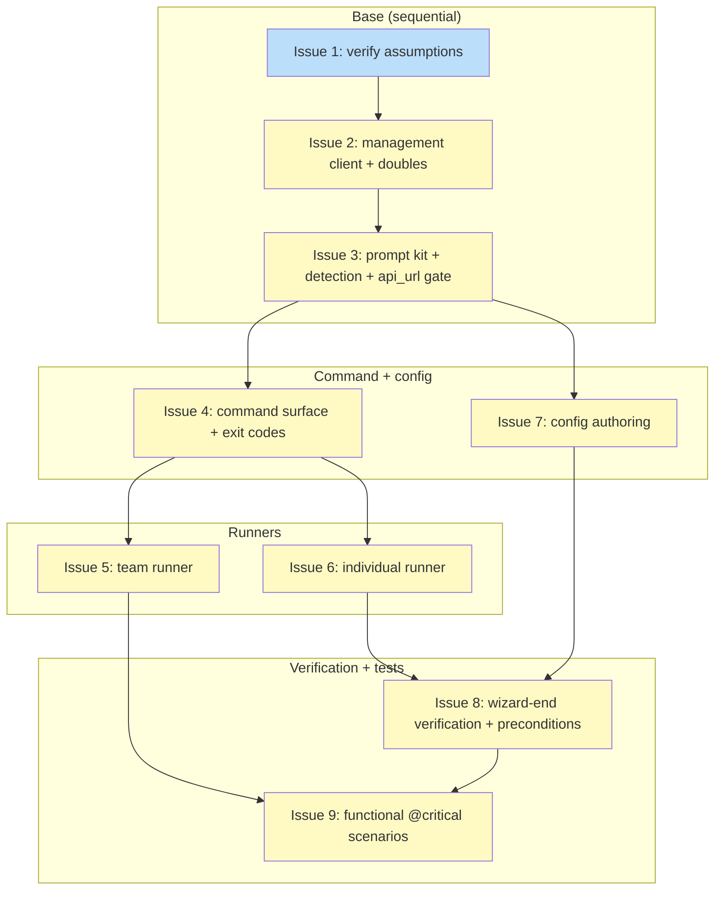

# PLAN: niwa onboard

## Status

Active

Single-pr mode. Per the unified plan lifecycle, a single-pr PLAN auto-transitions
Draft to Active when authoring finishes, with no human approval gate and no GitHub
side effects. Authoring is complete, so this PLAN is committed at Active. (A
committed single-pr PLAN left at Draft is a lifecycle violation — it would mean the
auto-transition never fired.) It transitions to Done when the `/work-on` cascade
runs before the PR flips to ready.

## Scope Summary

Ship `niwa onboard`: one interactive cobra command backed by a wizard engine in
`internal/onboard` that guides both the team setup and the individual setup,
detects setup and topology from observable world state, automates every mechanical
and exact-shape step it safely can, degrades to guided dashboard steps where the
provider exposes no automatable surface, and verifies the result resolves before
declaring success. The whole flow is hermetically testable against two doubles.
This plan covers everything in the design's Implementation Approach (phases 0-8),
landing as a single PR.

## Decomposition Strategy

**Horizontal.** The design already sequences nine phases where each builds one
component fully on interfaces settled by the five decisions: management client,
prompt kit, command shell, team runner, individual runner, config authoring,
verification, functional tests. The phases decompose cleanly along those component
seams, so each issue is one buildable, testable unit rather than a vertical slice
through all of them.

A separate walking-skeleton slice was not used: the design's Phase 3 already
delivers "the command shell wired to the wizard engine skeleton," so an extra
end-to-end skeleton pass would duplicate work the horizontal sequence already
contains. The build order is the design's own — foundation first (the REST client
and test doubles every later phase asserts against), then the interaction and
command layers, then the two runners, then verification and functional coverage.

## Issue Outlines

### Issue 1: docs(onboard): verify carried REST/CLI assumptions before build

**Goal**: Confirm the three assumptions the design's cross-validation flagged
before any code depends on them — re-fetch the management REST paths against
current Infisical API docs rather than inheriting them from the superseded
provision design, settle the Universal-Auth-attach and environment-grant
landing-check REST shapes, and determine whether `infisical login status` output
is parseable for org context. Each has a defined fallback, so none blocks the
build, but each changes call count or parsing detail and must be settled first.
Produce a short verification note recording findings and any path corrections.

**Acceptance Criteria**:
- [ ] The Universal-Auth-attach and environment-grant landing-check REST shapes
      are confirmed (whether each rides the GET-identity response or needs a
      separate read), with the trust-the-operator-claim fallback recorded where no
      read surface exists.
- [ ] The management REST paths are re-fetched against current Infisical API docs
      and pinned: read-identity, mint-client-secret, revoke (DELETE), and the
      net-new R9 read-hop environment secrets-read — the last pinned to a
      header-carrying (no-argv) REST endpoint.
- [ ] `infisical login status` parseability for org context is determined, with
      the classify-the-management-call's-own-error fallback recorded if it is
      unparseable or absent.
- [ ] Findings and any path corrections are captured in a durable note the
      downstream issues build against.
- [ ] Tests pass (existing suite) and CI green.

**Dependencies**: None

**Type**: docs

### Issue 2: feat(infisical): management REST client, session detection, api_url validation, test doubles

**Goal**: Lay the foundation the whole wizard builds on. Add the net-new
management REST client (`ReadIdentity`, `MintClientSecret`, `RevokeClientSecret`,
`ReadEnvironmentSecrets`) plus session/org detection to `internal/vault/infisical`,
all authenticating with the operator's own bearer and carrying secrets in headers
only. Extend `auth.go` with the single `resolveAPIURL` precedence rule and the
`api_url` validation function it feeds. Build both hermetic test doubles — the
httptest REST double and the extended `infisical` CLI stub — with seeding, fault
injection, and request recording, so every later phase tests against them.

**Acceptance Criteria**:
- [ ] `ReadIdentity`/`MintClientSecret`/`RevokeClientSecret`/`ReadEnvironmentSecrets`
      exist as plain package-level REST functions — none a `vault.Provider`
      method, none registered with `vault.DefaultRegistry`, none reached through
      `BatchResolver`; each authenticates with the operator's own bearer (or the
      minted pair's token for the read hop) carried in the `Authorization` header
      only.
- [ ] `MintClientSecret` returns the non-secret `secret_id` for R20 capture and
      registers the minted secret on the redactor the instant it is parsed.
- [ ] `resolveAPIURL` implements one precedence rule (explicit config value →
      `NIWA_INFISICAL_API_URL` env override → cloud default), consumed by both
      `Authenticate` and every management call.
- [ ] The `api_url` validation function hard-rejects a non-`https` value in every
      mode and flags a non-default `https` value for the entry gate (issue 3 wires
      the gate itself).
- [ ] The `infisical.go` package doc comment states the second (management)
      purpose, distinct from `Provider`/`Resolve`, and notes neither surface is
      reachable through `vault.Provider`.
- [ ] The static call-site lint test fails if any of `ReadIdentity`/
      `MintClientSecret`/`RevokeClientSecret` is called from team-phase code — a
      direct-call-site check, with the runtime request recorder the load-bearing
      team-path check.
- [ ] `infisicalFakeServer` models read-identity, mint-client-secret,
      universal-auth login, revoke, and environment-secrets-read; supports
      per-resource present/absent/malformed seeding, per-fault-mode injection
      (wrong-org auth, mint rejection, plan-gate, login-exchange failure, read-hop
      failure, revocation failure), and request recording; wired via
      `NIWA_INFISICAL_API_URL`.
- [ ] The extended `writeFakeInfisical` CLI stub serves `login`,
      `secrets folders create`, and `secrets set`; owns the folder and stored-body
      fixtures (present/absent/malformed); and can induce store-write and
      plan-gate failures.
- [ ] R17 secret hygiene holds on every management path: no secret on argv or env,
      REST secrets in `Authorization` headers only, secrets registered as
      `secret.Value` before first use, response bodies scrubbed before any logging
      or error wrapping, all errors via `secret.Errorf`.
- [ ] Security review completed.

**Dependencies**: Blocked by <<ISSUE:1>>

**Type**: code
**Files**: `internal/vault/infisical/management.go`, `internal/vault/infisical/session.go`, `internal/vault/infisical/auth.go`, `internal/vault/infisical/infisical.go`, plus the test doubles under `test/functional/` (the `infisicalFakeServer` REST double and the extended `writeFakeInfisical` CLI stub)

### Issue 3: feat(onboard): prompt kit, display sanitizer, api_url entry gate, detection funnel

**Goal**: Build the wizard's interaction and detection layer. Add the
`Confirm`/`Select`/`Pause` prompt kit over one shared re-prompt/EOF loop with a
single TTY-or-override gate at entry and one shared display-sanitizer (strip or
escape control bytes, ASCII/punycode-normalize hosts) applied to every config- or
response-sourced string. Wire the entry-time api_url gate to run right after
`resolveAPIURL` and before any bearer-carrying call. Implement the layered
local-first detection funnel: the free config signal, the reused identity-GET, and
topology inferred from that call's success/failure shape.

**Acceptance Criteria**:
- [ ] `Confirm(prompt, defaultYes)`, `Select(prompt, options)`, and
      `Pause(prompt)` share one re-prompt/EOF loop and one TTY-or-override gate
      performed once at wizard entry.
- [ ] Every config- or response-sourced string the kit prints passes through the
      display-sanitizer: control and non-printable bytes are stripped or escaped,
      and any host renders ASCII/punycode-normalized so a homoglyph is visible.
- [ ] The api_url entry gate runs right after `resolveAPIURL` and before the
      detection call: a non-`https` value is hard-rejected, and a non-default
      `https` value requires an interactive confirm or `--accept-api-url` (else
      exit 2) — asserted by the REST double showing zero requests when the gate
      rejects.
- [ ] Detection routes correctly across config-empty (team, no network),
      identity-not-found (team), identity-found-resolving (straight to
      verification), and identity-found-no-credential (individual), and infers
      split-login from the identity-GET's org-scope/unauthorized failure shape
      (grounds AC-2 and AC-5 inference).

**Dependencies**: Blocked by <<ISSUE:2>>

**Type**: code
**Files**: `internal/onboard/prompt.go`, `internal/onboard/detect.go`, `internal/onboard/apiurl.go`

### Issue 4: feat(onboard): onboard command surface, exit codes, non-TTY contract

**Goal**: Add the cobra command and terminal-outcome vocabulary that fronts the
wizard. Register `internal/cli/onboard.go` (`var onboardCmd`, flags in `init()`,
`rootCmd.AddCommand`) with `--team`/`--individual`, `--same-login`/`--split-login`,
`--json`, and `--accept-api-url`. Add the typed `onboard.ExitCodeError{Code, Msg}`
and a third `errors.As` arm in `Execute()`, plus the non-TTY fail-fast and the flag
mutual-exclusion errors. Wire the command shell to the wizard engine skeleton from
issue 3.

**Acceptance Criteria**:
- [ ] `niwa onboard` is a single command with no subcommands; `--team`/
      `--individual` and `--same-login`/`--split-login` are mutually-exclusive
      boolean pairs, and combining a conflicting pair is a plain exit 1 (AC-1);
      a supplied override forces the named setup regardless of what inference
      would pick (AC-3).
- [ ] `onboard.ExitCodeError` carries codes 0/2/3/4/5/6 mapped through the new
      `Execute()` arm per the design's exit-code table, giving each of the five
      terminal outcomes a distinct code (AC-26); 1 stays the repo-wide untyped
      fallback.
- [ ] Non-TTY fail-fast (exit 2): when stdin is not a TTY and neither the setup
      nor (when relevant) topology override is supplied, the command fails fast
      before any state change (AC-30).
- [ ] Non-TTY api_url contract: a non-default `api_url` in a non-TTY run fails fast
      (exit 2) unless `--accept-api-url` is supplied, and is never silently
      accepted; a non-`https` value rejects regardless of the flag.
- [ ] The `--json` terminal envelope carries `status`, `setup`, `exit_code`,
      `detail`, and non-secret identifiers only — never a secret value at any exit
      path.

**Dependencies**: Blocked by <<ISSUE:3>>

**Type**: code
**Files**: `internal/cli/onboard.go`, `internal/cli/root.go`, `internal/onboard/exitcode.go`, `internal/onboard/wizard.go`

### Issue 5: feat(onboard): team setup runner (landing checks, plan-gate degradation, R21 sweep)

**Goal**: Implement the team-phase step loop as a series of
landing-check-guarded units. Automate folder/secret-path creation by delegating to
`infisical secrets folders create`; degrade identity creation, Universal Auth
attach, and environment read grant to guided dashboard steps that print exactly
what to create (identity name, auth method, target environment slug — all
config-sourced), wait via `Pause`, then re-probe before advancing. A failed
landing check does not advance; a plan-gated step emits guided instructions and
resumes. Add the R21 re-run verification sweep.

**Acceptance Criteria**:
- [ ] Folder/secret-path creation fires the `infisical secrets folders create`
      CLI delegation, asserted against the CLI stub (AC-8).
- [ ] The guided identity/UA/grant steps print instructions containing the
      required tokens (identity name, auth method, target environment slug), wait,
      and verify the step landed (for identity, that it now exposes a `client_id`)
      before continuing (AC-9); a failed landing check re-surfaces the instruction
      and does not advance (AC-9b).
- [ ] No team-phase step drives any identity/org/project management REST endpoint
      with the operator's session JWT, asserted by the REST double's request
      recorder showing zero such calls on the team path (AC-10); every
      privileged team-phase call runs against the operator's own session with
      no niwa-custodied admin token (AC-12).
- [ ] A plan-gated step emits guided dashboard instructions for that specific step
      rather than a raw provider error, waits, and resumes the remaining steps
      automatically (AC-11).
- [ ] The R21 sweep verifies the identity exposes a `client_id`, the grant is
      present, and folders exist; names the missing artifact on failure; and is
      reported distinctly from R11 (AC-35).

**Dependencies**: Blocked by <<ISSUE:4>>

**Type**: code
**Files**: `internal/onboard/team.go`

### Issue 6: feat(onboard): individual setup runner (mint pipeline, store, split-login pause, R20 record + revocation)

**Goal**: Implement the individual-phase pipeline and its one persisted
non-secret record. Read the identity's `client_id` (`ReadIdentity`, never creating
an identity), mint a fresh secret (`MintClientSecret`, capturing `secret_id`), and
run R9's two-hop proof (same-package `authenticateHTTP` then `ReadEnvironmentSecrets`
with the token in a header, never `infisical export --token`) before any store.
Assemble the credential body with every interpolated field TOML-encoded, store it
via `infisical secrets set` over stdin at `/niwa/provider-auth/<kind>`, key
`p-<project-uuid>`. Insert exactly one login pause in split-login (zero in
same-login), run the self-referential guard before any write, and maintain the
`~/.config/niwa/` R20 record with best-effort revocation on supersession and on
store failure.

**Acceptance Criteria**:
- [ ] The wizard reads the existing identity's `client_id` and mints a fresh
      secret without creating an identity (GET-identity and POST-client-secret
      recorded, no create-identity request) (AC-13).
- [ ] R9 two-hop verification (universal-auth login exchange plus a
      target-environment read with the minted pair) runs before storing; on
      login-exchange failure no `infisical secrets set` delegation fires (AC-14).
- [ ] The stored credential is at `/niwa/provider-auth/<kind>`, key
      `p-<project-uuid>` (project id verbatim, no case-folding, `p-` prepended),
      with a TOML body carrying `version = "1"`, `client_id`, `client_secret`, and
      `api_url` only when non-default (AC-15, AC-16); a human types none of the
      path, key, or body (AC-17).
- [ ] Every interpolated field (`client_id`/`client_secret` from the mint,
      `project`/`api_url` from config) is TOML-encoded before embedding, and
      `secret_id`/identity id are validated before the DELETE/GET path, so a value
      carrying `"`, a newline, or `]` cannot break the body or inject a key/table.
- [ ] Split-login inserts exactly one login pause between mint and store;
      same-login inserts zero (AC-6, AC-7).
- [ ] The self-referential guard refuses to write when the credential-sync
      provider's own `(kind, project)` would be bootstrapped from the pool, before
      any write (AC-22).
- [ ] R20 revocation is best-effort and never changes an exit code: a superseding
      re-run revokes the prior recorded id (AC-33); a mint-then-verify success
      followed by a store failure revokes the just-minted id before exiting code 5
      (AC-34); an unrecoverable prior id yields a warning plus TTL-lapse and no
      revoke request (AC-35b).
- [ ] R17 hygiene holds: the store body is fed over stdin (never argv), any
      credential file is created `0600` via `os.OpenFile` in-dir then renamed
      (AC-29), REST secrets ride headers only (AC-28), and the `secrets set`
      subprocess stdout/stderr passes through `vault.ScrubStderr`; a canary
      `client_secret` rendered through every error and output surface
      (including `--json` and the exit-path envelope) never appears (AC-27).
- [ ] Security review completed.

**Dependencies**: Blocked by <<ISSUE:4>>

**Type**: code
**Files**: `internal/onboard/individual.go`, `internal/onboard/record.go`

### Issue 7: feat(onboard): config authoring (surgical TOML insert, three per-site drivers)

**Goal**: Implement config authoring as one shared table-header-aware insertion
primitive with a pre-write landing check, split three ways by git posture. The
personal-overlay `niwa.toml` gets a surgical `[global.vault.provider]` insert or
whole-table replace, committed locally with no custom author identity and never
pushed. The operator-local pointer (`~/.config/niwa/config.toml`) is written
directly. The team-config change is render-only: compute the snippet, name the
destination file, and stop. Every interpolated value is TOML-encoded, and each
write states which side it landed on.

**Acceptance Criteria**:
- [ ] The personal-overlay vault declaration is written to the overlay repo
      `niwa.toml` and nothing the wizard writes lands in the `.niwa/` snapshot
      (AC-24).
- [ ] The insert primitive is table-header-aware: it no-ops when the exact table
      already exists, appends after a blank line when absent, and replaces only the
      span from the table header to the next top-level header (or EOF) when present
      with different values, leaving comments, unknown tables, and unrelated blocks
      verbatim.
- [ ] Every interpolated value (`kind`, `project`, `api_url`) is TOML-encoded
      before embedding, so a value carrying `"`, a newline, or `]` cannot inject
      structure into the committed overlay.
- [ ] The overlay write uses the `0600`-temp-in-dir-then-rename discipline (no
      in-place truncate+rewrite); the overlay commit uses no custom author identity
      and does not push.
- [ ] Each config write states whether it landed in an upstream repo or
      operator-local state, and the team-config change is render-only, not
      committed on the operator's behalf (AC-25).

**Dependencies**: Blocked by <<ISSUE:3>>

**Type**: code
**Files**: `internal/onboard/config_authoring.go`

### Issue 8: feat(onboard): wizard-end verification and R22 preconditions

**Goal**: Wire the doctor-depth wizard-end check and the session/overlay
preconditions. R11 reuses `pickCredentialSyncSpec`/`openCredentialSyncProvider`,
the three-registry credential-pool enumeration, self-exclusion of the sync
provider's own `(kind, project)`, and the shared `parseProviderAuthBody` validator
— the exact read topology `niwa apply` uses, so the wizard and apply cannot
disagree. Add R22's session precondition (walk the operator through `infisical
login` as an in-scope pause, never a fail-fast) and overlay precondition (register
the pointer; scaffold the overlay config and guide the operator to create and push
the repo, never creating a remote repo). Report R9, R11, and R21 distinctly.

**Acceptance Criteria**:
- [ ] The wizard-end check opens one credential-sync provider, enumerates the pool
      across the three vault-registry sources, self-excludes the sync provider's
      own pair, and applies `parseProviderAuthBody` to each resolved body, reported
      distinctly from the mint-time R9 exchange (AC-18).
- [ ] On a malformed or unresolved stored credential (seeded via the CLI stub
      export), the check names the failing `(kind, project)`/source and the nature
      of the failure — missing entry, malformed body, missing field, or unsupported
      version — rather than a bare failure (AC-18b).
- [ ] When no authenticated `infisical` session exists at start, the wizard walks
      the operator through `infisical login` as a pause and resumes; it does not
      fail fast for a missing session (AC-36).
- [ ] When the personal-overlay pointer is unregistered, the wizard registers it
      via an operator-local `niwa config set global` write; when the overlay repo
      does not exist, it scaffolds the overlay config locally and guides the
      operator to create and push the repo, creating no remote repo on the
      operator's behalf (AC-37).

**Dependencies**: Blocked by <<ISSUE:6>>, <<ISSUE:7>>

**Type**: code
**Files**: `internal/onboard/verify.go`, `internal/onboard/preconditions.go`

### Issue 9: test(onboard): functional @critical scenarios and generic-surface grep

**Goal**: Add `test/functional/features/onboard.feature` and its step definitions.
Ship the individual-setup happy path driving both doubles and the TTY-decline path,
both `@critical`, so the core flow is gate-checked on every PR with no real service
or login. Add the re-run scenarios
(complete-setup-goes-straight-to-verification, partial-resume, topology-change
re-mint/re-store) composed from the doubles' seeding, and the source grep asserting
no baked-in org/workspace/project identifiers on the command surface.

**Acceptance Criteria**:
- [ ] A `@critical` Gherkin scenario drives the individual-setup happy path against
      both the CLI stub and the REST double and passes with no real service or
      login (AC-31).
- [ ] A `@critical` Gherkin scenario covers the TTY-decline path: the operator
      declines at the setup-confirmation prompt and the wizard exits with the
      decline/abort outcome (exit 3) having changed no state (AC-32, AC-4).
- [ ] Re-run scenarios pass: a completed setup goes straight to the wizard-end
      verification and performs no re-setup (AC-19); a partial setup resumes at the
      first incomplete step (AC-20); a topology change re-mints and re-stores at
      the new location (AC-21).
- [ ] A source grep over the command surface finds no org-, workspace-, or
      project-specific identifier in flags, defaults, or hard-coded messages
      (AC-23).

**Dependencies**: Blocked by <<ISSUE:5>>, <<ISSUE:8>>

**Type**: code
**Files**: `test/functional/features/onboard.feature` plus its step definitions in `test/functional/` (extending `steps_test.go` or a new `onboard_steps_test.go`)

## Dependency Graph

**Legend**: Green = done, Blue = ready, Yellow = blocked, Purple = needs-design,
Orange = tracks-design/tracks-plan.

## Implementation Sequence

**Critical path:** Issue 1 → Issue 2 → Issue 3 → Issue 4 → Issue 6 → Issue 8 →
Issue 9 (7 issues). The individual-runner arm is the long pole: it carries both
critical issues (2 and 6 — credential custody and secret hygiene), and issue 8's
verification cannot run until issue 6 has stored a credential.

**Recommended order:**
1. Issue 1 — verify the carried REST/CLI assumptions (research; no code).
2. Issue 2 — management client, session detection, api_url validation, and both
   test doubles (foundation every later phase asserts against).
3. Issue 3 — prompt kit, display-sanitizer, api_url entry gate, detection funnel.
4. Issues 4 and 7 — command surface and config authoring; independent of each
   other once issue 3 lands.
5. Issues 5 and 6 — team runner and individual runner; independent of each other
   once issue 4 lands.
6. Issue 8 — wizard-end verification and preconditions (needs issues 6 and 7).
7. Issue 9 — functional `@critical` scenarios and the generic-surface grep (needs
   issues 5 and 8; closes over all nine).

**Parallelization:** Three seams open inside the single PR. After issue 3, issues
4 and 7 can proceed in parallel. After issue 4, issues 5 and 6 can proceed in
parallel and touch disjoint files (`team.go` vs `individual.go`/`record.go`).
Toward the tip, issue 5 can still be in flight while issue 8 runs, converging at
issue 9. Issues 1, 2, and 3 are strictly sequential at the base — each settles the
interface the next builds on — so no parallelism exists before issue 3 completes.
