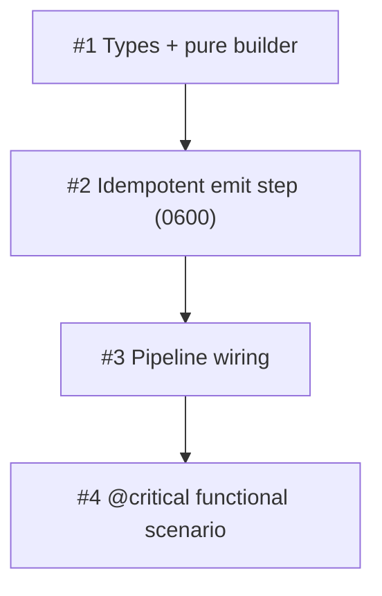

# PLAN: niwa apply emits a workspace-aware role table

## Status

Draft

Single-PR plan decomposed from `docs/designs/DESIGN-niwa-role-table.md`
(Accepted) via an autonomous `/scope` run. All four work items land in one
pull request; outlines below are the in-PR work breakdown, not separate
GitHub issues.

## Scope Summary

Add an apply-pipeline emit step that serializes niwa's already-computed role
set to a versioned, drift-tracked `.niwa/roles.json`, so sibling tools (the
shirabe bridge skill, koto mention-routing, the future `niwa role` CLI) and
any session can resolve a role name to its inbox from one authoritative file.

## Decomposition Strategy

**Horizontal.** The design describes a layered pipeline with stable interfaces
between each layer: a pure, I/O-free builder (`buildRoleTable`) feeds an emit
step (`EmitRoleTable`) that owns file I/O and idempotency, which a single
pipeline call site wires in, validated end-to-end by a functional scenario.
Each layer has a well-defined boundary and is a prerequisite for the next, and
the lower layers are unit-testable in isolation before the integration exists.
Integration risk is low — one new file write inside a directory apply already
owns, reusing existing JSON, path-constant, and managed-file machinery — so the
early-feedback benefit of a walking skeleton is not needed; building each layer
fully before the next is the lower-friction shape.

The four work items follow the design's own Implementation Approach phases
1-to-4 directly.

## Issue Outlines

### <<ISSUE:1>> — Serializable types and pure role-table builder

**Complexity:** testable

**Goal.** Add `internal/workspace/roletable.go` with the serializable types,
the schema-version and path constants, and the pure `buildRoleTable` function
that maps the enumeration into the wire shape. No I/O — this is the
table-testable core that the emit step and pipeline build on.

**Scope.**
- `roleTable` struct: `SchemaVersion int` (`json:"schema_version"`),
  `Generated time.Time` (`json:"generated"`), `Roles []roleTableEntry`
  (`json:"roles"`).
- `roleTableEntry` struct: `Name string`, `Coordinator bool`,
  `Repo *string` (`json:"repo"`, nil → JSON `null`), `Inbox string`.
- `const roleTableSchemaVersion = 1`.
- `RoleTableFile = "roles.json"` constant beside `StateDir`/`StateFile`, plus
  `RoleTablePath(instanceRoot) = filepath.Join(instanceRoot, StateDir,
  RoleTableFile)`.
- `buildRoleTable(roles []roleEntry, instanceRoot string) (roleTable, error)`:
  preserves `enumerateRoles`' coordinator-first, name-sorted order (no
  re-sort); sets `Coordinator` true only for the coordinator; converts each
  `roleEntry.repoPath` to an instance-root-relative path via `filepath.Rel`,
  emitting `null` (nil `*string`) for the coordinator's empty `repoPath`;
  computes `Inbox` as the instance-root-relative `.niwa/roles/<name>/inbox`.
- Reject (return an error) any role whose `repoPath` resolves outside the
  instance root (no `..` escape, no absolute leak) — the relative-path
  invariant from the design's Security Considerations, enforced in code.

**Acceptance criteria.**
- [ ] Table-driven unit tests cover: coordinator entry (`Repo` nil, `Inbox`
      = `.niwa/roles/coordinator/inbox`), a topology-derived role, an explicit
      `[channels.mesh.roles]` override role, ordering preservation
      (coordinator first, then name-sorted), and relative-path computation.
- [ ] A test asserts no built `Repo`/`Inbox` value is absolute, contains the
      instance-root prefix, or contains a `..` segment.
- [ ] A test asserts a role resolving outside the instance root produces an
      error rather than a leaked path.
- [ ] `go test ./internal/workspace/...`, `gofmt`, and `go vet` pass.

**Dependencies.** None.

**Design refs.** Decision 3 (schema), Components, Implementation Approach
Phase 1, Security Considerations invariant 2.

---

### <<ISSUE:2>> — Idempotent emit step writing `.niwa/roles.json` at mode 0600

**Complexity:** critical

Classified critical because this item owns the feature's two security
invariants — no host-path leakage (relative paths only) and restrictive file
mode (0600) — on a file explicitly intended to be committed and read by
external tools.

**Goal.** Add `EmitRoleTable(roles []roleEntry, instanceRoot string,
writtenFiles *[]string) error`: build the table, apply the idempotency check,
write the file only on a real change at mode 0600, and append the path to
`writtenFiles` so apply's Step 7 hashes it into `ManagedFiles`.

**Scope.**
- Call `buildRoleTable`; on a build error, fail the emit (propagate).
- Idempotency: read any existing `.niwa/roles.json`; compare the `roles`
  payload only (NOT `generated`). If unchanged, leave the file byte-identical
  (preserve the prior `generated`) and skip the write. If changed or absent,
  set `generated` and write.
- Write through the channels installer's existing `writeIdempotent` helper (or
  `os.WriteFile` + explicit `Chmod(0o600)`) — never a bare write that inherits
  the umask — using `json.MarshalIndent(..., "", "  ")` to match
  `instance.json`/`sessions.json`.
- Always append `RoleTablePath(instanceRoot)` to `*writtenFiles` (even on the
  no-op path) so managed-file tracking stays consistent.

**Acceptance criteria.**
- [ ] Unit tests cover: absent-file (writes fresh), unchanged-set (second emit
      produces a byte-identical file and preserves `generated`),
      changed-set (rewrite reflects new roles and refreshes `generated`).
- [ ] A test asserts the emitted file's mode is `0600`.
- [ ] A test asserts the emitted JSON contains no absolute path, no
      instance-root prefix, and no `..` segment (read-back of the serialized
      bytes).
- [ ] A test asserts the path is appended to `writtenFiles` on both the write
      and the no-op paths.
- [ ] `go test ./internal/workspace/...`, `gofmt`, and `go vet` pass.

**Dependencies.** `<<ISSUE:1>>`.

**Design refs.** Decision Outcome (idempotency), Data Flow steps 2-4,
Idempotency detail, Security Considerations invariants 1 and 2.

---

### <<ISSUE:3>> — Wire the emit step into the apply pipeline

**Complexity:** testable

**Goal.** Invoke `EmitRoleTable` in `runPipeline`
(`internal/workspace/apply.go`) immediately after
`InstallChannelInfrastructure` returns (around `apply.go:1276`, before Step 5),
passing the enumerated roles, `instanceRoot`, and the existing `&writtenFiles`
accumulator, so the table is emitted on every run that installs mesh
infrastructure and is picked up by Step 7 into `InstanceState.ManagedFiles`.
`runPipeline` is the pipeline shared by both `Applier.Create` (`apply.go:288`)
and `Applier.Apply` (`apply.go:428`), so wiring here — and only here — gives
create/apply symmetry (PRD R1) for free; do NOT add the call in an apply-only
branch.

**Scope.**
- Obtain the enumerated role set at the call site the same way
  `InstallChannelInfrastructure` obtains it (share the slice or re-invoke
  `enumerateRoles`); pass it to `EmitRoleTable`.
- Emit unconditionally whenever mesh channel infrastructure is installed (R1,
  R10) — no consumer-presence gating.
- No table-specific managed-file code: appending to `writtenFiles` is the whole
  integration; Step 7 (`apply.go:1435-1452`) and `CheckDrift` (`apply.go:411`)
  handle the rest.

**Acceptance criteria.**
- [ ] An apply-level test asserts `.niwa/roles.json` exists after apply and
      appears in `InstanceState.ManagedFiles` (drift-tracked).
- [ ] The emitted table lists exactly the enumerated roles (coordinator + one
      per cloned repo + explicit overrides), with each `inbox` matching the
      inbox directory created in the same apply.
- [ ] A test exercising the `Applier.Create` path asserts `.niwa/roles.json` is
      emitted there too (the call is in shared `runPipeline`, not apply-only) —
      locking PRD R1 create/apply symmetry.
- [ ] `go test ./...`, `gofmt`, and `go vet` pass.

**Dependencies.** `<<ISSUE:2>>`.

**Design refs.** Key Interfaces (internal call site, create/apply symmetry,
managed-file registration), Implementation Approach Phase 3; PRD R1, R9, R10.

---

### <<ISSUE:4>> — `@critical` functional scenario for role-table emission

**Complexity:** testable

**Goal.** Add a `@critical` Gherkin scenario under `test/functional/features/`
driving real `niwa apply` against `localGitServer` bare-repo fakes, validating
the end-to-end emission, idempotency, and add/remove-repo behavior the PRD
acceptance criteria require.

**Scope.**
- Assert `.niwa/roles.json` exists after apply.
- Assert it lists exactly the enumerated roles (coordinator + one per cloned
  repo); each `inbox` matches the created inbox directory.
- Assert a second apply on the unchanged workspace yields a byte-identical file
  (R8).
- Assert adding a repo and re-applying adds exactly one role entry; removing a
  repo removes exactly that entry.
- Assert a fresh `niwa create` produces `.niwa/roles.json` before any explicit
  `apply` (create/apply symmetry, R1; covers the init → create → apply workflow
  per CLAUDE.md).
- Assert the file contains no absolute host path (relative-path contract, R16).

**Acceptance criteria.**
- [ ] The scenario is tagged `@critical` and runs under `make
      test-functional-critical`.
- [ ] All assertions above pass against the compiled binary via the
      `localGitServer` helper (offline).
- [ ] `make test-functional-critical` passes.

**Dependencies.** `<<ISSUE:3>>`.

**Design refs.** Implementation Approach Phase 4; PRD Acceptance Criteria;
CLAUDE.md functional-testing convention.

## Dependency Graph

## Implementation Sequence

The four items form a single linear critical path —
`<<ISSUE:1>>` → `<<ISSUE:2>>` → `<<ISSUE:3>>` → `<<ISSUE:4>>` — with no
parallelization opportunity, which is expected for a horizontal decomposition
of one tightly-layered emit step. Land them in order within one PR:

1. **`<<ISSUE:1>>`** establishes the types and the pure, fully-tested builder
   (including the relative-path invariant) with zero I/O.
2. **`<<ISSUE:2>>`** adds the file-writing emit step with idempotency and the
   0600 mode invariant on top of the builder.
3. **`<<ISSUE:3>>`** wires the emit step into `runPipeline` and confirms
   managed-file/drift participation.
4. **`<<ISSUE:4>>`** validates the whole path end-to-end against real applies.

Each step is independently reviewable, but the PR is the unit of delivery: the
observable value — `niwa apply` emitting a working, drift-tracked role table —
is realized when all four land together.

## Value Confirmation

Single-PR unit check (Phase 3.5a): the one PR-shaped unit delivers observable
incremental value on its own — after it merges, `niwa apply` emits a versioned,
drift-tracked `.niwa/roles.json` that any reader can resolve role names
against, with no consumer required to be present (PRD R10). The split into four
in-PR items is a work breakdown, not four independently-shippable increments;
none is intended to land alone. Execution mode **single-pr** confirmed — no
hard constraint forces multiple PRs, and the feature is one cohesive
deliverable. (Autonomous `/scope` run; recommended-default judgment.)
