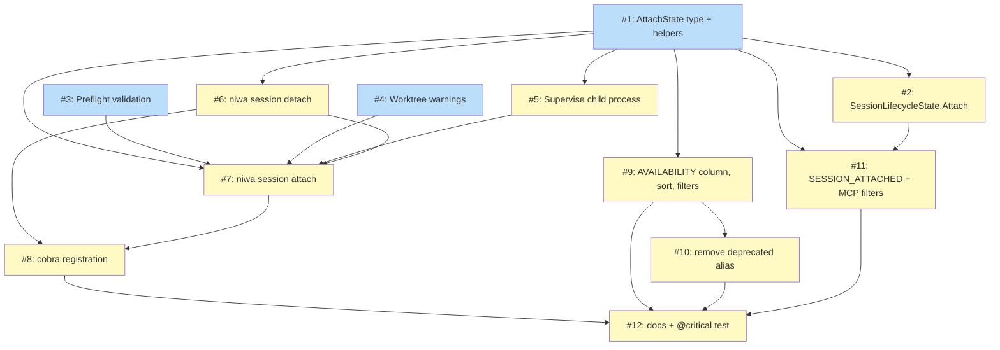

# PLAN: niwa session attach

## Status

Draft

## Scope Summary

Implements the human-in-the-loop primitive specified in
`PRD-niwa-session-attach.md` and architected in
`DESIGN-niwa-session-attach.md`: `niwa session attach <id>` and
`niwa session detach <id> [--force]`, plus the supporting state-model
addition (`attach` sub-object), CLI surface changes (AVAILABILITY
column, default-sort, filters, deprecated-alias removal), MCP tool
extensions (`niwa_list_sessions` filter parameters,
`niwa_destroy_session` `SESSION_ATTACHED` error), the `@critical`
Gherkin functional test, and the `docs/guides/sessions.md` update.

## Decomposition Strategy

**Horizontal layered.** The design's components have well-defined
interfaces with low runtime coupling: the sentinel/lock primitives in
`internal/mcp/attach_state.go` are independent of the cobra wiring,
which is independent of the daemon coordination, which is independent
of the AVAILABILITY column rendering. Walking-skeleton would be valid
but the layers can be tested in isolation, so horizontal yields more
parallel-friendly issues with less integration risk than a thin
end-to-end slice.

The 12 issues are grouped into 4 layers, with intra-layer parallelism:

- **Layer 1 (foundation)**: state types, sentinel helpers,
  preflight, worktree-warning helpers (Issues 1-4). Mostly independent;
  no inter-issue dependencies within the layer.
- **Layer 2 (process supervision)**: the supervise primitive that
  builds on Layer 1 (Issue 5).
- **Layer 3 (commands)**: detach + attach commands wiring everything
  together (Issues 6-8).
- **Layer 4 (CLI / MCP / docs surface)**: AVAILABILITY column +
  filters + sort, deprecated-alias removal, MCP destroy gate + filter
  params, docs and functional test (Issues 9-12).

This ordering means Layer 1 can land in any internal order, Layer 2
unblocks Layer 3, and Layer 4 can land in parallel with Layer 3 once
the AttachState type from Layer 1 is in place.

## Issue Outlines

### Issue 1: feat(mcp): introduce AttachState type and sentinel helpers

**Goal**: Add the `AttachState` type, `AttachAvailability` enum, and
the read/write/remove/path helpers in a new file
`internal/mcp/attach_state.go`. This is the foundation every other
attach-aware code path reads from.

**Acceptance Criteria**:
- [ ] New file `internal/mcp/attach_state.go` defines `AttachState`
  with the on-disk shape `{v, owner_pid, owner_start_time, started_at,
  lock_path}`.
- [ ] New file defines `AttachAvailability` constants `available`,
  `attached`, `stale`.
- [ ] `WriteAttachState` writes via atomic tmp+rename with mode 0600.
- [ ] `ReadAttachState(worktree, reapStale)` returns `(*AttachState,
  AttachAvailability, error)`. Returns `(nil, available, nil)` when no
  sentinel. Returns `(state, stale, nil)` when sentinel exists but
  owner pid is dead per `IsPIDAlive`. Returns `(state, attached, nil)`
  when alive. Best-effort reap when `reapStale=true` and state is
  stale; deletion failure logged not returned.
- [ ] `RemoveAttachState` is idempotent (missing file returns nil).
- [ ] `AttachLockPath`/`AttachStatePath` return the deterministic
  filesystem paths.
- [ ] Unit tests cover: write+read round-trip, stale detection
  (mock `IsPIDAlive`), missing-file returns available,
  reap-on-stale-when-flag-set, idempotent remove, mode-0600
  enforcement.

**Dependencies**: None

**Type**: code
**Files**: `internal/mcp/attach_state.go`, `internal/mcp/attach_state_test.go`

### Issue 2: feat(mcp): add Attach projection field to SessionLifecycleState

**Goal**: Add the `Attach *AttachState` field to
`SessionLifecycleState` so the type can carry the computed attach
projection in MCP responses without changing the on-disk schema.

**Acceptance Criteria**:
- [ ] `internal/mcp/session_lifecycle.go` adds
  `Attach *AttachState \`json:"attach,omitempty"\`` to the struct.
- [ ] Existing `WriteSessionLifecycleState` round-trip tests still
  pass (the field is `omitempty`; nil pointer marshals to absent
  key).
- [ ] A new test asserts that JSON-marshaling a `SessionLifecycleState`
  with `Attach == nil` produces output where the `attach` key is
  absent (not `null`). Verified by string-matching that the substring
  `"attach"` does not appear in the JSON.
- [ ] A new test asserts that JSON-marshaling with
  `Attach != nil` produces output containing the full sub-object.
- [ ] No `V` field bump.

**Dependencies**: Blocked by <<ISSUE:1>>

**Type**: code
**Files**: `internal/mcp/session_lifecycle.go`, `internal/mcp/session_lifecycle_test.go`

### Issue 3: feat(sessionattach): preflight transcript validation

**Goal**: Implement the `EncodeProjectDir`, `TranscriptPath`,
`PreflightError`, and `Preflight` helpers in a new package
`internal/cli/sessionattach`. These produce the three niwa-shaped
error messages PRD R4 requires.

**Acceptance Criteria**:
- [ ] New file `internal/cli/sessionattach/preflight.go` defines
  `EncodeProjectDir` per the `s/[^A-Za-z0-9]/-/g` rule. Test
  cases include `/tmp/claude-resume-test`, `/tmp/cr.dotted/sub_dir`,
  `/tmp/cr space/test`, and `/tmp/cr@upper-CASE+plus/x` from the
  exploration's empirical findings.
- [ ] `TranscriptPath(homeDir, workerCWD, convID)` returns the
  full path `<homeDir>/.claude/projects/<encoded>/<convID>.jsonl`.
- [ ] `Preflight(state)` returns nil on success.
- [ ] On case A (empty `ClaudeConversationID`), returns a
  `*PreflightError` whose `Error()` matches the verbatim PRD R4
  case-A string.
- [ ] On case B (transcript file missing), `Error()` matches the
  verbatim case-B string and includes the expected path.
- [ ] On case C (transcript file is zero bytes), `Error()` matches
  the verbatim case-C string and includes the path.
- [ ] Unit tests cover all three cases plus the happy path; uses
  tmp dirs and fixture transcript files.

**Dependencies**: None (independent of Issue 1)

**Type**: code
**Files**: `internal/cli/sessionattach/preflight.go`, `internal/cli/sessionattach/preflight_test.go`

### Issue 4: feat(sessionattach): worktree-state warning helpers

**Goal**: Implement the worktree-state inspection helpers used by
the natural-detach release path: detection of uncommitted edits,
untracked files, and unpushed commits on the session branch, with
warning-formatted output matching the PRD R20 wording.

**Acceptance Criteria**:
- [ ] New file `internal/cli/sessionattach/worktree_warnings.go`
  defines a `Warnings(worktreePath, sessionID, w io.Writer)` function.
- [ ] Detects uncommitted changes via `git status --porcelain`
  (modified or staged: any line not starting with `??`). Emits
  `warning: worktree has uncommitted changes` followed by the
  porcelain output.
- [ ] Detects untracked-only files (`??` lines from `git status
  --porcelain`). Emits `warning: worktree has untracked files`
  followed by the porcelain output.
- [ ] Detects unpushed commits on `session/<sessionID>` via
  `git for-each-ref` upstream tracking. Emits `warning: worktree
  has unpushed commits on session/<sessionID>` followed by the
  ahead-count.
- [ ] Multiple kinds can be detected on the same worktree; emits
  one warning section per kind found.
- [ ] No state changes on disk; this function only reads and writes
  to the supplied `io.Writer`.
- [ ] Unit tests use the existing `localGitServer` fixture from
  `test/functional/` (or analogous test helper) to set up dirty,
  untracked, and unpushed scenarios.

**Dependencies**: None (independent of Issues 1-3)

**Type**: code
**Files**: `internal/cli/sessionattach/worktree_warnings.go`, `internal/cli/sessionattach/worktree_warnings_test.go`

### Issue 5: feat(sessionattach): child-process supervision and signal handling

**Goal**: Implement the `Supervise` helper that spawns Claude Code
as a child process under the foreground niwa-attach process, with
stdio inheritance, CWD pinning, signal forwarding, and exit-code
propagation (capped at 125 per PRD R7).

**Acceptance Criteria**:
- [ ] New file `internal/cli/sessionattach/supervise.go` defines a
  `Supervise(ctx, claudeBin, convID, workerCWD, stdio io.Reader/Writer/Writer)
  (exitCode int, err error)` function.
- [ ] Spawns `<claudeBin> --resume <convID>` with `cmd.Dir =
  workerCWD`, stdio inherited from supplied io values.
- [ ] Returns the propagated exit code, capped at 125. Codes
  greater than 125 collapse to 125.
- [ ] If `claudeBin` is empty, looks it up via `exec.LookPath("claude")`
  and returns a niwa-shaped error if not found:
  `niwa: error: claude binary not found in PATH`.
- [ ] Installs a SIGINT handler that, when fired before the child
  starts, returns exit code 130 without spawning. After the child
  starts, signals are forwarded to the child and the exit waits on
  `cmd.Wait()`.
- [ ] Unit tests use a fake "claude" binary (a small Go test helper
  echoing argv and exiting with a controlled code) to verify argv,
  CWD, exit-code propagation, and 125-cap behaviour.

**Dependencies**: Blocked by <<ISSUE:1>>

**Type**: code
**Files**: `internal/cli/sessionattach/supervise.go`, `internal/cli/sessionattach/supervise_test.go`

### Issue 6: feat(sessionattach): niwa session detach command

**Goal**: Implement the `detach` command logic (read sentinel, check
liveness, auto-reap stale, force-kill live holder), exposed as a
`Run(ctx, opts) error` function. Cobra wiring is part of Issue 8.

**Acceptance Criteria**:
- [ ] New file `internal/cli/sessionattach/detach.go` defines `Run`
  with the `DetachOptions` struct from the design doc.
- [ ] Returns nil and prints nothing when no sentinel exists
  (idempotent).
- [ ] When holder PID is dead, removes sentinel and returns nil.
  Stderr is silent.
- [ ] When holder PID is alive and `Force == false`, returns a
  niwa-shaped error matching the PRD R3 format and exits with code 3.
- [ ] When holder PID is alive and `Force == true`, sends SIGTERM,
  waits `NIWA_DESTROY_GRACE_SECONDS` (default 5s), SIGKILLs if
  needed, removes sentinel, prints
  `warning: detaching live attach holder pid=<int> started=<RFC3339>`
  to stderr, and returns an error wrapping exit code 4 (PRD Exit
  Code Mapping).
- [ ] Unit tests cover all four cases (no sentinel, dead holder,
  live + no force, live + force) using a test-process fixture for
  the live-holder cases.

**Dependencies**: Blocked by <<ISSUE:1>>

**Type**: code
**Files**: `internal/cli/sessionattach/detach.go`, `internal/cli/sessionattach/detach_test.go`

### Issue 7: feat(sessionattach): niwa session attach command

**Goal**: Implement the `attach` command logic — the orchestration
of all the Layer 1 + Layer 2 helpers per the sequence diagrams in
the design doc. Exposed as `Run(ctx, opts) error`.

**Acceptance Criteria**:
- [ ] New file `internal/cli/sessionattach/attach.go` defines `Run`
  with the `Options` struct from the design doc.
- [ ] Step 1: reads `SessionLifecycleState` and rejects with
  niwa-shaped error if status != active (PRD R2, exit 1).
- [ ] Step 2: acquires `flock(<worktree>/.niwa/attach.lock,
  LOCK_EX|LOCK_NB)`. On contention, calls
  `ReadAttachState(reapStale=true)`. If the result is stale, retries
  flock once. If still contested, returns PRD R3 error (exit 3).
- [ ] Step 3: scans tasks for a running worker in the session's
  inbox (mirrors the existing `killSessionWorkers` walk, but
  read-only). Without `Force`, polls every 1s and prints the wait
  message every 5s (PRD R6). With `Force`, sends SIGTERM, waits
  grace, SIGKILLs.
- [ ] Step 4: calls `Preflight(state)`. On error, releases the
  lock and exits 1 with the case-specific message verbatim.
- [ ] Step 5: calls `TerminateDaemon(worktreePath)`.
- [ ] Step 6: calls `WriteAttachState` with the current PID, start
  time, RFC3339 now, and lock path.
- [ ] Step 7-8: calls `Supervise` with the stdio. On clean exit,
  returns the propagated exit code.
- [ ] Step 9 (cleanup, runs in defer): `RemoveAttachState`,
  `EnsureDaemonRunning(worktreePath, nil)`, calls the worktree
  warnings helper writing to stderr. Daemon respawn failures are
  logged warnings, not propagated errors.
- [ ] SIGINT during the wait (step 3) calls the cleanup defer and
  exits 130.
- [ ] Cross-UID failure (EACCES on state read) is wrapped per PRD
  R26 as `niwa: error: cannot attach to session owned by another
  user (file owner uid=<int>, your uid=<int>)`.
- [ ] Stderr emits `session: attached <id> at <path>` after step 6
  and before claude takes over; emits `session: detached <id>`
  after step 9.
- [ ] Unit tests cover: status-not-active rejection, lock contention
  with live holder, lock contention with stale lock (auto-reap +
  retry), preflight cases A/B/C, force-kill running worker,
  successful end-to-end with a test stand-in for claude.

**Dependencies**: Blocked by <<ISSUE:1>>, <<ISSUE:3>>, <<ISSUE:4>>, <<ISSUE:5>>, <<ISSUE:6>>

**Type**: code
**Files**: `internal/cli/sessionattach/attach.go`, `internal/cli/sessionattach/attach_test.go`

### Issue 8: feat(cli): cobra registration for session attach and detach

**Goal**: Wire the new commands into the existing `sessionCmd`
parent so `niwa session attach <id>` and `niwa session detach <id>`
are exposed at the CLI surface with the correct flags and help
text.

**Acceptance Criteria**:
- [ ] New file `internal/cli/session_attach_register.go` registers
  `sessionAttachCmd` and `sessionDetachCmd` under `sessionCmd` in
  an `init()` function.
- [ ] `niwa session attach --help` shows the description and the
  `--force` flag (description: "SIGTERM the running worker before
  acquiring the attach lock").
- [ ] `niwa session detach --help` shows the description and the
  `--force` flag (description: "release the attach lock even if
  held by a live process").
- [ ] Commands accept exactly one positional arg (session_id).
  Without an arg, `niwa session detach` prints PRD R10 usage error
  and exits 2.
- [ ] `RunE` functions delegate to `sessionattach.Run` /
  `sessionattach.DetachRun` after building the Options struct from
  cobra flags and resolving the instance root.
- [ ] Smoke unit tests use a fake instance root + state file to
  verify the cobra surface invokes the right helpers.

**Dependencies**: Blocked by <<ISSUE:6>>, <<ISSUE:7>>

**Type**: code
**Files**: `internal/cli/session_attach_register.go`

### Issue 9: feat(cli): AVAILABILITY column, sort, filters on niwa session list

**Goal**: Update `niwa session list` to read each session's attach
sentinel, render the AVAILABILITY column, sort attached-first, and
support `--attached` and `--available` filter flags.

**Acceptance Criteria**:
- [ ] `internal/cli/session_lifecycle_cmd.go`'s
  `runSessionLifecycleList` calls `mcp.ReadAttachState(worktreePath,
  reapStale=true)` for each row to derive the availability value.
- [ ] `writeSessionLifecycleTable` renders the new
  `AVAILABILITY` column 12 chars wide, between `STATUS` and
  `CREATED`. Header is uppercase; values are lowercase
  `available`/`attached`/`stale`.
- [ ] Sort key composite per PRD R17: attached first (descending by
  `started_at` from the sentinel), then by status (active before
  ended/abandoned), then by `creation_time` descending.
- [ ] `sessionListCmd` adds `--attached` and `--available` boolean
  flags (mutually exclusive — passing both is an error).
- [ ] Filters AND-combine with the existing `--repo` and `--status`.
- [ ] Sessions with `stale` availability are EXCLUDED from both
  `--attached` and `--available` filtered listings.
- [ ] Unit tests cover: column rendering, three-row sort fixture,
  --attached filter, --available filter, mutual exclusion error.

**Dependencies**: Blocked by <<ISSUE:1>>

**Type**: code
**Files**: `internal/cli/session_lifecycle_cmd.go`, `internal/cli/session.go`

### Issue 10: refactor(cli): remove deprecated session list to mesh list alias

**Goal**: Complete the deprecation — `niwa session list` (no flags)
defaults to the lifecycle view (NOT the deprecated coordinator-
registry alias). Operators wanting the coordinator process registry
call `niwa mesh list` directly. Per PRD R14.

**Acceptance Criteria**:
- [ ] `internal/cli/session.go` `runSessionList` no longer prints
  the deprecation warning and no longer falls back to
  `runMeshList`.
- [ ] Flagless `niwa session list` returns the lifecycle view (the
  same as if `--status active` was filtered for active-only) with
  no stderr noise.
- [ ] `niwa mesh list` still works unchanged (verified by an
  existing test that should still pass).
- [ ] Unit test removes the deprecation-warning assertion and
  replaces it with an assertion that flagless `niwa session list`
  returns lifecycle rows.

**Dependencies**: Blocked by <<ISSUE:9>>

**Type**: code
**Files**: `internal/cli/session.go`, `internal/cli/session_test.go`

### Issue 11: feat(mcp): SESSION_ATTACHED destroy gate and niwa_list_sessions filters

**Goal**: Update the MCP surface: `niwa_destroy_session` returns
`SESSION_ATTACHED` when the target is attached and `force` is not
set; `niwa_list_sessions` accepts `attached` and `available`
filter parameters and projects the `Attach` sub-object into each
returned state.

**Acceptance Criteria**:
- [ ] `internal/mcp/handlers_session.go` `handleDestroySession`
  reads the attach sentinel before any teardown. If
  `attachAvail == AttachAttached` and `args.Force == false`,
  returns a structured error response with `error_code:
  "SESSION_ATTACHED"` and a message containing the literal
  substring `niwa session detach --force` and the literal
  `pid=<int>` of the holder.
- [ ] When `force == true`, destroy proceeds (the existing
  worker-kill + worktree-removal cascade reaps the attach holder
  via worktree removal).
- [ ] `internal/mcp/server.go` `niwa_list_sessions` accepts new
  optional input fields `attached: bool` and `available: bool`.
- [ ] The handler projects the `Attach` field into each returned
  `SessionLifecycleState` when the sentinel exists with a live
  owner (per Issue 1's `ReadAttachState`).
- [ ] Filters AND-combine with `repo` and `status`.
- [ ] When no lock is held, the `attach` key is absent from the JSON
  response (not `null`). Verified by JSON unmarshal into a struct
  that fails on explicit null.
- [ ] Unit tests cover: SESSION_ATTACHED error shape, force=true
  destroy, list filter parity (CLI vs MCP), absent-vs-null absent
  attach key.

**Dependencies**: Blocked by <<ISSUE:1>>, <<ISSUE:2>>

**Type**: code
**Files**: `internal/mcp/handlers_session.go`, `internal/mcp/server.go`, `internal/mcp/handlers_session_test.go`, `internal/mcp/server_test.go`

### Issue 12: docs+test(session-attach): guide section and @critical Gherkin scenario

**Goal**: Document the attach feature in the operator-facing
sessions guide and add the `@critical` Gherkin functional test
exercising attach -> detach -> mesh-resume per PRD AC30. Also
verify locally that the binary works end-to-end across the 7
scenario walkthroughs from the exploration.

**Acceptance Criteria**:
- [ ] `docs/guides/sessions.md` gains a top-level section with the
  literal heading `## Human-in-the-Loop: Attaching to a Session`.
- [ ] The section contains all required subsections (verifiable
  via grep on `### `): `Attach`, `Detach`, `Discovering an
  Attached Session`, `Force Detach`, `Failure Modes`,
  `Scenario Walkthroughs`.
- [ ] The Failure Modes subsection contains the three R4 error
  strings (cases A, B, C) verbatim.
- [ ] The Scenario Walkthroughs subsection includes 7 scenarios
  with copy-pasteable command sequences and expected stderr lines:
  happy path, pair-debug-wait-for-worker, --force on running
  worker, hand-fix-and-hand-back (uncommitted edits), terminal
  crash recovery, force-detach a live holder, attach-to-ended
  session reject, concurrent attach reject.
- [ ] New Gherkin file `test/functional/features/session_attach.feature`
  contains a `@critical` scenario whose `Scenario:` line includes
  the literal text `attach`. The scenario exercises the full
  attach -> detach -> niwa_delegate -> worker-pickup loop using a
  fake claude stand-in.
- [ ] Make targets: `make test` passes, `make test-functional-critical`
  passes (the new scenario is part of the @critical set), `go vet
  ./...` is clean.
- [ ] Manual scenario validation: each of the 7 scenarios above is
  executed locally against the freshly-built `niwa` binary; the
  observed UX is documented in the guide's Scenario Walkthroughs
  subsection (matching what the binary actually prints).

**Dependencies**: Blocked by <<ISSUE:8>>, <<ISSUE:9>>, <<ISSUE:10>>, <<ISSUE:11>>

**Type**: docs
**Files**: `docs/guides/sessions.md`, `test/functional/features/session_attach.feature`

## Dependency Graph



**Legend**: Blue = ready, Yellow = blocked.

## Implementation Sequence

### Critical Path

The longest dependency chain is:

```
Issue 1 -> Issue 7 -> Issue 8 -> Issue 12
```

(four hops). Issue 7 is the heaviest (the orchestration of every
helper). Issue 12 is the closing artifact (docs + critical test +
local scenario validation).

### Parallelization Opportunities

After Issue 1 lands, the following can proceed in parallel (subject
to the listed dependencies):

- Issue 2 (state schema field)
- Issue 3 (preflight) — already independent of Issue 1 in code, but
  Issue 7 needs both, so practical sequencing groups them.
- Issue 4 (worktree warnings) — fully independent of Issue 1.
- Issue 5 (supervise) — needs Issue 1 for the AttachState type
  reference.
- Issue 6 (detach command) — needs Issue 1 for sentinel helpers.

After Layer 2 (Issue 5, 6, 7, 8) lands, Layer 4 can fan out:

- Issue 9 (CLI list updates) — only needs Issue 1.
- Issue 10 (deprecated alias removal) — needs Issue 9 for the
  flagless default behaviour to land in the same step.
- Issue 11 (MCP destroy gate + filters) — needs Issues 1, 2.
- Issue 12 (docs + critical test) — closes once 8, 9, 10, 11 are in.

### Recommended Sequence (Single-Session Implementation)

For an autonomous implementation against this PLAN, the order that
minimizes context-switching:

1. Issue 1 (foundation type)
2. Issue 2, Issue 3, Issue 4 (parallel-conceptually, but commit
   sequentially: 2 then 3 then 4)
3. Issue 5 (supervise)
4. Issue 6 (detach)
5. Issue 7 (attach)
6. Issue 8 (cobra wiring)
7. Issue 9 (list updates)
8. Issue 10 (alias removal)
9. Issue 11 (MCP)
10. Issue 12 (docs + test + manual scenario validation)

Each commits independently with passing tests. After Issue 12,
build the binary, run the 7 scenarios manually, and confirm the
observed UX matches the documented expectations.
