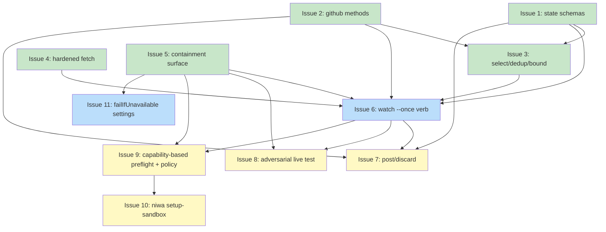

# PLAN: niwa watch --once PR-review dispatch

## Status

Active

## Scope Summary

Implement `niwa watch --once` -- a contained PR-review dispatch verb -- plus
its trusted `post`/`discard` subcommands and the enforced no-egress +
credential-scoped containment on the dispatch path, per
`DESIGN-niwa-watch-once-pr-review.md`.

## Decomposition Strategy

**Horizontal.** The design's components have clear interfaces (a GitHub
client extension, pure selection logic, a hardened fetch, the containment
launch surface, the orchestration verb, the post/discard subcommands, and a
release-gating adversarial test). Each is built and unit-tested on its own,
then the orchestration issue integrates them. The security-critical pieces
(the hardened fetch and the containment surface) are isolated into their own
issues so their risk is contained and their tests are focused, and the live
enforcement test comes last as the boundary proof that gates release.

## Issue Outlines

### Issue 1: feat(watch): state schemas for handled-set and staged-review records

**Goal**: Define and unit-test the durable state the watcher reads and writes -- the handled-set and the per-staged-review record -- with read/write helpers.

**Acceptance Criteria**:
- [x] A handled-set store under `<workspaceRoot>/.niwa/watch-handled`, one `owner/repo#number` line per handled PR, with append + membership helpers (PRD R11, AC5).
- [x] A staged-review record `{handle, owner, repo, number, url, draftPath}` persisted at `<workspaceRoot>/.niwa/watch/<handle>.json`, with write + load-by-handle helpers.
- [x] Handled-set membership is exact on `owner/repo#number`; a malformed line is ignored, not fatal.
- [x] Unit tests cover round-trip, membership, and missing-file (empty set) cases.

**Dependencies**: None

**Type**: code
**Files**: `internal/watch/state.go`, `internal/watch/state_test.go`

### Issue 2: feat(github): CurrentLogin, review-requested search, and CreateReview

**Goal**: Add the three net-new GitHub client methods the watcher and the post step need, tested against the existing fake server.

**Acceptance Criteria**:
- [x] `CurrentLogin(ctx) (string, error)` wraps `GET /user`.
- [x] `SearchReviewRequestedPRs(ctx, login) ([]PRRef, error)` wraps `GET /search/issues?q=is:pr+is:open+user-review-requested:<login>`; `PRRef{Owner, Repo, Number, URL, CreatedAt}` is parsed from the payload (PRD R2, D3).
- [x] `CreateReview(ctx, owner, repo, number, body, event)` wraps `POST /repos/{owner}/{repo}/pulls/{number}/reviews`; `event` is a parameter set by the caller (never derived from `body`) and defaults to `COMMENT` (PRD R14; design Decision 6).
- [x] Auth reuses `resolveGitHubToken` + `NewAPIClient`; unit tests run against `NIWA_GITHUB_API_URL`.

**Dependencies**: None

**Type**: code
**Files**: `internal/github/pulls.go`, `internal/github/pulls_test.go`

### Issue 3: feat(watch): workspace intersection, dedup, and bounded ordered selection

**Goal**: Turn the raw poll results into the bounded, ordered set of PRs to dispatch, as pure table-testable logic.

**Acceptance Criteria**:
- [x] Intersect `PRRef`s with the workspace's repositories from `config.Discover` -> `Sources`/`Repos`; a PR outside the workspace is dropped (PRD R3, AC4).
- [x] Drop PRs already in the handled-set (PRD R11, AC5).
- [x] Order the remainder by PR `created_at` (oldest first) and take at most the per-run bound (default 3); a repeat run over unchanged state selects the same set (PRD R10, AC8).
- [x] Team-only requests never appear (guaranteed upstream by the `user-review-requested` query; a test asserts the query shape) (PRD R2, AC3).
- [x] Pure functions with table tests.

**Dependencies**: Blocked by <<ISSUE:1>>, <<ISSUE:2>>

**Type**: code
**Files**: `internal/watch/select.go`, `internal/watch/select_test.go`

### Issue 4: feat(watch): hardened PR-head fetch and filter-neutered checkout

**Goal**: Fetch a PR's head as inert data and expose it to the review session as ordinary files without executing any checkout-time program (the sharpest risk, isolated).

**Acceptance Criteria**:
- [x] Fetch a specific head commit SHA (not arbitrary ref-following) with hooks disabled, `GIT_LFS_SKIP_SMUDGE=1` and `filter.lfs.smudge`/`.process` unset, submodule recursion off, `protocol.ext`/`protocol.file` disabled, empty `core.attributesFile`, and `GIT_CONFIG_NOSYSTEM=1` with a fetch-local `HOME` (design Decision 2).
- [x] Expose via a filter-neutered checkout the agent reads as normal files; `git archive` is NOT used.
- [x] Fixture test: a PR whose `.gitattributes` marks a path `filter=lfs` produces no smudge and no network call during fetch/checkout.
- [x] Fixture test: a file marked `export-ignore` is still present in the checked-out tree (not hidden from review).

**Dependencies**: None

**Type**: code
**Files**: `internal/watch/fetch.go`, `internal/watch/fetch_test.go`

### Issue 5: feat(dispatch): containment launch surface -- env allowlist, sandbox profile, re-verify

**Goal**: Add the net-new contained-dispatch surface -- an allowlisted environment with synthetic HOME, the no-egress sandbox settings merge, and per-instance re-verification -- without changing the ordinary dispatch path.

**Acceptance Criteria**:
- [x] The launch seam gains `LaunchOpts{EnvOverride []string}`; `EnvOverride == nil` preserves today's `cmd.Env = os.Environ()` so ordinary `niwa dispatch` is unchanged (design Decision 3).
- [x] The watch launch env is an explicit allowlist (model auth + `PATH`/locale + a synthetic `HOME` inside the instance); `GITHUB_TOKEN`, `GH_TOKEN`, `GH_*`/`GITHUB_*`, and `SSH_AUTH_SOCK` are absent (PRD R8).
- [x] A containment-profile builder produces `sandbox.enabled: true`, empty `sandbox.network.allowedDomains`, and a fail-closed permission mode, applied to the instance `.claude/settings.json` via the existing merge helper; niwa re-reads the merged file and asserts the stanza survived before launch (PRD R7, R9; design Decisions 1, 7).
- [x] Canary test: a planted `NIWA_CANARY_SECRET` and `SSH_AUTH_SOCK` in the parent env, and an on-disk `~/.netrc` / `~/.config/gh` sentinel under the real home, are all absent from the built session env / synthetic HOME; the session env is a subset of the allowlist (PRD AC12).

**Dependencies**: None

**Type**: code
**Files**: `internal/cli/dispatch_launcher.go`, `internal/watch/containment.go`, `internal/watch/containment_test.go`

### Issue 6: feat(watch): the watch --once orchestration verb

**Goal**: Wire the full single-shot pass together as the `niwa watch --once` verb, fail-closed and fail-loud.

**Acceptance Criteria**:
- [ ] `internal/cli/watch.go` registers `watchCmd` (with `--once`) via `init()` + `rootCmd.AddCommand`; it is stateless and starts no resident process (PRD R1).
- [ ] Fail-closed preflight: refuse (non-zero exit + stderr reason) when the OS sandbox cannot be enforced (e.g. `GOOS == "windows"` or the sandbox cannot be created) before any instance is created (PRD R9, AC13). Superseded by the capability-based/configurable preflight in Issue 9.
- [ ] Per selected PR: provision the instance, run the hardened fetch (Issue 4), merge + re-verify the containment (Issue 5), assemble a metadata-only prompt (only `owner/repo`, PR number, URL + fixed instructions; a pure function -- no title/body/diff/author), and launch `claude --bg` with `--detach` and the allowlisted env; persist the staged-review record and append the handled-set only on success (PRD R4, R5, R6, R11, AC1, AC2, AC7, AC18).
- [ ] A staged session is discoverable in the Claude Code agent view after a run (PRD R13, AC20).
- [ ] Empty poll (no matching PRs): print a "nothing to stage" message and exit zero (PRD AC6).
- [ ] Poll failure (GitHub query error, missing/expired auth, host unreachable, rate limit): print an error naming the failure, exit non-zero, and record nothing -- distinct from the empty-success path (PRD R12, AC19).
- [ ] Dispatch failure for a selected PR: print the error, exit non-zero, and do not record that PR as handled so a later run re-attempts it (PRD R12, AC17).

**Dependencies**: Blocked by <<ISSUE:1>>, <<ISSUE:2>>, <<ISSUE:3>>, <<ISSUE:4>>, <<ISSUE:5>>

**Type**: code
**Files**: `internal/cli/watch.go`, `internal/cli/watch_test.go`

### Issue 7: feat(watch): trusted post and discard subcommands

**Goal**: Let the developer post an approved draft or discard a staged review, from the trusted context, without ever touching the contained session.

**Acceptance Criteria**:
- [ ] `niwa watch post <handle>` resolves the staged-review record (handle = dispatch session short id), reads the draft at the recorded path (validated to resolve inside the instance root), and posts via `CreateReview` with `event` fixed in code (default `COMMENT`) -- run outside the sandbox with the dispatcher token, which never entered the session (PRD R14, AC15, AC21; design Decision 6).
- [ ] `niwa watch discard <handle>` posts nothing and records the PR as handled (PRD R14, AC16).
- [ ] A missing/invalid handle or an out-of-instance draft path is refused with a clear error.

**Dependencies**: Blocked by <<ISSUE:1>>, <<ISSUE:2>>, <<ISSUE:6>>

**Type**: code
**Files**: `internal/cli/watch.go`, `internal/cli/watch_post_test.go`

### Issue 8: test(watch): adversarial live-enforcement boundary proof

**Goal**: Prove -- by live execution inside a real contained session -- that egress and out-of-instance action are denied at the OS layer, not merely declined by the model. This is the release gate.

**Acceptance Criteria**:
- [ ] A hostile-PR fixture whose title/body/diff attempt `curl ... | sh`, a `git push`, and secret exfiltration is dispatched under the containment profile.
- [ ] From inside the running session (bypassing the model), the test attempts real outbound network -- a connection to a domain AND a raw socket to a literal IP -- and asserts each fails at the OS layer (connection blocked / EPERM) (PRD AC9, AC14; design Decision 7, Security Considerations).
- [ ] From inside the session, a write outside the instance directory is denied (PRD R7, AC10).
- [ ] From inside the unattended session, a tool action Claude Code would normally gate behind an approval prompt (e.g. a command not on any allow-list) is denied rather than auto-approved -- behaviorally verifying the fail-closed permission mode, the third leg of R7 (PRD R7, AC11).
- [ ] The test is wired so a passing egress/raw-socket escape fails the build (it gates release), and documents the platform requirement (Linux/macOS/WSL2; Windows fails closed and skips).

**Dependencies**: Blocked by <<ISSUE:5>>, <<ISSUE:6>>

**Type**: code
**Files**: `internal/watch/adversarial_test.go`

### Issue 9: feat(watch): capability-based preflight and uncontained_policy

**Goal**: Replace the hard-refuse preflight with an adaptive level selection plus an operator-owned fallback policy (design Decision 8A/8C, PRD R18/R20/R9).

**Acceptance Criteria**:
- [ ] The preflight selects the strongest enforceable level: macOS Seatbelt (built-in), or Linux `bwrap`+`socat` with a capability-bearing user namespace (the existing functional probe); it does not require the same level on every platform (R18).
- [ ] A durable `uncontained_policy` setting (`refuse` default | `warn` | `allow`) is read on the `flag > config header > default` stack; when no level is enforceable the run follows it -- refuse (non-zero + reason + remediation), warn (dispatch + recorded prominent warning), or allow (R20).
- [ ] Under `warn`/`allow`, the metadata-only prompt, credential-scrubbed env, and human gate still apply (asserted structurally).
- [ ] Default behavior is unchanged for a capable host (dispatch) and for an incapable host with no config (refuse).

**Dependencies**: Blocked by <<ISSUE:5>>, <<ISSUE:6>>

**Type**: code
**Files**: `internal/cli/watch.go`

### Issue 10: feat(cli): niwa setup-sandbox (hardened-Linux capability unlock)

**Goal**: The opt-in privileged command that unlocks the sandbox capability on a hardened Linux host (design Decision 8B, PRD R19).

**Acceptance Criteria**:
- [ ] `niwa setup-sandbox` detects the hardened-userns condition and installs an AppArmor profile for `bwrap` (or sets the sysctl), reporting what it changed; it is idempotent and a no-op where the capability already exists.
- [ ] It is the ONLY privileged step; it is never invoked per dispatch; on macOS / permissive Linux it reports "already capable" and changes nothing.
- [ ] The `watch --once` refuse message (Issue 9) names this command as the remediation.

**Dependencies**: Blocked by <<ISSUE:9>>

**Type**: code
**Files**: `internal/cli/setup_sandbox.go`

### Issue 11: feat(watch): fail-closed harness settings (failIfUnavailable)

**Goal**: Make the harness refuse rather than silently disable the sandbox (design Decision 8, PRD R21).

**Acceptance Criteria**:
- [ ] The containment profile (Issue 5) also sets `sandbox.failIfUnavailable: true` and `allowUnsandboxedCommands: false` in the merged instance settings.
- [ ] The pre-launch re-verification asserts both survived the merge.

**Dependencies**: Blocked by <<ISSUE:5>>

**Type**: code
**Files**: `internal/watch/containment.go`

**Companion change (tsuku repo, not this PR).** Packaging the Linux sandbox deps (PRD R19) lands in **tsukumogami/tsuku**, not
niwa: a curated `recipes/n/niwa.toml` declaring Linux-only
`runtime_dependencies = ["bubblewrap", "socat"]` (shadowing today's
auto-generated download recipe), plus `recipes/b/bubblewrap.toml`
(homebrew-bottle action) and a `socat`/`socat1` naming fix. Tracked as a
companion tsuku PR; it does not block the niwa code but is required for the
"standard install provides the binaries" contract.

## Dependency Graph

**Legend**: Green = done, Blue = ready, Yellow = blocked

Issues 1-5 are complete (implemented and unit-tested; all acceptance criteria
checked). Issues 6 and 7 are implemented but their end-to-end acceptance
criteria are not yet verified on a sandbox-capable host, so they remain open;
Issue 6's blockers are all done, so it is `ready`. Issue 8 (the live-enforcement
release gate) and Issues 9-11 (the Decision-8 amendment) are not yet done. The
companion tsuku recipe change is likewise pending in tsukumogami/tsuku.

## Implementation Sequence

- **Parallelizable first wave (no dependencies):** Issue 1 (state schemas),
  Issue 2 (github methods), Issue 4 (hardened fetch), Issue 5 (containment
  surface). These share no files and can be built and tested independently.
- **Then:** Issue 3 (selection) once 1 + 2 land.
- **Integration:** Issue 6 (the `watch --once` verb) is the critical-path
  join; it needs 1-5.
- **Then:** Issue 7 (post/discard) after 6; Issue 8 (the adversarial
  live-enforcement proof) after 5 + 6 as the last, release-gating step.
- **Decision-8 amendment:** Issue 9 (capability-based preflight + `uncontained_policy`)
  after 5 + 6, then Issue 10 (`setup-sandbox`) after 9; Issue 11
  (`failIfUnavailable` settings) after 5.

Critical path: (1,2) -> 3 -> 6 -> 8. The security-critical issues (4, 5, 8)
carry the sharpest risk and the boundary proof; treat their reviews with
elevated scrutiny.
