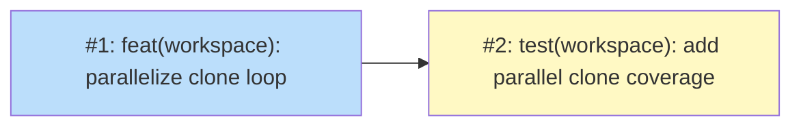

# PLAN: Parallel repo clones in niwa apply/create

## Status

Draft

## Scope Summary

Parallelize Step 3 of `runPipeline()` (`internal/workspace/apply.go`) using a bounded
8-worker goroutine pool, summary progress spinner, and fail-fast error handling on clone
failures.

## Decomposition Strategy

**Horizontal.** The change targets a single existing function with a clear before/after:
sequential loop becomes worker pool. Phase 1 delivers the implementation; Phase 2 delivers
test coverage that depends on it. Two issues, sequential dependency, no integration risk
beyond the existing test surface.

## Issue Outlines

### Issue 1: feat(workspace): parallelize clone loop with bounded worker pool

**Goal**

Replace the sequential for-loop in Step 3 of `runPipeline()` with a bounded worker pool
of 8 goroutines that clones and syncs repos concurrently.

**Context**

Design: `docs/designs/DESIGN-parallel-clones.md`

The sequential loop (lines 772–805 of `apply.go`) calls `Cloner.CloneWithBranch` and
`SyncRepo` for each repo before moving to the next. This issue restructures that loop
into the orchestrator-worker pattern: the orchestrator queues `cloneJob` structs into a
buffered channel, 8 workers drain it concurrently, and results flow back via a `cloneResult`
channel. The orchestrator drives all `Reporter` calls; workers receive a no-op reporter.

**Acceptance Criteria**

- `cloneJob` struct defined in `apply.go` with fields: `cr ClassifiedRepo`, `cloneURL string`,
  `branch string`, `targetDir string`, `defaultBranch string`, `noPull bool`
- `cloneResult` struct defined with fields: `name string`, `cloneURL string`, `cloned bool`,
  `syncWarn string`, `err error`
- `const cloneWorkers = 8` defined at package level in `apply.go`
- `cloneWorker` unexported function implemented; receives a no-op reporter
  (`NewReporterWithTTY(io.Discard, false)`); never calls `a.Reporter` directly
- Both `jobs` and `results` channels buffered to `len(classified)` — not to `cloneWorkers`
- Orchestrator sets initial status: `a.Reporter.Status("cloning repos... (0/N done)")`
  before starting workers
- Orchestrator updates spinner on each result: `cloning repos... (N/total done)`
- On first clone error: orchestrator calls `cancel()`, drains remaining results, returns error
- Sync failures (`result.Action == "fetch-failed"` or non-nil syncErr) produce deferred
  warnings via orchestrator; they do not call `cancel()`
- `RepoState.URL` populated from `cloneResult.cloneURL` (not recomputed by orchestrator)
- `go test ./internal/workspace/...` passes

**Validation**

```bash
#!/usr/bin/env bash
set -euo pipefail

cd "$(git rev-parse --show-toplevel)"

go build ./...
go vet ./internal/workspace/...
go test ./internal/workspace/... -count=1 -timeout 60s

echo "All validations passed"
```

**Dependencies**

None

**Downstream Dependencies**

This issue blocks <<ISSUE:2>>. Must deliver:
- `cloneJob` and `cloneResult` types (test doubles and functional tests reference them)
- `cloneWorkers` constant (functional tests may need to set up N repos)
- Worker pool implementation in `runPipeline()` (functional tests exercise the parallel path)

---

### Issue 2: test(workspace): add parallel clone coverage

**Goal**

Update `apply_test.go` for the parallel clone path and add `@critical` functional test
scenarios covering multi-repo create, clone failure cleanup, and apply sync.

**Context**

Design: `docs/designs/DESIGN-parallel-clones.md`

Parallel scheduling may break existing unit tests that assert on the order of `Status`
calls or on exact reporter message content during clone operations. The functional test
file exercises the parallel path end-to-end using the `localGitServer` helper.

See `docs/guides/functional-testing.md` for the Gherkin scenario format and the
`localGitServer` helper API.

**Acceptance Criteria**

- All existing `apply_test.go` tests pass without modification (if they don't, update
  any assertions that depend on sequential Status call ordering or specific per-repo
  spinner messages)
- New file `test/functional/features/parallel-clones.feature` with `@critical` tag
- Scenario 1: `niwa create` with multiple repos — all repos present in instance directory
  after create completes
- Scenario 2: `niwa create` with one repo having an invalid URL — create fails and the
  instance directory is removed (no partial state left)
- Scenario 3: `niwa apply` with multiple already-cloned repos — apply completes, all
  repos synced, no errors
- `make test-functional-critical` passes

**Validation**

```bash
#!/usr/bin/env bash
set -euo pipefail

cd "$(git rev-parse --show-toplevel)"

go test ./internal/workspace/... -count=1 -timeout 60s
make test-functional-critical

echo "All validations passed"
```

**Dependencies**

<<ISSUE:1>>

**Downstream Dependencies**

None

## Dependency Graph



**Legend**: Blue = ready, Yellow = blocked

## Implementation Sequence

**Critical path**: Issue 1 → Issue 2. Both issues must complete in order; no
parallelization opportunity. Issue 1 is the larger piece of work (restructuring
`runPipeline()`); Issue 2 is bounded by the functional test surface, which is small
(3 scenarios using the existing `localGitServer` helper).

Start with Issue 1. Once `go test ./internal/workspace/...` passes cleanly, move to
Issue 2.
