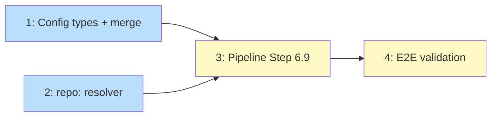

# PLAN: Plugin Installation

## Status

Draft

## Scope Summary

Implement `[claude].plugins` and `[claude].marketplaces` in workspace.toml for
declarative plugin installation. Covers config types, `repo:` reference resolution,
pipeline integration with `claude` CLI, and per-repo override semantics.

## Decomposition Strategy

**Horizontal.** Four layers that build sequentially: config types and merge first,
then `repo:` resolver, then pipeline integration that wires both together, then
tests against the real CLI (or mocked). The resolver and config types are
independent and can be done in parallel.

## Issue Outlines

### 1. Add plugins and marketplaces to config types

**Goal:** Add `Plugins *[]string` and `Marketplaces []string` to `ClaudeConfig`.
Add `Plugins []string` to `EffectiveConfig`. Update `MergeOverrides` with replace
semantics for plugins.

**Acceptance criteria:**
- `ClaudeConfig.Plugins` is `*[]string` with `toml:"plugins,omitempty"`
- `ClaudeConfig.Marketplaces` is `[]string` with `toml:"marketplaces,omitempty"` and
  doc comment "workspace-only, not merged from repo overrides"
- `EffectiveConfig.Plugins` is `[]string` (non-pointer, resolved by merge)
- `MergeOverrides`: nil plugins = copy workspace default; non-nil = replace entirely
- Config parsing tests: workspace plugins + marketplaces, repo override replaces,
  repo override disables (empty list), missing (inherits)
- Scaffold template updated with commented examples

**Dependencies:** None

**Complexity:** simple

### 2. Implement `repo:` reference resolver

**Goal:** Parse `repo:<name>/<path>` marketplace refs, validate against managed
repo set, resolve to absolute paths with containment check.

**Acceptance criteria:**
- `ResolveMarketplaceSource(source string, repoIndex map[string]string) (string, error)`
- GitHub refs (`org/repo`) pass through unchanged
- `repo:` prefix: strip prefix, split on first `/`, look up repo in index
- Resolved path checked with `checkContainment` (stays within repo dir)
- Fatal errors for: malformed ref, unmanaged repo, not cloned, file not found,
  path traversal
- Tests: GitHub passthrough, `repo:` success, all 5 error cases

**Dependencies:** None

**Complexity:** testable

### 3. Pipeline integration (Step 6.9)

**Goal:** Add Step 6.9 to the apply pipeline that registers marketplaces and
installs plugins per repo via the `claude` CLI.

**Acceptance criteria:**
- Check `claude` on PATH at entry; warn with PRD's message (including install
  link) and skip all plugin operations if missing
- Build `repoIndex` from classified repos
- Phase A: for each marketplace source, resolve (fatal on error), run
  `claude plugin marketplace add <source> --scope user`, warn on CLI failure.
  After all registrations, run `claude plugin marketplace update`
- Phase B: for each repo with non-empty effective plugins, run
  `claude plugin install <plugin> --scope project` from repo dir. Warn on failure
- Stdout/stderr inherit from niwa process
- Tests: mock CLI via PATH manipulation or interface. Test marketplace
  registration, plugin install, missing CLI skip, CLI failure warning

**Dependencies:** <<ISSUE:1>> (config types), <<ISSUE:2>> (resolver)

**Complexity:** testable

### 4. End-to-end validation

**Goal:** Verify the full flow works with the real `claude` CLI in a controlled
environment. This is a manual testing issue, not automated.

**Acceptance criteria:**
- Create a test workspace.toml with a GitHub marketplace source and a plugin
- Run `niwa apply` and verify marketplace is registered and plugin installed
- Verify per-repo disable works (repo with `plugins = []` has no plugin)
- Verify idempotency (second apply produces no errors)
- Document any `claude` CLI quirks discovered during testing

**Dependencies:** <<ISSUE:3>>

**Complexity:** simple

## Dependency Graph

**Legend**: Blue = ready, Yellow = blocked

## Implementation Sequence

Issues 1 and 2 are independent and can be done in parallel. Issue 3 depends on
both and is the core integration. Issue 4 is manual validation after the code
is complete.

Critical path: max(1, 2) -> 3 -> 4.

Suggested commit sequence:
1. Issue 1 (config types + merge + tests)
2. Issue 2 (resolver + tests)
3. Issue 3 (pipeline step + tests)
4. Issue 4 (manual validation, no commit)
5. Clean up wip/ artifacts before merge
