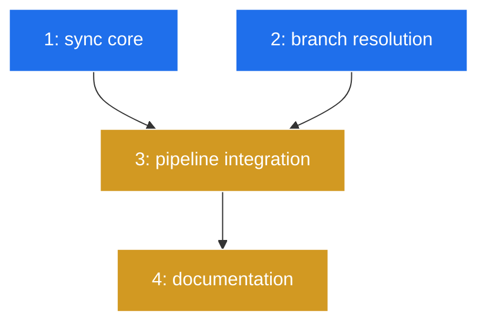

# PLAN: Pull Managed Repos

## Status

Draft

## Scope Summary

Add repo pull behavior to niwa apply: fetch + ff-only pull for clean repos
on their default branch, skip others with warnings, --no-pull opt-out.
Default branch resolved via config (per-repo -> workspace default_branch -> "main").

## Decomposition Strategy

**Horizontal decomposition.** The design has clear layer dependencies: sync
core provides the foundation, branch resolution extends config, pipeline
integration wires everything together, and docs wrap up. No integration risk
warrants a walking skeleton -- the interfaces between layers are simple
function calls.

## Issue Outlines

### 1. feat(workspace): add repo sync core

**Complexity:** testable

**Goal:** Add InspectRepo, FetchRepo, PullRepo, and SyncRepo functions to
`internal/workspace/sync.go` with tests covering the full repo state matrix.

**Acceptance Criteria:**
- InspectRepo returns clean/dirty status, current branch, and ahead/behind
  counts. Handles no upstream tracking branch gracefully.
- FetchRepo runs `git fetch origin` via exec.CommandContext.
- PullRepo runs `git pull --ff-only origin <branch>`, returns commit count.
- SyncRepo orchestrates fetch -> inspect -> conditional pull, returns SyncResult.
- Tests use real git repos in temp dirs. Cover: clean+default+behind (pull),
  dirty+default (skip), clean+other-branch (skip), clean+default+diverged (skip),
  clean+default+up-to-date (no-op).

**Dependencies:** None

### 2. feat(workspace): add default branch resolution

**Complexity:** testable

**Goal:** Add DefaultBranch() helper to `internal/workspace/override.go` with
three-tier fallback: per-repo branch -> workspace default_branch -> "main".

**Acceptance Criteria:**
- DefaultBranch(cfg, repoName) returns resolved branch name, never empty.
- Falls back through all three tiers correctly.
- Tests cover all three fallback levels.

**Dependencies:** None

### 3. feat(workspace): integrate repo sync into apply pipeline

**Complexity:** testable

**Goal:** Wire SyncRepo into runPipeline, add --no-pull CLI flag, replace
"skipped (already exists)" with sync result output.

**Acceptance Criteria:**
- Applier struct gains NoPull field. runPipeline calls SyncRepo when
  !cloned && !NoPull.
- Uses DefaultBranch() (not RepoCloneBranch()) for sync.
- --no-pull flag added to CLI.
- Output: "pulled <name> (<N> commits)", "skipped <name> (<reason>)",
  "skipped <name> (up to date)".
- Fetch failures are non-fatal warnings.
- Apply tests cover: pull, skip-dirty, skip-branch, --no-pull.

**Dependencies:** Issue 1, Issue 2

### 4. docs: document repo pull behavior

**Complexity:** simple

**Goal:** Update CLI help text to describe pull behavior, --no-pull flag,
and config-first branch resolution.

**Acceptance Criteria:**
- `niwa apply -h` mentions default pull behavior.
- --no-pull flag documented.
- Branch resolution described in long help.

**Dependencies:** Issue 3

## Dependency Graph

**Legend:** Blue = ready, Yellow = blocked

## Implementation Sequence

**Critical path:** Issue 1 (or 2) -> Issue 3 -> Issue 4

**Parallelization:** Issues 1 and 2 have no dependencies on each other and
can be implemented concurrently. Issue 3 blocks on both. Issue 4 is last.

**Recommended order for single-pr:** Implement Issue 1 first (larger, more
complex), then Issue 2, then Issue 3 to integrate, then Issue 4 to document.
All in one branch, one PR.
