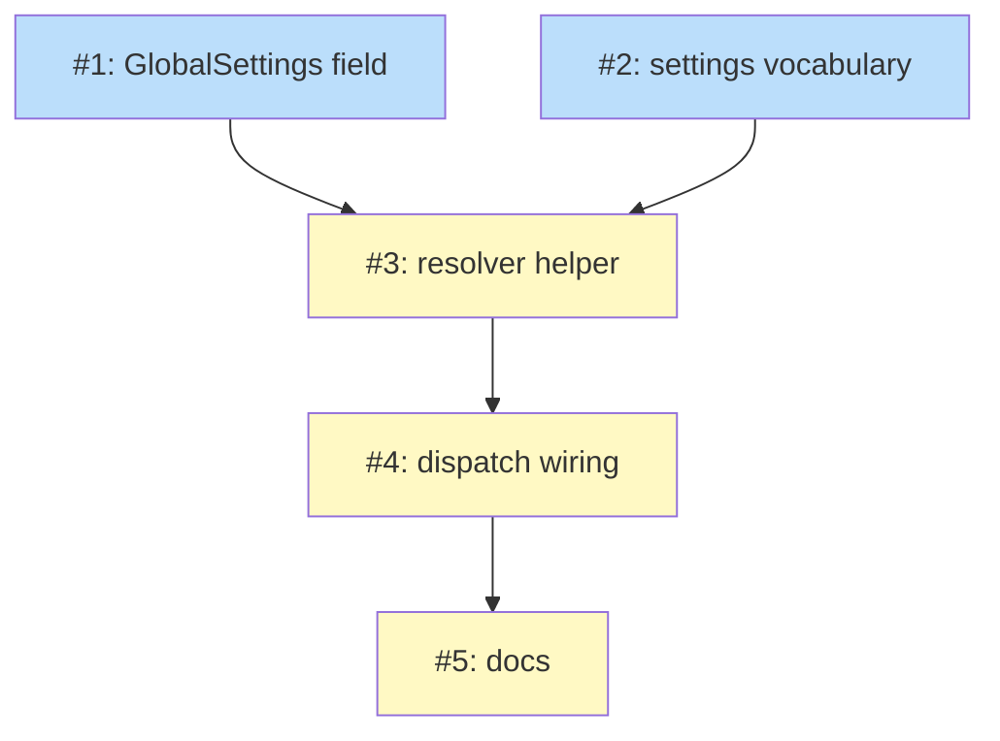

# PLAN: remote-control by default on dispatched workers

## Status

Draft

Single-PR plan. The five issues below are implemented on one branch and ship in one
PR alongside the BRIEF, PRD, and DESIGN. No GitHub issues are materialized.

## Scope Summary

This PLAN implements `docs/designs/current/DESIGN-remote-control-by-default.md`: a
host-level `remote_control_on_dispatch` preference on `config.GlobalSettings` that, when
on and not overridden downstream, makes `niwa dispatch` workers start with Claude Code
Remote enabled by injecting `--settings '{"remoteControlAtStartup":true}'` into the
dispatch-only argv. Downstream override is carried through niwa's Claude settings
vocabulary so a `[claude.settings].remoteControlAtStartup` value both reaches the worker
and is readable by the dispatch resolver, and a definitive local ineligibility signal
(`ANTHROPIC_API_KEY`) downgrades to a clear one-line notice. The work takes the DESIGN's
four touch points as given and does not re-open any requirement or decision.

## Decomposition Strategy

Horizontal, layered bottom-up, one issue per touch point plus a pure-logic issue and a
docs issue. The slices are chosen so each compiles and is unit-tested in isolation before
the next consumes it: the config field (Issue 1) and the settings-vocabulary plumbing
(Issue 2) are independent leaves; the pure resolver (Issue 3) depends on both leaf types;
the dispatch wiring (Issue 4) depends on the resolver; the docs (Issue 5) depend on the
finished behavior. Grouping rule: one issue per Go package surface that changes, with the
decision logic extracted into its own pure-function issue so the truth table is tested
without exec.

## Issue Outlines

### Issue 1: feat(config): add remote_control_on_dispatch to GlobalSettings

**Complexity**: testable

**Goal**: Add the host-level preference field so `~/.config/niwa/config.toml` `[global]`
can carry `remote_control_on_dispatch`.

**Acceptance Criteria**:
- `config.GlobalSettings` has `RemoteControlOnDispatch *bool` with TOML tag
  `remote_control_on_dispatch,omitempty`.
- Decoding `[global]\nremote_control_on_dispatch = true` yields a non-nil `true`; `false`
  yields non-nil `false`; an absent key yields `nil`.
- A decode then re-encode round-trip preserves the value; existing `[global]` fields are
  unaffected.
- `go test ./internal/config/...` passes.

**Dependencies**: None

**Files**: `internal/config/registry.go`, `internal/config/registry_test.go`

---

### Issue 2: feat(workspace): carry remoteControlAtStartup through the settings vocabulary

**Complexity**: testable

**Goal**: Let a downstream `[claude.settings].remoteControlAtStartup` both materialize into
the instance settings.json and be readable by the dispatch resolver.

**Acceptance Criteria**:
- `buildSettingsDoc` emits `doc["remoteControlAtStartup"]` as a JSON boolean when the key
  is present in the effective `[claude.settings]`; an unparseable value is a config error
  (consistent with how `permissions` rejects unknown values).
- When the key is absent from `[claude.settings]`, the materialized settings.json does NOT
  contain `remoteControlAtStartup` (no key is turned on by default anywhere).
- `instanceSettings` gains `RemoteControlAtStartup *bool` (`json:"remoteControlAtStartup"`);
  `readInstanceSettings` returns a non-nil pointer when the key is present and `nil` when
  absent.
- `go test ./internal/workspace/... ./internal/cli/...` passes for the new cases.

**Dependencies**: None

**Files**: `internal/workspace/materialize.go`, `internal/workspace/materialize_test.go`,
`internal/cli/dispatch_plugins.go`, `internal/cli/dispatch_plugins_test.go`

---

### Issue 3: feat(cli): resolveDispatchRemoteControl decision helper

**Complexity**: testable

**Goal**: Capture the override-resolution and eligibility logic as one pure, table-tested
function.

**Acceptance Criteria**:
- A pure helper
  `resolveDispatchRemoteControl(global config.GlobalSettings, inst *instanceSettings, env []string) (inject bool, warning string)`
  returns: `inject=true` only when the host toggle is on AND the instance's
  `remoteControlAtStartup` is nil AND `ANTHROPIC_API_KEY` is absent from `env`;
  `inject=false, warning!=""` when the host toggle is on, the key is nil, and
  `ANTHROPIC_API_KEY` is present; `inject=false, warning==""` when the host toggle is
  off/unset, OR when the instance's `remoteControlAtStartup` is non-nil (downstream
  decided).
- A truth table covers host {unset, false, true} × downstream {nil, false, true} ×
  `ANTHROPIC_API_KEY` {present, absent}.
- `go test ./internal/cli/...` passes.

**Dependencies**: <<ISSUE:1>>, <<ISSUE:2>>

**Files**: `internal/cli/dispatch_remotecontrol.go`,
`internal/cli/dispatch_remotecontrol_test.go`

---

### Issue 4: feat(cli): enable remote-control by default on niwa dispatch

**Complexity**: testable

**Goal**: Apply the resolver on the real dispatch path so the default takes effect only for
`niwa dispatch`.

**Acceptance Criteria**:
- After `provisionInstanceFunc` returns, `runDispatch` calls `config.LoadGlobalConfig()`
  and `readInstanceSettings(instancePath)`, then `resolveDispatchRemoteControl`.
- When the helper returns `inject`, the dispatch passthrough gains `--settings` and
  `{"remoteControlAtStartup":true}` as two discrete argv elements; the worker launches with
  the bridge on.
- When the helper returns a non-empty warning, the warning is printed and the worker still
  launches.
- When the host toggle is unset, the constructed argv and env are byte-for-byte unchanged
  from current behavior (PRD AC4), asserted via the existing `dispatchLaunch` test seam.
- A `readInstanceSettings` error is treated as "key absent" and never fails the dispatch.
- `go test ./internal/cli/...` passes.

**Dependencies**: <<ISSUE:3>>

**Files**: `internal/cli/dispatch.go`, `internal/cli/dispatch_test.go`

---

### Issue 5: docs(dispatch): document the remote-control-on-dispatch preference

**Complexity**: simple

**Goal**: Document the feature for developers (PRD R7).

**Acceptance Criteria**:
- The dispatch guide and the global-config reference describe: setting
  `remote_control_on_dispatch` in `~/.config/niwa/config.toml`, overriding it downstream via
  `[claude.settings].remoteControlAtStartup`, and the eligibility caveat (claude.ai login
  required; `ANTHROPIC_API_KEY` precludes it).
- No `wip/...` references appear in any committed doc.

**Dependencies**: <<ISSUE:4>>

**Files**: `docs/guides/` (dispatch + global-config references), `README.md` if a dispatch
section exists

## Dependency Graph

**Legend**: Blue = ready, Yellow = blocked

## Implementation Sequence

**Critical path:** Issues 1 + 2 (parallel) → Issue 3 → Issue 4 → Issue 5.

Open with the two independent leaves in either order: Issue 1 (config field) and Issue 2
(settings vocabulary); they share no code. Then Issue 3 (the pure resolver), which consumes
both leaf types and is fully unit-tested via its truth table before any exec wiring. Then
Issue 4, which wires the resolver into `runDispatch` and asserts the argv contract
(including the byte-identical no-op when the toggle is unset). Finish with Issue 5 (docs),
written against the now-final behavior. Run `go build ./...` and `go test ./...` after
Issues 1-4; the whole sequence is one branch, one PR.
