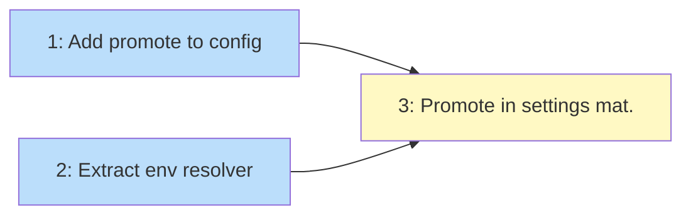

# PLAN: Settings Env

## Status

Draft

## Scope Summary

Implement the promote mechanism for `[claude.env]` so users can route env vars from
the `[env]` pipeline into `settings.local.json` without value duplication. Covers
config parsing, env resolution extraction, and settings materializer integration.

## Decomposition Strategy

**Horizontal.** The three issues build sequentially: config types first, then a shared
resolver extracted from the env materializer, then the settings materializer consumes
the resolver to look up promoted keys. Each layer has clear inputs and outputs, and
the components don't interact at runtime in a way that benefits from a walking skeleton.

## Issue Outlines

### 1. Add promote field to config and merge logic

**Goal:** Extend `ClaudeConfig` with a `Promote []string` field and update
`MergeOverrides` to union promote lists across workspace and repo levels.

**Acceptance criteria:**
- `ClaudeConfig` has `Promote []string` with `toml:"promote,omitempty"`
- `MergeOverrides` unions workspace and repo promote lists (repo extends, no duplicates)
- Config parsing round-trips a `[claude.env]` section with both `promote` and inline vars
- Scaffold template updated to show `promote` option
- Existing tests still pass; new tests for promote parsing and merge

**Dependencies:** None

**Complexity:** simple

### 2. Extract shared env resolver

**Goal:** Extract `ResolveEnvVars` from `EnvMaterializer` so both the env and settings
materializers can consume the resolved env var map without duplicating logic.

**Acceptance criteria:**
- New `ResolveEnvVars(ctx *MaterializeContext) (map[string]string, error)` function
- `EnvMaterializer.Materialize` delegates to `ResolveEnvVars` then writes the file
- All existing env materializer tests pass without modification
- `ResolveEnvVars` is tested independently (input: context with files/vars/discovered -> output: merged map)

**Dependencies:** None (can be done in parallel with issue 1)

**Complexity:** testable

### 3. Implement promote in settings materializer

**Goal:** The settings materializer resolves promoted keys from the env pipeline,
layers them with inline vars per the design's resolution order, and emits the `env`
block in `settings.local.json`. Missing promoted keys produce hard errors.

**Acceptance criteria:**
- Settings materializer calls `ResolveEnvVars` to get the resolved env map
- Promoted keys are looked up from the resolved map; missing key -> hard error with
  message `claude.env: promoted key "X" not found in resolved env vars`
- Resolution order: promoted base -> workspace inline overlay -> repo inline overlay
- Promoted key also declared inline at same level: inline wins silently
- All 6 combination scenarios from the design doc are covered by tests
- Existing settings materializer tests still pass

**Dependencies:** Issue 1 (promote field), Issue 2 (resolver)

**Complexity:** testable

## Dependency Graph

**Legend**: Blue = ready, Yellow = blocked

## Implementation Sequence

Issues 1 and 2 are independent and can be done in parallel. Issue 3 depends on
both and is the integration point. The critical path is whichever of 1 or 2 takes
longer, followed by 3.

Suggested commit sequence:
1. Issue 1 + Issue 2 (one commit each, can be interleaved)
2. Issue 3 (final commit, wires everything together)
3. Clean up wip/ artifacts before merge
