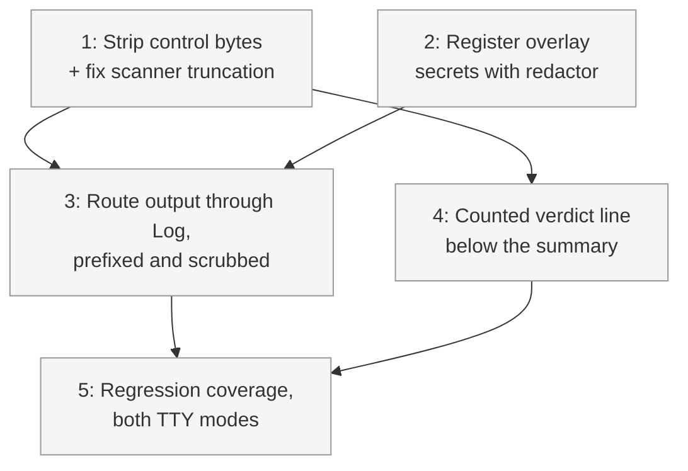

# PLAN: Setup-script visibility

## Status

Active

## Scope Summary

Make a failed setup script impossible to miss and its cause readable: stream script
stdout and stderr durably in both TTY and non-TTY runs with a `[<repo>/<script>]`
prefix, sanitize and redact those lines before they reach the terminal, and print a
counted verdict line below the apply summary. Implements the Amendment 2026-08-08
section of `DESIGN-post-clone-scripts.md`. Closes tsukumogami/niwa#239.

## Decomposition Strategy

**Horizontal**, and deliberately not a walking skeleton.

The components have stable, well-defined boundaries and almost no runtime interaction:
the line sanitizer is a pure string function, the redactor already exists and is
already constructed, the routing change is confined to one scanner loop, and the
verdict line is a field on an existing result struct plus two `Log` calls. There is no
integration risk to surface early because there is no new integration -- every seam
this touches is already load-bearing in the current code.

The ordering is driven by one real dependency: the sanitizer must be correct *before*
output starts flowing, because the whole point of the sanitizer is that the routing
change is what makes unsanitized bytes reachable. Landing the routing first would ship
a window in which repo-controlled control bytes reach the operator's terminal
unfiltered. So the sanitizer goes first even though it is the smaller change.

Execution mode is **single-pr**. Neither escape condition holds: there is no hard
constraint forcing multiple PRs (one repo, no landing order, no merge gate), and none
of the five units is independently useful to a reader on its own. A sanitizer with
nothing routed through it, or a verdict line counting failures whose output is still
discarded, is a building block rather than an increment. The usable unit of value is
"a failed setup script explains itself and is counted," which is the whole set.

## Issue Outlines

### <<ISSUE:1>> Strip control bytes and fix the scanner's truncation failure

**Complexity:** testable

**Goal**: Make the line sanitizer complete, and stop the scanner from silently
swallowing the output this change exists to surface.

`stripEscapes` currently removes CSI-with-numeric-parameters and OSC-terminated-by-BEL
and nothing else. Private-parameter CSI, ST-terminated OSC, DCS, APC, PM, a bare
`ESC c` terminal reset, lone ESC, and every C0 control byte survive it. Separately,
the scanner keeps `bufio.Scanner`'s default 64 KB token limit and never checks
`scanner.Err()`.

**Acceptance Criteria**:

- `stripEscapes` removes all C0 control bytes except tab, plus DEL, in addition to the
  escape sequences it already handles. Newlines are not a concern here: the scanner has
  already split on them by the time this runs.
- A table test covers, at minimum: bare `\r`, `\b`, BEL, NUL, `\x1b[?25l`,
  ST-terminated OSC, `\x1bc`, DCS/APC/PM, a lone trailing ESC, and a tab that must
  survive.
- A test proves a `\r` mid-line can no longer erase a prefix: given input
  `"safe\rforged"` with a prefix applied, the rendered line still shows the prefix and
  both segments.
- The scanner buffer is raised to 1 MB and `scanner.Err()` is surfaced through
  `Reporter.Warn` rather than dropped.
- A test proves a line longer than 64 KB no longer truncates the stream: a script that
  emits one long line followed by a short identifiable line has *both* observed, and
  the run is not reported as a broken pipe.

**Dependencies**: none.

### <<ISSUE:2>> Register overlay-resolved secrets with the redactor

**Complexity:** testable

**Goal**: Close the redactor coverage gap so that scrubbing covers what a setup script
can actually read.

The redactor is constructed and attached to the context partway through the pipeline,
after the personal-overlay pre-pass has already resolved the overlay's env. Those
values are never registered, they merge into the effective config, the later
resolution pass skips them because they are already marked resolved, and they are then
materialized into the working directory the script runs in.

**Acceptance Criteria**:

- The redactor's construction and context attachment move to the top of the pipeline,
  ahead of the overlay pre-pass. No signature changes; purely a reordering.
- A test proves an overlay-resolved secret is present in the redactor's fragment set
  by the time setup scripts run, and is scrubbed from a line containing it. This test
  fails before the move and passes after.
- Existing secret-resolution and materialization tests still pass unchanged.

**Dependencies**: none. Independent of <<ISSUE:1>>; both are prerequisites for
<<ISSUE:3>>.

### <<ISSUE:3>> Route setup-script output through Log, prefixed and scrubbed

**Complexity:** critical

**Goal**: The core fix. Make a setup script's stdout and stderr reach the operator in
both TTY and non-TTY runs, prefixed with the repo and script name, as
`DESIGN-post-clone-scripts.md` Decision 2 has always promised.

**Acceptance Criteria**:

- `runCmdWithReporter` takes a line prefix and a nil-tolerant `*secret.Redactor`, and
  routes each line through `Reporter.Log` instead of `Reporter.Status`. Decisions A and
  C of the amendment both touch this signature, so they land as one change rather than
  two.
- Inside the scanner loop the order is: strip escapes and control bytes, scrub, apply
  prefix, `Log`. The ordering is load-bearing and a comment says why -- stripping
  before scrubbing is what stops an interleaved escape sequence from defeating the
  redactor's substring match.
- `RunSetupScripts` takes the redactor, emits `running setup script <repo>/<script>`
  before each `exec.Command`, and builds the `[<repo>/<script>] ` prefix once per
  script. The script filename is passed through the same sanitizer before use, because
  filenames are repo-controlled.
- The `runCmdWithReporter` doc comment, which currently asserts that script output is
  silent in piped and CI contexts, is rewritten to describe the new behavior.
- `TestRunCmdWithReporter_AllLinesViaStatus` is deliberately rewritten. It currently
  asserts the defect is intended; leaving it would make the codebase
  self-contradictory. The replacement asserts routing through `Log`.
- Existing `RunSetupScripts` callers in tests compile by passing `nil` for the
  redactor.
- No behavior change to `runGitWithReporter`. Its line classifier and its
  discard-non-diagnostic-lines policy are untouched.

**Dependencies**: <<ISSUE:1>>, <<ISSUE:2>>. Both must land first so that the moment
output starts flowing it is already sanitized and the redactor already has full
coverage.

### <<ISSUE:4>> Count repos whose setup did not finish, below the summary

**Complexity:** testable

**Goal**: Make a failed setup script discoverable without reading the warning stream.

**Acceptance Criteria**:

- `pipelineResult` gains a list of repos whose setup did not finish, a sibling of the
  existing warnings field. Step 6.75 appends to it, counting a repo once even when
  several of its scripts errored -- a non-executable script is skipped rather than
  stopping the repo, so multi-error repos are real.
- `Create` and `Apply` each print a counted line between their summary line and their
  deferred-warning loop, with a singular/plural branch matching the adjacent summary:
  `setup incomplete for 1 repo: beta` / `setup incomplete for 2 repos: beta, gamma`.
- The line is a plain `Log`, not a `Warn`, and not deferred. Placement below the
  summary is the substance of the fix and a test asserts the order: summary line, then
  counted line, then the deferred warning.
- The pipeline still returns nil on setup failure. A test proves `create` still exits
  0 and that the instance directory and `state.json` both survive a setup failure --
  this is the guard against a future change routing the failure through the pipeline
  error path, which would delete the instance.
- Nothing is printed when no repo failed setup.

**Dependencies**: <<ISSUE:1>>. Ordering only -- the counted line names repos, and repo
names reach output through the sanitizer.

### <<ISSUE:5>> Regression coverage for both TTY modes and the preserved failure policy

**Complexity:** critical

**Goal**: Prove the bug is fixed in both run modes, and prove the behavior Decision 2
deliberately chose still holds.

The naive assertion does not work here and this is the crux of the issue. Measured on
current `main`: off a TTY the reporter's buffer is literally empty, but on a TTY
exactly one line of a fifty-line failing script renders before `stopSpinner` erases
it, and *which* line is a goroutine-scheduling artifact. So
`strings.Contains(buf, marker)` passes on today's `main` in TTY mode and would silently
fail the acceptance criterion.

**Acceptance Criteria**:

- A test helper reduces raw reporter output to permanent output only, keeping just the
  newline-terminated segments outside the `\r\x1b[K` spinner delimiters. Verified to
  return empty for today's behavior in both TTY modes.
- A regression test runs a script that writes a known line to stderr and exits
  non-zero, and asserts that line is present in permanent output with `isTTY=false`
  **and** `isTTY=true`. This test must fail against `main` before the fix in both
  modes -- confirm that explicitly rather than assuming it.
- A test asserts the `[<repo>/<script>]` prefix and the `running setup script ...`
  announcement both appear.
- Stop-on-first-error within a repo still holds: given three scripts where the second
  fails, the third does not run. Strengthen the existing test to also assert on
  output.
- Continue-to-next-repo still holds: given two repos where the first repo's script
  fails, the second repo's scripts still run and its output still appears.
- A test asserts a registered secret echoed by a script is scrubbed from the streamed
  output.
- A `@critical` Gherkin scenario covers the end-to-end path, per the repo's convention
  that a regression fix in the init/create/apply workflow warrants one. This needs a
  new step to write an executable file -- the existing write-file step writes mode
  0644, which the setup runner correctly skips as non-executable.

**Dependencies**: <<ISSUE:3>>, <<ISSUE:4>>.

## Implementation Issues

Not applicable in single-pr mode. No GitHub issues or milestone are created; the
outlines above are the unit of work, and all five land in one pull request.

## Dependency Graph

## Implementation Sequence

**Critical path:** <<ISSUE:1>> -> <<ISSUE:3>> -> <<ISSUE:5>>. This is the chain that
carries the actual fix; issues 2 and 4 hang off it without extending it.

**Parallelization.** <<ISSUE:1>> and <<ISSUE:2>> are genuinely independent and can be
done in either order or at once -- one is a pure string function in `gitutil.go`, the
other is a statement reordering in `apply.go`, and they do not touch the same lines.
<<ISSUE:4>> only needs <<ISSUE:1>>, so it can proceed alongside <<ISSUE:3>>.

**Why the sanitizer goes first.** It is the smaller change and the less interesting
one, and it would be natural to do it last. Doing so would ship an intermediate commit
in which repo-controlled control bytes reach the operator's terminal with no filter --
including a `\r` that erases the prefix distinguishing script output from niwa's own
output. Order matters here for a security reason, not an engineering-convenience one.

**Verification gate.** Before the PR is marked ready: `go test ./...` green across all
packages, `gofmt` and `go vet` clean, the `@critical` scenario passing under
`make test-functional-critical`, and the <<ISSUE:5>> regression test confirmed to fail
on `main`. A test that passes both before and after proves nothing and is the specific
trap this plan is guarding against.
