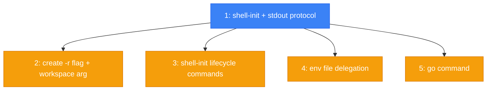

# PLAN: Shell Integration

## Status

Draft

## Scope Summary

Add shell integration to niwa so that `create` and a new `go` command can change
the parent shell's working directory. Uses the eval-init pattern (zoxide-style)
with a shell function wrapper, env file delegation, optional lifecycle commands,
and context-aware navigation.

## Decomposition Strategy

**Walking skeleton.** Shell integration spans CLI code generation, binary stdout
protocol, shell script installer, and a new navigation command. The skeleton proves
the end-to-end path (binary stdout -> wrapper function -> cd) before refinements
add flags, lifecycle commands, env file delegation, and the go command. All
refinements depend only on the skeleton and can be worked in parallel.

## Issue Outlines

### 1. feat(cli): add shell-init subcommand and create stdout protocol

**Complexity**: testable

**Goal**: Add the `niwa shell-init` subcommand and establish the stdout protocol.
After this ships, `eval "$(niwa shell-init bash)"` produces a working wrapper
function, and `niwa create` prints a bare directory path to stdout with human
messages on stderr.

**Acceptance Criteria**:
- [ ] `niwa shell-init bash` emits valid bash code with wrapper function and cobra completions
- [ ] `niwa shell-init zsh` emits valid zsh code with wrapper function and cobra completions
- [ ] `niwa shell-init auto` detects shell from `$ZSH_VERSION`/`$BASH_VERSION`, empty output for unknown shells
- [ ] Generated wrapper intercepts `create` and `go`, passes other subcommands through
- [ ] Generated code exports `_NIWA_SHELL_INIT=1`
- [ ] `create` prints bare absolute path to stdout, human messages to stderr
- [ ] On failure, stdout is empty and exit code is non-zero
- [ ] Stdout invariant validation: path is absolute, single line, no newlines
- [ ] Runtime hint to stderr when `_NIWA_SHELL_INIT` is unset on cd-eligible commands
- [ ] Hint suppressed when `_NIWA_SHELL_INIT=1` is set

**Dependencies**: None (skeleton)

---

### 2. feat(cli): add -r flag and workspace positional arg to create

**Complexity**: testable

**Goal**: Add `-r/--repo` flag and optional workspace name positional argument to
`niwa create`, enabling remote workspace creation and repo-level landing.

**Acceptance Criteria**:
- [ ] `niwa create <workspace>` resolves workspace via global registry
- [ ] Change cobra Args from `NoArgs` to `MaximumNArgs(1)`
- [ ] Without positional arg, existing behavior preserved (discover from cwd)
- [ ] Unknown workspace name errors listing registered workspaces
- [ ] `-r/--repo <repo>` overrides landing target to repo directory
- [ ] `-r` with nonexistent repo: instance created, non-zero exit, error includes instance path
- [ ] Ambiguous repo name (multiple groups) errors suggesting qualified form
- [ ] Path containment validation via `filepath.Rel` for `-r` argument
- [ ] E2E flow still works (do not break the skeleton)

**Dependencies**: Blocked by Issue 1

---

### 3. feat(cli): add shell-init install, uninstall, and status commands

**Complexity**: testable

**Goal**: Add lifecycle management commands for shell integration. `install` writes
the delegation block and rc file source line. `uninstall` reverts to PATH-only.
`status` reports current state.

**Acceptance Criteria**:
- [ ] `shell-init install` writes delegation block to `~/.niwa/env` (creates file if needed)
- [ ] `shell-init install` adds source line to rc files if absent
- [ ] Idempotent: no duplicates on repeated runs (source line and delegation block)
- [ ] `shell-init uninstall` rewrites env file to PATH-only, preserves rc file source line
- [ ] `shell-init status` reports wrapper loaded state and env file delegation state
- [ ] Status exits 0 regardless of state (informational, not health check)
- [ ] Handles missing rc files gracefully
- [ ] E2E flow still works (do not break the skeleton)

**Dependencies**: Blocked by Issue 1

---

### 4. feat(installer): env file delegation and --no-shell-init flag

**Complexity**: testable

**Goal**: Update `install.sh` to write an env file that delegates to
`niwa shell-init auto`, so existing users get shell integration on upgrade.
Add `--no-shell-init` for CI/containerized environments.

**Acceptance Criteria**:
- [ ] install.sh writes env file with `command -v` guarded delegation block
- [ ] `--no-shell-init` produces PATH-only env file (no delegation)
- [ ] Combines correctly with existing `--no-modify-path` flag
- [ ] Source line idempotency (no duplicates on repeated installs)
- [ ] Graceful degradation: old binary without shell-init still gets PATH, no errors
- [ ] Graceful degradation: no niwa binary at all, env file still sets PATH
- [ ] E2E flow still works (do not break the skeleton)

**Dependencies**: Blocked by Issue 1

---

### 5. feat(cli): add go command with context-aware navigation

**Complexity**: testable

**Goal**: Add `niwa go` with context-aware resolution. Single positional arg
resolves as repo (in current instance) or workspace (via registry). `-w`/`-r`
flags for disambiguation. Resolution trace to stderr. Error messages with
recovery guidance.

**Acceptance Criteria**:
- [ ] `niwa go` (no args) navigates to workspace root from cwd
- [ ] `niwa go` outside any workspace: error with guidance listing registered workspaces
- [ ] Single arg inside instance: tries repo first, falls back to workspace registry
- [ ] Single arg outside instance: tries workspace registry
- [ ] Collision (matches both repo and workspace): prefers repo, hints about `-w`
- [ ] `-w/--workspace` forces registry lookup
- [ ] `-r/--repo` targets repo in current instance
- [ ] `-w -r` combined: repo in first instance of named workspace
- [ ] `-w -r` with zero instances: error with guidance to run `niwa create`
- [ ] Resolution trace to stderr on success
- [ ] Multiple positional args: error
- [ ] Positional + `-w` or `-r` flag: error (mutual exclusivity)
- [ ] Path traversal attempts rejected
- [ ] Group directory cwd treated as inside instance
- [ ] Multi-instance: prefer current, fall back to lowest-numbered
- [ ] Stale registry entry: clear error with guidance
- [ ] Shell-init output updated to intercept `go` alongside `create`
- [ ] E2E flow still works (do not break the skeleton)

**Dependencies**: Blocked by Issue 1

## Dependency Graph

**Legend**: Blue = ready, Yellow = blocked by upstream, Green = done

## Implementation Sequence

**Critical path**: Issue 1 (skeleton) is the only bottleneck. All four refinements
(2, 3, 4, 5) depend solely on the skeleton and are independent of each other.

**Recommended order**:
1. **Issue 1** (skeleton) -- must ship first. Delivers shell-init code generation,
   create stdout protocol, wrapper function, runtime hint.
2. **Issues 2-5 in parallel** -- once the skeleton is merged, all refinements can
   proceed simultaneously:
   - Issue 2: create -r flag + workspace positional arg
   - Issue 3: shell-init install/uninstall/status
   - Issue 4: env file delegation + install.sh --no-shell-init
   - Issue 5: go command (largest issue, start early)

**Parallelization**: Maximum parallelism of 4 after the skeleton. Issue 5 (go
command) is the heaviest refinement and should be started first if serializing.
