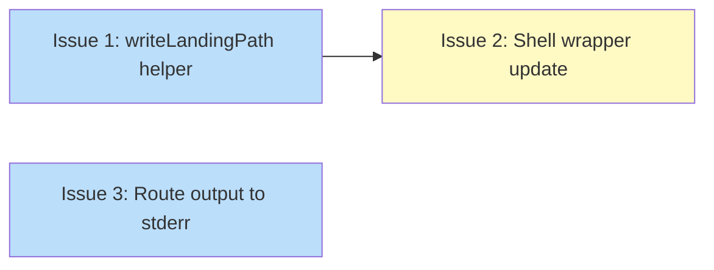

# PLAN: Shell Navigation Protocol

## Status

Draft

## Scope Summary

Replace the fragile stdout-capture protocol between the niwa shell wrapper and CLI binary with a temp-file-based channel (`NIWA_RESPONSE_FILE`), making shell navigation resilient to any stdout/stderr output from subprocesses, verbose flags, or future output modes.

## Decomposition Strategy

**Horizontal decomposition.** The design describes three independent layers -- a Go protocol helper, a shell wrapper template, and stderr routing fixes -- with stable interfaces between them. Each layer can be built and tested fully before the next. Walking skeleton wasn't appropriate because the components interact only through the `NIWA_RESPONSE_FILE` contract, not through a runtime pipeline that benefits from early integration.

## Issue Outlines

### Issue 1: feat(cli): add writeLandingPath helper and wire into create/go commands

**Complexity:** testable

**Goal:** Add a `writeLandingPath` helper that writes the landing directory to `NIWA_RESPONSE_FILE` when set, or to stdout when absent, and wire it into `create.go` and `go.go`.

**Acceptance Criteria:**
- [ ] `internal/cli/landing.go` exists with `writeLandingPath(cmd *cobra.Command, path string) error`
- [ ] When `NIWA_RESPONSE_FILE` is set to a valid temp path, `writeLandingPath` writes the path to that file and writes nothing to stdout
- [ ] When `NIWA_RESPONSE_FILE` is absent, `writeLandingPath` writes the path to stdout (backward compat)
- [ ] When `NIWA_RESPONSE_FILE` points outside `$TMPDIR`/`/tmp`, `writeLandingPath` returns an error
- [ ] `create.go` calls `writeLandingPath` instead of `fmt.Fprintln(cmd.OutOrStdout(), landingPath)`
- [ ] `go.go` calls `writeLandingPath` instead of `fmt.Fprintln(cmd.OutOrStdout(), targetPath)`
- [ ] Root command's `PersistentPreRunE` calls `os.Unsetenv("NIWA_RESPONSE_FILE")`
- [ ] Unit tests cover: env var set (file written, stdout empty), env var absent (stdout written), env var outside tmp (error returned)
- [ ] `go test ./internal/cli/...` passes

**Dependencies:** None

---

### Issue 2: feat(cli): update shell wrapper to temp-file protocol

**Complexity:** testable

**Goal:** Replace the stdout-capture `shellWrapperTemplate` with the mktemp-based temp file protocol that uses `NIWA_RESPONSE_FILE`.

**Acceptance Criteria:**
- [ ] `shellWrapperTemplate` in `internal/cli/shell_init.go` uses the mktemp-based protocol from the design doc
- [ ] For cd-eligible commands (`create`, `go`): wrapper creates temp file, exports `NIWA_RESPONSE_FILE`, runs `command niwa "$@"`, reads file, removes file, calls `builtin cd` if valid directory
- [ ] For other commands: wrapper delegates directly to `command niwa "$@"` with no wrapping
- [ ] mktemp failure falls back to running niwa without navigation (not a hard error)
- [ ] Wrapper preserves the exit code from the niwa binary
- [ ] `_NIWA_SHELL_INIT=1` export is preserved for `shell-init status` detection
- [ ] `shell_init_test.go` updated to verify new wrapper body
- [ ] `go test ./internal/cli/...` passes

**Dependencies:** Blocked by Issue 1

---

### Issue 3: fix(workspace): route progress output and subprocess stdout to stderr

**Complexity:** testable

**Goal:** Route workspace progress messages and subprocess stdout to stderr so they don't contaminate the stdout protocol.

**Acceptance Criteria:**
- [ ] `internal/workspace/apply.go`: all 6 `fmt.Printf` progress lines changed to `fmt.Fprintf(os.Stderr, ...)`
- [ ] `internal/workspace/clone.go`: `cmd.Stdout = os.Stdout` (line 61) changed to `cmd.Stdout = os.Stderr`
- [ ] `internal/workspace/setup.go`: `cmd.Stdout = os.Stdout` (line 105) changed to `cmd.Stdout = os.Stderr`
- [ ] `internal/workspace/sync.go`: both `cmd.Stdout = os.Stdout` (lines 68, 88) changed to `cmd.Stdout = os.Stderr`
- [ ] `internal/workspace/configsync.go`: `cmd.Stdout = os.Stdout` (line 42) changed to `cmd.Stdout = os.Stderr`
- [ ] Progress output still visible in terminal (stderr goes to terminal by default)
- [ ] `go test ./internal/workspace/...` passes
- [ ] `go vet ./...` passes

**Dependencies:** None

## Dependency Graph

**Legend**: Green = done, Blue = ready, Yellow = blocked

## Implementation Sequence

**Critical path:** Issue 1 -> Issue 2 (2 issues)

**Recommended order:**
1. Issue 1 and Issue 3 -- start in parallel (both have no dependencies)
2. Issue 2 -- after Issue 1 completes (wrapper depends on protocol writer)

**Parallelization:** Issues 1 and 3 are fully independent and can be implemented simultaneously.
